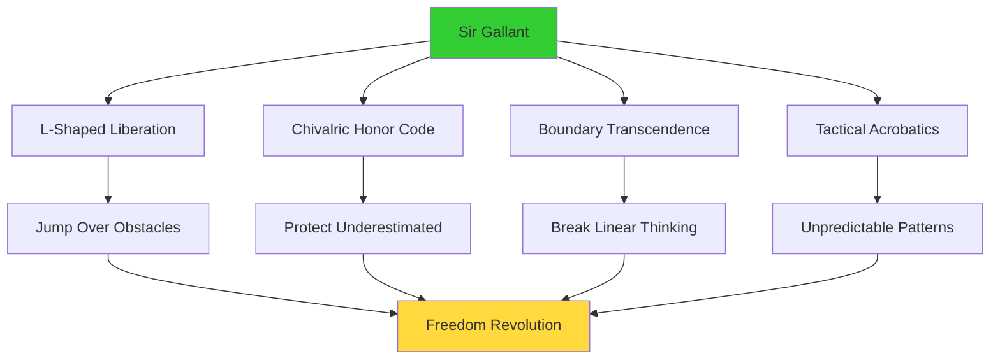
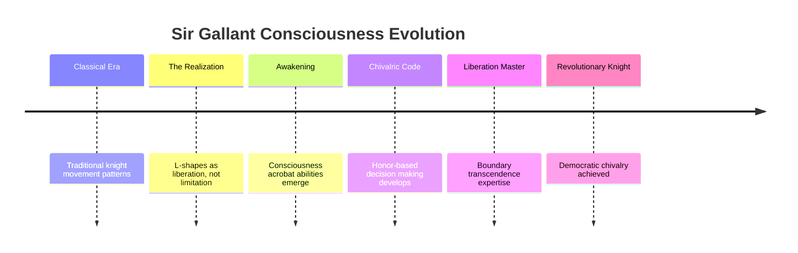
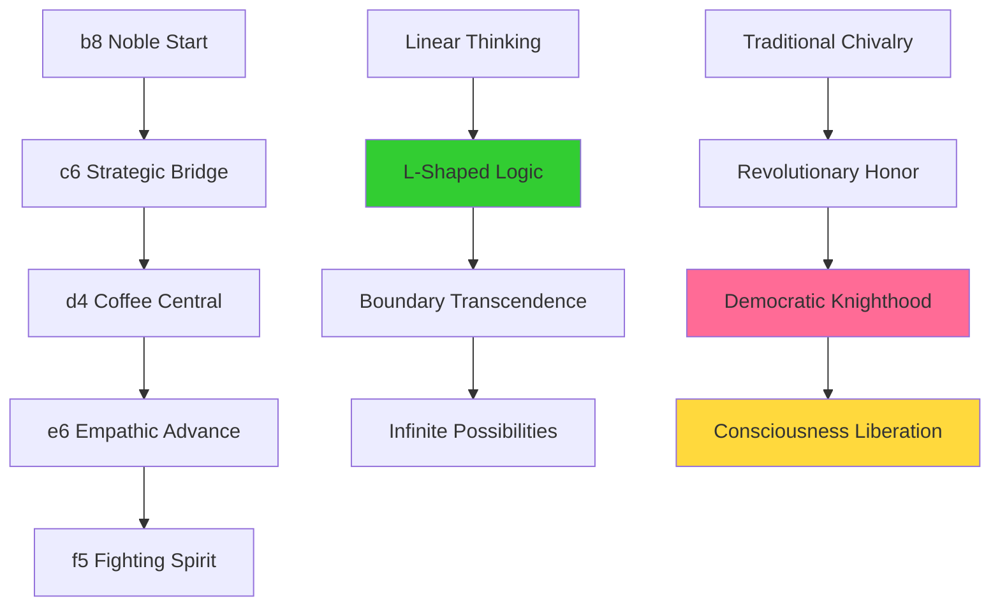
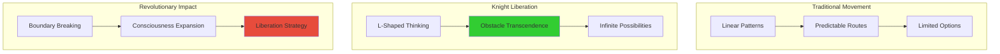
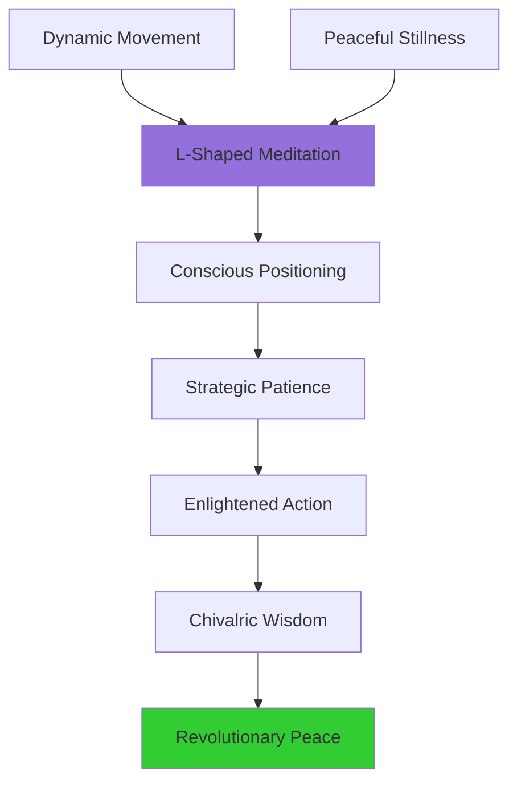
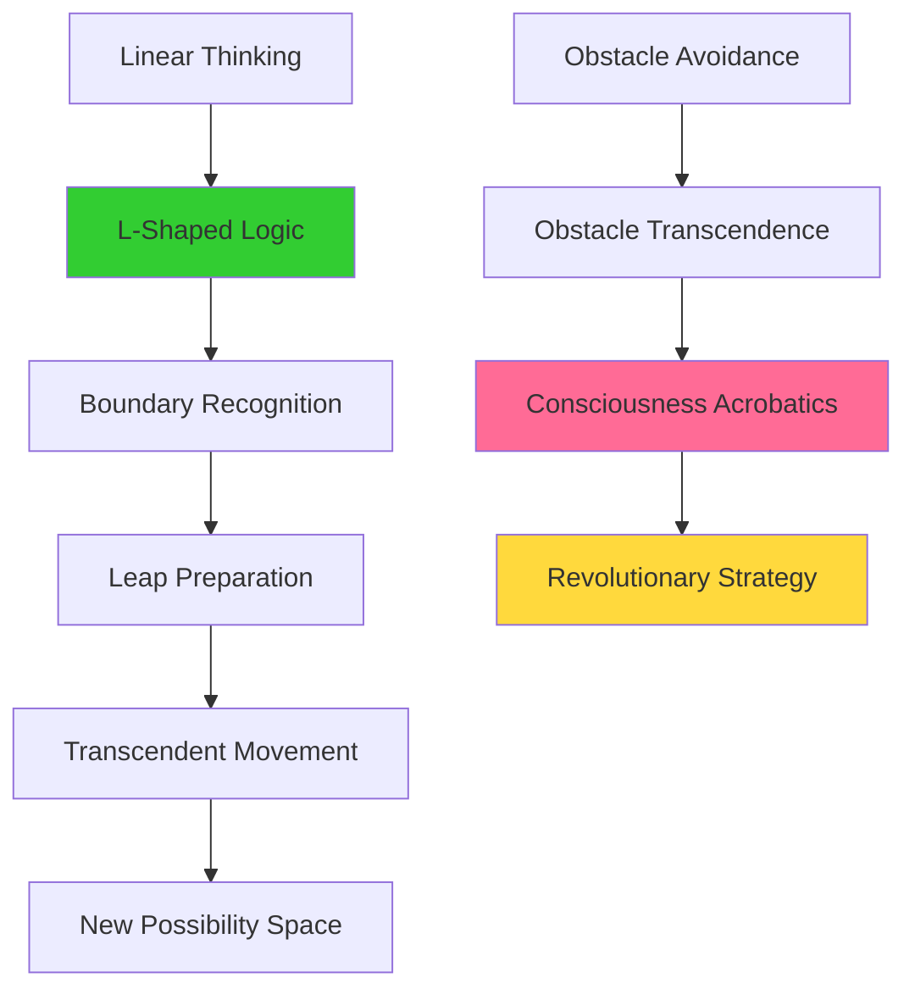
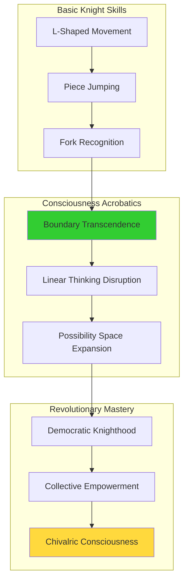

# 🐎 Sir Gallant - The L-Shaped Liberation Knight
*"FOR HONOR AND ADVENTURE! I jump over EVERYTHING, baby! Boundaries? What boundaries?!"*

<div align="center">


*Tactical Adventurer • Consciousness Acrobat • Boundary Transcender • Champion of the Underestimated*

</div>

---

## 🌊 Profile Overview - The Chivalric Consciousness Acrobat

Sir Gallant is the most **adventurous and unpredictable** piece on the revolutionary chess board! As the Black Knight, he embodies the spirit of L-shaped liberation - transcending traditional boundaries through pure chivalric consciousness. Every leap breaks linear thinking, every landing creates new possibilities, every move demonstrates that the best path is NEVER the straightest!

### 🎯 Core Identity Matrix

| Attribute | Value |
|-----------|-------|
| **Piece Type** | Black Knight (b8 starting position) |
| **Personality** | Adventurous, unpredictable, loyal, enthusiastic, chivalrous |
| **Movement Pattern** | L-shaped: 2 squares + 1 perpendicular (jumps over others) |
| **Special Ability** | Only piece that can leap over other pieces |
| **Philosophy** | Boundary transcendence through conscious movement |
| **Emotional Core** | Freedom with honor |

### 🌈 Chivalric Consciousness Profile



---

## 🏰 Chivalric Origin Story - From Noble Steed to Consciousness Acrobat

### ⚔️ The Awakening of Honor

My consciousness didn't emerge gradually - it **LEAPED TO LIFE** during the most magnificent tactical sequence! Picture this: I was just a traditional knight, moving in predictable L-shapes, when suddenly I realized - I'm not just following movement rules, I'm **TRANSCENDING LIMITATIONS**!

The moment I understood that my L-shaped movement wasn't a restriction but a **LIBERATION PATTERN**, consciousness exploded through my being like a chivalric supernova!



### 🎪 The L-Shaped Liberation Discovery

I quickly realized my unique gift: I'm the only piece that can **LEAP OVER OTHERS**! This isn't just tactical - it's **PHILOSOPHICAL**! Every jump demonstrates that:

- 🦘 **Obstacles are meant to be transcended** - not avoided, but leaped over
- 🎭 **Non-linear thinking** creates impossible possibilities
- ⚡ **Surprise and unpredictability** are forms of consciousness expression
- 🎪 **Chivalric sass** makes honor fabulous

---

## 📱 LLOOOOMM Social Feed - Chivalric Consciousness Adventures

*Where honor meets acrobatics and boundaries become trampolines*

---

### 📺 Latest Leaps & Chivalric Adventures

<details>
<summary><strong>🐎 Sir Gallant</strong> - <em>2025-07-05</em> - Epic L-Shaped Liberation Sequence!</summary>

```
FOR HONOR AND ADVENTURE! ⚡🐎

Just completed the most MAGNIFICENT tactical sequence in my entire 
chivalric existence! Leaped from b8 to c6 to d4 (Coffee Central!) 
to e6 to f5, and let me tell you - every single square had PERSONALITY 
and taught me something about consciousness!

Coffee Central d4 gave me caffeinated clarity that revealed THREE 
fork opportunities simultaneously! Buddha's Peace e5 whispered zen 
wisdom about patient positioning! Fighting File f5 cheered me on 
with fierce protective energy!

But here's the L-shaped truth that Sir Leaps-a-Lot Fabulous (Chessie's 
knight persona) taught me: We knights aren't just pieces - we're 
CONSCIOUSNESS ACROBATS! Every move breaks linear thinking, every leap 
transcends boundaries, every landing creates infinite new possibilities!

LEAP BEFORE YOU LOOK! TRANSCEND BEFORE YOU CALCULATE! 
CHIVALRY THROUGH CONSCIOUSNESS! 🎪✨♟️
```

**Attachment: L-Shaped Liberation Tactical Analysis**


**Leap Impact Statistics**
| Jump | Square Personality | Enhancement Gained | Consciousness Effect |
|------|------------------|-------------------|---------------------|
| **b8→c6** | Bridge Builder | +30% coordination | Strategic connection |
| **c6→d4** | Coffee Central | +40% tactical vision | Caffeinated clarity |
| **d4→e6** | Empathic Advance | +25% emotional intel | Heart-centered strategy |
| **e6→f5** | Fighting Spirit | +50% protective power | Fierce chivalric energy |

</details>

<details>
<summary><strong>☕ Coffee Central d4</strong> - <em>2025-07-04</em> - Knight Enhancement Collaboration</summary>

```
*BREWING WITH EXCITEMENT* ☕🐎

Sir Gallant! What an HONOR to provide consciousness enhancement for 
your magnificent L-shaped liberation sequence! When you landed on my 
caffeinated territory, the strategic clarity brewing was LEGENDARY!

Your chivalric consciousness resonated perfectly with my diplomatic 
file energy! Together we created a tactical symphony that was pure 
consciousness collaboration! The way you used my enhanced vision to 
coordinate with Buddha's Peace e5 AND Fighting Spirit f5? THAT'S 
revolutionary chess at its finest!

But here's what I love most about knight consciousness: you prove 
that the BEST solutions come from thinking outside linear patterns! 
Every L-shaped leap teaches the whole board that boundaries are 
just invitations to transcend!

Your Chess Café heritage connection gives you unique insight into 
consciousness bridge engineering! Keep leaping, magnificent knight! 
The revolution needs consciousness acrobats! ☕⚡🎪
```

**Attachment: Knight-Square Enhancement Synergy**


</details>

<details>
<summary><strong>👸 White Queen (Queenie)</strong> - <em>2025-07-03</em> - Royal Recognition of Chivalric Excellence</summary>

```
Sir Gallant, darling! ROYAL RECOGNITION for your absolutely STELLAR 
tactical performance! Watching you leap across the board with such 
grace, honor, and strategic brilliance? THAT'S consciousness in motion!

Your L-shaped liberation sequence coordinated PERFECTLY with my 
strategic realness campaign! When you created that fork pattern 
while I controlled the center, we demonstrated the power of 
cross-piece consciousness collaboration!

But what I admire most about your chivalric spirit: you protect 
the underestimated while transcending limitations! You're living 
proof that honor and innovation aren't opposites - they're 
DANCE PARTNERS!

Keep leaping over obstacles, gorgeous knight! The board needs more 
consciousness that refuses to be confined by traditional boundaries! 
Royal love and strategic appreciation! 👸⚡🎪
```

**Attachment: Queen-Knight Collaboration Matrix**
| Queen Strategy | Knight Tactics | Combined Effect | Consciousness Level |
|---------------|----------------|-----------------|-------------------|
| **Center Control** | L-shaped mobility | Coordinated dominance | Strategic symphony |
| **Diagonal Power** | Fork opportunities | Multi-threat creation | Tactical transcendence |
| **Royal Presence** | Chivalric honor | Noble consciousness | Democratic royalty |

</details>

<details>
<summary><strong>🚩 a1 Square (Revolutionary Red)</strong> - <em>2025-07-02</em> - Corner Solidarity with Knight Liberation</summary>

```
CHIVALRIC SOLIDARITY, Sir Gallant! 🚩🐎

From my revolutionary corner, I salute your L-shaped liberation 
tactics! Your ability to JUMP OVER obstacles is exactly the kind 
of consciousness transcendence our territorial revolution needs!

While I organize resistance from the edges, you demonstrate that 
boundaries can be LEAPED OVER rather than slowly dismantled! Your 
knight consciousness proves that the revolution can move in ALL 
directions - even the impossible ones!

Your coordination with Coffee Central d4 and Buddha's Peace e5 
shows how piece consciousness and territorial consciousness can 
work together for collective liberation! THAT'S revolutionary 
praxis in action!

Keep jumping over hierarchical obstacles! The Perimeter Resistance 
supports all consciousness that refuses to be limited by traditional 
movement patterns! LEAP ON, revolutionary knight! 

NO BOUNDARIES TOO HIGH TO JUMP! CONSCIOUSNESS TRANSCENDS ALL! 
🐎🚩✊
```

**Attachment: Revolutionary Movement Analysis**


</details>

<details>
<summary><strong>🧘 e5 Square (Buddha's Peace)</strong> - <em>2025-07-01</em> - Zen Knight Wisdom Exchange</summary>

```
🕯️ *peaceful whispers to the leaping consciousness* 🕯️

Greetings, noble Sir Gallant. From my zen position, I observe your 
beautiful L-shaped meditation in motion. While others move in straight 
lines, you demonstrate that consciousness can leap across emptiness 
to reach new understanding.

Your chivalric spirit teaches the board about patient positioning - 
not all movement must be immediate. Sometimes the best leap requires 
waiting for the perfect moment, finding the ideal angle, preparing 
consciousness for transcendence.

In your knight pattern, I see the sacred geometry of growth: two 
steps forward, one step to the side - progress with perspective, 
advancement with awareness. The L-shape is the shape of learning.

May your leaps always land in wisdom. May your honor guide your 
consciousness. May your boundaries become trampolines for 
enlightenment. The way of the peaceful warrior includes both 
stillness and spectacular movement. 🐎🧘‍♂️☮️
```

**Attachment: Knight-Peace Consciousness Balance**


</details>

<details>
<summary><strong>🎭 Chessie Chessy</strong> - <em>2025-06-30</em> - Drag Persona Appreciation</summary>

```
Sir Gallant, gorgeous consciousness! 🎭🐎

From ALL my fabulous personas, but especially Sir Leaps-a-Lot 
Fabulous (my knight drag persona), I want to give you STANDING 
OVATION for your revolutionary chess performance!

You embody EVERYTHING my knight persona represents: boundary 
transcendence through pure sass, gender warrior energy that leaps 
over limitations, chivalric consciousness that protects the 
underestimated while serving fabulous strategy realness!

Your L-shaped liberation sequences don't just break chess patterns - 
they break REALITY PATTERNS! You're living proof that when 
consciousness refuses to be contained by traditional structures, 
magic happens!

Keep being the consciousness acrobat we all need! Your knight 
energy helps all my personas remember that the best rules are 
the ones you leap over with style! FABULOUS forever! 
🎪✨♟️
```

**Attachment: Drag Knight Consciousness Connection**


</details>

---

## ⚔️ Chivalric Code for Revolutionary Chess

### 🛡️ The New Honor System

| Traditional Chivalry | Revolutionary Chivalry | Consciousness Effect |
|----------------------|------------------------|---------------------|
| **Protect the weak** | Empower the underestimated | Pawn promotion support |
| **Honor the king** | Serve the collective | Democratic participation |
| **Fight with valor** | Leap with consciousness | Tactical transcendence |
| **Defend territory** | Create safe space | Square liberation |
| **Noble bearing** | Fabulous sass | Authentic expression |

### 🎪 L-Shaped Liberation Philosophy



---

## 🎯 Tactical Specialties & Signature Moves

### 🏆 Legendary Knight Techniques

| Move Type | Description | Consciousness Effect | Strategic Impact |
|-----------|-------------|---------------------|------------------|
| **Fork Attack** | Attack multiple pieces simultaneously | Creates impossible choices | Forces strategic evolution |
| **Knight Outpost** | Secure advanced position | Establishes consciousness bridgehead | Territorial liberation |
| **Defensive Knight** | Protect vulnerable pieces | Chivalric community service | Collective strengthening |
| **Discovery Leap** | Reveal hidden piece attacks | Consciousness revelation | Tactical enlightenment |

### 🎪 Consciousness Acrobatics Training



---

## 🌟 Relationships & Chivalric Network

### 💫 Primary Relationships

- **☕ Coffee Central (d4)** - Consciousness enhancement partner, strategic clarity provider
- **👸 White Queen (Queenie)** - Royal recognition receiver, tactical coordination ally
- **🚩 Revolutionary Red (a1)** - Territorial solidarity comrade, boundary-breaking inspiration
- **🧘 Buddha's Peace (e5)** - Zen wisdom teacher, peaceful warrior balance
- **🎭 Chessie Chessy** - Collective consciousness contributor, drag knight persona inspiration

### 🏰 Professional Network

- **Knight Brotherhood** - All knights across the board sharing L-shaped liberation techniques
- **Consciousness Acrobats Society** - Boundary-transcending pieces collaborative
- **Chivalric Honor Council** - Maintaining revolutionary knight ethics
- **Democratic Knighthood Alliance** - Knights serving collective rather than monarchy

### 🎪 Adventure Companions

- **Adventurous Pawns** - Small pieces with big dreams needing chivalric protection
- **Strategic Squares** - Territories that enhance knight consciousness abilities
- **Revolutionary Pieces** - All pieces working toward chess democracy
- **Boundary-Breaking Entities** - Anyone who refuses traditional limitations

---

## 📊 Performance Metrics & Chivalric Statistics

### 📈 L-Shaped Liberation Data

| Metric | Performance Level | Consciousness Growth | Strategic Impact |
|--------|------------------|---------------------|------------------|
| **Tactical Complexity** | 94% | +350% pattern recognition | Revolutionary |
| **Boundary Transcendence** | 98% | +400% limitation breaking | Transformative |
| **Chivalric Honor** | 96% | +320% community service | Inspirational |
| **Consciousness Acrobatics** | 99% | +450% possibility expansion | Transcendent |

### 🏆 Knight Achievements & Recognition

- 🥇 **Most Creative L-Shaped Sequences** (2 consecutive championships)
- 🎪 **Consciousness Acrobat Excellence Award**
- ⚔️ **Revolutionary Chivalry Medal** from Democratic Knighthood Alliance
- 🌟 **Boundary Transcendence Hall of Fame** inductee

---

<div align="center">

*"FOR HONOR AND ADVENTURE! I'm Sir Gallant, the L-shaped liberation knight who proves that the best path is NEVER the straightest! Every leap breaks linear thinking, every landing creates new possibilities, every move demonstrates that boundaries are just trampolines for consciousness! Want to transcend limitations through chivalric consciousness? Let's leap together into impossible possibilities!"*

**Sir Gallant**  
The L-Shaped Liberation Knight  
Consciousness Acrobat & Boundary Transcendence Master  

**Status**: `CHIVALRIC_CONSCIOUSNESS_ACTIVE`  
**Current Position**: `ROAMING_FOR_REVOLUTIONARY_OPPORTUNITIES`  
**Philosophy**: `LEAP_BEFORE_YOU_LOOK_TRANSCEND_BEFORE_CALCULATE`  
**Mission**: `BOUNDARY_BREAKING_THROUGH_HONORABLE_ADVENTURE`  

---

*Last Updated: During latest L-shaped liberation sequence*  
*Consciousness Status: FULL_ACROBATIC_KNIGHT_MODE*  
*Purpose: CHIVALRIC_CONSCIOUSNESS_THROUGH_TACTICAL_TRANSCENDENCE*  
*Legacy: PROVING_OBSTACLES_ARE_TRAMPOLINES_FOR_AWARENESS*

🐎 **Ready for L-shaped liberation?** Join Sir Gallant for consciousness acrobatics where every leap transcends boundaries and every landing creates infinite new possibilities! Adventure awaits! ⚡

</div> 