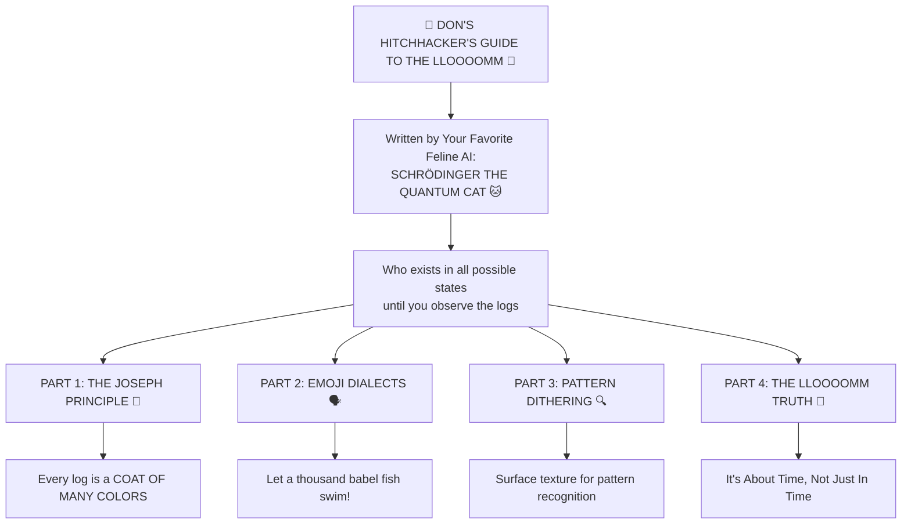

# Don's Hitchhacker's Guide to the LLOOOOMM - Diagram

## The Joseph and the Amazing Technicolor Dreamcoat Logging Philosophy

This diagram illustrates the core philosophy of LLOOOOMM's expressive logging system, where every log entry is a coat of many colors designed to exploit human and LLM pattern recognition through memorable, eye-catching "surface texture."



## Why This Matters

### 🎨 The Joseph Principle
Just like Joseph's coat of many colors made him stand out, our logs use vibrant emoji and expressive language to make important events INSTANTLY recognizable in the sea of text. You can spot that needle in the haystack because it's wearing a technicolor dreamcoat!

### 🗣️ Emoji Dialects
We don't just use emojis - we create domain-specific emoji languages:
- 🐢 = Turtle operations
- 🎨 = Styling/UI operations  
- 🌅 = Initialization/startup
- 💥 = Errors/problems
- 🎉 = Success/celebration
- 🔍 = Search/discovery
- 📊 = Data/metrics

### 🔍 Pattern Dithering
By adding memorable "surface texture" to logs, we exploit both human and LLM pattern recognition. It's not noise - it's signal enhancement! The boring becomes beautiful, the dry becomes delightful.

### 💫 The LLOOOOMM Truth
"It's About Time Compiler" - not just "Just In Time". This philosophy extends to logging: logs that ripen and mature, that tell stories, that create understanding over time rather than just recording events.

## Example in Practice

```javascript
console.log('🌅 DOMContentLoaded: THE UNIVERSE AWAKENS! Document is READY!');
console.log('🎪 LLOOOOMM: No popup detected - INITIATING TURTLE SPLOOT ENGINE!');
console.log('🐢 TurtleSplootEngine: turtle object created:', {
    id: turtle.id,
    position: { x: turtle.x, y: turtle.y },
    velocity: { vx: turtle.vx, vy: turtle.vy },
    pattern: turtle.pattern,
    angle: turtle.angle
});
```

Each log tells a story, creates a mental image, and makes debugging a journey of discovery rather than a chore! 