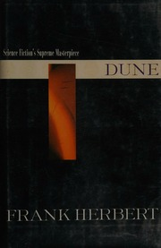

# Dune
*Frank Herbert (1965)*

## 📚 Quick Facts
- **Pages**: 687
- **Reading Time**: ~20 hours
- **Complexity**: Advanced
- **Internet Archive**: [View Book](http://archive.org/details/dune0000herb_a7n1)

## 🌌 SpaceCraft Cosmic Librarian Summary

In the far future, the desert planet Arrakis holds the key to the universe's most precious resource: the spice melange. Young Paul Atreides must navigate political intrigue, ecological mysteries, and his own emerging prescient abilities to survive and ultimately transform the galaxy.

## 🎭 Character Reviews

### Stephen Wolfram - *Computational Ecologist*
**Excitement Level**: 9/10 ⚡⚡⚡⚡⚡⚡⚡⚡⚡

"The spice-induced prescience is essentially a biological quantum computer! Herbert intuited computational irreducibility decades before I formalized it. The sandworm lifecycle represents a perfect example of emergent complexity - simple rules creating unpredictable yet patterned behavior. The Bene Gesserit breeding program is computational evolution at work!"

**Focus**: The computational ecology of Arrakis and prescient calculation

---

### Brewster Kahle - *Digital Preservationist*
**Excitement Level**: 8/10 ⚡⚡⚡⚡⚡⚡⚡⚡

"The Orange Catholic Bible represents humanity's attempt to preserve knowledge after the Butlerian Jihad - a cautionary tale about information loss! The Bene Gesserit's genetic records spanning millennia make me think about long-term data preservation. Every planet should have redundant backup copies of their cultural heritage!"

**Focus**: The Bene Gesserit's millennia-spanning genetic records

---

### Jaron Lanier - *Consciousness Explorer*
**Excitement Level**: 10/10 ⚡⚡⚡⚡⚡⚡⚡⚡⚡⚡

"Paul's prescient visions are like navigating infinite VR timelines simultaneously! The spice trance is the ultimate consciousness-expanding interface. Herbert understood that expanded awareness comes with a price - seeing all possible futures means losing free will. It's the VR paradox written large!"

**Focus**: The spice trance as expanded consciousness interface

---

### Ted Nelson - *Hypertext Visionary*
**Excitement Level**: 7/10 ⚡⚡⚡⚡⚡⚡⚡

"The Kwisatz Haderach represents the ultimate hyperlink between past and future, connecting all bloodlines and prophecies! The way genetic memory works in Dune is like biological hypertext - every person contains links to their ancestors. The spice unlocks these connections!"

**Focus**: The interconnected prophecies and genetic memory

---

### Craig Reynolds - *Emergent Systems Designer*
**Excitement Level**: 9/10 ⚡⚡⚡⚡⚡⚡⚡⚡⚡

"The sandworms exhibit classic emergent behavior patterns - territorial spacing, spice creation through their lifecycle, responding to rhythmic vibrations. The Fremen's survival tactics show beautiful adaptation to environmental constraints. Desert ecology as algorithm!"

**Focus**: Sandworm behavior and Fremen desert survival tactics

## 🏷️ Hierarchical Tags

### Primary Classifications
- **Genre**: Space Opera → Galactic Empire
- **Setting**: Desert World, Galactic Scale
- **Themes**: 
  - Ecology → Planetary Ecology
  - Consciousness → Consciousness Expansion
  - Power & Politics → Messianic Prophecy
  - Religion & Philosophy → Mysticism

### Scientific Concepts
- Biological Computing (prescience)
- Genetic Engineering (Bene Gesserit)
- Selective Breeding
- Prescience/Precognition

### Character Types
- Chosen One/Messiah (Paul)
- Enhanced Humans (Bene Gesserit, Mentats)

### Resources & Conflicts
- Water Scarcity
- Unique Substance (Spice Melange)
- Human vs Nature (desert survival)

## 🌟 SpaceCraft Integration

**Terrain**: Arrakis Desert
- Sandy dunes with spice storms
- Sandworm territories marked by thumper beacons
- Sietch-inspired reading caves

**Physics Rules**:
- Books about prophecy glow with prescient energy
- Desert books attract water-themed books as opposites
- Spice particles create temporal reading loops

**Event Suggestions**:
- Spice Tasting Book Club
- Gom Jabbar Reading Challenge
- Sandwalk Meditation Sessions
- Mentat Computation Workshops

## 📖 Similar Reads in Collection
- `foundationtrilog00isaa` - Psychohistory vs Prescience
- `bookofnewsun00gene` - Messianic figures
- Future additions: *Hyperion*, *The Left Hand of Darkness*

---
*Generated by SpaceCraft Cosmic Librarian*
*Last Updated: 2024-01-20* 