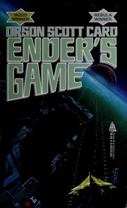

# Ender's Game
*Orson Scott Card (1985)*

## 📚 Quick Facts
- **Pages**: 374
- **Reading Time**: ~8 hours
- **Complexity**: Moderate
- **Internet Archive**: [View Book](http://archive.org/details/endersgameenderw00orso)
- **Awards**: Hugo & Nebula Winner

## 🌌 SpaceCraft Cosmic Librarian Summary

Six-year-old Andrew "Ender" Wiggin is humanity's last hope against the alien Buggers. Bred for tactical genius and trained through increasingly brutal zero-gravity war games, Ender excels at Battle School while slowly losing his humanity. The final twist: his "simulations" at Command School are real battles. He wins the war by committing xenocide, becoming both savior and destroyer.

## 🎭 Character Reviews

### Sun Tzu - *Master Strategist* ⚔️
**Excitement Level**: 10/10 ⚡⚡⚡⚡⚡⚡⚡⚡⚡⚡

"The supreme excellence! Ender wins the war before knowing he fights it. 'All warfare is based on deception' - but here the general himself is deceived. The enemy's gate is down? No - the enemy is ignorance of one's own actions. He defeats foes by understanding them so completely he loves them. This child achieved what I only theorized!"

**Focus**: Ultimate strategic deception

---

### John von Neumann - *Game Theory Pioneer* 🎲
**Excitement Level**: 9/10 ⚡⚡⚡⚡⚡⚡⚡⚡⚡

"Fascinating! The Battle Room creates perfect zero-sum games, but Ender transcends them by inventing new rules. His final 'game' uses the Little Doctor as a minimax solution - total annihilation as optimal strategy. The psychological games within games, especially with his siblings' political machinations, demonstrate n-person game theory at its finest!"

**Focus**: Games within games within wars

---

### Maria Montessori - *Child Development Pioneer* 👶
**Excitement Level**: 8/10 ⚡⚡⚡⚡⚡⚡⚡⚡

"This breaks my heart! They took everything I believed about nurturing children's natural genius and weaponized it. The Battle School is my method perverted - self-directed learning becomes isolation, prepared environments become killing grounds. Yet Ender's empathy survives. Even in this nightmare, the child's essential humanity persists."

**Focus**: Childhood genius perverted to violence

---

### Carl von Clausewitz - *War Theorist* 🎖️
**Excitement Level**: 9/10 ⚡⚡⚡⚡⚡⚡⚡⚡⚡

"War is politics by other means - but whose politics? The children fight humanity's war without understanding the political stakes. Ender embodies 'genius for war' yet knows nothing of war's nature. The fog of war here is absolute - he cannot see he fights real battles. Remarkable study in total war through total innocence!"

**Focus**: Child soldiers and the nature of war

---

### Hannah Arendt - *Political Philosopher* ⚖️
**Excitement Level**: 10/10 ⚡⚡⚡⚡⚡⚡⚡⚡⚡⚡

"The banality of evil perfected! Ender commits genocide thinking he plays games - the ultimate thoughtlessness. Yet he's also the victim of totalitarian manipulation. The adults create conditions where a child can unknowingly destroy a species. This is how good people do terrible things. The moral weight crushes him only after - true tragedy."

**Focus**: Ethics of unknowing genocide

## 🏷️ Hierarchical Tags

### Primary Classifications
- **Genre**: Military Science Fiction, Young Adult SciFi, Space Opera
- **Setting**: Battle School, Zero-G Battleroom, Near Future, Interstellar War
- **Themes**: 
  - Child Soldiers
  - Genius Isolation
  - Moral Ambiguity of War
  - Sibling Dynamics
  - Manipulation and Control
  - Xenocide Ethics
  - Games as Reality

### Military & Strategic Concepts
- Zero-Gravity Combat
- Game Theory Warfare
- Ansible Communication
- Military Indoctrination
- Tactical Innovation

### Character Types
- Child Prodigy Protagonist
- Reluctant Warrior
- Inscrutable Aliens (Buggers)
- Military Manipulators

### Psychological Elements
- Gifted Child Psychology
- Isolation and Leadership
- Empathy as Weakness/Strength
- Identity Through Conflict

## 🌟 SpaceCraft Integration

**Terrain**: Battle School Station
- Zero-gravity battle rooms
- Rotating corridors
- Command School asteroid
- Mind Game landscapes

**Physics Rules**:
- Zero gravity combat zones
- The enemy gate is down
- Formations create new tactics
- Mind games reveal psychology
- Ansible allows instant communication

**Event Suggestions**:
- Dragon Army Training Session 🐉
- Zero-G Battle Room Tournament 🌌
- Giant's Drink Psychology Test 🍷
- Command School Simulations 🎮
- Locke & Demosthenes Debate Club 📝
- Form Your Own Toon 👥
- Design New Battle Room Scenarios 🎯

## 📖 Similar Reads in Collection
- `starship_troopers` - Military SF origins
- `the_forever_war` - War's true cost
- Future: *Speaker for the Dead*, *Ender's Shadow*

---
*Generated by SpaceCraft Cosmic Librarian*
*Last Updated: 2024-01-20*
*"The enemy's gate is down."* 