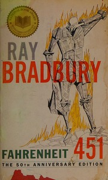

# Fahrenheit 451
*Ray Bradbury (1953)*

## 📚 Quick Facts
- **Pages**: 190
- **Reading Time**: ~5 hours
- **Complexity**: Moderate
- **Internet Archive**: [View Book](http://archive.org/details/fahrenheit4510000brad)

## 🌌 SpaceCraft Cosmic Librarian Summary

In a world where firemen burn books instead of saving them, Guy Montag begins to question everything. When books are outlawed and "firemen" burn any that are found, one fireman starts to wonder what's in these books that makes them so dangerous. A prophetic tale about censorship, mass media, and the vital importance of literature.

## 🎭 Character Reviews

### Neil Postman - *Media Ecologist*
**Excitement Level**: 10/10 ⚡⚡⚡⚡⚡⚡⚡⚡⚡⚡

"Bradbury saw it coming! Not government censorship, but self-censorship through entertainment addiction. The wall-sized TVs, the seashell radios, the constant stimulation - he predicted our amusing ourselves to death. People didn't want books anymore; they wanted faster cars, louder music, bigger screens. We banned books not through law but through indifference!"

**Focus**: Television's role in creating the book-burning society

---

### Aaron Swartz - *Information Freedom Fighter*
**Excitement Level**: 9/10 ⚡⚡⚡⚡⚡⚡⚡⚡⚡

"The book memorizers are the original hackers! They're creating a distributed, decentralized network of human hard drives. Each person is a node preserving crucial data. It's peer-to-peer file sharing using wetware. The real crime isn't possessing information - it's destroying it. Information wants to be free, even if you have to hide it in your head!"

**Focus**: Underground networks preserving knowledge

---

### Tim Berners-Lee - *Web Creator*
**Excitement Level**: 8/10 ⚡⚡⚡⚡⚡⚡⚡⚡

"This is what happens when you centralize control over information! No redundancy, no backups, no mirrors. The web was designed to route around censorship, but what if the censors control the infrastructure? The book people are like human URLs - each one pointing to invaluable content. We need protocols for freedom, not just technology."

**Focus**: Decentralized information architecture

---

### Cory Doctorow - *Digital Rights Activist*
**Excitement Level**: 9/10 ⚡⚡⚡⚡⚡⚡⚡⚡⚡

"DRM taken to its logical extreme - they don't just lock the content, they burn it! The mechanical hound is like a weaponized DMCA takedown. But the beautiful thing? You can't DRM a human brain. The book people are the ultimate act of civil disobedience - they've jailbroken their own minds to run unauthorized content!"

**Focus**: Copyright extremism and resistance

---

### Lawrence Lessig - *Free Culture Advocate*
**Excitement Level**: 8/10 ⚡⚡⚡⚡⚡⚡⚡⚡

"When culture itself becomes contraband, we all become criminals. The tragedy isn't just burning books - it's criminalizing the remix, the quote, the reference. Clarisse is arrested for being peculiar - that's what happens when you outlaw creativity. The book people aren't just preserving texts, they're preserving the right to think!"

**Focus**: Culture as illegal substance

## 🏷️ Hierarchical Tags

### Primary Classifications
- **Genre**: Dystopian, Social Science Fiction
- **Setting**: Near Future, Dystopian City, Totalitarian State
- **Themes**: 
  - Censorship
  - Book Burning
  - Totalitarianism
  - Knowledge Preservation
  - Intellectual Freedom
  - Media Manipulation

### Scientific & Social Concepts
- Mass Media Control
- Surveillance State
- Collective Amnesia
- Information Warfare

### Character Types
- Rebel Revolutionary (Montag)
- Book People (Human Libraries)
- State Enforcers (Firemen)
- Free Thinker (Clarisse)

### Literary Elements
- Fire and Phoenix Symbolism
- Transformation Arc
- Social Commentary
- Prophetic Warning

## 🌟 SpaceCraft Integration

**Terrain**: Burning Library
- Endless corridors of flame-resistant shelves
- Phoenix nesting grounds
- Underground memory caves
- Holographic book projections

**Physics Rules**:
- Books regenerate when burned (phoenix effect)
- Banned books glow with rebellious energy
- Memorized texts float as holograms
- Knowledge creates protective shields

**Event Suggestions**:
- Book Memorization Marathon
- Fireman to Book-Saver Workshop
- Build Your Own Secret Library
- 451°F Science Experiments
- Mechanical Hound Hide-and-Seek
- Wall TV Detox Sessions

## 📖 Similar Reads in Collection
- Future additions: *1984*, *Brave New World*, *The Handmaid's Tale*
- `parableofsower0000butl_p5f6` - Another dystopian warning
- Any book about the power of knowledge

---
*Generated by SpaceCraft Cosmic Librarian*
*Last Updated: 2024-01-20*
*"It was a pleasure to burn" - until it wasn't* 