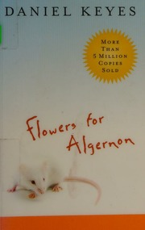

# Flowers for Algernon
*Daniel Keyes (1966)*

## 📚 Quick Facts
- **Pages**: 311
- **Reading Time**: ~6 hours
- **Complexity**: Moderate
- **Internet Archive**: [View Book](http://archive.org/details/flowersforalgern2004keye)
- **Awards**: Hugo & Nebula Winner
- **Warning**: Will make you cry

## 🌌 SpaceCraft Cosmic Librarian Summary

Through Charlie Gordon's diary entries, we witness a heartbreaking journey. Starting with an IQ of 68, Charlie undergoes experimental surgery that transforms him into a genius, following the path of Algernon, a laboratory mouse. But when Algernon begins to decline, Charlie realizes his fate. His progris riports evolve from simple misspellings to complex philosophical insights, then tragically regress. It's not about being smart - it's about being human.

## 🎭 Character Reviews

### Oliver Sacks - *Neurologist & Humanist* 🧠
**Excitement Level**: 10/10 ⚡⚡⚡⚡⚡⚡⚡⚡⚡⚡

"This is the most accurate portrayal of consciousness transformation I've ever read! Keyes captures the neurological reality - how increased intelligence changes perception, memory, even personality. But more importantly, he shows that Charlie's essential humanity, his capacity for love and kindness, transcends IQ. The regression is medically plausible and emotionally devastating."

**Focus**: The neurology of consciousness

---

### Temple Grandin - *Neurodiversity Advocate* 🧩
**Excitement Level**: 9/10 ⚡⚡⚡⚡⚡⚡⚡⚡⚡

"Society thinks 'fixing' different minds is always good, but Charlie was happier before! His simple kindness meant more than his genius theories. Different kinds of minds have different gifts. Charlie's tragedy isn't losing intelligence - it's that people only valued him when he was 'normal.' We need all kinds of minds, not just the 'smart' ones."

**Focus**: Value of neurodiversity

---

### Helen Keller - *Disability Rights Pioneer* 🌟
**Excitement Level**: 10/10 ⚡⚡⚡⚡⚡⚡⚡⚡⚡⚡

"The loneliness! Charlie experiences what I know too well - the isolation that comes with being different. First isolated by disability, then by genius, never quite fitting in. His journey through darkness into light and back again breaks my heart. But his courage to keep trying, to keep loving despite everything - that's true human greatness."

**Focus**: Isolation and transformation

---

### William James - *Consciousness Explorer* 💭
**Excitement Level**: 8/10 ⚡⚡⚡⚡⚡⚡⚡⚡

"A perfect demonstration of my stream of consciousness theory! Watch how Charlie's thought patterns evolve - from concrete to abstract, simple to complex. His varieties of religious experience shift with intelligence. The tragedy is that greater consciousness brings greater suffering. Sometimes ignorance truly is bliss."

**Focus**: Evolution of consciousness

---

### Charlie Chaplin - *Master of Pathos* 🎭
**Excitement Level**: 9/10 ⚡⚡⚡⚡⚡⚡⚡⚡⚡

"The little fellow made big, then small again! I built my career on the dignity of the common man, and Charlie Gordon embodies this. His fumbling attempts at sophistication, his heartbreak when he understands mockery, his final simple dignity - pure tragedy. The flowers on Algernon's grave? I'm weeping behind my smile."

**Focus**: Dignity in suffering

## 🏷️ Hierarchical Tags

### Primary Classifications
- **Genre**: Psychological SF, Medical SF, Literary Science Fiction
- **Setting**: Research Facility, Bakery, Contemporary, Personal Journey
- **Themes**: 
  - Intelligence and Humanity
  - Temporary Gifts
  - Isolation Through Intelligence
  - Ethics of Enhancement
  - Loss of Innocence
  - What Makes Us Human
  - Knowledge and Suffering

### Scientific & Medical Concepts
- Intelligence Enhancement
- IQ and Consciousness
- Experimental Surgery
- Animal Testing Ethics
- Psychological Regression

### Character Types
- Disabled Protagonist
- Experimental Subject
- Lab Animals (Algernon!)
- Well-Meaning Scientists

### Literary Innovation
- Epistolary Structure (Diary)
- Evolving Language Style
- Unreliable Narrator
- First-Person Journey
- Tragic Hope

## 🌟 SpaceCraft Integration

**Terrain**: Mind Maze
- Intelligence fluctuates with elevation
- Simple pleasures garden
- Memory fading edges
- Algernon's memorial

**Physics Rules**:
- Intelligence fluctuates with altitude
- Books change complexity as you read
- Memories fade at maze edges
- Simple joys glow brightest
- Kindness remains constant

**Event Suggestions**:
- Progress Report Writing Workshop 📝
- Rorschach Test Interpretation 🎨
- Algernon's Maze Race 🐭
- Bakery Bread Making Class 🍞
- Intelligence Ethics Debate 🤔
- Flower Arrangement Therapy 🌼
- "Put Flowers on Algernon's Grave" Quest 💐

## 📖 Similar Reads in Collection
- `storiesofyourlif0000chia_u1w4` - "Understand" story
- Future: *The Speed of Dark*, *The Curious Incident*
- Any book about what makes us human

---
*Generated by SpaceCraft Cosmic Librarian*
*Last Updated: 2024-01-20*
*"P.S. please put some flowrs on Algernons grave in the bak yard."* 