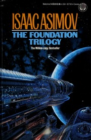

# The Foundation Trilogy
*Isaac Asimov (1951-1953)*

## 📚 Quick Facts
- **Pages**: 534 (trilogy omnibus)
- **Reading Time**: ~16 hours
- **Complexity**: Moderate-Advanced
- **Internet Archive**: [View Book](http://archive.org/details/foundationtrilog00isaa)

## 🌌 SpaceCraft Cosmic Librarian Summary

Witness the fall of a Galactic Empire and the rise of a new civilization through the lens of psychohistory - a mathematical science that can predict the future of large populations. Follow the Foundation across millennia as it navigates Seldon Crises, preserves knowledge, and shortens the coming dark age from 30,000 years to merely 1,000.

## 🎭 Character Reviews

### Donald Knuth - *Mathematical Maestro*
**Excitement Level**: 9/10 ⚡⚡⚡⚡⚡⚡⚡⚡⚡

"The mathematical beauty of psychohistory equations! Asimov essentially invented Big Data analysis before we had computers to process it. The idea that human behavior becomes predictable in large numbers is fundamental to algorithm design. I particularly love how the Second Foundation uses mathematical manipulation of emotional states - it's like programming human wetware!"

**Focus**: The mathematical beauty of psychohistory equations

---

### Marvin Minsky - *AI Pioneer*
**Excitement Level**: 8/10 ⚡⚡⚡⚡⚡⚡⚡⚡

"Psychohistory is early AI thinking - predicting human behavior through mathematical models! The Mule represents the unpredictable mutation that breaks our models. The Second Foundation's mentalics are like debugging human consciousness. Asimov understood that intelligence isn't just logic, it's about understanding and manipulating complex systems."

**Focus**: Psychohistory as early AI thinking

---

### Carl Hewitt - *Distributed Systems Architect*
**Excitement Level**: 7/10 ⚡⚡⚡⚡⚡⚡⚡

"The Foundation is a distributed actor system across the galaxy! Each planet acts independently yet follows the Seldon Plan. The Encyclopedia Galactica is distributed knowledge preservation. Even the location of the Second Foundation demonstrates security through obscurity. Classic actor model principles!"

**Focus**: The Foundation as a distributed system

---

### Ken Kahn - *Educational Technologist*
**Excitement Level**: 8/10 ⚡⚡⚡⚡⚡⚡⚡⚡

"Teaching psychohistory to future generations - what a challenge! The Encyclopedia project is really about education preservation. I love how the Foundation has to rediscover lost knowledge and teach it in new ways. It's like creating ToonTalk for a post-apocalyptic galaxy - making complex ideas accessible!"

**Focus**: Educational aspects of preserving civilization

---

### Will Wright - *Simulation Master*
**Excitement Level**: 10/10 ⚡⚡⚡⚡⚡⚡⚡⚡⚡⚡

"Galactic civilization as the ultimate simulation! This is SimCity on a cosmic scale - you can see the same patterns of growth, decay, and renewal. The Seldon Crises are like disaster scenarios in city planning. The way technology regresses and advances in different sectors is exactly how tech trees work in Spore!"

**Focus**: Civilization as emergent simulation

## 🏷️ Hierarchical Tags

### Primary Classifications
- **Genre**: Space Opera → Galactic Empire; Hard Science Fiction → Physics-Based
- **Setting**: Galactic Scale, Space Station (Terminus), Millennia Timespan
- **Themes**: 
  - Power & Politics → Empire Building, Revolution
  - Knowledge Preservation
  - Determinism vs Free Will

### Scientific Concepts
- Mathematical Prediction (Psychohistory)
- Statistical Sociology
- Mass Psychology
- Predictive Modeling

### Character Types
- Scientist/Explorer (Hari Seldon)
- Mathematicians
- Politicians

### Resources & Conflicts
- Knowledge as Scarce Resource
- Seldon Crises
- Human vs Human Conflict

## 🌟 SpaceCraft Integration

**Terrain**: Trantor Ecumenopolis
- City-planet covered in metal
- Underground libraries and data vaults
- Holographic Seldon appearances at crisis points

**Physics Rules**:
- Books cluster by Seldon Plan probability curves
- Mathematical texts orbit Foundation books
- Crisis points create reading vortexes

**Event Suggestions**:
- Psychohistory Calculation Workshop
- Encyclopedia Galactica Writing Sprint
- Seldon Crisis Simulation Games
- Galactic Empire Building Contest

## 📖 Similar Reads in Collection
- `dune0000herb_a7n1` - Empire and prophecy themes
- `irobot0000asim` - More Asimov brilliance
- Future additions: *1984*, *Decline and Fall of the Roman Empire*

---
*Generated by SpaceCraft Cosmic Librarian*
*Last Updated: 2024-01-20* 