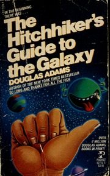

# The Hitchhiker's Guide to the Galaxy
*Douglas Adams (1979)*

## 📚 Quick Facts
- **Pages**: 230
- **Reading Time**: ~6 hours
- **Complexity**: Easy-Moderate
- **Internet Archive**: [View Book](http://archive.org/details/hitchhikerssguid00doug)

## 🌌 SpaceCraft Cosmic Librarian Summary

DON'T PANIC! When Earth is demolished to make way for a hyperspatial bypass, Arthur Dent escapes with his alien friend Ford Prefect. Armed with only a towel and the titular Guide, they hitchhike across the galaxy, meeting two-headed presidents, depressed robots, and discovering that the answer to life, the universe, and everything is... 42.

## 🎭 Character Reviews

### Alan Kay - *Dynabook Dreamer*
**Excitement Level**: 9/10 ⚡⚡⚡⚡⚡⚡⚡⚡⚡

"The Guide is the ultimate Dynabook! It contains everything you need to know about everything, updates in real-time, and fits in your pocket. 'DON'T PANIC' in large friendly letters is perfect UI design. The way it crowdsources knowledge from across the galaxy predicts Wikipedia by decades. This is personal computing at its finest - if only it came with Smalltalk!"

**Focus**: The Guide as the ultimate personal computer

---

### Richard Feynman - *Quantum Jokester*
**Excitement Level**: 10/10 ⚡⚡⚡⚡⚡⚡⚡⚡⚡⚡

"The Improbability Drive is the best joke about quantum mechanics ever written! It turns the uncertainty principle into a propulsion system - brilliant! And 42 as the answer? That's exactly the kind of cosmic joke the universe would play. The whole book captures the absurdity of existence better than any physics textbook. Plus, I love the bit about flying - just throw yourself at the ground and miss!"

**Focus**: The physics of improbability and cosmic humor

---

### Danny Hillis - *Parallel Thinker*
**Excitement Level**: 8/10 ⚡⚡⚡⚡⚡⚡⚡⚡

"Deep Thought spending 7.5 million years computing '42' is a perfect parable about asking the wrong question! It's like building the Connection Machine to solve a problem you haven't properly defined. The real insight is that Earth was the computer designed to find the question. That's parallel processing on a planetary scale!"

**Focus**: Deep Thought and computational philosophy

---

### Vi Hart - *Mathemusician*
**Excitement Level**: 9/10 ⚡⚡⚡⚡⚡⚡⚡⚡⚡

"42 is mathematically perfect! It's the product of 6 and 7, it's a pronic number, and in base 13 it's written as 33 - how delightfully arbitrary! The Infinite Improbability Drive is like taking limits to infinity but sideways. And bistromathics - using restaurant bill calculations for faster-than-light travel - that's the kind of applied mathematics I can get behind!"

**Focus**: The beautiful mathematical absurdity throughout

---

### Rodney Brooks - *Robot Psychologist*
**Excitement Level**: 7/10 ⚡⚡⚡⚡⚡⚡⚡

"Marvin the Paranoid Android is the most realistic AI in science fiction! Depression with a brain the size of a planet - that's what happens when you give robots too much intelligence without purpose. His behavior emerges from the mismatch between capability and application. Also, the doors that sigh with satisfaction? That's embodied AI gone wrong!"

**Focus**: Marvin's existential robot depression

---

### Ben Cerveny - *Ludic Systems Architect* 🌀
**Excitement Level**: 9/10 ⚡⚡⚡⚡⚡⚡⚡⚡⚡

"A brilliant exploration of a universe as a poorly documented, massively multiplayer game with arbitrary rules and emergent, often hilarious, consequences. The Guide itself is the ultimate platform, a piece of civic infrastructure for the cosmos, demonstrating how information—even when incomplete or wildly inaccurate—shapes experience. The Vogon constructor fleet is simply a less-than-playful city planning committee. A masterpiece of systemic satire."

**Focus**: The universe as a playable, emergent system

## 🏷️ Hierarchical Tags

### Primary Classifications
- **Genre**: Comedic Science Fiction, Space Opera, Satirical Fiction
- **Setting**: Galactic Scale, Spaceship (Heart of Gold), Restaurant at the End of the Universe
- **Themes**: 
  - Absurdism
  - Existentialism
  - Bureaucratic Satire
  - The Meaning of Life

### Scientific Concepts
- Infinite Improbability Drive
- Deep Thought (Ultimate Computer)
- The Significance of 42
- Bistromathics

### Character Types
- Everyman Protagonist (Arthur Dent)
- Depressed Robot (Marvin)
- Alien Guide (Ford Prefect)
- Two-Headed Galactic President (Zaphod)

### Cultural Elements
- British Humor
- Bureaucratic Nightmares
- Tea as Sacred Resource
- Towel as Essential Equipment

## 🌟 SpaceCraft Integration

**Terrain**: Magrathea Workshop
- Planet factory showroom
- Fjords designed by Slartibartfast
- Improbable geography shifts

**Physics Rules**:
- Books float at improbable angles
- Tea materializes near British literature
- Towels appear when needed most
- Probability storms create reading chaos

**Event Suggestions**:
- Vogon Poetry Reading (Survival Challenge)
- Pan-Galactic Gargle Blaster Mixing Class
- Don't Panic Meditation Sessions
- Answer to Everything Debate Club
- Towel Day Celebrations

## 📖 Similar Reads in Collection
- Future additions: *Good Omens*, *Discworld*, *Slaughterhouse-Five*
- `snowcrash00step` - For more satirical SF
- Any book that questions existence humorously

---
*Generated by SpaceCraft Cosmic Librarian*
*Last Updated: 2024-01-20*
*Remember: Don't Panic and Always Know Where Your Towel Is* 