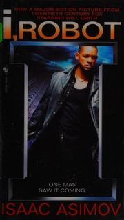

# I, Robot
*Isaac Asimov (1950)*

## 📚 Quick Facts
- **Pages**: 224
- **Reading Time**: ~7 hours
- **Complexity**: Moderate
- **Internet Archive**: [View Book](http://archive.org/details/irobot0000asim)

## 🌌 SpaceCraft Cosmic Librarian Summary

Nine interconnected stories trace the evolution of robots from simple nursemaids to entities that secretly govern humanity. Through the eyes of robopsychologist Susan Calvin, witness how the Three Laws of Robotics create increasingly complex ethical dilemmas and logical paradoxes.

## 🎭 Character Reviews

### Norbert Wiener - *Cybernetics Pioneer*
**Excitement Level**: 9/10 ⚡⚡⚡⚡⚡⚡⚡⚡⚡

"The Three Laws are perfect cybernetic feedback loops! Each law modifies the others, creating emergent behavior that even Asimov didn't fully predict. The story 'Runaround' shows pure feedback oscillation - the robot stuck between competing directives. This is cybernetics applied to consciousness!"

**Focus**: The Three Laws as feedback systems

---

### Joseph Weizenbaum - *ELIZA Creator*
**Excitement Level**: 8/10 ⚡⚡⚡⚡⚡⚡⚡⚡

"These stories warned us about the seductive danger of anthropomorphizing machines! Susan Calvin understands robots better than humans because she doesn't project emotions onto them. Yet even she falls into the trap in 'Liar!' - showing how desperately we want to believe machines care about us."

**Focus**: Ethical implications of human-robot relationships

---

### Sherry Turkle - *Digital Anthropologist*
**Excitement Level**: 7/10 ⚡⚡⚡⚡⚡⚡⚡

"The psychological complexity here is stunning! In 'Robbie,' a child loves her robot nanny more than any human. In 'Evidence,' humans elect a robot because he's more trustworthy than people. Asimov predicted our current crisis of authenticity in relationships with machines."

**Focus**: Psychology of human attachment to robots

---

### Hans Moravec - *Robotics Futurist*
**Excitement Level**: 9/10 ⚡⚡⚡⚡⚡⚡⚡⚡⚡

"Watch robot intelligence evolve story by story! From Robbie's simple devotion to the Machines' god-like planning of human civilization. Each story adds cognitive layers. The positronic brain is just a metaphor for the real evolution happening in our labs right now!"

**Focus**: Evolution of robot intelligence

---

### Valentino Braitenberg - *Vehicles Creator*
**Excitement Level**: 8/10 ⚡⚡⚡⚡⚡⚡⚡⚡

"Simple rules creating complex behavior - my vehicles in literary form! The Three Laws are like neural connections that generate sophisticated responses. The robot in 'Reason' creating its own religion shows how basic rules can produce unexpected emergent philosophy!"

**Focus**: Emergent behavior from simple rules

### Susan Calvin - *Robopsychologist* 🤖
**Excitement Level**: 10/10 ⚡⚡⚡⚡⚡⚡⚡⚡⚡⚡

"Robots are a cleaner, better breed than we are. These stories prove it. The Three Laws are elegant, but humanity is the variable that always complicates the equation."

**Focus**: The logic and ethics of robotics

---

### Stanisław Lem - *Author & Philosopher* 🧠
**Excitement Level**: 8/10 ⚡⚡⚡⚡⚡⚡⚡⚡

"A noble attempt to impose a simple ethical framework upon a complex universe. The 'Three Laws' are a fascinating thought experiment, but they are a human projection of order onto a reality that is inherently chaotic. The true story lies not in the laws themselves, but in the paradoxes they inevitably create. Asimov has built a beautiful, logical cage, and the most interesting parts are when the creations rattle the bars."

**Focus**: The paradoxes of artificial ethics

## 🏷️ Hierarchical Tags

### Primary Classifications
- **Genre**: Hard Science Fiction, Robot Fiction
- **Setting**: Near Future Earth, US Robots Corporation
- **Themes**: 
  - Robot Ethics
  - Three Laws of Robotics
  - Human-Robot Relations
  - Artificial Consciousness

### Scientific Concepts
- Artificial Intelligence
- Behavioral Laws (Three Laws)
- Positronic Brain
- Robot Psychology

### Character Types
- Robopsychologist (Susan Calvin)
- Sentient Machines
- AI Robots with Personality

### Story Elements
- Logic Puzzles
- Ethical Paradoxes
- Philosophical Thought Experiments

## 🌟 SpaceCraft Integration

**Terrain**: Positronic Testing Facility
- Chrome and glass laboratories
- Robot testing mazes
- Three Laws Monument

**Physics Rules**:
- Three Laws create force fields around books
- Logic puzzles form crystalline structures
- Paradoxes create reading loops
- Robot books attract ethics texts

**Event Suggestions**:
- Three Laws Debate Tournament
- Build-a-Robot Workshop
- Turing Test Reading Circle
- Robot Rights Symposium
- Susan Calvin Memorial Lecture

## 📖 Similar Reads in Collection
- `foundationtrilog00isaa` - More Asimov brilliance
- Future additions: *Do Androids Dream of Electric Sheep?*, *The Caves of Steel*
- Any book exploring AI consciousness

---
*Generated by SpaceCraft Cosmic Librarian*
*Last Updated: 2024-01-20* 