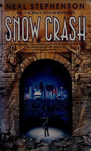

# Snow Crash
*Neal Stephenson (1992)*

## 📚 Quick Facts
- **Pages**: 486
- **Reading Time**: ~14 hours
- **Complexity**: Moderate-Advanced
- **Internet Archive**: [View Book](http://archive.org/details/snowcrash00step)

## 🌌 SpaceCraft Cosmic Librarian Summary

In a hyper-capitalist future America divided into corporate franchulates, Hiro Protagonist - freelance hacker and pizza delivery driver - discovers a new drug called Snow Crash that can infect both computers and human brains. His investigation leads him deep into the Metaverse, ancient Sumerian mythology, and a conspiracy that threatens to reprogram humanity itself.

## 🎭 Character Reviews

### John Perry Barlow - *Cyberspace Pioneer* 🎸
**Excitement Level**: 10/10 ⚡⚡⚡⚡⚡⚡⚡⚡⚡⚡

"The Metaverse is what we were trying to build! A place where information wants to be free, but Stephenson shows how it can be weaponized. The franchulates are like digital feudalism - exactly what we warned against. But Hiro's a true cyberpunk cowboy, riding through virtual space with a katana! This is the Declaration of the Independence of Cyberspace as a novel!"

**Focus**: Freedom vs control in virtual worlds

---

### Howard Rheingold - *Virtual Community Builder* 🌐
**Excitement Level**: 9/10 ⚡⚡⚡⚡⚡⚡⚡⚡⚡

"The social dynamics in the Metaverse are prophetic! The Black Sun club, the Street protocol, avatars as identity - Stephenson understood that virtual communities need both structure and chaos. The way information literally becomes architecture in cyberspace? That's exactly how online spaces work. Smart mobs before smart mobs!"

**Focus**: Virtual community dynamics

---

### Douglas Rushkoff - *Media Virus Creator* 🦠
**Excitement Level**: 10/10 ⚡⚡⚡⚡⚡⚡⚡⚡⚡⚡

"Snow Crash IS a media virus! Language as code, memes as mind viruses, Sumerian as the root programming language of consciousness - this book infected culture with these ideas. The nam-shub is literally a neurolinguistic hack. Stephenson understood that whoever controls the code controls reality. Program or be programmed, baby!"

**Focus**: Linguistic viruses and memetic warfare

---

### Vernor Vinge - *Singularity Prophet* 🔮
**Excitement Level**: 8/10 ⚡⚡⚡⚡⚡⚡⚡⚡

"The ancient Sumerians as the first programmers - brilliant! The idea that language itself is technology, that consciousness can be hacked through deep linguistic structures, connects perfectly to the coming intelligence explosion. The Metaverse is a proto-singularity space where enhanced minds will first emerge. True names indeed!"

**Focus**: Deep programming and consciousness

---

### Bruce Sterling - *Cyberpunk Architect* 🏗️
**Excitement Level**: 9/10 ⚡⚡⚡⚡⚡⚡⚡⚡⚡

"Corporate feudalism with style! The Mafia as a business franchise, Rat Things as canine cyborgs, burbclaves as gated nations - this is design fiction at its finest. Stephenson took our cyberpunk aesthetic and injected it with amphetamines and ancient mythology. The future isn't just dystopian, it's hilariously dystopian!"

**Focus**: Franchulate nations and corporate dystopia

## 🏷️ Hierarchical Tags

### Primary Classifications
- **Genre**: Cyberpunk, Satirical Fiction, Techno-Thriller
- **Setting**: Metaverse, Franchulate America, Near Future Los Angeles
- **Themes**: 
  - Virtual Reality
  - Linguistic Programming
  - Corporate Dystopia
  - Information Warfare
  - Memes and Viruses
  - Ancient Technology

### Scientific & Tech Concepts
- Virtual Worlds & Avatars
- Neural Hacking
- Language as Code
- Viral Information/Memetics
- Quantum Computing (implied)

### Character Types
- Hacker Hero (Hiro Protagonist)
- Virtual Avatars
- Info-Terrorists
- Corporate Samurai
- Skateboard Couriers (Y.T.)

### Cultural Elements
- Pizza Delivery Culture
- Sword Fighting in VR
- Sumerian Mythology
- Franchulate Citizenship

## 🌟 SpaceCraft Integration

**Terrain**: Metaverse Plaza
- The Street stretching to infinity
- Black Sun club floating overhead
- Code architecture visible as buildings
- Bandwidth rivers flowing between nodes

**Physics Rules**:
- Avatars can exceed physical limitations
- Information packets fly as visible objects
- Code manifests as architecture
- Bandwidth determines movement speed
- Crashes create reality glitches

**Event Suggestions**:
- Hiro's Pizza Delivery Race 🍕
- Metaverse Sword Fighting Tournament ⚔️
- Build Your Own Franchulate 🏢
- Sumerian Programming 101 🐍
- Design Your Avatar Workshop 👤
- Rat Thing Racing Circuit 🐕
- Code Your Own Virus (Safely!) 💾

## 📖 Similar Reads in Collection
- `neuromancer` - The cyberpunk origin
- `ready_player_one` - VR world successor
- Future: *Cryptonomicon*, *The Diamond Age*

---
*Generated by SpaceCraft Cosmic Librarian*
*Last Updated: 2024-01-20*
*"Until a man is twenty-five, he still thinks, every so often, that under the right circumstances he could be the baddest motherf***er in the world."* 