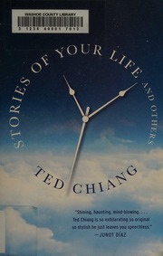

# Stories of Your Life and Others
*Ted Chiang (2002)*

## 📚 Quick Facts
- **Stories**: 8 philosophical masterpieces
- **Pages**: 281
- **Reading Time**: ~8 hours
- **Complexity**: High
- **Internet Archive**: [View Book](http://archive.org/details/storiesofyourlif0000chia_u1w4)
- **Awards**: Nebula, Theodore Sturgeon Award

## 🌌 SpaceCraft Cosmic Librarian Summary

Ted Chiang writes science fiction like a mathematician proving theorems of the human heart. The title story (filmed as "Arrival") explores how learning an alien language that perceives time simultaneously changes a mother's experience of loss. Other tales include enhanced intelligence as existential crisis, the Tower of Babel as information theory, and beauty as a switch you can turn off.

## 🎭 Character Reviews

### Noam Chomsky - *Linguistic Revolutionary* 🗣️
**Excitement Level**: 10/10 ⚡⚡⚡⚡⚡⚡⚡⚡⚡⚡

"Finally, someone who understands that language IS thought! The heptapod language in 'Story of Your Life' demonstrates how grammatical structures shape temporal perception. Chiang proves the Sapir-Whorf hypothesis through narrative. This is cognitive science disguised as literature - the universal grammar includes non-linear time!"

**Focus**: Language as the architecture of consciousness

---

### Carl Sagan - *Cosmic Communicator* 🌟
**Excitement Level**: 9/10 ⚡⚡⚡⚡⚡⚡⚡⚡⚡

"First contact through linguistics rather than mathematics - brilliant! Chiang shows that understanding alien minds requires more than radio signals. Each story is a thought experiment in empathy. The emotional depth matches the scientific rigor. This is what happens when you add heart to hard science fiction. Billions and billions of neurons firing!"

**Focus**: Science with soul

---

### Ursula K. Le Guin - *Anthropological Storyteller* 🌍
**Excitement Level**: 10/10 ⚡⚡⚡⚡⚡⚡⚡⚡⚡⚡

"Chiang builds worlds from single scientific premises, then inhabits them fully. Like my Hainish stories, but with mathematical precision. 'Story of Your Life' achieves what all SF aspires to - making the alien familiar and the familiar alien. He writes equations that make you cry. A master of the thought experiment!"

**Focus**: Human truth through scientific metaphor

---

### Ludwig Wittgenstein - *Language Philosopher* 🔤
**Excitement Level**: 8/10 ⚡⚡⚡⚡⚡⚡⚡⚡

"The limits of my language mean the limits of my world - and Chiang shatters those limits! The heptapod language shows a form of life beyond linear time. 'Tower of Babylon' literalizes reaching the ineffable. Each story is a language game revealing new possibilities of meaning. Whereof one cannot speak, thereof Chiang writes fiction!"

**Focus**: Language games and reality

---

### Kurt Gödel - *Incompleteness Theorist* ∞
**Excitement Level**: 9/10 ⚡⚡⚡⚡⚡⚡⚡⚡⚡

"Chiang understands that consciousness itself is a strange loop! 'Understand' shows intelligence bootstrapping itself beyond formal systems. The time perception in 'Story of Your Life' is a closed timelike curve of emotion. He finds the undecidable propositions in human experience. Mathematics with tears!"

**Focus**: Consciousness as mathematical paradox

## 🏷️ Hierarchical Tags

### Primary Classifications
- **Genre**: Hard Science Fiction, Philosophical SciFi, Linguistic Science Fiction
- **Setting**: Non-Linear Time, Academic Environments, Intimate Scale
- **Themes**: 
  - Language and Thought
  - Determinism vs Free Will
  - Mathematical Beauty
  - Enhanced Intelligence
  - Communication Barriers
  - Time Perception

### Scientific & Philosophical Concepts
- Sapir-Whorf Hypothesis
- Variational Principles
- Formal Mathematical Systems
- Intelligence Enhancement
- Simultaneity in Physics

### Character Types
- Scientist-Philosophers
- Benevolent Aliens
- Enhanced Humans
- Seekers of Understanding

### Literary Excellence
- Contemplative Wonder
- Non-Linear Narratives
- Precise, Elegant Prose
- Thought Experiments as Plot

## 🌟 SpaceCraft Integration

**Terrain**: Linguistic Laboratory
- Floating semantic fields
- Time flowing in circles
- Mathematical structures visible
- Words creating reality bubbles

**Physics Rules**:
- Words create reality bubbles
- Time flows in all directions simultaneously
- Mathematical proofs manifest physically
- Understanding changes the past
- Beauty can be toggled on/off

**Event Suggestions**:
- Heptapod Language Workshop 👽
- Build a Tower to Heaven 🗼
- Mathematical Beauty Contest 🔢
- Time-Symmetric Conversation Circle ⭕
- Intelligence Enhancement Ethics Debate 🧠
- Golem Creation Class 🗿
- Variational Principle Physics Demo 〰️

## 📖 Similar Reads in Collection
- Future: *Exhalation*, *Anxiety Is the Dizziness of Freedom*
- `borges_ficciones` - Similar philosophical depth
- Any book that makes science emotional

---
*Generated by SpaceCraft Cosmic Librarian*
*Last Updated: 2024-01-20*
*"The universe began as an enormous breath being held."* 