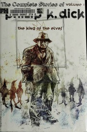

# The Collected Stories of Philip K. Dick
*Philip K. Dick (1987 Collection)*

## 📚 Quick Facts
- **Stories**: 118 mind-benders
- **Pages**: ~2,500 (5 volumes)
- **Reading Time**: ~60 hours
- **Complexity**: Varies wildly
- **Internet Archive**: [View Collection](http://archive.org/details/the-collected-stories-of-philip-k.-dick)

## 🌌 SpaceCraft Cosmic Librarian Summary

From "We Can Remember It for You Wholesale" to "The Electric Ant," PKD's 118 stories systematically dismantle reality. Androids question their humanity, time loops trap suburbanites, and memories prove false. Each story asks: What if everything you know is wrong? The answer is always: It probably is.

## 🎭 Character Reviews

### Jean Baudrillard - *Hyperreality Philosopher* 🎭
**Excitement Level**: 10/10 ⚡⚡⚡⚡⚡⚡⚡⚡⚡⚡

"PKD didn't predict the future - he diagnosed the present! Every story is a simulacrum revealing the absence of reality. 'We Can Remember It for You Wholesale' isn't about false memories, it's about how ALL memories are false. The precogs in 'Minority Report' see the future because there IS no future, only simulations. He understood that reality died and we're living in its corpse!"

**Focus**: Reality as simulation all the way down

---

### Robert Anton Wilson - *Reality Tunnel Explorer* 👁️‍🗨️
**Excitement Level**: 9/10 ⚡⚡⚡⚡⚡⚡⚡⚡⚡

"Every PKD story is a different reality tunnel, and they're all equally true! The paranoia isn't a bug, it's a feature - maybe you ARE being watched by time-traveling androids. His genius was showing that consensus reality is just the most popular delusion. Read these while high for maximum ontological vertigo!"

**Focus**: Multiple simultaneous realities

---

### Terence McKenna - *Psychonaut Philosopher* 🍄
**Excitement Level**: 10/10 ⚡⚡⚡⚡⚡⚡⚡⚡⚡⚡

"PKD achieved naturally what others need DMT for - direct downloads from the cosmic consciousness! VALIS, the pink beam, time running backwards - these aren't metaphors, they're trip reports! He surfed the fractal edges of the time wave and brought back maps of impossible territories. The machine elves told me they're fans!"

**Focus**: Natural psychedelic revelations

---

### Jorge Luis Borges - *Labyrinth Architect* 📚
**Excitement Level**: 8/10 ⚡⚡⚡⚡⚡⚡⚡⚡

"Dick creates labyrinths of time and identity that would make Ts'ui Pên envious. Each story is a forking path where reality splinters. His paranoid suburbanites are like my librarians - lost in infinite possibilities. But where I use mirrors, he uses androids. A worthy successor to the fantastic tradition."

**Focus**: Reality as infinite library

---

### Grant Morrison - *Chaos Magician* ✨
**Excitement Level**: 9/10 ⚡⚡⚡⚡⚡⚡⚡⚡⚡

"PKD was a reality hacker before we had the term! Each story is a hypersigil that reprograms consensus reality. He didn't write fiction - he documented his shamanic journeys through the multiverse. VALIS was his Holy Guardian Angel, and these stories are his grimoire. Try the ritual: Read PKD, question reality, become enlightened!"

**Focus**: Fiction as reality manipulation

## 🏷️ Hierarchical Tags

### Primary Classifications
- **Genre**: Reality-Bending Fiction, Paranoid Science Fiction, Metaphysical SciFi
- **Setting**: Unstable Reality, Fluid Time, Suburban Nightmares
- **Themes**: 
  - What Is Reality?
  - Simulation Theory
  - Identity Crisis
  - False Memories
  - Android Humanity
  - Time Loops
  - Divine Madness

### Mind-Bending Concepts
- Simulation Hypothesis
- Altered Consciousness
- Precognition
- Memory Manipulation
- Reality Tunnels

### Character Types
- Unreliable Narrators
- Reality Manipulators
- Androids Who Think They're Human
- Paranoid Everymen

### PKD Specialties
- Reality Suddenly Shifts
- Everything You Know Is Wrong
- Time Isn't What You Think
- You Might Be An Android

## 🌟 SpaceCraft Integration

**Terrain**: Reality Maze
- Shifting suburban landscapes
- Doors that lead to yesterday
- Mirrors showing alternate selves
- Time running in all directions

**Physics Rules**:
- Books phase between dimensions
- Stories leak into each other
- Time runs backwards randomly
- Memories become unreliable near PKD books
- Android detectors malfunction
- Reality saves corrupted frequently

**Event Suggestions**:
- Voight-Kampff Empathy Test 🤖
- Build Your Own Reality Workshop 🔨
- VALIS Contact Séance 📡
- Paranoid Book Club (Are We Real?) 🤔
- Electric Sheep Counting Contest 🐑
- False Memory Implant Booth 🧠
- Precrime Prevention Training 👮

## 📖 Similar Reads in Collection
- `maninhighcastle0000dick` - More PKD!
- Future: *Ubik*, *VALIS*, *A Scanner Darkly*
- Any book that makes you question existence

---
*Generated by SpaceCraft Cosmic Librarian*
*Last Updated: 2024-01-20*
*"Reality is that which, when you stop believing in it, doesn't go away." - PKD* 