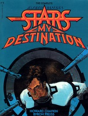

# The Stars My Destination
*Alfred Bester (1956)*

## 📚 Quick Facts
- **Pages**: 236 (novel)
- **Reading Time**: ~6 hours
- **Complexity**: Moderate
- **Internet Archive**: [View Comic](http://archive.org/details/the-stars-my-destination)
- **Famous Quote**: "Gully Foyle is my name / And Terra is my nation / Deep space is my dwelling place / The stars my destination"

## 🌌 SpaceCraft Cosmic Librarian Summary

Gully Foyle - mechanic's mate 3rd class, education: none, skills: none - is left to die in space. Through pure rage, he transforms himself into an unstoppable force in a world where teleportation ("jaunting") has revolutionized society. His quest for revenge against those who abandoned him becomes a journey from nobody to transcendent being, complete with facial tiger tattoos and the ultimate weapon: PyrE.

## 🎭 Character Reviews

### Alexandre Dumas - *Revenge Master* ⚔️
**Excitement Level**: 10/10 ⚡⚡⚡⚡⚡⚡⚡⚡⚡⚡

"Mon Dieu! This is my Count of Monte Cristo in SPACE! But where Edmond Dantès took decades, Gully Foyle burns through transformation in months. The tattooed face appearing when angry? Genius! From ignorant nobody to cosmic force - this is revenge as self-creation. Bester understood that the best revenge is becoming more than your enemies can imagine!"

**Focus**: Revenge as catalyst for transformation

---

### Marshall McLuhan - *Media Prophet* 📡
**Excitement Level**: 9/10 ⚡⚡⚡⚡⚡⚡⚡⚡⚡

"Jaunting is the ultimate hot medium - it collapses space into pure thought! Bester predicted how teleportation would create a new tribalism. The typography experiments? Pure visual poetry expressing rage that can't be contained by conventional text. When Gully jauntes through space-time, he becomes the message itself!"

**Focus**: Teleportation as media revolution

---

### William Blake - *Visionary Poet* 🐅
**Excitement Level**: 10/10 ⚡⚡⚡⚡⚡⚡⚡⚡⚡⚡

"TYGER TYGER BURNING BRIGHT! My poem lives! Gully Foyle IS the tyger, forged in the furnaces of space! The fearful symmetry of his tattooed face, the fire in his eyes - Bester channeled my vision into future myth. What immortal hand or eye could frame thy fearful symmetry? GULLY FOYLE'S RAGE!"

**Focus**: Poetry made flesh through fury

---

### Timothy Leary - *Consciousness Explorer* 🚀
**Excitement Level**: 9/10 ⚡⚡⚡⚡⚡⚡⚡⚡⚡

"PyrE is the ultimate psychedelic - it doesn't expand consciousness, it EXPLODES it! Gully's transformation is a bad trip that becomes enlightenment. Jaunting is astral projection made real. Turn on (to rage), tune in (to revenge), drop out (of spacetime). This book is a guide to evolutionary acceleration through anger!"

**Focus**: Rage as consciousness fuel

---

### Hakim Bey - *Chaos Philosopher* 🏴
**Excitement Level**: 8/10 ⚡⚡⚡⚡⚡⚡⚡⚡

"Every jaunte creates a Temporary Autonomous Zone! Gully Foyle is the ultimate poetic terrorist - his revenge shatters all hierarchies. When everyone can teleport, borders become meaningless. His final gift of PyrE to humanity? Pure ontological anarchy! The stars aren't destinations, they're escape routes!"

**Focus**: Teleportation as liberation

## 🏷️ Hierarchical Tags

### Primary Classifications
- **Genre**: Proto-Cyberpunk, Revenge Thriller, Psychedelic SciFi
- **Setting**: Inner Planets, Jaunte-Enabled Society, 25th Century
- **Themes**: 
  - Revenge and Transformation
  - Class Warfare
  - Transcendence Through Rage
  - Teleportation Society
  - Tiger Burning Bright
  - Bootstrap Evolution

### Revolutionary Concepts
- Jaunting (Personal Teleportation)
- PyrE (Thought-Triggered Explosive)
- Rage-Driven Evolution
- Corporate Clan Warfare

### Character Arc
- Nobody to Force of Nature
- Ignorance to Cosmic Awareness
- Victim to Victor to Transcendent
- Marked by Rage (Tiger Tattoos)

### Literary Innovation
- Typographic Explosions
- Poetry Integration
- Synaesthetic Descriptions
- Proto-Cyberpunk Aesthetics

## 🌟 SpaceCraft Integration

**Terrain**: Jaunte Maze
- Teleportation nodes everywhere
- Visualization chambers
- Rage amplification zones
- Typography floating in space

**Physics Rules**:
- Teleportation requires visualization
- Rage amplifies jaunte distance
- Typography becomes physical
- PyrE thoughts explode reality
- Tiger tattoos appear when angry

**Event Suggestions**:
- Learn to Jaunte Workshop 🌟
- Revenge Planning Committee 📋
- Tyger Poetry Slam 🐅
- Find Gully Foyle's Tattoos 🎭
- PyrE Handling Safety Course ⚠️
- Space Marooning Survival Training 🚀
- Corporate Clan Wars Simulation ⚔️

## 📖 Similar Reads in Collection
- `dune0000herb_a7n1` - For epic transformation
- Future: *The Count of Monte Cristo* in space
- Any book about becoming more than human

---
*Generated by SpaceCraft Cosmic Librarian*
*Last Updated: 2024-01-20*
*"Vorga, I kill you filthy!"* 