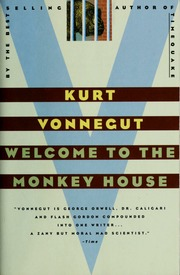

# Welcome to the Monkey House
*Kurt Vonnegut (1968)*

## 📚 Quick Facts
- **Stories**: 25 dark gems
- **Pages**: 360
- **Reading Time**: ~7 hours
- **Complexity**: Moderate
- **Internet Archive**: [View Book](http://www.archive.org/details/welcometomonkeyh00vonn)

## 🌌 SpaceCraft Cosmic Librarian Summary

In these 25 stories, Vonnegut turns science fiction into a funhouse mirror reflecting humanity's absurdities. "Harrison Bergeron" shows a world where everyone must be equally mediocre. The title story imagines mandatory ethical birth control pills that remove all pleasure from sex. "EPICAC" features a computer that learns to love and write poetry. Each tale combines laugh-out-loud satire with gut-punch insights about what makes us human - for better and worse.

## 🎭 Character Reviews

### Mark Twain - *America's Satirist* 🎩
**Excitement Level**: 10/10 ⚡⚡⚡⚡⚡⚡⚡⚡⚡⚡

"By thunder! This Vonnegut fellow has perfected my formula - tell the truth about the damned human race, but make 'em laugh while you do it. 'Harrison Bergeron' could be my 'Connecticut Yankee' for the space age. The government making everyone equally stupid? I wrote about democracy, but this boy's gone and shown where it leads! The monkey house indeed - we never left it!"

**Focus**: Evolution of American satire

---

### Dorothy Parker - *Mistress of Wit* 🍸
**Excitement Level**: 9/10 ⚡⚡⚡⚡⚡⚡⚡⚡⚡

"Well, well. Someone else who sees that humans are just sophisticated idiots. His women are real - frustrated, funny, trapped by men's stupidity. 'Welcome to the Monkey House' nails male hypocrisy about sex perfectly. And that computer in love? More genuine emotion than most men I've known. Pass the gin, this darkness needs toasting!"

**Focus**: Dark wit about human relationships

---

### Rod Serling - *Twilight Zone Creator* 🌙
**Excitement Level**: 10/10 ⚡⚡⚡⚡⚡⚡⚡⚡⚡⚡

"Submitted for your approval: 25 episodes I wish I'd written! Each story has that perfect Twilight Zone twist - ordinary people in extraordinary situations revealing profound truths. 'Harrison Bergeron' IS the Twilight Zone! Vonnegut doesn't need my introduction - he's already in that dimension where satire meets prophecy. Consider, if you will, a monkey house where the monkeys think they're gods..."

**Focus**: Science fiction as social commentary

---

### George Carlin - *Philosopher Comedian* 🎤
**Excitement Level**: 9/10 ⚡⚡⚡⚡⚡⚡⚡⚡⚡

"FINALLY! Someone who gets that humans are just barely evolved primates in suits! Vonnegut strips away all the bullshit - religion, government, social norms - and shows the scared monkey underneath. 'Ethical suicide parlors'? We already have those, they're called voting booths! This is comedy that makes you think, then makes you drink!"

**Focus**: Exposing civilization's absurdities

---

### Franz Kafka - *Bureaucratic Nightmare Weaver* 🪲
**Excitement Level**: 8/10 ⚡⚡⚡⚡⚡⚡⚡⚡

"The handicapper general, the ethical birth control - such elegant bureaucracies of oppression! But where my characters are crushed by absurdity, Vonnegut's laugh at it. Perhaps this is the American metamorphosis - not into a bug, but into a cheerful prisoner who doesn't notice the cage. The monkey house has glass walls, and the monkeys polish them daily."

**Focus**: Bureaucratic control with a smile

## 🏷️ Hierarchical Tags

### Primary Classifications
- **Genre**: Satirical SF, Dark Comedy SciFi, Social Commentary Fiction
- **Setting**: Cold War Future, Suburban Dystopia, Personal Stories
- **Themes**: 
  - Enforced Equality
  - Dehumanization Through Kindness
  - Technology vs Humanity
  - Love in Dystopia
  - Bureaucratic Absurdity
  - Free Will vs Social Control

### Social & Political Concepts
- Population Control Methods
- Ethical Suicide Parlors
- Emotional Machines
- Enforced Mediocrity
- Benevolent Totalitarianism

### Character Types
- Ordinary Rebels
- Benevolent Totalitarians
- Feeling Machines
- Handicapped Geniuses

### Literary Mastery
- Darkly Humorous Tone
- Conversational Profundity
- Ironic Plot Twists
- Vignette Collection Structure

## 🌟 SpaceCraft Integration

**Terrain**: Monkey House Complex
- Happiness enforcement zones
- Equality chambers
- EPICAC's love poetry corner
- Ethical suicide parlor museum

**Physics Rules**:
- Happiness enforced at entry
- Equal gravity for all
- Emotions leak from machines
- Satire sharpens reality
- Dark humor lightens load

**Event Suggestions**:
- Harrison Bergeron Dance Party 💃
- EPICAC Love Letter Generator 💌
- Ethical Suicide Parlor Tour ☠️
- Handicapper General Training 🎯
- Write Your Own Vonnegut Story ✍️
- Monkey House Escape Room 🐵
- Billy Pilgrim Time Travel Experience ⏰

## 📖 Similar Reads in Collection
- `fahrenheit4510000brad` - Similar social satire
- `hitchhikerssguid00doug` - Absurdist humor
- Future: *Cat's Cradle*, *Slaughterhouse-Five*

---
*Generated by SpaceCraft Cosmic Librarian*
*Last Updated: 2024-01-20*
*"Hello babies. Welcome to Earth. It's hot in the summer and cold in the winter..."* 