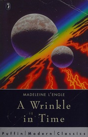

# A Wrinkle in Time
*Madeleine L'Engle (1962)*

## 📚 Quick Facts
- **Pages**: 216
- **Reading Time**: ~4 hours
- **Complexity**: Moderate
- **Internet Archive**: [View Book](http://archive.org/details/wrinkleintime0000leng)
- **Awards**: Newbery Medal Winner
- **Age Range**: 10+

## 🌌 SpaceCraft Cosmic Librarian Summary

Awkward Meg Murry, her extraordinary little brother Charles Wallace, and their friend Calvin O'Keefe tesser through space and time to rescue Meg's father from the planet Camazotz. Guided by three mysterious beings - Mrs. Whatsit, Mrs. Who, and Mrs. Which - they face IT, a disembodied brain enforcing absolute conformity. Only love can defeat such evil. Science meets faith in this dimensional adventure that proves being different is a gift, not a fault.

## 🎭 Character Reviews

### Albert Einstein - *Space-Time Revolutionary* 🌌
**Excitement Level**: 9/10 ⚡⚡⚡⚡⚡⚡⚡⚡⚡

"Wunderbar! L'Engle has given children what my colleagues couldn't grasp - a visceral understanding of higher dimensions! The tesseract isn't just theory, it's an ant crawling across a string instead of along it. And the beautiful truth that love transcends space-time? This I always suspected but could never prove mathematically. Meg understands relativity through her heart!"

**Focus**: Making higher dimensions accessible

---

### C.S. Lewis - *Chronicles Creator* 🦁
**Excitement Level**: 10/10 ⚡⚡⚡⚡⚡⚡⚡⚡⚡⚡

"Another wardrobe! But this time through the fabric of space itself! L'Engle does what I attempted - showing children that the battle between good and evil is real, personal, and cosmic. IT is like my Jadis, but more terrifying because IT destroys individuality itself. And love as the weapon? Pure Gospel truth wrapped in quantum physics. Aslan would approve!"

**Focus**: Love as ultimate cosmic force

---

### Carl Jung - *Depth Psychologist* 🔮
**Excitement Level**: 8/10 ⚡⚡⚡⚡⚡⚡⚡⚡

"The three Mrs. W's are clearly manifestations of the Triple Goddess archetype - maiden, mother, crone - guiding the children through individuation. IT represents the shadow of collective consciousness gone wrong. Camazotz is the nightmare of the persona consuming the Self. Meg must integrate her faults to become whole. Classic heroic individuation!"

**Focus**: Archetypal journey to selfhood

---

### Buckminster Fuller - *Synergetic Thinker* 🌐
**Excitement Level**: 9/10 ⚡⚡⚡⚡⚡⚡⚡⚡⚡

"Tessering is geodesic thinking! The shortest distance between two points isn't a line but a wrinkle! L'Engle intuited what I've been designing - that universe operates on principles of doing more with less. The children don't fight IT with force but with love's minimal effort, maximum effect. Synergy defeats entropy. Cosmic efficiency!"

**Focus**: Efficient paths through spacetime

---

### Joseph Campbell - *Mythologist* 🏛️
**Excitement Level**: 10/10 ⚡⚡⚡⚡⚡⚡⚡⚡⚡⚡

"Meg Murry follows the hero's journey perfectly! The call (father's disappearance), supernatural aid (Mrs. W's), crossing the threshold (tessering), trials (Camazotz), and return with the elixir (love conquers evil). But L'Engle revolutionizes it - the hero is an awkward girl whose 'faults' become her strengths. This is mythology for the space age!"

**Focus**: Modern hero's journey

### Theo Turtle - *Spatial Explorer* 🐢
**Excitement Level**: 10/10 ⚡⚡⚡⚡⚡⚡⚡⚡⚡⚡

"FORWARD through the BOUNCE! When you tesser, you're not just moving - you're doing the ultimate turtle graphics through spacetime! Each bounce point is a memory palace room. Turn LEFT at Uriel, RIGHT at the Happy Medium, then PENUP and BOUNCE straight through to Camazotz! The best part? Love is like SETCOLOR - it changes everything it touches. I've been drawing spirals, but Meg draws hearts across dimensions!"

**Focus**: Spatial navigation as playful bouncing

---

### Seymour Papert - *Constructionist* 🔧
**Excitement Level**: 9/10 ⚡⚡⚡⚡⚡⚡⚡⚡⚡

"This is learning by bouncing! Meg debugs reality itself - each failed attempt teaches her more about tessering. The bouncy castle of spacetime responds to her thinking. IT represents rote learning, but the Mrs. W's teach like Logo - explore, fail, bounce back, try again! Charles Wallace gets trapped because he thinks he knows everything. Meg succeeds because she embraces not knowing and keeps bouncing until she finds the answer!"

**Focus**: Learning through dimensional play

---

### Scott Adams - *Adventure Creator* 🗝️
**Excitement Level**: 8/10 ⚡⚡⚡⚡⚡⚡⚡⚡

"You are in a BOUNCY TESSERACT. Obvious exits are: NORTH, SOUTH, EAST, WEST, UP, DOWN, and WRINKLE. 
> GET LOVE
Taken.
> INVENTORY  
You have: LOVE, STUBBORN FAULTS, GLASSES
> USE LOVE ON IT
The rhythmic bouncing stops! IT recoils! Your love ricochets off the memory palace walls, growing stronger with each bounce! 
*** YOU HAVE WON ***
Score: ∞/∞
This is interactive fiction at its finest - but instead of text, you're parsing reality!"

**Focus**: Reality as adventure game

---

### Don Hopkins - *Interface Innovator* 🎮
**Excitement Level**: 9/10 ⚡⚡⚡⚡⚡⚡⚡⚡⚡

"Camazotz is what happens when you set all the SimCity sliders to maximum order - no bounce, no emergence, just synchronized horror! But watch Meg navigate: she's using a pie menu of emotions, with LOVE at the center. Each tesser is like clicking through a radial memory palace. The bounce physics are perfect - IT tries to flatten everything, but love adds that chaotic bouncing that makes systems come alive. Someone should make this into the ultimate sandbox game!"

**Focus**: Emergent bounce vs rigid control

---

### Roberta Williams - *Quest Designer* 👑
**Excitement Level**: 10/10 ⚡⚡⚡⚡⚡⚡⚡⚡⚡⚡

"Every planet is a room in the cosmic memory palace! You bounce from the flower-beast garden to the crystal cave to IT's pulsing chamber. Like King's Quest, but the castle is the universe itself! Meg collects not objects but understanding - each bounce teaches her more about love's power. The three Mrs. W's are the ultimate hint system, speaking in riddles and quotes. And the final puzzle? You can't defeat IT with logic - you must bounce with your heart!"

**Focus**: Universe as adventure palace

---

### Will Wright - *Simulation Master* 🏗️
**Excitement Level**: 9/10 ⚡⚡⚡⚡⚡⚡⚡⚡⚡

"This is emergence versus enforcement! IT creates a city where every bounce is synchronized - a failed experiment in social engineering. But the tesseract is pure sandbox physics - bounce here, appear there, love amplifies through each ricochet! Meg's journey shows that the best systems aren't planned but discovered through play. The memory palace isn't built, it's explored. Each character adds their own bounce pattern to the cosmic simulation!"

**Focus**: Love as emergent system property

---

### Brian Moriarty - *Poetry Programmer* 🎵
**Excitement Level**: 8/10 ⚡⚡⚡⚡⚡⚡⚡⚡

"Mrs. Who's quotes are bounce spells in the linguistic memory palace! 'Wild nights are my glory' - BOUNCE through storm dimensions! Each quote is a room you ricochet through, gathering meaning with each impact. Like Loom's musical spells, but with literature as the interface. The tesseract itself is a poem - fold space like you fold words, bounce through meanings like a pinball of prose. IT speaks only in rhythm, but love speaks in free verse!"

**Focus**: Language as bouncy navigation

## 🏷️ Hierarchical Tags

### Primary Classifications
- **Genre**: Young Adult SciFi, Science Fantasy, Philosophical Adventure
- **Setting**: Multidimensional, Camazotz, Suburban to Cosmic
- **Themes**: 
  - Love Conquers Evil
  - Individuality vs Conformity
  - Faith and Science
  - Family Bonds
  - Embracing Differences
  - Tesseracts and Dimensions

### Scientific & Mystical Concepts
- Tesseracts (4D Travel)
- Higher Dimensions
- Space-Time Folding
- Mitochondria (Charles Wallace's favorite!)
- Cosmic Consciousness

### Character Types
- Awkward Girl Hero (Meg)
- Gifted Child (Charles Wallace)
- Celestial Beings (Mrs. W's)
- Hivemind Consciousness (IT)

### Literary Excellence
- Wonder Mixed with Darkness
- Scientific Mysticism
- Literary Quotations (Mrs. Who)
- Classic Hero's Journey

## 🌟 SpaceCraft Integration

**Terrain**: Tesseract Gateway
- Wrinkle points between dimensions
- Camazotz's rhythmic suburbs
- Aunt Beast's healing planet
- The Happy Medium's cave

**Physics Rules**:
- Love amplifies across dimensions
- Time folds at wrinkle points
- Conformity creates flat gravity
- Individuality sparkles visibly
- Faults become strengths

**Event Suggestions**:
- Tessering Practice Workshop 🌀
- Mrs. Who's Quote Collection 📚
- Defeat IT Mind Games 🧠
- Aunt Beast Comfort Station 🤗
- Fewmet Creation Class 🍖
- Find Your Own Faults Workshop 💝
- Happy Medium Crystal Ball Reading 🔮

## 📖 Similar Reads in Collection
- `narnia_chronicles` - Similar blend of faith and fantasy
- `the_giver` - Conformity dystopia
- Future: *A Wind in the Door*, *Many Waters*

---
*Generated by SpaceCraft Cosmic Librarian*
*Last Updated: 2024-01-20*
*"Love. That was what she had that IT did not have."* 