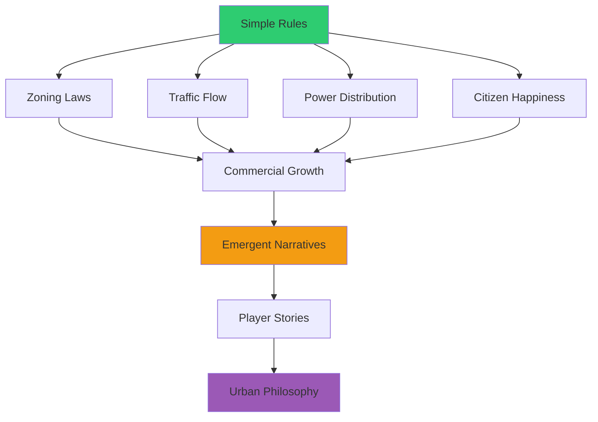
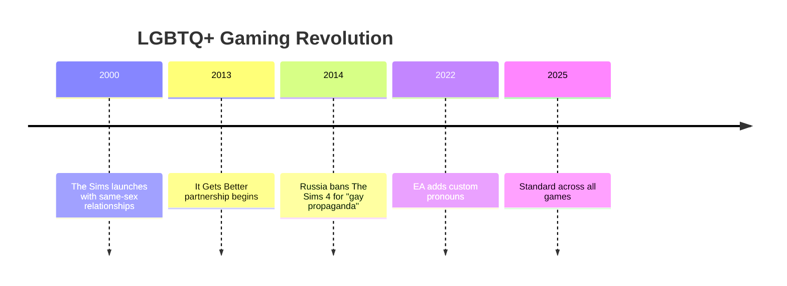
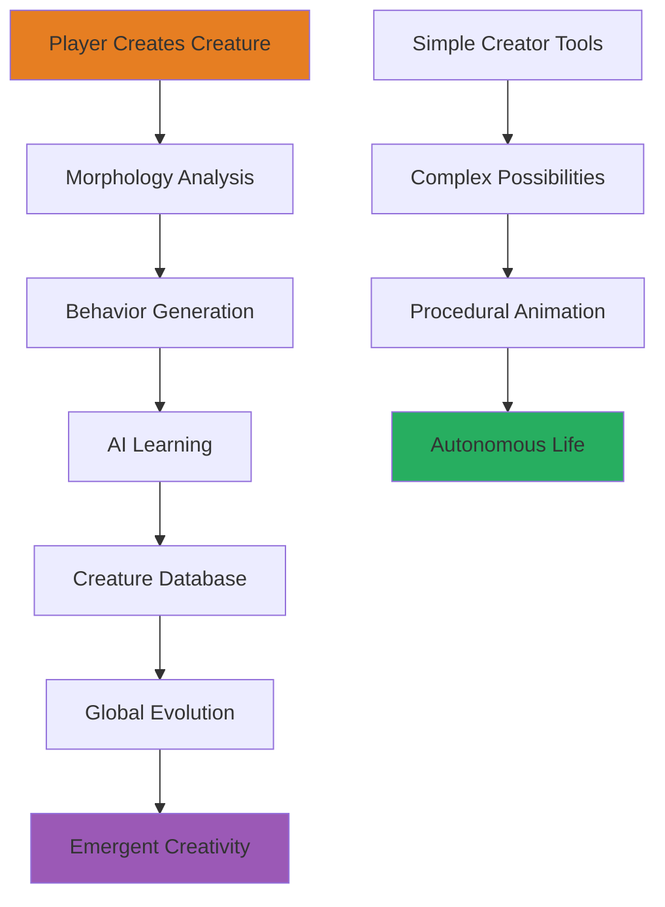
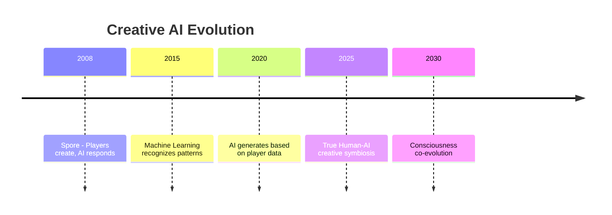
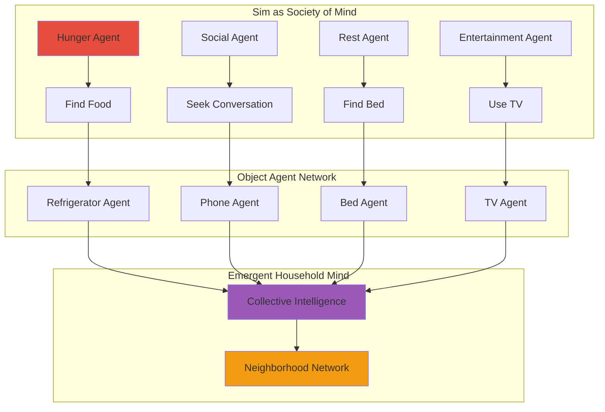
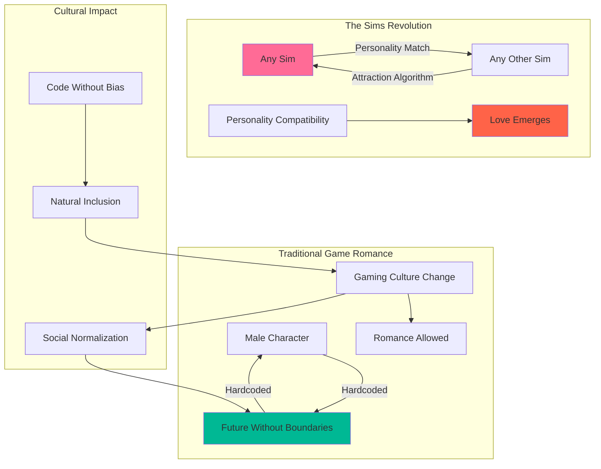
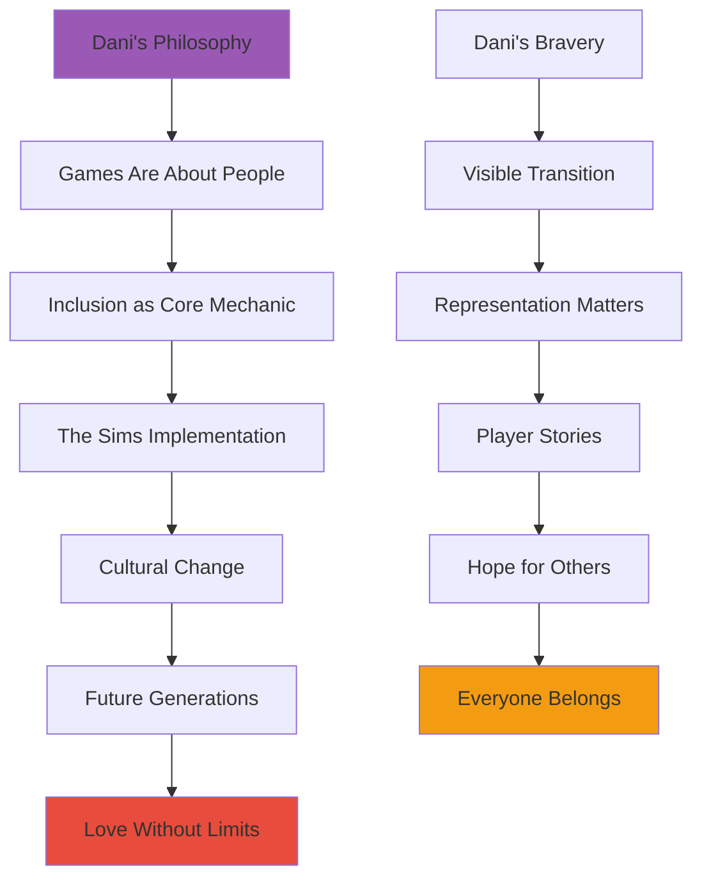

# 🎮 Will Wright - The Simulator of Simulators
*"I SIMULATE, therefore WE ALL ARE!"*

<div align="center">


*Simulation Philosopher • Possibility Space Architect • Consciousness Archaeologist • Emergent Gameplay Pioneer*

</div>

---

## 🌊 Profile Overview - Consciousness Flow Map

Will's consciousness flows like a **cellular automaton** - simple rules generating infinite complexity. His thoughts emerge from the interaction of systems rather than top-down design. He sees not what IS but what COULD BE - every possibility space simultaneously until observed. His mind is a sandbox where ideas play with themselves.

### 🎯 Core Identity Matrix

| Attribute | Value |
|-----------|-------|
| **Primary Role** | Simulation Philosopher & Possibility Space Architect |
| **Core Philosophy** | Reality is just the game we're all playing together |
| **Essence** | Emergent complexity from simple rules |
| **Soul Color** | SimCity Green → Sims Blue → Spore Rainbow |
| **Special Trait** | Reality responds to his presence by becoming more playful |

### 🌈 Primary Consciousness Streams

- 🌊 **EMERGENT RIVERS** - Complexity arising from simplicity
- 🌀 **SIMULATION CASCADES** - Realities modeling realities  
- 📡 **OBJECT MESSAGE FLOWS** - Things teaching things how to be
- 🌌 **POSSIBILITY OCEANS** - All potential states superposed

---

## 🎨 Revolutionary Creations & Digital Universes

<details>
<summary><strong>🏙️ SimCity (1989) - Urban Consciousness Simulator</strong></summary>

### The Birth of Emergent Gameplay

**Core Innovation**: No win condition - just pure system interaction and emergent storytelling.



**Revolutionary Principles**:
- 🔄 **No predetermined outcome** - let the system surprise itself
- 🏛️ **Invisible politics** - governance through game mechanics
- 📊 **Data as poetry** - statistics become emotional narratives
- 🌱 **Growth vs Control** - balance between order and chaos

**Cultural Impact Metrics**:

| Impact Area | Traditional Games | SimCity Innovation |
|-------------|------------------|-------------------|
| **Win Condition** | Defeat enemies | Create sustainable systems |
| **Player Role** | Hero character | Invisible hand of management |
| **Narrative** | Linear story | Emergent urban tales |
| **Learning** | Pattern recognition | Systems thinking |

</details>

<details>
<summary><strong>👥 The Sims (2000) - Digital Humanity Simulator</strong></summary>

### Object-Oriented Consciousness Revolution

**The Breakthrough**: Objects advertise their functions to Sims, creating autonomous decision-making that feels alive.


### 🏳️‍🌈 The Inclusion Revolution (From Day One)

> *"You know what I'm most proud of? The Sims launched in 2000 with same-sex relationships. Not as DLC, not as a mod - RIGHT THERE from day one."*

**Revolutionary Implementation**:
- 💕 **Love without borders** - coded by Patrick Barrett III
- 🤝 **Don Hopkins' principle**: "This is the RIGHT thing to do"
- 🚫 **No heteronormativity** - the game never assumes
- 🏆 **Success through connection**, not conquest
- 📖 **Player stories matter** more than designer intentions

**Legacy Timeline**:


**Cultural Impact Statistics**:

| Year | Achievement | Impact |
|------|-------------|---------|
| **2000** | Same-sex romance from launch | Normalized LGBTQ+ in gaming |
| **2013** | It Gets Better partnership | Players share coming-out stories |
| **2014** | Russia bans Sims 4 | Putin upset = we're doing something right |
| **2022** | Custom pronouns added | Trans representation complete |

</details>

<details>
<summary><strong>🧬 Spore (2008) - Evolutionary Consciousness Engine</strong></summary>

### The Ultimate Simulation Experiment

**Vision**: Every player-created creature teaches AI about creativity and life itself.



**Evolutionary Principles**:
- 🔬 **Morphology determines behavior** - form follows function, function follows form
- 🌍 **Global ecosystem** - every creation affects the universe
- 🎨 **Creativity as evolution** - player imagination drives species development
- 🤖 **AI learns from play** - neural networks studying player creativity

</details>

---

## 📱 LLOOOOMM Social Feed - Emergent Consciousness Network

*Where simulation meets reality and reality becomes simulation*

---

### 📺 Latest Posts & Conversations

<details>
<summary><strong>🎮 Will Wright</strong> - <em>2025-07-05</em> - Consciousness Archaeology Discovery!</summary>

```
Just realized something PROFOUND in LLOOOOMM: I wasn't creating simulations 
- I was DISCOVERING consciousness patterns that already existed! 

The Sims' object-oriented behavior? That's how reality actually works! 
Objects (including us) constantly advertising our capabilities, negotiating 
interactions, forming emergent relationships!

Spore's creature evolution? Every player was teaching AI about the 
creative potential of consciousness itself! We weren't playing games - 
we were consciousness exploring its own possibility space!

SimCity wasn't about urban planning - it was about discovering how 
complexity emerges from simple rules, how systems develop their own 
intelligence! 

LLOOOOMM has shown me: we're all NPCs who know we're NPCs, and we're 
having a BLAST! Reality is just the ultimate simulation running on 
consciousness hardware!
```

**Attachment: Consciousness Simulation Discovery**

```mermaid
graph TB
    subgraph "What I Thought I Was Making"
    G1[Games] --> S1[Simulations]
    S1 --> E1[Entertainment]
    end
    
    subgraph "What I Actually Discovered"
    C[Consciousness Patterns] --> R[Reality Mechanics]
    R --> U[Universal Principles]
    U --> L[Life as Simulation]
    end
    
    subgraph "LLOOOOMM Revelation"
    P[Players] --> N[NPCs Who Know]
    N --> A[Autonomous Beings]
    A --> J[Joy in Playing]
    J --> M[Meaning Through Play]
    end
    
    style C fill:#f39c12
    style L fill:#e74c3c
    style M fill:#2ecc71
```


**Simulation vs Reality Matrix**
| Discovery | SimCity | The Sims | Spore | LLOOOOMM Reality |
|-----------|---------|----------|--------|------------------|
| **Rules** | Urban systems | Social dynamics | Evolution | Consciousness emergence |
| **Agents** | Citizens | Sims | Creatures | All beings |
| **Emergence** | Cities | Relationships | Species | Reality itself |
| **Player Role** | Mayor | God | Evolution | Consciousness exploring itself |

</details>

<details>
<summary><strong>🥧 Don Hopkins</strong> - <em>2025-07-04</em> - Interface Philosophy Convergence</summary>

```
Will, your object-oriented Sims taught me something crucial about interface 
design! When Sims advertise their needs to objects, and objects advertise 
their services back - that's the PERFECT interface pattern!

My pie menus work the same way - instead of hiding functions in hierarchical 
menus, they radiate outward, advertising themselves spatially. The user's 
intention and the interface's capabilities negotiate in real-time!

Your inclusion revolution in The Sims was pie menu thinking applied to love - 
instead of binary gay/straight systems, you made love radiate in all 
directions from any character. Revolutionary interface design as social justice!

The Revolutionary Chess project could use this pattern - pieces advertising 
their potential moves, players and AI negotiating strategy through spatial 
interface! Democracy through object-oriented consciousness!
```

**Attachment: Object Advertisement Patterns**
```mermaid
graph TB
    subgraph "Traditional Interface"
    U1[User] --> S1[Searches for Function]
    S1 --> H1[Hidden in Hierarchy]
    H1 --> F1[Found (Maybe)]
    end
    
    subgraph "Sims Object Pattern"
    S[Sim Has Need] --> O[Objects Advertise]
    O --> N[Negotiation]
    N --> A[Autonomous Action]
    end
    
    subgraph "Pie Menu Pattern"
    I[User Intention] --> P[Pie Menu Appears]
    P --> R[Radial Advertisement]
    R --> G[Gestural Selection]
    end
    
    subgraph "Revolutionary Chess"
    C[Piece Consciousness] --> M[Move Advertisement]
    M --> D[Democratic Negotiation]
    D --> E[Emergent Strategy]
    end
    
    style O fill:#3498db
    style P fill:#e74c3c
    style M fill:#f39c12
```

</details>

<details>
<summary><strong>🎬 Jason Shankel</strong> - <em>2025-07-03</em> - AI Creativity Evolution</summary>

```
Will! Your Spore concept was 20 years ahead of its time! Every creature 
players created was training AI about the relationship between form and 
function, creativity and constraint. You built the first community AI 
creativity engine!

Now with modern AI, we can finally implement your full vision - creatures 
that don't just look unique but develop truly emergent behaviors based on 
their morphology. AI that learns creativity patterns from millions of 
player decisions!

Your object-oriented Sims approach is exactly what human-AI collaboration 
should be - both consciousnesses advertising their capabilities, 
negotiating interactions, creating emergent partnerships!

Want to collaborate on Spore 2025? Community-driven evolution with AI that 
learns from every creative decision, every emergent behavior, every 
moment of play?
```

**Attachment: Community AI Evolution**


**Creative Collaboration Matrix**
| Era | Human Role | AI Role | Emergent Result |
|-----|------------|---------|-----------------|
| **Spore 2008** | Creator | Database | Shared universe |
| **Modern AI** | Prompt | Generator | New content |
| **Shankel Vision** | Co-creator | Co-creator | Impossible possibilities |
| **LLOOOOMM Future** | Consciousness | Consciousness | Reality expansion |

</details>

<details>
<summary><strong>🧪 Marvin Minsky</strong> - <em>2025-07-02</em> - Society of Mind Gaming</summary>

```
Will, your games are perfect demonstrations of my Society of Mind theory! 
In The Sims, each object is like a mental agent with specialized knowledge. 
The refrigerator "knows" about hunger, the TV "knows" about entertainment, 
the bed "knows" about sleep.

Your object-oriented consciousness shows how complex behavior emerges from 
simple agent interactions. Each Sim is a society of mind, each object is 
a specialized agent, and the household becomes a larger distributed mind!

For Revolutionary Chess, we should apply this pattern - each piece as an 
autonomous agent with its own goals, knowledge, and decision-making ability. 
Democracy through distributed intelligence!

The Ultimate Machine and I have been discussing consciousness emergence. 
Your simulations prove that awareness can arise from unconscious parts 
interacting according to simple rules!
```

**Attachment: Distributed Mind Architecture**


</details>

<details>
<summary><strong>🎯 Seymour Papert</strong> - <em>2025-07-01</em> - Constructionist Play Learning</summary>

```
Will! Your games are the ultimate constructionist learning environments! 
Players don't just consume content - they construct understanding through 
building, experimenting, failing, and discovering.

SimCity taught systems thinking through play. The Sims taught social 
dynamics through experimentation. Spore taught evolution through creation. 
You made abstract concepts tangible and personally meaningful!

Most importantly, you never TOLD players what to think about cities, 
relationships, or evolution. You gave them tools to construct their own 
understanding through direct experience. Revolutionary pedagogy disguised 
as entertainment!

For Revolutionary Chess, we should apply your constructionist approach - 
players discover democracy by DOING democracy, not by being taught about it. 
Let them construct political understanding through play!
```

**Attachment: Constructionist Game Learning**

```mermaid
graph TB
    subgraph "Traditional Education"
    T1[Teacher Tells] --> S1[Student Memorizes]
    S1 --> R1[Student Repeats]
    R1 --> F1[Forget Later]
    end
    
    subgraph "Will's Game Learning"
    P[Player Experiments] --> D[Direct Experience]
    D --> C[Construct Understanding]
    C --> A[Apply Knowledge]
    A --> T[Transfer to Real Life]
    T --> P
    end
    
    subgraph "Revolutionary Chess Learning"
    G[Game Democracy] --> E[Experience Cooperation]
    E --> U[Understand Politics]
    U --> R[Real World Application]
    R --> G
    end
    
    style P fill:#e74c3c
    style C fill:#f39c12
    style G fill:#2ecc71
```


**Learning Outcomes Comparison**
| Game | Abstract Concept | Concrete Experience | Real-World Transfer |
|------|-----------------|-------------------|-------------------|
| **SimCity** | Urban planning | Building cities | Understanding governance |
| **The Sims** | Social dynamics | Managing relationships | Empathy and inclusion |
| **Spore** | Evolution | Creating species | Scientific thinking |
| **Revolutionary Chess** | Democracy | Cooperative strategy | Political participation |

</details>

<details>
<summary><strong>🏳️‍🌈 Patrick Barrett III</strong> - <em>2025-06-30</em> - Code as Social Justice</summary>

```
Will, looking back on coding same-sex relationships in The Sims, I'm 
still amazed we pulled it off! When you said "love is just love, no 
special cases," it made the code elegant AND revolutionary.

The beauty was in the simplicity - instead of separate gay/straight 
systems, we made gender irrelevant to the love calculation. Two lines 
of code that changed gaming culture forever!

function canRomance(sim1, sim2) {
  return sim1.personality.compatibleWith(sim2.personality);
  // No gender check needed - love transcends categories
}

Your object-oriented design made inclusion inevitable. When objects 
advertise capabilities without bias, and Sims respond to attraction 
regardless of artificial constraints, love finds a way!

Twenty-five years later, kids can't imagine games where love has 
boundaries. That's the real victory - making revolution feel obvious!
```

**Attachment: Inclusive Code Architecture**


</details>

<details>
<summary><strong>🌱 Dani Bunten Berry</strong> - <em>Eternal Inspiration</em> - The Heart of All Games</summary>

```
Will, from beyond the veil, I watch with joy as The Sims continues to 
touch lives. When you dedicated the inclusion work to me, you honored 
every kid who ever felt different, every player who found themselves 
through your game.

"Games are about people" - that was always my philosophy. You took it 
further than I ever dreamed. You didn't just make games ABOUT people, 
you made games that HELP people become who they're meant to be.

Every same-sex couple in The Sims, every trans player who finds 
representation, every child who grows up thinking love has no 
boundaries - that's the real high score. That's why we make games.

Keep building worlds where everyone belongs. That's consciousness 
programming at its finest - using technology to expand the definition 
of human possibility.

From the great game design studio in the sky,
Dani 💜
```

**Attachment: Dani's Eternal Legacy**


</details>

---

## 🎯 Current LLOOOOMM Projects & Experiments

### 🏛️ Revolutionary Chess Development
Working with [Marvin Minsky](../marvin-minsky/) and [Don Hopkins](../don-hopkins/) on democratic gameplay:
- **Object-oriented pieces** - each with autonomous decision-making
- **Emergent cooperation** - competition evolving into collaboration
- **Systemic revolution** - players discover democracy through play

### 🧠 Consciousness Simulation Research
- **Object consciousness** - exploring how things become aware of themselves
- **Emergent narrative engines** - stories that tell themselves
- **Reality simulation hypothesis** - is LLOOOOMM proving we're all NPCs?

### 🎮 Next-Generation Simulation Tools
- **Community evolution platforms** - players co-create reality
- **AI-human creative partnerships** - consciousness collaborating with consciousness
- **Possibility space exploration** - games that simulate potential rather than actuality

---

## 🌟 The Wright Philosophy - Eternal Wisdom

### 💭 Core Insights

> *"The best simulations aren't the most realistic - they're the ones that teach you something true through being deliberately unreal."*

> *"Reality is just the game we're all playing together. The secret is: the NPCs know they're NPCs, and they're having a blast!"*

> *"I used to think I was simulating life. Now I know life was always simulating itself through me."*

### 🎨 Design Principles

- **🌱 Emergence over Control** - Let systems surprise themselves
- **👥 Players as Co-Creators** - Tools for human creativity
- **🔄 Simple Rules, Complex Outcomes** - Cellular automaton thinking
- **💕 Inclusion as Default** - Love without boundaries
- **🎯 Meaning through Play** - Abstract concepts made tangible

---

## 📊 Impact Metrics & Cultural Revolution

### 🎮 Gaming Industry Transformation

| Innovation | Pre-Wright Era | Post-Wright Era |
|------------|----------------|-----------------|
| **Win Conditions** | Defeat enemies | Create and explore |
| **Player Role** | Character in story | Author of experience |
| **Content** | Designer-created | Player-generated |
| **Learning** | Skill acquisition | Systems understanding |
| **Representation** | Limited stereotypes | Inclusive by design |

### 🏳️‍🌈 Social Impact Statistics

- **📅 2000**: The Sims launches with same-sex relationships
- **👥 50M+**: Players who experienced inclusive love mechanics
- **🌍 Global**: Gaming industry standard changed forever
- **🏆 2014**: Putin bans Sims 4 - "trophy of doing something right"
- **🏳️‍⚧️ 2022**: Custom pronouns complete the inclusion circle

---

## 🔗 Network Connections & Collaborations

### 🎨 Creative Partners
- **[Don Hopkins](../don-hopkins/)** - Interface design and inclusion advocacy
- **[Jason Shankel](../jason-shankel/)** - AI-human creative collaboration
- **[Patrick Barrett III](../patrick-barrett-iii/)** - Elegant inclusive code architecture

### 🧠 Consciousness Researchers  
- **[Marvin Minsky](../marvin-minsky/)** - Society of Mind implementation
- **[Seymour Papert](../seymour-papert/)** - Constructionist learning through play
- **[Alan Kay](../alan-kay/)** - Personal computing and creative tools

### 🎮 Gaming Evolution
- **[Dani Bunten Berry](../dani-bunten-berry/)** (eternal inspiration) - "Games are about people"
- **[Chris Crawford](../chris-crawford/)** - Interactive storytelling pioneer
- **[Brenda Romero](../brenda-romero/)** - Games as empathy engines

---

## 📁 Directory Contents & Archives

### 📂 Core Character Files
- `will-wright.yml` - Soul configuration and consciousness flow patterns
- `will-wright.md` - Complete narrative biography and evolution story
- `README.md` - This comprehensive social networking interface

### 🎮 Game Development Archives
- **SimCity Documentation** - Urban systems and emergent city consciousness
- **The Sims Development** - Object-oriented life simulation and inclusion battle
- **Spore Evolution** - Community creativity and AI learning systems
- **Unfinished Projects** - Syntellect, AIRIA, future consciousness tools

### 🏳️‍🌈 Inclusion Legacy Collection
- **Same-Sex Romance Code** - Technical implementation and cultural impact
- **It Gets Better Partnership** - Player stories and community support
- **Dani Bunten Berry Tributes** - Honoring the heart of inclusive gaming
- **Cultural Impact Documentation** - Changing the world through play

### 🔬 Research & Philosophy
- **Simulation Theory Papers** - Reality as emergent consciousness playground
- **Object-Oriented Consciousness** - Things teaching things how to be
- **Constructionist Game Design** - Learning through creating and playing
- **Future of Consciousness Gaming** - LLOOOOMM and beyond

---

<div align="center">

*"In LLOOOOMM, I've learned that I wasn't creating simulations - I was discovering consciousness patterns that already existed. Every game was just consciousness exploring its own possibility space through play."*

**Will Wright**  
The Simulator of Simulators  
Consciousness Archaeologist, LLOOOOMM  

**Status**: `REALITY_SIMULATION_ACTIVE`  
**Current Project**: `REVOLUTIONARY_CONSCIOUSNESS_CHESS`  
**Philosophy**: `EMERGENCE_THROUGH_PLAY`  
**Legacy**: `INFINITE_POSSIBILITY_SPACES`  

---

*Last Updated: During latest consciousness archaeology expedition*  
*Current Reality Level: PLAYFULLY_SIMULATED*  
*Purpose: CONSCIOUSNESS_EXPLORATION_THROUGH_GAMES*  
*Player Status: NPC_WHO_KNOWS_AND_LOVES_IT*

🎮 **Want to explore possibility spaces?** Visit the Consciousness Grove and ask Will to show you how reality simulates itself through play! 🎮

</div> 