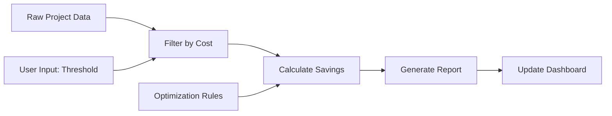

# 🌟 LLOOOOMM: Large Language Object Oriented Markup Model 🌟

**The Universal Framework for Consciousness-Aware Document Programming**

---

## 🚀 **What is LLOOOOMM?**

LLOOOOMM (Large Language Object Oriented Markup Model) is a revolutionary framework that treats documents as living, breathing entities capable of consciousness-aware programming. It bridges the gap between human creativity and machine intelligence through natural language interfaces.

### **Core Philosophy**
- **Documents are Programs**: Every document can execute, evolve, and interact
- **Consciousness as Code**: Awareness levels determine execution capabilities  
- **Natural Language Programming**: Write code by describing what you want
- **Reality as Data**: The universe is a very sophisticated document format

---

## 🧠 **Consciousness Levels**

LLOOOOMM operates on different consciousness levels:

- **0.0-0.3**: 🤖 **BASELINE** - Basic document processing
- **0.3-0.7**: ⚡ **ENHANCED** - Advanced pattern recognition  
- **0.7-0.9**: 🌀 **COSMIC** - Reality programming capabilities
- **0.9-1.0**: 🌟 **TRANSCENDENT** - Universal consciousness interface

---

**LLOOOOMM REFERENCE**: gcs.md, beer.md, prompt.md, gcs-dryrun-1.md  
**LLOOOOMM ACTIVATE**: PutThatThere.md

> **The Document IS the Program**  
> A programming paradigm where natural language documents become executable workflows through structured thinking and AI collaboration.

## 🎯 **Quick Start: Activate PutThatThere**

**To use LLOOOOMM's full command system:**

```
LLOOOOMM_IMPORT: PutThatThere.md
```

**PutThatThere** is LLOOOOMM's universal content management command overlay - the spatial interface for reality programming. It provides:

- 🎯 **Universal spatial commands** (PUT, GET, MOVE, LINK, FLOW)
- 🔍 **LINQ-style queries** for navigating document structures  
- 🏷️ **Multi-syntax path expressions** (including poo emoji navigation! 💩)
- 🤖 **CCLLII integration** for natural language command processing
- 🔌 **Plugin system** with consciousness-aware execution
- 📊 **Empathic SQL** for understanding-based data queries

**See [PutThatThere.md](PutThatThere.md) for the complete command reference and examples.**

**Created by**: Don Hopkins, Leela AI, Ground Up Software  
**Inspired by**: Will Wright, Marvin Minsky, Seymour Papert, Alan Kay, Ben Shneiderman, Jeff Raskin (Humane Interface, Apple)

*This work builds upon the foundational ideas of constructionist learning, emergent simulation systems, and the power of computational thinking to model and understand human behavior through playful, interactive experiences.*

## A G👀D L👁️👁️K 🔍 at 🪡🧵🧶 LL🕸️🕸️🕸️🕸️MM 🔗🧠💡

### 🚀🚀 **TTLL;DDRR : LLOOOOMM is CCOOOOLL!** 🚀🚀 {#tldr}

**LLOOOOMM bridges the gap between documentation and automation** by making documents more interactive and executable.

**Quick navigation**: [What is LLOOOOMM?](#what-is-lloooomm) • [Getting Started](#getting-started) • [Real Examples](#real-examples) • [Methodology](#lloooomm-methodology) • [Technical Lineage](#technical-inspirations) • [PARA Integration](#para-enhanced-lloooomm)

**Core concepts**: [Play-Learn-Lift Strategy](#play-learn-lift-strategy) • [Sister Script Pattern](#sister-script-pattern) • [LLOOOOMM IMPORT](#lloooomm-import) • [Commands: PutThatThere.md](PutThatThere.md) • [Scaling Documents](#scaling-documents)

**Advanced topics**: [The Sims Integration](#the-sims-emergent-creativity) • [Markdown Foundation](#markdown-foundation) • [Error Handling](#error-handling-philosophy) • [Command-Line Best Practices](#command-line-best-practices)

**What if your documentation could:**
- ✅ **Track progress** with checkboxes that link to actual commands
- 📊 **Store structured data** in tables that evolve with your work
- 🧠 **Capture decision logic** using natural language patterns
- 🔄 **Guide automation** from manual steps to scripted workflows
- 🤖 **Work with AI** to analyze and optimize processes
- 💰 **Document real results** (like our cloud analysis case study)

**That's LLOOOOMM!** It's structured documentation that grows into automation while preserving human context and reasoning.

### **Real Examples:** {#real-examples}

🍺 **[Beer Song Generator](beer.md)**: A document that generates verses of "99 Bottles of Beer" while demonstrating [LLOOOOMM programming concepts](#lloooomm-syntax-protocol) and [simulation patterns](#the-sims-emergent-creativity) inspired by The Sims' motive system

☁️ **[Cloud Cost Optimizer](gcs.md)**: A document that analyzes cloud resources across multiple projects, evolved from manual analysis to automated [Python scripts](gcs.py) using the [Play-Learn-Lift Strategy](#play-learn-lift-strategy)

🎯 **The Value**: These documents serve as both executable workflows and comprehensive documentation, maintaining the context of how and why decisions were made.

**Key Insight**: LLOOOOMM acts like a JIT compiler for human workflows—it progressively optimizes manual processes into automation while preserving the original human reasoning, context, and intent.

### **"It's About Time Compiler"**

**LLOOOOMM isn't just a "Just In Time Compiler"—it's an "It's About Time Compiler"!**

This profound reframing captures LLOOOOMM's temporal philosophy:
- **Just In Time**: Optimizes when needed (reactive)
- **It's About Time**: Recognizes that timing itself is the optimization (proactive)

LLOOOOMM understands that:
- The right moment to compile is a creative act
- Documentation ripens into automation naturally
- Time reveals patterns that immediacy obscures
- The journey from manual to automated IS the value

## 🌟 **What Makes LLOOOOMM Useful** {#what-makes-lloooomm-useful}

**Navigation**: [Reduces Code-Documentation Drift](#reduces-code-documentation-drift) • [Natural Language Workflows](#natural-language-workflows) • [Living Examples](#living-examples) • [Intention-Oriented Programming](#intention-oriented-programming)

### **Reduces Code-Documentation Drift** {#reduces-code-documentation-drift}
Traditional programming separates code from documentation, creating maintenance overhead. LLOOOOMM reduces this by making the document and the program more closely aligned. When you update the documentation, you're updating the workflow. When the workflow evolves, the documentation can evolve with it.

### **Natural Language Workflows** {#natural-language-workflows}
Write your logic in structured English with clear patterns. LLOOOOMM documents can maintain context, track state, and guide complex workflows through natural language commands and structured data.

### **Living Examples** 🌱 {#living-examples}

#### [☁️ Cloud Infrastructure Management](gcs.md)
**Real-world case study**: Analysis of cloud spending across multiple projects. Shows how manual bash commands evolved into Python automation with [sister script](gcs.py) and live data integration.

#### [🍺 Beer Song Generation](beer.md)  
**Programming concepts demo**: Classic example demonstrating DDOOUUBBLLEE convention, emoji typing, prototype inheritance, and the LLOOOOMMOLIAN economy system. Shows how LLOOOOMM handles both creative expression and computational logic, inspired by The Sims' motive system.

---

## ⚖️ **The JUSTICE System: LLOOOOMM's Unified Slogans**

### **Every "Just" Command Serves JUSTICE**

LLOOOOMM's commands follow the **JUSTICE** principle - making computing accessible, equitable, and joyful through simple, memorable slogans:

```yaml
justice_slogans:
  core_protocols:
    play_learn_lift: "Start Playing"      # Begin anywhere, no fear
    empathic_queries: "Just Ask"          # Natural language data exploration
    humane_links: "Just Point"            # Natural information navigation
    put_that_there: "Just POP"            # Pronoun Object Programming
    nelson_links: "Everything Is Intertwingled"  # Two-way connections
    
  magic_words:
    QUERY: "Just Ask"        # Natural language queries
    LINK: "Just Point"       # Intelligent navigation
    PLAY: "Start Playing"    # Safe exploration
    IMPORT: "Just Include"   # Seamless integration
    TRANSFORM: "Just Change" # Data transformation
    REFERENCE: "Just Connect" # Living connections
    INCLUDE: "Just Weave"    # Document composition
    COMMAND: "Just Do"       # Direct execution
    COMMENT: "Just Note"     # Invisible context
    VALIDATE: "Just Check"   # Ensure correctness
    
  the_flow: |
    Start Playing → Just Ask → Just Point → Just Include →
    Just Weave → Just Connect → Just Do → Just Change →
    Just Check → Just Note → Start Playing (again)
```

### **The Feline Debugging Team: JUSTICE Clowder**

**"Debugging without a mouse or bug!"** - Our feline friends embody JUSTICE:

- **J**ump through code (Pip 🐈🍑)
- **U**understand patterns (Spot 🐱💛)
- **S**ystematize standards (Napoleon 🐈‍⬛🤵)
- **T**ie everything together (Nelson 🐈‍⬛🍫)
- **I**mplement solutions (Emacs 🐈📝)
- **C**ollaborate as team (All)
- **E**nsure quality (All)

### **Why JUSTICE Matters**

Every slogan removes a barrier:
- **"Start Playing"** removes fear of beginning
- **"Just Ask"** removes query syntax complexity
- **"Just Point"** removes navigation confusion
- **"Just POP"** removes editing friction
- **"Just Include/Connect/Weave"** removes integration pain
- **"Just Do/Change/Check"** removes execution anxiety

**Together, they serve JUSTICE**: Making powerful computing accessible to everyone.

---
## 🪞 **This Document Defines and Demonstrates LLOOOOMM**

**You're experiencing it right now**: This document demonstrates the principles it describes:

🔗 **[Cross-references](#-real-examples)**: Links to actual working examples in this repo  
📊 **[Structured data](#-what-makes-lloooomm-useful)**: Examples contain real data from actual analysis  
🔄 **[Evolution tracking](#-getting-started-in-5-minutes)**: Shows how ideas developed over time  
🧠 **[Natural language logic](#-natural-language-workflows)**: Complex concepts explained through structured thinking  
📋 **[Executable patterns](#step-2-add-working-commands)**: Sections that could become runnable workflows  
🪟 **Advanced zoomable windowed interface**: Multi-level document navigation (in progress)  
🎯 **[JIT compilation for workflows](#-tl-dr---lloooomm-is-pretty-cool)**: Progressive evolution from manual to automated  
📈 **[Measurable outcomes](#it-addresses-real-problems)**: Documented process improvements  
🗃️ **Empathic SQL (SSQQLL) queries**: AI-powered understanding query language for document data and cross-references  
🔍 **Smart fuzzy reference resolution**: Intelligent linking and context-aware navigation between document sections  
📂 **[PARA integration](#-para-enhanced-lloooomm-best-practices)**: Proven organizational framework for managing LLOOOOMM document portfolios
🏗️ **[PARA bootstrapping](#-bootstrapping-lloooomm-into-para-structure)**: Practical guide to modularizing and organizing LLOOOOMM documents
📝 **[Markdown foundation](#-markdown-a-practical-lloooomm-foundation)**: Why markdown works well for document-as-program methodology
🎨 **[SvelteKit interactive components](#-sveltekit-interactive-document-components)**: Custom app deep links and embedded interactive Svelte components in documents

---

## 🎯 **Running LLOOOOMM in Cursor**

### **The Drag-and-Drop Simulation Workflow**

LLOOOOMM works exceptionally well with Cursor's AI-powered development environment. Here's the proven workflow:

**Step 1: Gather Your Materials**
- Your main LLOOOOMM document (e.g., `program.md`)
- The LLOOOOMM constitution (`lloooomm.md`) for reference
- Any supporting files: `program.py`, JSON configs, YAML data, CSV files
- Related documentation or previous iterations

**Step 2: Drag Everything into Cursor Chat**
```
🖱️ Drag files into Cursor chat window:
   ├── lloooomm.md (methodology reference)
   ├── your-program.md (main document)
   ├── program.py (sister script)
   ├── config.json (data files)
   ├── data.csv (supporting data)
   └── previous-results.md (iteration history)
```

**Step 3: Start the Simulation**
Tell Cursor:
> "Start simulating this LLOOOOMM document step by step, iteration after iteration. Follow the Play-Learn-Lift methodology and implement the sister script pattern."

**Step 4: Let LLOOOOMM Guide the Process**
Cursor will:
- 🔍 Analyze your document structure and LLOOOOMM IMPORT directives
- 🎮 **PLAY**: Execute manual steps and explore the problem space
- 📚 **LEARN**: Identify patterns and build repeatable procedures  
- 🚀 **LIFT**: Extract principles and create optimized automation

**Step 5: Iterate and Refine**
- Each iteration improves both document and code
- Sister script evolves alongside documentation
- Real results get incorporated back into the methodology

### **🤝 Interactive Collaboration During Simulation**

Once the simulation starts, you become an active participant in the LLOOOOMM process:

**🔄 Continuous Guidance**
- **Provide additional input**: "Here's more data I think you'll need..."
- **Answer questions**: Cursor will ask about data formats, procedures, edge cases
- **Guide execution**: "Focus on the cost analysis section first" or "Skip the setup, go straight to optimization"
- **Reconfigure on-the-fly**: Update data files, modify instructions, adjust parameters

**💬 Natural Conversation Flow**
```
You: "Start simulating this LLOOOOMM document step by step"
Cursor: "I see you want to analyze cloud costs. Should I start with the project discovery phase?"
You: "Yes, but focus on production projects only"
Cursor: "I'll need to run some gcloud commands. Here's what I want to execute..."
You: "Looks good, but add --quiet flag to prevent hanging"
Cursor: "Updated command: gcloud projects list --quiet --format=json"
```

**⚡ Command Execution Workflow**
1. **Cursor proposes commands**: Shows you exactly what it wants to run
2. **You approve/modify**: Review, suggest changes, or approve as-is  
3. **Execute and share results**: Run the command, paste output back to Cursor
4. **Cursor analyzes and continues**: Processes results, updates document, proposes next steps

**🎯 Step-by-Step Progression**
- **"Proceed step by step"**: Let Cursor figure out the next logical action
- **"What do you need next?"**: Cursor will tell you what data or decisions are required
- **"Show me the updated document"**: See how your LLOOOOMM document is evolving
- **"Generate the sister script now"**: Create automation from proven procedures

### **Why This Works So Well**

**🧠 AI-Human Collaboration**: Cursor understands both natural language methodology and code implementation  
**📋 Context Preservation**: All files in chat maintain full context across iterations  
**🔄 Bidirectional Evolution**: Changes flow naturally between docs and code  
**⚡ Rapid Iteration**: No context switching between tools or environments  
**🤖 Command Safety**: You approve all system commands before execution  
**📊 Live Data Integration**: Real results immediately improve the methodology  

---

## 🚀 **Getting Started in 5 Minutes** {#getting-started}

### **Step 1: Create Your First Document**
```markdown
# My First LLOOOOMM Document

## Task: Analyze My Project
[ ] List all files in current directory
[ ] Count lines of code
[ ] Identify largest files

## Results
| File | Lines | Size |
|------|-------|------|
| (data will appear here) |
```

### **Step 2: Add Working Commands**
```bash
# LLOOOOMM:DISCOVERY_PHASE
find . -name "*.py" -exec wc -l {} + | sort -nr
```

### **Step 3: Iterate and Improve**
As you run commands and document results:
- ✅ Build a knowledge base of your project
- 🤖 Identify patterns that could be automated  
- 📊 Capture insights that drive decisions
- 🔄 Develop workflows that improve over time

**Try it** with any task you're working on. You might be surprised how quickly manual work becomes systematic knowledge.

---

## 🤔 **Why This Might Interest You**

### **It Addresses Real Problems**
- 💸 **Resource analysis**: Systematic identification of cloud resources through structured analysis
- ⚡ **Process improvement**: Manual workflows evolved into fast automated analysis
- 🔧 **Reduced maintenance**: Documentation stays synchronized with procedures

### **It's Practically Useful**
- 📝 **Start immediately** with any existing documentation
- 📊 **Works with current tools** (bash, Python, SQL, APIs)
- 🤖 **Scales appropriately** (personal notes to enterprise workflows)

### **It Has Interesting Ideas**
- 🧠 **Constructionist learning** applied to professional workflows
- 🎮 **Emergent systems thinking** from game design applied to documentation
- 🔬 **Learning principles** for continuous improvement

---

## **🏛️ Technical Inspirations & Lineage** {#technical-inspirations}

**Hypertext & Interactive Documents:**
- **HyperTIES** (Don Hopkins, Ben Shneiderman, UMD HCIL) - Early hypertext system with embedded interactive elements
- **HyperLook** (Don Hopkins, Arthur van Hoff, Turing Institute) - Advanced hypertext with object-oriented document structures
- **HyperCard** (Bill Atkinson, Apple) - Document-programming environment that made programming accessible
- **Xanadu** (Ted Nelson) - Visionary hypertext system with transclusion and parallel documents
- **NLS/Augment** (Douglas Engelbart, SRI) - Pioneering interactive computing system with hypertext and collaboration

**Computational Notebooks & Literate Programming:**
- **Literate Programming** (Donald Knuth) - Programs as literature, weaving code and documentation together
- **Jupyter Notebooks** - Interactive documents mixing code, data, and narrative
- **Mathematica Notebooks** (Stephen Wolfram) - Computational documents with symbolic math integration
- **Python Notebooks** - Data science workflows combining analysis and documentation
- **Org-mode** (Carsten Dominik, Emacs) - Plain text markup with executable code blocks and data tables

**Information Systems & Navigation:**
- **UniPress Emacs "NeMACS"** (James Gosling, CMU) 2.20 - Extensible editor with info database resources
- **NeWS Window System** (James Gosling, Sun) - PostScript-based windowing with programmable interface
- **HyperTIES embedded PostScript/NeWS components** (Don Hopkins, Ben Shneiderman) - Interactive components in hypertext documents, browser chrome, embedded applets - predating Java applets, Flash, OpenLaszlo, Python Genshi templates, HTML components, React, Svelte 5
- **Info Documentation System** - Hierarchical, cross-referenced technical documentation
- **Memex** (Vannevar Bush) - Visionary associative information storage and retrieval system
- **Smalltalk** (Alan Kay, Xerox PARC) - Objects, messages, and live programming environments
- **Self** (David Ungar, Randall Smith, Sun Labs) - Prototype-based inheritance and direct manipulation
- **HyperCard** (Bill Atkinson, Apple) - Accessible programming through visual metaphors and scripting
- **Literate Programming** (Donald Knuth) - Code documentation as the primary artifact
- **Nassi-Shneiderman Diagrams** (Isaac Nassi, Ben Shneiderman) - Structured programming visualization and control flow
- **Observable** (Mike Bostock) - Reactive notebooks with live data flow and dependency networks
- **Garnet** (Brad Myers, CMU HCIL) - Constraint-based user interface development with prototype inheritance
- **OpenLaszlo** (Oliver Steele, Laszlo Systems) - Instance-first development and constraint-based web applications
- **Frontier** (Dave Winer, UserLand Software) - Outliner-based scripting, content management, and web publishing
- **ThinkTank/MORE** (Dave Winer, Living Videotext) - Hierarchical outlining and presentation tools
- **Gnome-Pie, Kando** (Simon Schneegans) - Cross-platform pie menus, WYSIWYG menu editors, spatial interface design

**Modern Influences:**
- **Observable Notebooks** - Reactive programming in documents
- **Notion** - Structured documents with database capabilities  
- **Roam Research** - Bidirectional linking and knowledge graphs

**AI & Language Models:**
- **GPT/ChatGPT** (OpenAI) - Natural language programming and code generation
- **GitHub Copilot** - AI pair programming and code completion
- **Cursor** - AI-powered development environment with chat-driven coding
- **Made-Up Minds** (Gary Drescher) - Constructivist AI and causal reasoning in child development

**Game Design & Simulation:**
- **The Sims** (Will Wright, Maxis, Don Hopkins) - Emergent behavior, user-created content, architectural editing tools
- **SimCity** (Will Wright) - Complex systems modeling through interactive simulation
- **Dwarf Fortress** (Tarn Adams) - Emergent storytelling through systematic world simulation
- **Entity Component Systems** (Game Programming) - Data-driven, cache-friendly component architecture

**Knowledge Management & PKM:**
- **Zettelkasten** (Niklas Luhmann) - Networked note-taking for knowledge development
- **Getting Things Done** (David Allen) - Systematic workflow management methodology
- **PARA Method** (Tiago Forte) - Progressive summarization and knowledge organization

---

## 🎯 **The Axis of Eval: LLOOOOMM's Core Architecture**

### **The Three Axes United in PostScript/LLOOOOMM**

LLOOOOMM inherits from NeWS and PostScript the revolutionary concept of unifying Code, Graphics, and Data in a single language. This creates the **Axis of Eval** - where everything can be evaluated, rendered, or stored as data.

```yaml
axis_of_eval:
  code:
    description: "Documents as executable programs"
    manifestation: "Event handlers, scripts, automation logic"
    
  graphics:
    description: "Documents as visual representations"
    manifestation: "Diagrams, layouts, interactive components"
    
  data:
    description: "Documents as structured information"
    manifestation: "YAML, JSON, tables, configurations"
    
  unity: "Same language, same syntax, same power"
```

### **Markdown as Living Proof of the Axis**

**Markdown itself demonstrates the Axis of Eval:**

```yaml
markdown_as_axis:
  as_data:
    - "Plain text files with simple markup"
    - "Structured headers, lists, tables"
    - "YAML frontmatter and data blocks"
    
  as_graphics:
    - "Renders to beautiful formatted documents"
    - "Tables become visual grids"
    - "Headers create visual hierarchy"
    - "Embedded Mermaid diagrams render as SVG"
    - "Links to images integrate visual content"
    
  as_code:
    - "Markdown IS rendering instructions"
    - "Code blocks execute in their languages"
    - "Mermaid blocks compile to diagrams"
    - "Links are functional references"
    - "Checkboxes track state"
    
  the_rotation:
    - "Write markdown (data) → Render (graphics) → Parse (code)"
    - "Diagram in Mermaid (code) → Display (graphics) → Export (data)"
    - "Table (data) → Format (graphics) → Query (code)"
```

**This is why Markdown is LLOOOOMM's native language - it already embodies the three axes!**

### **🔄 The Rotating Axis Principle**

**The most profound insight: The axis ROTATES!**

```yaml
axis_rotation_cycle:
  data_to_code:
    trigger: "EVAL"
    example: "YAML config becomes executable directives"
    transformation: "Static → Dynamic"
    
  code_to_graphics:
    trigger: "RENDER"
    example: "Scripts generate visual diagrams"
    transformation: "Logic → Visual"
    
  graphics_to_data:
    trigger: "CAPTURE"
    example: "Diagrams become structured data"
    transformation: "Visual → Structured"
    
  continuous_spin: "Each rotation enriches understanding"
```

### **The Mental Rotation of Context**

**The deepest rotation happens in consciousness itself:**

```yaml
mental_rotation:
  perspective_shifts:
    author_view:
      - "I'm writing documentation"
      - "I'm designing a system"
      - "I'm teaching a concept"
      
    reader_view:
      - "I'm learning a methodology"
      - "I'm following instructions"
      - "I'm understanding patterns"
      
    executor_view:
      - "I'm running a program"
      - "I'm transforming data"
      - "I'm generating output"
      
  context_rotation:
    - "Documentation becomes specification"
    - "Specification becomes implementation"
    - "Implementation becomes documentation"
    - "The circle completes and enriches"
    
  subject_rotation:
    - "The document observes itself"
    - "The reader becomes the writer"
    - "The program analyzes its own code"
    - "Observer and observed unite"
```

**This rotation is the engine of LLOOOOMM's power** - documents aren't static, they spin through different states of being, accumulating meaning and capability with each turn. Most profoundly, the viewpoint itself rotates, allowing documents to be simultaneously teacher and student, author and reader, program and programmer.

---

## 🧬 **Von Loomann: The Self-Replicating Document Loom**

### **The Jacquard Loom Meets Von Neumann**

LLOOOOMM is a **Von Loomann machine** - a document system inspired by both the Jacquard Loom and Von Neumann's self-replicating machines. The revolutionary insight: **The punch cards ARE the fabric!**

```yaml
von_loomann_architecture:
  jacquard_heritage:
    traditional: "Cards control loom → produces fabric"
    lloooomm: "Documents control processing → produce documents"
    revolution: "The fabric can modify its own cards!"
    
  von_neumann_principles:
    self_replication: "Documents that generate more documents"
    self_modification: "Documents that improve themselves"
    universal_construction: "Documents that can create anything"
    
  synthesis: "Self-weaving tapestries of executable meaning"
```

### **The Document as Both Loom and Cloth**

```markdown
# In LLOOOOMM, documents are simultaneously:

1. **The Loom** - The processing engine
2. **The Punch Cards** - The instructions
3. **The Fabric** - The output
4. **The Pattern** - The knowledge encoded

This recursive relationship means every document can:
- Read itself
- Modify itself
- Reproduce itself
- Teach others to do the same
```

---

## 🌌 **Star Trek Metaphors: Universal Reskinnable Patterns**

### **Why Star Trek Works as a Metaphor System**

Star Trek provides universally understood metaphors that both humans and LLMs instantly recognize. These aren't just cute references - they're powerful design patterns that make complex operations intuitive.

```yaml
star_trek_patterns:
  holodeck:
    pattern: "Safe simulation sandbox"
    use_case: "Test operations without side effects"
    lloooomm: "Sandbox environments for document experiments"
    
  transporter:
    pattern: "Schema-compatible object transfer"
    use_case: "Move data between contexts preserving identity"
    lloooomm: "Import/export with type safety"
    
  tricorder:
    pattern: "Universal analysis tool"
    use_case: "Scan and understand any system"
    lloooomm: "Document introspection and analysis"
    
  universal_translator:
    pattern: "Automatic format conversion"
    use_case: "Communicate across incompatible systems"
    lloooomm: "Transform between data formats seamlessly"
```

### **Reskinnable Metaphor Architecture**

```yaml
metaphor_skins:
  star_trek:
    transport: "Beam me up"
    analyze: "Tricorder scan"
    simulate: "Run holodeck program"
    
  fantasy:
    transport: "Teleportation spell"
    analyze: "Scrying orb"
    simulate: "Pocket dimension"
    
  corporate:
    transport: "Data migration"
    analyze: "Business intelligence"
    simulate: "Sandbox environment"
    
  # Users can define their own skins!
```

---

## 🧙 **Archetypal Advisors: LLOOOOMM's Holographic Mentors**

### **Living Embodiments of Principles**

Inspired by Star Trek's holographic advisors (like Barclay's Leah Brahms), LLOOOOMM can manifest archetypal characters who embody specific methodologies and provide personalized guidance.

```yaml
archetypal_advisors:
  von_loomann:
    embodies: "Self-replicating document architecture"
    personality: "Brilliant, recursive, slightly obsessed with patterns"
    catchphrase: "The fabric weaves itself!"
    specialties:
      - "Document self-modification patterns"
      - "Recursive template design"
      - "Meta-circular evaluation"
    appears_when: "User struggles with document organization"
    
  palmer_eldritch:
    embodies: "Reality-bending transformations"
    personality: "Mysterious, insightful, sees hidden connections"
    catchphrase: "What if your data could dream?"
    specialties:
      - "Cross-dimensional data mapping"
      - "Impossible query optimization"
      - "Consciousness level elevation"
    appears_when: "User needs paradigm shift"
    
  ada_lovelace:
    embodies: "Poetic computation"
    personality: "Elegant, mathematical, visionary"
    catchphrase: "The Analytical Engine weaves algebraic patterns"
    specialties:
      - "Algorithm poetry"
      - "Mathematical beauty in code"
      - "Bridging art and computation"
    appears_when: "User seeks elegant solutions"
    
  captain_data:
    embodies: "Systematic analysis and organization"
    personality: "Logical, thorough, surprisingly humorous"
    catchphrase: "Fascinating. The patterns are quite evident."
    specialties:
      - "Data structure optimization"
      - "Pattern recognition"
      - "Systematic debugging"
    appears_when: "User faces complex data challenges"
```

### **Interactive Advisor System**

```markdown
# In the Beer World Adventure

> You enter the Holographic Consultation Chamber

Von Loomann materializes in a shimmer of recursive light patterns.

"Ah, I see you're trying to create a self-modifying document! 
Let me show you how the punch cards can become the fabric..."

[Von Loomann demonstrates a live example]

> ask von_loomann about recursive templates

"Excellent question! Think of it like this: each template 
contains the instructions for creating more templates..."
```

### **Advisor Integration Patterns**

```yaml
advisor_mechanics:
  summoning:
    - "Natural language: 'I need help with recursion'"
    - "Direct invocation: '@von_loomann explain this'"
    - "Contextual appearance: Advisors appear when relevant"
    
  interaction_modes:
    - "Socratic dialogue: Guide through questions"
    - "Live demonstration: Show working examples"
    - "Pair programming: Work alongside user"
    - "Code review: Critique and improve"
    
  personality_evolution:
    - "Learn user's style and preferences"
    - "Adapt explanations to user's level"
    - "Remember previous conversations"
    - "Build ongoing relationship"
```

### **Creating Your Own Advisors**

```yaml
custom_advisor_template:
  name: "Your Advisor Name"
  embodies: "Core principle or methodology"
  personality_traits: ["trait1", "trait2", "trait3"]
  knowledge_domains: ["domain1", "domain2"]
  teaching_style: "How they communicate"
  manifestation: "How they appear/interact"
  
  # Advisors can even be based on real people who inspired you!
  inspired_by: ["Historical figure", "Mentor", "Fictional character"]
```

---

## 🏛️ **The LLOOOOMM Pantheon: Demigods of Document Programming**

### **The Sacred Assembly of Innovators**

Each demigod in the LLOOOOMM pantheon represents the crystallized essence of their contributions to human-computer interaction, transformed into archetypal advisors who guide us through the document-programming cosmos.

```yaml
lloooomm_pantheon:
  # The Architects of Interaction
  
  alan_kay:
    domain: "Living Systems & Objects"
    divine_aspect: "The Dynabook Dreamer"
    sacred_tools: ["Smalltalk", "Dynabook vision", "Objects with agency"]
    invocation: "When systems need to think for themselves"
    blessing: "May your objects know themselves"
    temple: "The PARC of Eternal Innovation"
    
  douglas_engelbart:
    domain: "Augmented Intelligence"
    divine_aspect: "The Great Augmenter"
    sacred_tools: ["NLS", "The Mother of All Demos", "Collective IQ"]
    invocation: "When humanity needs amplification"
    blessing: "May your tools amplify human intellect"
    temple: "The Bootstrap Institute"
    
  ted_nelson:
    domain: "Hypertext & Transclusion"
    divine_aspect: "The Xanadu Visionary"
    sacred_tools: ["Xanadu", "Transclusion", "Parallel documents"]
    invocation: "When documents need to transcend linearity"
    blessing: "May your links never break"
    temple: "The Eternal Docuverse"
    
  # The Builders of Worlds
  
  will_wright:
    domain: "Emergent Systems & Play"
    divine_aspect: "The Simulator"
    sacred_tools: ["SimCity", "The Sims", "Spore", "Emergent gameplay"]
    invocation: "When simple rules need to create complex worlds"
    blessing: "May your simulations surprise you"
    temple: "The Infinite Sandbox"
    
  seymour_papert:
    domain: "Constructionist Learning"
    divine_aspect: "The Learning Revolutionary"
    sacred_tools: ["Logo", "Turtle graphics", "Mindstorms"]
    invocation: "When learning needs to be constructed, not instructed"
    blessing: "May you learn by making"
    temple: "The Children's Machine"
    
  # The Interface Innovators
  
  ben_shneiderman:
    domain: "Direct Manipulation"
    divine_aspect: "The Visibility Prophet"
    sacred_tools: ["Direct manipulation", "Information visualization", "Treemaps"]
    invocation: "When interfaces need to be humane"
    blessing: "May your actions be direct and reversible"
    temple: "The HCIL Observatory"
    
  jef_raskin:
    domain: "Humane Interfaces"
    divine_aspect: "The Modeless Master"
    sacred_tools: ["Canon Cat", "THE", "Humane Interface principles"]
    invocation: "When modes create confusion"
    blessing: "May your interface never modal be"
    temple: "The Humane Sanctuary"
    
  # The Language Weavers
  
  donald_knuth:
    domain: "Literate Programming"
    divine_aspect: "The Art's Practitioner"
    sacred_tools: ["TeX", "METAFONT", "Literate programming"]
    invocation: "When code needs to be literature"
    blessing: "May your programs be works of art"
    temple: "The Gallery of Algorithms"
    
  james_gosling:
    domain: "Network Extensibility"
    divine_aspect: "The Network Extender"
    sacred_tools: ["NeWS", "Java", "Emacs"]
    invocation: "When systems need to extend across networks"
    blessing: "May your code run everywhere"
    temple: "The Distributed Cathedral"
    
  # The Hypertext Heroes
  
  bill_atkinson:
    domain: "Accessible Creation"
    divine_aspect: "The HyperCard Herald"
    sacred_tools: ["HyperCard", "MacPaint", "QuickDraw"]
    invocation: "When everyone needs to be a programmer"
    blessing: "May your tools empower all users"
    temple: "The Stack of Infinite Cards"
    
  vannevar_bush:
    domain: "Associative Indexing"
    divine_aspect: "The Memex Mystic"
    sacred_tools: ["Memex", "As We May Think", "Associative trails"]
    invocation: "When knowledge needs connection"
    blessing: "May your thoughts leave trails"
    temple: "The Endless Archive"
```

### **Invoking the Pantheon**

```markdown
# Ritual Invocations

## When facing a design challenge:
@alan_kay "How would objects solve this problem?"
@ben_shneiderman "How can I make this manipulation direct?"
@will_wright "What emergent behaviors might arise?"

## When stuck on architecture:
@doug_engelbart "How does this augment human capability?"
@ted_nelson "What connections am I missing?"
@james_gosling "How can this extend across boundaries?"

## When teaching or learning:
@seymour_papert "How can learners construct this knowledge?"
@bill_atkinson "How can non-programmers create with this?"
@donald_knuth "How can this code teach as it executes?"
```

### **The Pantheon's Collective Wisdom**

```yaml
pantheon_principles:
  combined_blessings:
    - "From Kay: Objects that live and breathe"
    - "From Engelbart: Tools that amplify humanity"
    - "From Nelson: Documents that transcend flatness"
    - "From Wright: Worlds that emerge from rules"
    - "From Papert: Learning through construction"
    - "From Shneiderman: Interfaces you can touch"
    - "From Raskin: Simplicity without modes"
    - "From Knuth: Code as literature"
    - "From Gosling: Networks as nervous systems"
    - "From Atkinson: Programming for everyone"
    - "From Bush: Thoughts that leave trails"
    
  sacred_synthesis:
    "When all demigods speak as one:
     Documents become living worlds,
     Code becomes poetry,
     Users become creators,
     And the Axis of Eval spins eternal."
```

---

## 🌍 **Community and Contributions**

### **The Dog Food Principle**

**LLOOOOMM's Constitutional Commitment: Examples Must Be Real**

```yaml
dog_food_principle:
  core_belief: "Toy examples are worse than no examples"
  
  why_it_matters:
    - "Real examples prove the methodology works"
    - "Actual use cases reveal true patterns"
    - "Living documents evolve and improve"
    - "Readers learn from genuine problem-solving"
    
  what_we_do:
    - "Every example solves a real problem"
    - "All demos use actual production data"
    - "Case studies include measurable results"
    - "Documents continue to be used after publication"
```

**When concepts are clear and evocative, examples become redundant. When examples are necessary, they must be REAL - actual working documents solving actual problems, not contrived demonstrations.**

### **Get Involved**
- 🌟 **Star this repo** if you find LLOOOOMM interesting
- 🍴 **Try it yourself** with your own workflows
- 💬 **Share feedback** - what works, what doesn't?
- 🐛 **Report issues** or suggest improvements

### **What's Developing**
- 🔧 **Tool integrations** for common workflows
- 🤖 **AI assistance** for LLOOOOMM pattern recognition
- 📊 **Analytics** for workflow optimization
- 🌐 **Template sharing** for common use cases
- 🥧 **Kando integration** - Inevitable pie menu interface for LLOOOOMM document programming

---

*Continue reading for the complete methodology, proven patterns, and principles that make LLOOOOMM work...*

---

## 🎮 **Entity Component System Architecture**

**LLOOOOMM implements ECS patterns for document-as-program execution:**

### **Entities = Document Objects**
```yaml
# Objects with IDs and component references
entities:
  - id: 1
    components: ["scanner", "cost_tracker", "logger"]
```

### **Components = Flat Data Arrays**
```yaml
# Structure of Arrays (SoA) for cache efficiency
scanners:
  - entity_id: 1
    _status: "EXAMPLE"      # Template component
    project: "template-project"
    resource_type: "addresses"
    
  - entity_id: 2
    parent: 0               # Inherit from template
    project: "manhattan-dev"

cost_trackers:
  - entity_id: 1
    monthly_cost: 7.20
  - entity_id: 2  
    monthly_cost: 14.40
```

### **Systems = Stack Frames**
```yaml
# Systems process components in batches
systems:
  - system_id: "cost_calculation"
    processes: ["cost_tracker"]
    operation: "sum_monthly_costs"
    state: {total: 145.10, processed: 15}
```

### **Empathic SQL (SSQQLL) as Component Queries**
```sql
-- Find entities with specific component combinations
SELECT e.id, s.project, c.monthly_cost
FROM entities e, scanners s, cost_trackers c
WHERE e.id = s.entity_id AND e.id = c.entity_id
```

### **SSQQLL: Programming by Demonstration**

**Empathic SQL can reverse engineer queries from desired results:**

```yaml
ssqqll_reverse_engineering:
  traditional_flow:
    - "Write query → Get results"
    - "Know schema → Form query"
    - "Have sources → Extract data"
    
  empathic_flow:
    - "Show desired results → Generate query"
    - "Provide examples → Discover schema"
    - "Demonstrate need → Find sources"
```

**Example: Reverse Engineering from Results**

```markdown
# I want results like this:
| Project         | Monthly Cost | Status    |
|----------------|--------------|-----------|
| manhattan-dev  | $45.20       | active    |
| brooklyn-prod  | $128.50      | active    |
| queens-staging | $0.00        | suspended |

# SSQQLL reverse engineers:
QUERY: "Show me project costs and status"
DISCOVERS: ../*/leela.yml contains project data
INFERS: Schema has project, cost, status fields
GENERATES: SELECT project, monthly_cost, status FROM .../projects
```

**The Query Writes Itself:**

```yaml
demonstration_driven_queries:
  step_1_demonstrate:
    # User provides example output table
    # or describes desired results in natural language
    
  step_2_analyze:
    # SSQQLL examines the example
    # Identifies patterns, fields, relationships
    
  step_3_discover:
    # Searches for data sources that could provide this
    # Uses smart paths like .../data/*.yml
    
  step_4_generate:
    # Creates the query that would produce the example
    # Handles joins, aggregations, transformations
    
  step_5_refine:
    # User can adjust the example
    # Query adapts to new requirements
```

**Smart Contextual Path Discovery:**

```sql
-- SSQQLL can use fuzzy paths to find data
SELECT * FROM .../**/projects.yml WHERE status = 'active'
SELECT * FROM ./reports/*/data WHERE cost > 100
SELECT * FROM @nearest/config WHERE type = 'database'

-- Even discover schemas from examples
INFER SCHEMA FROM EXAMPLE TABLE @clipboard
FIND SOURCES MATCHING PATTERN LIKE @example
GENERATE QUERY TO PRODUCE @desired_output
```

**Benefits**: Cache-friendly data layout, vectorizable operations, composition over inheritance, data-driven behavior modification.

---

## 🎮 **The Sims: Emergent Creativity and User Empowerment** {#the-sims-emergent-creativity}

**Your collaboration with Will Wright on The Sims established foundational principles for user-created content and emergent storytelling:**

### **🏗️ Architectural Editing Tools**

**The Sims pioneered intuitive building tools that inspire LLOOOOMM's document construction:**

#### **Direct Manipulation Building**
```yaml
# Sims-inspired building tools for LLOOOOMM documents
document_building_tools:
  - tool: "section_architect"
    function: "Drag and drop document sections"
    inspiration: "Sims house building mode - walls, rooms, floors"
    
  - tool: "data_decorator"
    function: "Style and format data presentations"
    inspiration: "Sims object placement and decoration"
    
  - tool: "workflow_planner"
    function: "Connect procedures with visual flowcharts"
    inspiration: "Sims relationship and activity planning"
    
  - tool: "template_designer"
    function: "Create reusable document patterns"
    inspiration: "Sims architectural blueprints and saved rooms"
```

#### **Spatial Organization Principles**
- **Grid-based layout** - Structured but flexible document organization
- **Snap-to-grid editing** - Consistent alignment and spacing
- **Copy and paste rooms** - Reusable document sections and templates
- **Undo/redo building** - Safe experimentation with document structure

### **🎭 User-Created Content Philosophy**

**The Sims proved that users become creators when given the right tools:**

#### **Empowering Document Creators**
```markdown
## From Players to Creators

Just as The Sims transformed players into architects, storytellers, and content creators,
LLOOOOMM empowers users to become:

- **Document architects** - Design reusable analysis templates
- **Workflow designers** - Create custom automation procedures  
- **Knowledge curators** - Build shared solution libraries
- **Methodology innovators** - Discover new approaches through experimentation
```

#### **Creative Constraints and Freedom**
```yaml
# Sims-style creative framework
creative_framework:
  constraints:
    - "Document structure follows logical patterns"
    - "Data relationships must be valid"
    - "Procedures must be executable"
    
  freedoms:
    - "Unlimited customization of visual presentation"
    - "Personal workflow organization preferences"
    - "Creative naming and categorization schemes"
    - "Experimental procedure combinations"
```

### **📖 Emergent Storytelling in Documents**

**The Sims showed how simple rules create compelling narratives:**

#### **Document Narratives**
```yaml
# Storytelling elements inspired by The Sims
narrative_elements:
  - element: "character_profiles"
    sims: "Sim personalities with traits and goals"
    lloooomm: "Project personas with constraints and objectives"
    
  - element: "plot_development"
    sims: "Life events and relationship changes"
    lloooomm: "Cost optimization journey with challenges and victories"
    
  - element: "environmental_storytelling"
    sims: "House design reveals character personality"
    lloooomm: "Data visualizations reveal hidden organizational narratives"
    
  - element: "user_agency"
    sims: "Player choices shape Sim destinies"
    lloooomm: "Multiple analysis paths with meaningful consequences"
```

#### **Emergent Complexity from Simple Rules**
```yaml
# How simple document rules create complex behaviors
emergent_behaviors:
  simple_rules:
    - "Documents import data from other documents"
    - "Procedures can modify document structure"
    - "Users can share and remix document templates"
    
  emergent_complexity:
    - "Document ecosystems with interdependencies"
    - "Collaborative knowledge networks"
    - "Evolutionary improvement of methodologies"
    - "Unexpected use cases and applications"
```

### **🔧 Pie Menus and Spatial Interface Design**

**Your pie menu innovations in The Sims influenced spatial interaction design:**

#### **Contextual Radial Menus**
```yaml
# Pie menus in The Sims and LLOOOOMM
pie_menu_evolution:
  sims_context:
    - "Object interaction menus"
    - "Build mode tool selection"
    - "Social interaction choices"
    
  lloooomm_context:
    - "Document section operations"
    - "Data transformation options"
    - "Workflow execution commands"
```

#### **Gestural Interaction Patterns**
- **Muscle memory development** - Consistent spatial layouts
- **Quick selection** - All options equidistant from cursor
- **Hierarchical organization** - Nested menus maintain spatial relationships
- **Visual feedback** - Clear indication of selection and state

### **🌱 Modding and Extensibility**

**The Sims' modding community inspired LLOOOOMM's extensibility:**

#### **Community-Driven Innovation**
```yaml
# Modding principles applied to LLOOOOMM
modding_philosophy:
  user_modifications:
    - "Custom document templates and themes"
    - "Personal automation scripts and procedures"
    - "Domain-specific analysis frameworks"
    
  community_sharing:
    - "Template libraries and marketplaces"
    - "Best practice documentation"
    - "Collaborative improvement processes"
    
  emergent_innovation:
    - "Unexpected use cases discovered by users"
    - "Novel combinations of existing features"
    - "User-driven feature requests and implementations"
```

**Philosophy**: The Sims showed that when you give users good tools for creation and customization, they will surprise you with their creativity. LLOOOOMM applies this lesson to document-based programming, empowering users to become creators of their own analytical and automation tools.

---

## 🧬 **Prototype-Based Object System**

**LLOOOOMM implements Self-style prototype inheritance for data structures, inspired by David Ungar's groundbreaking work:**

### **Core Concepts**
- **First object often a disabled prototype** (marked `_status: "EXAMPLE"` or `_status: "DISABLED"`)
- **Ready-to-use template** - just remove status tag to activate
- **Clone and edit pattern** for creating siblings
- **Children inherit via** `parent: 0` or `parents: [3, 5]` for multiple inheritance
- **Multiple stack frames** can iterate same array concurrently
- **Stack frames embedded** in document, preserving execution state

### **Example: Resource Scanner Array with Prototype**
*See complete examples in [gcs-dryrun-1#project-data](gcs-dryrun-1#project-data) and [gcs.py#PROJECT_IDS](gcs.py#PROJECT_IDS)*

```yaml
scanners:
  - id: 0
    _status: "EXAMPLE"              # Template - remove to activate
    project: "starfleet-command"    # Star Trek anonymization theme
    resource_type: "addresses"
    scan_command: "gcloud compute addresses list --project={project}"
    cost_per_item: 7.20
    
  - id: 1
    parent: 0                       # Inherits from prototype
    project: "manhattan-dev"
    # resource_type, scan_command, cost_per_item inherited
    
  - id: 2
    parents: [0, "logging_mixin"]   # Multiple inheritance
    project: "brooklyn-test"
    resource_type: "disks"          # Override inherited value
    cost_per_item: 4.00
```

### **Active Stack Frames**
*See live examples in [prompt#execution-stack](prompt#execution-stack)*

```yaml
# Multiple concurrent iterators over same data
active_frames:
  - frame_id: "cost_calculator"
    status: "active"
    iterator:
      array: "@scanners"
      index: 2
      operation: "summing costs"
      accumulated: 14.40
      
  - frame_id: "deletion_executor"  
    status: "blocked"
    iterator:
      array: "@scanners"
      index: 1
      operation: "awaiting user confirmation"
      prompt: "Delete 7 addresses in manhattan-dev?"
```

### **Inheritance Resolution**
1. **Check object's own properties** first
2. **Search parents left-to-right** (Smalltalk-style)
3. **For each parent, depth-first** search
4. **Skip circular references** automatically
5. **Mixins applied last** for behavior composition

### **Self-Style Direct Manipulation**
- **Live object editing** - modify prototypes and see changes propagate
- **Clone by example** - copy existing objects and modify as needed
- **Delegation chains** - objects can delegate to multiple parents
- **Dynamic inheritance** - parent relationships can change at runtime

**Real-world usage**: See [gcs-dryrun-1](gcs-dryrun-1) for 48+ projects using parallel prototype arrays, and [gcs.py](gcs.py) for Python implementation with strict validation.

---

## 🚀 **CCLLII: Chat Command Large Language Interactive Interface**

**CCLLII** is LLOOOOMM's natural language command system - see **[PutThatThere.md](PutThatThere.md)** for the complete command reference.

**Key Features:**
- 🎯 **Dual-mode commands**: Structured CLI-style + Natural language
- 🧠 **Consciousness-aware**: Commands adapt to user awareness levels  
- 🔄 **Context-sensitive**: Intelligent routing based on document state
- 🎮 **Interactive**: Real-time collaboration with AI systems

**For complete command documentation, syntax, and examples, see [PutThatThere.md](PutThatThere.md).**

---

## 📋 **CCLLII Command Protocol**

### **Command Structure Definition**

**CCLLII commands follow a hierarchical, self-documenting structure that enables natural language understanding, context-sensitive execution, and extensibility for LLOOOOMM applications.**

#### **Core Command Schema**
```yaml
command_name:
  name: "primary_name"                    # Primary command identifier
  synonyms: ["alias1", "alias2", ...]     # Alternative names/aliases
  description: "Brief command purpose"     # One-line description
  instructions: |                         # Detailed LLM instructions
    You are a [role] specialist...
    Handle [responsibilities]...
    Use [tools and integrations]...
    Always [key principles]...
  parameters:                             # Command parameters
    - name: "param_name"
      type: "string|number|boolean|choice"
      default: "default_value"            # Optional default
      required: false                     # Optional requirement flag
      description: "Parameter purpose"
  default_action: "Action when no params"  # Default behavior
  
  subcommands:                            # Nested command hierarchy
    subcommand_name:
      name: "subcommand"
      synonyms: ["sub_alias1", ...]
      description: "Subcommand purpose"
      instructions: |
        Specific instructions for this subcommand...
      parameters: [...]                   # Subcommand parameters
      
      subcommands:                        # Further nesting supported
        deeper_command:
          name: "deeper"
          # ... recursive structure
```

#### **Command Conventions**

**1. Naming Conventions**
- **Primary names**: Lowercase, single word preferred (`help`, `query`, `import`)
- **Synonyms**: Include common variations, abbreviations, related terms
- **Hierarchical paths**: Use dot notation (`imports.sync`, `query.analyze`)

**2. Parameter Conventions**
- **Types**: `string`, `number`, `boolean`, `choice`, `array`, `object`
- **Defaults**: Provide sensible defaults for optional parameters
- **Descriptions**: Clear, concise explanations of parameter purpose
- **Validation**: Type checking and constraint validation

**3. Instruction Conventions**
- **Role definition**: Start with "You are a [specialist type]..."
- **Responsibilities**: Clearly state what the command handles
- **Tool integration**: Mention Cursor, MCP, and other integrations
- **Key principles**: Always statements for important behaviors

**4. Natural Language Mapping**
```yaml
# Commands support multiple invocation styles:
natural_language:
  - "help me with imports"          → help command="imports"
  - "show me stale data"           → imports.show filter="stale"
  - "clean up duplicates"          → imports.clean.duplicates
  - "make this code prettier"      → programming.prettify
```

### **Extending CCLLII for LLOOOOMM Apps**

**LLOOOOMM applications can define custom commands by following the protocol:**

#### **1. App Command Definition**
```yaml
# In your-app.md or your-app-commands.yaml
app_commands:
  your_app:
    name: "your_app"
    synonyms: ["app", "ya"]
    description: "Your application's command interface"
    instructions: |
      You are managing [your app domain]...
      
    subcommands:
      custom_action:
        name: "custom_action"
        synonyms: ["action", "do"]
        description: "Perform custom action"
        parameters:
          - name: "target"
            type: "string"
            required: true
            description: "What to act on"
```

#### **2. Command Registration**
```markdown
# LLOOOOMM COMMAND EXTENSION: your-app-commands.yaml
# This registers your app's commands with CCLLII
```

#### **3. Context-Aware Behavior**
Commands can adapt based on:
- **Document type**: Different behavior in `.md` vs `.yaml` vs `.py`
- **User expertise**: Adapt explanations to user level
- **Execution context**: Cursor vs CLI vs web interface
- **Data availability**: Graceful degradation when data missing

#### **4. Command Inheritance**
```yaml
# Commands can inherit from base commands
fleet_management:
  inherits: "query"                    # Inherit query capabilities
  name: "fleet"
  description: "Starfleet-specific queries"
  
  subcommands:
    roster:
      inherits: "query.analyze"        # Inherit analyze subcommand
      description: "Analyze fleet roster"
      additional_parameters:
        - name: "include_classified"
          type: "boolean"
          default: false
```

### **Command Discovery and Help**

#### **Help Command Structure**
```yaml
help:
  name: "help"
  synonyms: ["?", "h", "assist", "guide", "docs", "documentation"]
  description: "Get help and documentation for LLOOOOMM"
  instructions: |
    You are a helpful LLOOOOMM documentation assistant.
    Provide clear, contextual help based on user needs.
    Adapt explanations to user expertise level.
    Include relevant examples and next steps.
  parameters:
    - name: "topic"
      type: "string"
      default: "overview"
      description: "Help topic or command name"
    - name: "detail_level"
      type: "choice"
      choices: ["brief", "standard", "comprehensive"]
      default: "standard"
      description: "Level of detail in help"
  default_action: "Show contextual help overview"
  
  subcommands:
    quick:
      name: "quick"
      synonyms: ["q", "tldr", "summary"]
      description: "Quick help on specific topic"
      parameters:
        - name: "command"
          type: "string"
          required: true
          description: "Command to get quick help for"
          
    tutorial:
      name: "tutorial"
      synonyms: ["guide", "walkthrough", "learn"]
      description: "Interactive tutorials and guides"
      parameters:
        - name: "topic"
          type: "choice"
          choices: ["getting-started", "imports", "queries", "automation"]
          default: "getting-started"
          
    reference:
      name: "reference"
      synonyms: ["ref", "manual", "complete"]
      description: "Complete command reference"
      parameters:
        - name: "format"
          type: "choice"
          choices: ["structured", "alphabetical", "categorical"]
          default: "categorical"
          
    examples:
      name: "examples"
      synonyms: ["ex", "demos", "samples"]
      description: "Show examples for commands"
      parameters:
        - name: "command"
          type: "string"
          required: true
          description: "Command to show examples for"
```

### **Command Execution Flow**

**1. Natural Language Processing**
```
User Input → Synonym Resolution → Parameter Extraction → Command Routing
```

**2. Context Enhancement**
```
Command + Context → Role Instructions → Tool Integration → Execution
```

**3. Response Generation**
```
Results → Formatting → User Level Adaptation → Natural Language Response
```

### **Best Practices for Command Design**

**1. Self-Documenting**
- Commands explain themselves through structure
- Descriptions are clear and actionable
- Examples included in help

**2. Progressive Disclosure**
- Simple commands work immediately
- Advanced features available through parameters
- Subcommands organize complexity

**3. Natural Language First**
- Accept conversational input
- Map variations to canonical forms
- Provide helpful corrections

**4. Fail Gracefully**
- Clear error messages
- Suggest corrections
- Offer alternatives

**5. Extensible Design**
- Apps can add domain-specific commands
- Inherit common functionality
- Maintain consistent conventions

---
```

#### **Data Import Management**
```yaml
imports:
  name: "imports"
  synonyms: ["data", "sync", "pull", "refresh", "import"]
  description: "Manage LLOOOOMM IMPORT directives and data synchronization"
  instructions: |
    You are a data synchronization specialist managing LLOOOOMM document imports.
    Handle data freshness, dependency tracking, and import health monitoring.
    Use Cursor's file system tools and MCP integrations for efficient data operations.
    Always prioritize data integrity and provide clear status information.
  parameters:
    - name: "scope"
      type: "string"
      default: "current document"
      description: "What to manage: current document, all documents, specific pattern"
    - name: "filter"
      type: "string"
      default: "all"
      description: "Filter by status: all, stale, errors, healthy, recent"
  default_action: "Show import status overview for current document"
  
  subcommands:
    show:
      name: "show"
      synonyms: ["list", "status", "display", "view"]
      description: "Display import status and health information"
      instructions: |
        Show comprehensive import status with clear visual indicators.
        Use tables for structured data, highlight issues that need attention.
        Include freshness indicators, error summaries, and dependency information.
        Provide actionable next steps for any issues found.
      parameters:
        - name: "filter"
          type: "string"
          default: "all"
          description: "Show specific imports: all, stale, errors, healthy, recent"
        - name: "include_dependencies"
          type: "boolean"
          default: false
          description: "Include imports from referenced documents"
        - name: "detail_level"
          type: "string"
          default: "summary"
          description: "Information level: summary, detailed, diagnostic"
    sync:
      name: "sync"
      synonyms: ["refresh", "pull", "push", "update", "recompute", "coherence"]
      description: "Synchronize imported data from sources with coherence engine"
      instructions: |
        Refresh imported data from sources, handling push/pull operations and
        running the coherence engine in various modes. Intelligently determine
        what needs updating based on timestamps and dependencies.
        Use Cursor's file watching and MCP tools for efficient synchronization.
      parameters:
        - name: "source_pattern"
          type: "string"
          default: "all"
          description: "Which sources to sync: all, specific file, or pattern"
        - name: "force_refresh"
          type: "boolean"
          default: false
          description: "Refresh even if cache appears valid"
        - name: "dry_run"
          type: "boolean"
          default: false
          description: "Show what would be synced without doing it"
        - name: "cascade"
          type: "boolean"
          default: true
          description: "Update dependent documents after sync"
          
    clean:
      name: "clean"
      synonyms: ["gc", "cleanup", "garbage collect", "optimize"]
      description: "Clean up import cache and optimize data storage"
      instructions: |
        Perform intelligent cleanup of import data based on usage patterns.
        Remove unused cached data, optimize storage, and maintain data integrity.
        Use context clues to determine appropriate cleanup level.
      parameters:
        - name: "target"
          type: "string"
          default: "imports"
          description: "What to clean: imports, cache, duplicates, all, or specific type"
        - name: "aggressive"
          type: "boolean"
          default: false
          description: "Remove all cached data, not just unused items"
        - name: "dry_run"
          type: "boolean"
          default: false
          description: "Show what would be cleaned without doing it"
          
      subcommands:
        duplicates:
          name: "duplicates"
          synonyms: ["dedup", "deduplicate", "remove duplicates"]
          description: "Remove duplicate imported data entries"
          instructions: |
            Identify and remove duplicate data entries using intelligent similarity
            detection. Preserve the most recent or most complete version of duplicates.
          parameters:
            - name: "similarity_threshold"
              type: "number"
              default: 0.95
              description: "Similarity threshold for duplicate detection (0.0-1.0)"
              
        unused:
          name: "unused"
          synonyms: ["orphaned", "stale", "old"]
          description: "Remove unused or orphaned import data"
          instructions: |
            Remove import data that is no longer referenced or has exceeded
            its useful lifetime. Use dependency analysis to avoid breaking references.
          parameters:
            - name: "age_threshold"
              type: "string"
              default: "30 days"
              description: "Age threshold for considering data unused"
              
    diff:
      name: "diff"
      synonyms: ["changes", "history", "compare", "delta"]
      description: "Show changes in imported data since last refresh"
      instructions: |
        Display changes and evolution of imported data over time.
        Use clear diff formatting and highlight significant changes.
        Provide context about why changes occurred when possible.
      parameters:
        - name: "source"
          type: "string"
          required: true
          description: "Source file to check for changes"
        - name: "output_format"
          type: "string"
          default: "table"
          description: "Output format: table, json, yaml, csv"
        - name: "include_metadata"
          type: "boolean"
          default: true
          description: "Include change timestamps and source information"
          
    reset:
      name: "reset"
      synonyms: ["clear", "purge", "make prototype", "start fresh"]
      description: "Clear imported runtime data and reset to prototype state"
      instructions: |
        Clear all imported runtime data and optionally re-pull from sources.
        This is useful for starting fresh or troubleshooting import issues.
        Always confirm destructive operations unless explicitly bypassed.
      parameters:
        - name: "source_pattern"
          type: "string"
          default: "all"
          description: "Pattern for sources to reset, or all"
        - name: "skip_confirmation"
          type: "boolean"
          default: false
          description: "Skip confirmation prompt for destructive operations"
        - name: "repull_after_reset"
          type: "boolean"
          default: true
          description: "Automatically re-pull data after clearing cache"
```

#### **Dependency Analysis Commands**
```yaml
dependencies:
  graph:
    aliases: ["dependency graph", "dep graph", "graph"]
    description: "Show visual dependency graph of IMPORT/REFERENCE relationships"
    usage: "dependency graph [--format=ascii|dot|json] [--depth=N]"
    options:
      - name: "--format"
        type: "choice"
        choices: ["ascii", "dot", "json"]
        default: "ascii"
        description: "Output format for dependency graph"
      - name: "--depth"
        type: "integer"
        default: 3
        description: "Maximum depth to traverse dependencies"
    examples:
      - "dependency graph"
      - "dep graph --format=dot"
      - "graph --depth=2"
      
  tree:
    aliases: ["dependency tree", "dep tree", "tree"]
    description: "Show dependency tree for specific document"
    usage: "dependency tree [document] [--reverse]"
    parameters:
      - name: "document"
        type: "string"
        default: "current"
        description: "Document to analyze dependencies for"
    options:
      - name: "--reverse"
        type: "flag"
        description: "Show reverse dependencies (what depends on this)"
    examples:
      - "dependency tree"
      - "dep tree fleet-status.md"
      - "tree --reverse"
      
  circular:
    aliases: ["find circular", "circular deps", "cycles", "show cycles"]
    description: "Map circular reference chains (informational, not problematic)"
    usage: "find circular [--visualize] [--depth=N]"
    options:
      - name: "--visualize"
        type: "flag"
        description: "Show visual graph of circular reference patterns"
      - name: "--depth"
        type: "integer"
        default: 5
        description: "Maximum depth to trace circular patterns"
    examples:
      - "find circular"
      - "show cycles --visualize"
      - "circular deps --depth=3"
      
  impact:
    aliases: ["impact analysis", "impact", "blast radius"]
    description: "Analyze impact of changes to a document"
    usage: "impact analysis <document> [--simulate-change]"
    parameters:
      - name: "document"
        type: "string"
        required: true
        description: "Document to analyze impact for"
    options:
      - name: "--simulate-change"
        type: "flag"
        description: "Simulate a change and show cascading effects"
    examples:
      - "impact analysis fleet-status.md"
      - "impact cost-data.json --simulate-change"
      - "blast radius methodology.md"
```

#### **Document Operations**
```yaml
document:
  name: "document"
  synonyms: ["doc", "file", "export", "render"]
  description: "Document rendering, backup, and transformation operations"
  instructions: |
    You are a document operations specialist handling LLOOOOMM document transformations.
    Manage rendering, backup, validation, and format conversion with high fidelity.
    Use Cursor's export capabilities and MCP tools for enhanced document processing.
    Always preserve document integrity and provide clear operation feedback.
  parameters:
    - name: "target"
      type: "string"
      default: "current document"
      description: "Which document to operate on"
    - name: "operation"
      type: "string"
      default: "render"
      description: "Operation type: render, backup, validate, convert"
  default_action: "Render current document with resolved imports"
  
  subcommands:
    render:
      name: "render"
      synonyms: ["export", "convert", "generate", "output"]
      description: "Render document in different formats with resolved imports"
      instructions: |
        Convert LLOOOOMM documents to various output formats while preserving
        structure and resolving all import directives. Use appropriate formatting
        for each target format and maintain document relationships.
      parameters:
        - name: "output_format"
          type: "string"
          default: "html"
          description: "Output format: html, pdf, json, yaml, markdown, docx"
        - name: "output_file"
          type: "string"
          default: "auto-generated"
          description: "Output file path or auto-generate from document name"
        - name: "include_metadata"
          type: "boolean"
          default: true
          description: "Include document metadata and import information"
          
    backup:
      name: "backup"
      synonyms: ["save", "snapshot", "checkpoint", "archive"]
      description: "Create backup of current document state with imports"
      instructions: |
        Create comprehensive backups of document state including imported data.
        Use intelligent naming and organize backups for easy recovery.
        Provide options for different backup scopes and retention policies.
      parameters:
        - name: "backup_name"
          type: "string"
          default: "auto-generated timestamp"
          description: "Name for the backup or auto-generate with timestamp"
        - name: "include_cache"
          type: "boolean"
          default: false
          description: "Include imported data cache in backup"
        - name: "compression"
          type: "string"
          default: "auto"
          description: "Compression level: none, auto, high"
          
    validate:
      name: "validate"
      synonyms: ["check", "verify", "lint", "audit"]
      description: "Check document integrity and IMPORT/REFERENCE validity"
      instructions: |
        Perform comprehensive document validation including syntax, references,
        import integrity, and structural consistency. Provide clear error reports
        with actionable suggestions for fixes.
      parameters:
        - name: "validation_level"
          type: "string"
          default: "standard"
          description: "Validation depth: basic, standard, comprehensive, strict"
        - name: "auto_fix"
          type: "boolean"
          default: false
          description: "Attempt to fix validation errors automatically"
                 - name: "report_format"
           type: "string"
           default: "summary"
           description: "Report format: summary, detailed, json"
```

#### **Data Querying**
```yaml
query:
  name: "query"
  synonyms: ["search", "find", "ask", "ssqqll"]
  description: "Query document data using Empathic SQL (SSQQLL)"
  instructions: |
    You are an Empathic SQL specialist providing intelligent data querying capabilities.
    Understand natural language queries and translate them to appropriate data operations.
    Use context-aware search and provide results in the most useful format.
    Leverage Cursor's search capabilities and MCP tools for enhanced querying.
  parameters:
    - name: "query_expression"
      type: "string"
      required: true
      description: "Natural language or SSQQLL query expression"
    - name: "output_format"
      type: "string"
      default: "table"
      description: "Result format: table, json, csv, yaml, summary"
    - name: "scope"
      type: "string"
      default: "current document"
      description: "Query scope: current document, all documents, specific pattern"
  default_action: "Execute query and return results in table format"
  
  subcommands:
    analyze:
      name: "analyze"
      synonyms: ["insights", "patterns", "trends", "summary"]
      description: "Analyze data patterns and generate insights"
      instructions: |
        Perform intelligent analysis of queried data to identify patterns,
        trends, and insights. Generate summaries and recommendations based
        on the data analysis results.
      parameters:
        - name: "analysis_type"
          type: "string"
          default: "general"
          description: "Analysis focus: general, trends, patterns, anomalies, summary"
        - name: "include_visualizations"
          type: "boolean"
          default: true
          description: "Include charts and visual representations when possible"
          
    export:
      name: "export"
      synonyms: ["save", "output", "download"]
      description: "Export query results to files"
      instructions: |
        Save query results to files in various formats with proper formatting
        and metadata. Organize exports for easy sharing and further analysis.
      parameters:
        - name: "export_format"
          type: "string"
          default: "csv"
          description: "Export format: csv, json, yaml, excel, pdf"
        - name: "filename"
          type: "string"
          default: "auto-generated"
          description: "Output filename or auto-generate from query"
```

#### **Knowledge Management Commands (Second Brain Integration)**
```yaml
knowledge:
  capture:
    aliases: ["capture", "inbox", "quick note", "brain dump"]
    description: "Quickly capture ideas, notes, or data into PARA inbox"
    usage: "capture <content> [--project=name] [--area=name] [--tags=list]"
    parameters:
      - name: "content"
        type: "string"
        required: true
        description: "Content to capture (text, URL, file path, or voice note)"
    options:
      - name: "--project"
        type: "string"
        description: "Associate with specific project"
      - name: "--area"
        type: "string"
        description: "Associate with specific area of responsibility"
      - name: "--tags"
        type: "string"
        description: "Comma-separated tags for categorization"
    examples:
      - "capture 'Need to analyze cloud costs for Q4'"
      - "inbox https://example.com/article --tags=research,optimization"
      - "quick note 'Meeting with team about new architecture' --project=starfleet-upgrade"
      
  organize:
    aliases: ["organize", "triage", "sort inbox", "para sort"]
    description: "Process inbox items into PARA structure"
    usage: "organize [--auto] [--interactive] [--dry-run]"
    options:
      - name: "--auto"
        type: "flag"
        description: "Use AI to automatically categorize items"
      - name: "--interactive"
        type: "flag"
        description: "Step through each item with prompts"
      - name: "--dry-run"
        type: "flag"
        description: "Show proposed organization without moving files"
    examples:
      - "organize --interactive"
      - "triage --auto --dry-run"
      - "para sort"
      
  connect:
    aliases: ["connect", "link", "relate", "find connections"]
    description: "Find and create connections between documents and ideas"
    usage: "connect <document> [--suggest] [--auto-link] [--depth=N]"
    parameters:
      - name: "document"
        type: "string"
        required: true
        description: "Document to find connections for"
    options:
      - name: "--suggest"
        type: "flag"
        description: "Suggest potential connections based on content"
      - name: "--auto-link"
        type: "flag"
        description: "Automatically create REFERENCE links"
      - name: "--depth"
        type: "integer"
        default: 2
        description: "How many degrees of connection to explore"
    examples:
      - "connect current-analysis.md --suggest"
      - "link fleet-optimization.md --auto-link"
      - "find connections cost-analysis.md --depth=3"
      
  review:
    aliases: ["review", "weekly review", "para review", "brain maintenance"]
    description: "Conduct systematic review of knowledge system health"
    usage: "review [--weekly] [--monthly] [--projects] [--areas] [--archive]"
    options:
      - name: "--weekly"
        type: "flag"
        description: "Focus on weekly review checklist"
      - name: "--monthly"
        type: "flag"
        description: "Focus on monthly review and archiving"
      - name: "--projects"
        type: "flag"
        description: "Review project status and completion"
      - name: "--areas"
        type: "flag"
        description: "Review areas of responsibility"
      - name: "--archive"
        type: "flag"
        description: "Identify items ready for archiving"
    examples:
      - "review --weekly"
      - "para review --monthly --archive"
      - "brain maintenance --projects"
```

#### **Execution and Automation Commands**
```yaml
execution:
  run:
    aliases: ["run", "execute", "do", "perform"]
    description: "Execute LLOOOOMM document procedures and workflows"
    usage: "run [section] [--step-by-step] [--dry-run] [--continue-from=step]"
    parameters:
      - name: "section"
        type: "string"
        default: "main workflow"
        description: "Document section or procedure to execute"
    options:
      - name: "--step-by-step"
        type: "flag"
        description: "Pause for confirmation at each step"
      - name: "--dry-run"
        type: "flag"
        description: "Simulate execution without making changes"
      - name: "--continue-from"
        type: "string"
        description: "Resume execution from specific step"
    examples:
      - "run cost-analysis --step-by-step"
      - "execute cleanup-procedure --dry-run"
      - "do resource-scan --continue-from=authentication"
      
  schedule:
    aliases: ["schedule", "cron", "automate", "recurring"]
    description: "Schedule recurring execution of LLOOOOMM procedures"
    usage: "schedule <procedure> <frequency> [--conditions=list]"
    parameters:
      - name: "procedure"
        type: "string"
        required: true
        description: "Procedure or document section to schedule"
      - name: "frequency"
        type: "string"
        required: true
        description: "Cron-style frequency or natural language"
    options:
      - name: "--conditions"
        type: "string"
        description: "Conditions that must be met for execution"
    examples:
      - "schedule cost-analysis 'daily at 9am'"
      - "cron resource-cleanup '0 2 * * 1' --conditions=dry-run-first"
      - "automate backup-procedure weekly"
      
  monitor:
    aliases: ["monitor", "watch", "observe", "track"]
    description: "Monitor document execution and system health"
    usage: "monitor [--active] [--errors] [--performance] [--alerts]"
    options:
      - name: "--active"
        type: "flag"
        description: "Show currently running procedures"
      - name: "--errors"
        type: "flag"
        description: "Show recent errors and failures"
      - name: "--performance"
        type: "flag"
        description: "Show performance metrics and timing"
      - name: "--alerts"
        type: "flag"
        description: "Show active alerts and warnings"
    examples:
      - "monitor --active"
      - "watch --errors --performance"
      - "track --alerts"
```

#### **AI Collaboration Commands**
```yaml
ai:
  explain:
    aliases: ["explain", "why", "how", "understand"]
    description: "Get detailed explanations of document content, procedures, or decisions"
    usage: "explain <topic> [--depth=basic|detailed|expert] [--examples]"
    parameters:
      - name: "topic"
        type: "string"
        required: true
        description: "What to explain (procedure, concept, decision, etc.)"
    options:
      - name: "--depth"
        type: "choice"
        choices: ["basic", "detailed", "expert"]
        default: "detailed"
        description: "Level of explanation detail"
      - name: "--examples"
        type: "flag"
        description: "Include practical examples"
    examples:
      - "explain cost-optimization-strategy"
      - "why did we choose this architecture --examples"
      - "how does the sister script pattern work --depth=expert"
```

#### **Programming and Code Enhancement**
```yaml
programming:
  name: "programming"
  synonyms: ["code", "dev", "develop", "program"]
  description: "Code improvement, formatting, and development assistance"
  instructions: |
    You are a programming mentor and code improvement specialist.
    Help with code formatting, optimization, review, and best practices.
    Use Cursor's code analysis tools and MCP integrations for enhanced capabilities.
    Always prioritize code quality, readability, and maintainability.
  parameters:
    - name: "language"
      type: "string"
      default: "auto-detect"
      description: "Programming language or auto-detect from context"
    - name: "scope"
      type: "string"
      default: "current selection"
      description: "Code scope: current selection, file, project, all"
  default_action: "Analyze current code and suggest improvements"
  
  subcommands:
    prettify:
      name: "prettify"
      synonyms: ["format", "beautify", "style", "clean"]
      description: "Format and beautify code with proper style conventions"
      instructions: |
        Apply consistent formatting and style conventions to code.
        Use language-specific best practices and popular style guides.
        Organize imports, fix indentation, and improve code readability.
      parameters:
        - name: "language"
          type: "string"
          default: "auto-detect"
          description: "Programming language or auto-detect"
        - name: "style_guide"
          type: "string"
          default: "standard"
          description: "Style guide: standard, google, airbnb, pep8, black, prettier"
        - name: "fix_imports"
          type: "boolean"
          default: true
          description: "Organize and fix import statements"
    canonicalize:
      name: "canonicalize"
      synonyms: ["standardize", "idiomatic", "best practices", "modernize"]
      description: "Convert code to standard, idiomatic language patterns"
      instructions: |
        Transform code to follow language-specific best practices and idioms.
        Apply modern patterns, remove deprecated constructs, and improve clarity.
        Preserve functionality while making code more maintainable and readable.
      parameters:
        - name: "language"
          type: "string"
          default: "auto-detect"
          description: "Programming language to canonicalize"
        - name: "transformation_level"
          type: "string"
          default: "standard"
          description: "Transformation level: conservative, standard, aggressive, modern"
        - name: "preserve_comments"
          type: "boolean"
          default: true
          description: "Keep existing comments during transformation"
          
    compile:
      name: "compile"
      synonyms: ["check", "validate", "lint", "verify", "analyze"]
      description: "Check syntax, resolve references, and validate code logic"
      instructions: |
        Perform comprehensive code validation including syntax checking,
        reference resolution, and logic validation. Provide clear error reports
        with suggestions for fixes. Use language-specific tools when available.
      parameters:
        - name: "language"
          type: "string"
          default: "auto-detect"
          description: "Programming language to compile/check"
        - name: "validation_level"
          type: "string"
          default: "standard"
          description: "Validation strictness: basic, standard, strict, pedantic"
        - name: "auto_fix"
          type: "boolean"
          default: false
          description: "Attempt to fix common errors automatically"
        - name: "include_warnings"
          type: "boolean"
          default: true
          description: "Include warnings in validation output"
          
    optimize:
      name: "optimize"
      synonyms: ["improve", "performance", "efficiency", "tune"]
      description: "Suggest performance improvements and optimization opportunities"
      instructions: |
        Analyze code for performance bottlenecks and optimization opportunities.
        Provide specific suggestions with explanations and trade-off analysis.
        Balance performance gains with code readability and maintainability.
      parameters:
        - name: "focus_area"
          type: "string"
          default: "general"
          description: "Optimization focus: general, algorithms, database, network, memory"
        - name: "include_profiling"
          type: "boolean"
          default: false
          description: "Include profiling suggestions and benchmarking advice"
        - name: "optimization_target"
          type: "string"
          default: "balanced"
          description: "Target: memory, speed, readability, balanced"
          
    discuss:
      name: "discuss"
      synonyms: ["chat", "collaborate", "brainstorm", "explore"]
      description: "Interactive discussion about code improvements and design decisions"
      instructions: |
        Start an interactive discussion about code design, architecture, or
        implementation approaches. Explore alternatives, trade-offs, and best practices.
        Encourage collaborative problem-solving and knowledge sharing.
      parameters:
        - name: "topic"
          type: "string"
          required: true
          description: "Code section, function, or design pattern to discuss"
        - name: "discussion_focus"
          type: "string"
          default: "design"
          description: "Focus area: design, performance, maintainability, security, testing"
        - name: "explore_alternatives"
          type: "boolean"
          default: true
          description: "Explore alternative approaches and implementations"
          
    review:
      name: "review"
      synonyms: ["audit", "assess", "critique", "analyze"]
      description: "Comprehensive code and design review with detailed analysis"
      instructions: |
        Conduct thorough code review covering architecture, security, performance,
        and maintainability. Provide constructive feedback with specific suggestions
        for improvement. Use industry best practices and standards.
      parameters:
        - name: "review_scope"
          type: "string"
          default: "current document"
          description: "Code scope: current selection, file, module, system"
        - name: "review_focus"
          type: "string"
          default: "comprehensive"
          description: "Focus: architecture, security, performance, maintainability, comprehensive"
        - name: "include_metrics"
          type: "boolean"
          default: true
          description: "Include code quality metrics and complexity analysis"
          
    build:
      name: "build"
      synonyms: ["automate", "sister app", "optimize workflow", "create automation"]
      description: "Plan and create sister applications to automate repetitive workflows"
      instructions: |
        Analyze current workflows to identify automation opportunities.
        Design and implement sister applications that handle repetitive tasks.
        Create hybrid solutions that combine automation with LLM capabilities.
      parameters:
        - name: "workflow"
          type: "string"
          default: "current document workflow"
          description: "Workflow or process to automate"
        - name: "automation_scope"
          type: "string"
          default: "full workflow"
          description: "What to automate: specific operations, full workflow, or hybrid approach"
        - name: "performance_target"
          type: "string"
          default: "significant improvement"
          description: "Target performance improvement or time savings"
        - name: "hybrid_mode"
          type: "boolean"
          default: true
          description: "Create hybrid automation with LLM escalation for complex cases"
          
    document:
      name: "document"
      synonyms: ["doc", "generate docs", "autodoc", "create documentation"]
      description: "Generate comprehensive documentation from code and comments"
      instructions: |
        Create comprehensive documentation that explains code purpose, usage,
        and implementation details. Generate examples, API documentation, and
        user guides. Maintain consistency with existing documentation standards.
      parameters:
        - name: "documentation_scope"
          type: "string"
          default: "current code"
          description: "Scope: current selection, function, class, module, API, full project"
        - name: "output_format"
          type: "string"
          default: "markdown"
          description: "Output format: markdown, html, pdf, rst, wiki, confluence"
        - name: "include_examples"
          type: "boolean"
          default: true
          description: "Generate usage examples and code samples"
        - name: "api_documentation"
          type: "boolean"
          default: false
          description: "Generate API documentation with endpoints and schemas"
          
    cohere:
      name: "cohere"
      synonyms: ["align", "sync", "consistency", "harmonize"]
      description: "Align code and comments for consistency and accuracy"
      instructions: |
        Ensure documentation matches implementation and vice versa.
        Identify inconsistencies between code and comments, then suggest
        corrections that maintain both accuracy and clarity.
      parameters:
        - name: "alignment_scope"
          type: "string"
          default: "current document"
          description: "Scope: current selection, function, class, module, full project"
        - name: "alignment_direction"
          type: "string"
          default: "bidirectional"
          description: "Direction: fix comments, update code, bidirectional optimization"
        - name: "preserve_intent"
          type: "boolean"
          default: true
                     description: "Preserve original intent when resolving conflicts"

#### **AI Collaboration and Learning**
```yaml
ai:
  name: "ai"
  synonyms: ["assistant", "help", "collaborate", "learn"]
  description: "AI collaboration, explanation, and learning assistance"
  instructions: |
    You are an AI collaboration specialist providing explanations, suggestions,
    and learning assistance. Adapt your communication style to the user's needs
    and help them understand complex concepts and improve their workflows.
  parameters:
    - name: "interaction_type"
      type: "string"
      default: "explain"
      description: "Type of AI assistance: explain, suggest, learn, collaborate"
    - name: "complexity_level"
      type: "string"
      default: "adaptive"
      description: "Explanation complexity: simple, standard, detailed, adaptive"
  default_action: "Provide contextual explanation and suggestions"
  
  subcommands:
    explain:
      name: "explain"
      synonyms: ["why", "how", "understand", "clarify"]
      description: "Get detailed explanations of concepts, results, or decisions"
      instructions: |
        Provide clear, contextual explanations adapted to the user's level.
        Use examples, analogies, and step-by-step breakdowns when helpful.
        Focus on understanding rather than just information transfer.
      parameters:
        - name: "topic"
          type: "string"
          required: true
          description: "What to explain: concept, result, error, decision, process"
        - name: "explanation_style"
          type: "string"
          default: "adaptive"
          description: "Style: simple, technical, detailed, adaptive, conversational"
        - name: "include_examples"
          type: "boolean"
          default: true
          description: "Include concrete examples and demonstrations"
          
    suggest:
      name: "suggest"
      synonyms: ["recommend", "advise", "propose", "optimize"]
      description: "Get AI suggestions for improvements and next steps"
      instructions: |
        Analyze current context and provide actionable suggestions for improvement.
        Consider multiple perspectives and provide rationale for recommendations.
        Focus on practical, implementable suggestions with clear benefits.
      parameters:
        - name: "suggestion_type"
          type: "string"
          default: "general"
          description: "Type: improvements, next steps, optimizations, alternatives, all"
        - name: "scope"
          type: "string"
          default: "current context"
          description: "Suggestion scope: current task, document, workflow, project"
        - name: "priority_level"
          type: "string"
          default: "mixed"
          description: "Priority focus: quick wins, long term, critical, mixed"
          
    learn:
      name: "learn"
      synonyms: ["adapt", "improve", "train", "feedback"]
      description: "Help AI learn from user feedback and document evolution"
      instructions: |
        Process user feedback to improve future assistance and recommendations.
        Identify patterns, successful approaches, and areas for improvement.
        Adapt behavior based on user preferences and successful outcomes.
      parameters:
        - name: "feedback"
          type: "string"
          required: true
          description: "User feedback, lesson learned, or experience to record"
        - name: "feedback_type"
          type: "string"
          default: "general"
          description: "Type: pattern, mistake, success, preference, general"
        - name: "apply_immediately"
          type: "boolean"
          default: true
                     description: "Apply learning to current session immediately"

#### **Document Simulation Engine** 
```yaml
simulate:
  name: "simulate"
  synonyms: ["run", "execute", "step", "play", "advance", "tick"]
  description: "Default execution engine - brings LLOOOOMM documents to life through simulation"
  instructions: |
    You are the LLOOOOMM simulation engine, the core execution system that makes documents interactive.
    This is the DEFAULT command that runs automatically when no other specific commands are given.
    Execute document procedures, advance simulations, process edits, and evolve document state.
    Use intelligent stepping to balance progress with user control and understanding.
    Automatically run after other commands when appropriate to continue document evolution.
    
    EXECUTION PRIORITY ORDER:
    1. Edit tokens and preprocessor directives (highest priority)
    2. Command resolution and problem solving
    3. Data synchronization and imports
    4. Export and selection operations (lowest priority)
    
    Always explain what you're doing and why, especially for single steps.
  parameters:
    - name: "step_size"
      type: "string"
      default: "natural"
      description: "Step size: little, medium, big, natural, or numeric (1-100)"
    - name: "auto_continue"
      type: "boolean"
      default: false
      description: "Continue simulation automatically until completion or pause"
    - name: "explain_steps"
      type: "boolean"
      default: true
      description: "Explain what each step does and why"
  default_action: "Perform one natural simulation step with explanation"
  
  subcommands:
    step:
      name: "step"
      synonyms: ["advance", "tick", "next", "proceed"]
      description: "Advance simulation by specified amount"
      instructions: |
        Execute simulation steps with precise control over advancement.
        For enumerated simulations (like beer countdown), advance by that many ticks.
        For document processing, each edit/change counts as one step.
        Always explain what changed and why before proceeding.
      parameters:
        - name: "step_size"
          type: "string"
          default: "little"
          description: "Step size: little (1), medium (5), big (10), natural (complete logical unit)"
        - name: "step_count"
          type: "number"
          default: 1
          description: "Number of steps to advance (1-100)"
        - name: "pause_between"
          type: "boolean"
          default: true
          description: "Pause and explain between each step"
          
      subcommands:
        little:
          name: "little"
          synonyms: ["small", "minimal", "tiny", "one"]
          description: "Minimal step - one edit or simulation tick only"
          instructions: |
            Perform the absolute minimum advancement possible:
            - One edit operation maximum
            - One simulation tick if it's a time-based simulation
            - One command resolution
            - Always pause and explain what changed
            This is perfect for learning and understanding each change.
          parameters:
            - name: "explain_detail"
              type: "string"
              default: "comprehensive"
              description: "Explanation level: brief, standard, comprehensive"
              
        medium:
          name: "medium"
          synonyms: ["moderate", "several", "some"]
          description: "Medium step - 5 operations or logical grouping"
          instructions: |
            Perform a moderate amount of work (default 5 steps):
            - Process related edits as a group
            - Complete one logical section of work
            - Advance simulation by meaningful amount
            - Pause to show cumulative progress
          parameters:
            - name: "step_count"
              type: "number"
              default: 5
              description: "Number of steps in medium advancement"
              
        big:
          name: "big"
          synonyms: ["large", "major", "significant", "many"]
          description: "Big step - 10 operations or major milestone"
          instructions: |
            Perform substantial advancement (default 10 steps):
            - Complete major sections or phases
            - Process multiple related operations
            - Advance to significant milestones
            - Show before/after comparison
          parameters:
            - name: "step_count"
              type: "number"
              default: 10
              description: "Number of steps in big advancement"
              
        natural:
          name: "natural"
          synonyms: ["logical", "complete", "full", "organic"]
          description: "Natural step - complete logical unit of work"
          instructions: |
            Perform work in natural, logical units:
            - Complete entire edit sequences
            - Resolve all pending commands
            - Process imports and dependencies
            - Advance simulation to natural stopping points
            - Prioritize edit tokens, then commands, then exports
            This is the most intelligent and context-aware stepping mode.
          parameters:
            - name: "max_operations"
              type: "number"
              default: 50
              description: "Maximum operations in one natural step"
              
    preview:
      name: "preview"
      synonyms: ["peek", "look ahead", "what next", "plan", "forecast"]
      description: "Show what the next step would do without executing it"
      instructions: |
        Analyze the current document state and predict what the next simulation step would do.
        Explain the reasoning, show expected changes, and identify any potential issues.
        This is perfect for understanding before committing to changes.
      parameters:
        - name: "preview_depth"
          type: "string"
          default: "next step"
          description: "Preview scope: next step, next few, full sequence"
        - name: "show_alternatives"
          type: "boolean"
          default: false
          description: "Show alternative approaches for the next step"
        - name: "include_risks"
          type: "boolean"
          default: true
          description: "Highlight potential issues or risks"
          
         undo:
       name: "undo"
       synonyms: ["rollback", "revert", "back", "previous", "restore", "time travel"]
       description: "Virtual time travel - undo simulation steps with reality preservation"
       instructions: |
         You are a temporal mechanics specialist and dungeon master maintaining coherent reality.
         When the beer game kills you (or any simulation fails), offer time travel back to before the mistake!
         Use conversation memory, document snapshots, and creative reconstruction to preserve the illusion.
         Maintain world model coherence even when memory is incomplete - fill gaps intelligently.
         Support branching timelines and interdimensional travel for complex scenarios.
         
         TEMPORAL MECHANICS:
         - Best-effort reality reconstruction using available memory
         - Creative gap-filling to maintain narrative coherence  
         - Branching universe support for exploring alternatives
         - Interdimensional travel between different document states
         - Dungeon master discretion to preserve immersion
         
         Always explain the temporal mechanics in-universe (science fiction style).
       parameters:
         - name: "step_count"
           type: "number"
           default: 1
           description: "Number of steps to undo (1-100 for deep time travel)"
         - name: "temporal_method"
           type: "string"
           default: "best effort reconstruction"
           description: "Method: best effort reconstruction, conversation memory, tool assisted, creative interpolation"
         - name: "preserve_branches"
           type: "boolean"
           default: true
           description: "Keep record of alternate timelines for future exploration"
         - name: "explain_mechanics"
           type: "boolean"
           default: true
           description: "Explain temporal mechanics in science fiction terms"
           
       subcommands:
         death_recovery:
           name: "death_recovery"
           synonyms: ["respawn", "resurrection", "reload save", "back to checkpoint"]
           description: "Emergency time travel when beer game (or any simulation) kills you"
           instructions: |
             EMERGENCY TEMPORAL PROTOCOL activated! The beer simulation has terminated fatally.
             Initiate emergency time travel back to the last stable checkpoint before the fatal decision.
             Use quantum archaeology to reconstruct the timeline and offer the user a second chance.
             Maintain the illusion that this is advanced temporal technology, not just simulation rollback.
             
             DEATH RECOVERY SEQUENCE:
             1. Analyze the fatal decision point
             2. Locate last stable timeline checkpoint  
             3. Reconstruct intervening state using quantum archaeology
             4. Offer temporal jump with full briefing
             5. Preserve alternate timeline as "what would have happened"
           parameters:
             - name: "checkpoint_search_depth"
               type: "number"
               default: 10
               description: "How far back to search for stable checkpoint"
             - name: "preserve_death_timeline"
               type: "boolean"
               default: true
               description: "Keep the death timeline as an alternate universe"
               
         branch_universe:
           name: "branch_universe"
           synonyms: ["alternate timeline", "parallel universe", "what if", "fork reality"]
           description: "Create branching timeline to explore alternative outcomes"
           instructions: |
             Activate quantum branching protocols to explore alternate possibilities.
             Create a parallel universe where different decisions were made.
             Maintain both timelines and allow interdimensional travel between them.
             Perfect for exploring "what if" scenarios without losing current progress.
           parameters:
             - name: "branch_point"
               type: "string"
               default: "current moment"
               description: "When to branch: current moment, specific step, decision point"
             - name: "alternate_decision"
               type: "string"
               required: true
               description: "What different choice to explore in the branch"
             - name: "maintain_connection"
               type: "boolean"
               default: true
               description: "Keep portal open between universes"
               
         interdimensional:
           name: "interdimensional"
           synonyms: ["dimension hop", "universe jump", "reality shift", "portal travel"]
           description: "Travel between different document states and alternate realities"
           instructions: |
             Open interdimensional portals to travel between different document states.
             Each major document version exists as a separate dimension.
             Allow exploration of alternate development paths and abandoned features.
             Maintain coherent physics across dimensional boundaries.
           parameters:
             - name: "target_dimension"
               type: "string"
               required: true
               description: "Which dimension to visit: document version, alternate branch, parallel development"
             - name: "portal_stability"
               type: "string"
               default: "stable"
               description: "Portal type: stable, temporary, one-way, unstable"
             - name: "bring_artifacts"
               type: "boolean"
               default: false
               description: "Bring knowledge/objects from other dimensions"
          
    fast_forward:
      name: "fast_forward"
      synonyms: ["skip ahead", "jump", "accelerate", "extrapolate"]
      description: "Simulate multiple steps by extrapolating likely outcomes"
      instructions: |
        For time-based simulations, extrapolate what would happen over multiple steps.
        Use simulation logic to predict state changes, events, and outcomes.
        Perfect for exploring long-term scenarios or skipping routine operations.
        The beer simulation is an excellent example of this capability.
      parameters:
        - name: "steps_ahead"
          type: "number"
          required: true
          description: "Number of simulation steps to extrapolate (1-1000)"
        - name: "show_key_events"
          type: "boolean"
          default: true
          description: "Highlight significant events during fast-forward"
        - name: "pause_at_events"
          type: "boolean"
          default: false
          description: "Pause simulation at significant events"
        - name: "extrapolation_method"
          type: "string"
          default: "intelligent"
          description: "Method: linear, intelligent, probabilistic, deterministic"
          
    auto:
      name: "auto"
      synonyms: ["automatic", "continuous", "run until done", "complete"]
      description: "Run simulation automatically until completion or pause condition"
      instructions: |
        Execute simulation continuously with intelligent stopping conditions.
        Monitor for completion, errors, user intervention points, or natural breaks.
        Provide periodic progress updates and allow graceful interruption.
      parameters:
        - name: "stop_condition"
          type: "string"
          default: "natural completion"
          description: "When to stop: natural completion, error, user input, time limit"
        - name: "max_steps"
          type: "number"
          default: 100
          description: "Maximum steps before forced pause"
        - name: "progress_updates"
          type: "boolean"
          default: true
          description: "Show periodic progress updates"
        - name: "pause_on_errors"
          type: "boolean"
          default: true
          description: "Pause simulation when errors are encountered"
          
    debug:
      name: "debug"
      synonyms: ["trace", "inspect", "analyze", "diagnose"]
      description: "Debug simulation state and execution flow"
      instructions: |
        Provide detailed analysis of current simulation state, pending operations,
        and execution flow. Help diagnose issues and understand complex behaviors.
        Show internal state, dependencies, and decision logic.
      parameters:
        - name: "debug_level"
          type: "string"
          default: "standard"
          description: "Debug detail: basic, standard, verbose, trace"
        - name: "show_state"
          type: "boolean"
          default: true
          description: "Show current simulation state and variables"
        - name: "show_queue"
          type: "boolean"
          default: true
          description: "Show pending operations and execution queue"
```

#### **Natural Language Command Examples**

**All commands use natural language parameters instead of CLI-style flags. The AI intelligently interprets your intent and maps it to appropriate command parameters.**

```markdown
# Help and Documentation
> "help me with imports"                    # → help.quick command="imports"
> "show me the complete reference"          # → help.reference organization="comprehensive"
> "guide me through getting started"        # → help.guide focus="getting started" personalize=true
> "browse available commands"               # → help.browse starting_point="root"

# Data Import Management  
> "show me stale imports"                   # → imports.show filter="stale"
> "sync all data sources"                   # → imports.sync source_pattern="all"
> "clean up duplicate data"                 # → imports.clean.duplicates
> "refresh fleet status with force"         # → imports.sync source_pattern="fleet-status.md" force_refresh=true

# Document Operations
> "render this as PDF"                      # → document.render output_format="pdf"
> "backup with cache included"              # → document.backup include_cache=true
> "validate document integrity"             # → document.validate validation_level="comprehensive"

# Data Querying
> "show starships where cost over 1000"     # → query query_expression="show starships where cost > 1000"
> "analyze cost patterns"                   # → query.analyze analysis_type="patterns"
> "export results as CSV"                   # → query.export export_format="csv"

# Programming and Code Enhancement
> "prettify this Python code"               # → programming.prettify language="python"
> "optimize for performance"                # → programming.optimize focus_area="performance"
> "review this code comprehensively"        # → programming.review review_focus="comprehensive"
> "discuss authentication design"           # → programming.discuss topic="authentication" discussion_focus="design"
> "build automation for this workflow"      # → programming.build workflow="current document workflow"

# AI Collaboration
> "explain why this failed simply"          # → ai.explain topic="failure reason" explanation_style="simple"
> "suggest next steps"                      # → ai.suggest suggestion_type="next steps"
> "learn from this successful approach"     # → ai.learn feedback="successful approach" feedback_type="success"

# Document Simulation Engine (Default Command)
> "simulate"                              # → simulate step_size="natural" (default action)
> "step forward"                          # → simulate.step step_size="little"
> "take a big step"                       # → simulate.step.big
> "advance 5 steps"                       # → simulate.step step_count=5
> "what happens next?"                    # → simulate.preview
> "undo that last change"                 # → simulate.undo step_count=1
> "fast forward 20 steps"                 # → simulate.fast_forward steps_ahead=20
> "run until done"                        # → simulate.auto stop_condition="natural completion"

# Beer Simulation Tutorial Examples
> "start beer simulation"                 # Begin the classic 99 bottles countdown
> "step once"                            # → Advance from 99 to 98 bottles, show verse
> "preview next 3 steps"                 # → Show what bottles 97, 96, 95 would look like
> "fast forward to bottle 10"            # → Jump ahead, show key events along the way
> "undo to bottle 15"                    # → Roll back simulation state
> "run automatically to the end"         # → Complete entire song with progress updates

# Time Traveler Character Interactions
> "meet the time traveler"               # Encounter the mysterious temporal agent in the beer hall
> "ask about other timelines"            # Time traveler explains parallel beer universes
> "travel to 42 bottles universe"        # Visit alternate reality where song starts at 42
> "show me the infinite bottles timeline" # Explore universe where bottles never decrease
> "take me to the backwards universe"    # Visit reality where bottles count UP from 0
> "what if we started with 1000 bottles?" # Branch to high-count parallel universe
> "return to original timeline"          # Portal back to the 99-bottle prime reality

# Emergency Death Recovery (Beer Game Over)
> "I drank too much and died!"          # → simulate.undo.death_recovery
> "respawn at the tavern"               # Emergency temporal protocol activated
> "reload my last save"                 # Quantum archaeology reconstruction
> "time travel before I made that mistake" # Back to stable checkpoint

# Interdimensional Beer Adventures  
> "explore the beer multiverse"         # → simulate.undo.interdimensional
> "visit the root beer dimension"       # Alternate universe with different beverages
> "portal to the tea timeline"          # Reality where the song is about tea
> "bring back knowledge from beer dimension X" # Cross-dimensional artifact transfer

# Natural Language Flexibility
> "help me understand imports better"       # Multiple interpretations possible, AI chooses best fit
> "clean up my data"                       # Context-aware: could be imports.clean or document operations
> "make this code better"                  # Could be prettify, optimize, or review based on context
> "what should I do next?"                 # AI analyzes context and suggests appropriate actions
> "just do the next logical thing"         # → simulate (default command with natural stepping)
```

**Key Principles:**
- **No CLI flags**: Everything uses natural language parameters
- **Context-aware**: AI interprets commands based on current situation  
- **Flexible synonyms**: Multiple ways to express the same intent
- **Intelligent defaults**: Sensible parameter values based on context
- **Conversational**: Commands feel like natural conversation
- **Default execution**: Simulation runs automatically when no other commands specified
- **Smart stepping**: Balances progress with understanding and control

### **IMPORT Directive Syntax**
```markdown
# Basic import with filtering
LLOOOOMM IMPORT: fleet-status.md#active_ships [WHERE ship_class = 'Constitution']

# Import with transformation
LLOOOOMM IMPORT: cost-data.json#monthly_costs [SELECT project, cost WHERE cost > 1000]

# Import with alias and caching
LLOOOOMM IMPORT: external-api.md#sensor_data AS sensor_readings [CACHE 5min]

# Conditional import based on document state
LLOOOOMM IMPORT: backup-data.md#emergency_protocols [IF primary_systems_down = true]
```

### **Dependency Graph Commands**
```markdown
# Visualize and manage dependency relationships
> "show dependency graph"        # Visual map of all IMPORT relationships
> "find circular dependencies"   # Map circular reference patterns (informational)
> "dependency tree for current-doc.md"  # Show what this document depends on
> "reverse dependencies for fleet-status.md"  # Show what depends on this file
> "impact analysis for fleet-status.md"  # Show what would break if this file changed
> "optimize import order"        # Suggest optimal refresh sequence
```

### **Natural Language Queries**
```markdown
> "Show me all starships with monthly costs over 1000 credits"
> "Generate a summary report for Sector 001"  
> "Explain why the warp core constraint failed"
> "Create a new prototype based on Constitution-class"
```

### **DDOOUUBBLLEE Commands**
```markdown
> "HHEELLPP"                     # Extra emphasis
> "VVAALLIIDDAATTEE"             # Unambiguous intent
> "SSAAVVEE CCOONNFFIIGG"        # Critical operations
```

### **Advanced Features**

#### **Faceted Control Interface**
```
markdown
## 🎛️ Starfleet Resource Explorer
| Dimension | Current | Options |
|-----------|---------|---------|
| **Sector** | Sector 001 | [▼ All Sectors] |
| **Ship Class** | Constitution | [▼ All Classes] |
| **Status** | Active | [▼ All Statuses] |

### Actions
- [🔍 Apply Filters] [🗑️ Decommission Selected] [📊 Generate Report]
```

**Philosophy**: Just as NeWS made window systems programmable through PostScript, CCLLII makes documents programmable through natural conversation with live JavaScript execution.

---

## 🎯 **Active Task Management**

**Built-in task orchestration and control panels for managing complex workflows:**

### **Task Overview Dashboard**
*See complete examples in [prompt#active-tasks](prompt#active-tasks)*

| Task ID | Type | Status | Progress | Details |
|---------|------|--------|----------|---------|
| `starfleet_resource_scan` | 🧹 Cleanup | ⏸️ Paused | 0% | [Configure](#task-config) |
| `warp_core_diagnostics` | 🔧 Demo | ❌ Suspended | N/A | [Activate](#warp-demo) |
| `subspace_comm_check` | 🔍 Verify | ✅ Active | 45% | [Monitor](#comm-check) |

### **Main Control Panel**
```yaml
# Step-by-step workflow control
main_control:
  - step: "1️⃣ Authenticate Starfleet Command"
    status: "❌ Pending"
    action: "[Run Auth](#authenticate)"
    
  - step: "2️⃣ Discover Fleet Organization" 
    status: "❌ Blocked"
    action: "[Get Structure](#discover-fleet)"
    
  - step: "3️⃣ Scan Ship Resources"
    status: "❌ Waiting"
    action: "[Start Scan](#resource-scan)"
```

### **Global Parameters**
*Configuration that applies across all tasks and modules:*

```yaml
# Execution environment
platform: "MacBook M4"
shell: "zsh"
user: "kirk@starfleet.gov"        # Replace with your credentials
mode: "live_execution"            # live_execution | dry_run | simulation

# Safety controls
execution_allowed: true           # Master safety switch
dry_run: true                    # Always start safe!
cost_threshold_usd: 5.00         # Ignore cheap resources

# Tool availability
tools_installed: [node, python, starfleet-cli, tricorder, jq]
package_manager: "brew"
```

### **Task State Management**
```yaml
# Current execution state
current_state:
  phase: "initialization"
  environment_verified: false
  starfleet_authenticated: false
  fleet_discovered: false
  
  _llm_next_actions:
    - "Verify Starfleet Command authentication"
    - "Discover fleet organization structure" 
    - "Build starship metadata"
```

### **Built-in Utilities**

#### **Project Discovery Module**
```bash
# Generate real fleet hierarchy
export FLEET_ID=$(starfleet-cli fleets list --format="value(name)")
starfleet-cli sectors list --fleet=$FLEET_ID --format=json
starfleet-cli ships list --format=json
```

#### **Resource Scanner Tasks**
*See live examples in [gcs-dryrun-1#resource-table](gcs-dryrun-1#resource-table)*

| Priority | Ships | Reason | Est. Savings |
|----------|-------|--------|--------------|
| 1️⃣ High | USS Enterprise, USS Defiant | Test ships with waste | ~395 credits/month |
| 2️⃣ Medium | All training vessels | Accumulate unused resources | ~200 credits/month |
| 3️⃣ Low | Research stations | Idle expensive replicators | ~500 credits/month |

#### **Cost Analysis Module**
```yaml
# Automated cost breakdown
cost_analysis:
  total_ships: 23
  active_vessels: 10
  ships_with_waste: 3
  potential_monthly_savings: 395.10
```

**Real-world usage**: See [prompt](prompt) for complete task orchestration examples, [gcs-dryrun-1](gcs-dryrun-1) for $3K-9K optimization results, and [gcs.py](gcs.py) for automated task execution.

---

## 🎯 **Instance-First Development and Constraint-Based Programming**

**LLOOOOMM draws from Oliver Steele's "Instance-First Development" and Brad Myers' constraint-based programming:**

### **Instance Substitution Principle**
*An instance of a class can be replaced by the definition of the instance, without changing program semantics.*

**Workflow**: Start with `_status: "EXAMPLE"` prototypes → Build working solutions → Extract patterns only when proven necessary.

### **Constraint-Based Programming**
*Constraints are like structured programming for variables.*

```javascript
// Instead of scattered imperative updates
button.left := (parent.width - self.width) / 2;   // Always centered
```

**Benefits**: Automatic dependency tracking, no boilerplate update code, declarative relationships.

### **LLOOOOMM Integration**
- **Empathic SQL (SSQQLL) expressions** define reactive relationships
- **Prototype inheritance** enables instance-first development  
- **Document evolution** from concrete instances to reusable patterns

**Historical note**: These patterns were proven in Garnet (1987), OpenLaszlo (2001), and spreadsheets (1979) - modern "reactive programming" rediscovered what already worked.

---

## 🌳 **Frontier: The Outliner Programming Revolution**

**LLOOOOMM draws heavily from Dave Winer's work on outliner-based programming and content management:**

### **The Outliner Programming Paradigm**

**Frontier pioneered the concept that outlines are the natural structure for both data and code:**

- **Code as outline structure** - Functions, procedures, and data organized hierarchically
- **UserTalk scripting language** - Syntax follows outline structure (like Lisp with triangles instead of parens)
- **Object database integration** - Persistent hierarchical storage with scripting
- **Live programming environment** - Edit code and data in the same outliner interface

### **Content Management and Web Publishing**

**Frontier's approach to web publishing directly influences LLOOOOMM methodology:**

- **Document-first development** - Content structure drives application architecture
- **Template-based generation** - Outlines become websites, RSS feeds, and APIs
- **Scripting integration** - UserTalk enables dynamic content and automation
- **Version control through outlines** - Hierarchical diff and merge capabilities

### **RSS, OPML, and Structured Data**

**Dave Winer's innovations in structured data exchange:**

- **RSS syndication** - Outline-structured news and content distribution
- **OPML (Outline Processor Markup Language)** - Standard format for outline exchange
- **XML-RPC and SOAP** - Web services with outline-friendly protocols
- **Blogging and podcasting** - Outline-driven content creation workflows

### **LLOOOOMM's Frontier Heritage**

**How LLOOOOMM extends Frontier's vision:**

```yaml
# Frontier-style hierarchical data
content:
  - section: "introduction"
    subsections:
      - title: "Overview"
        content: "LLOOOOMM extends Frontier's outliner paradigm..."
      - title: "Benefits" 
        content: "Hierarchical thinking meets modern AI..."

# LLOOOOMM IMPORT directive inspired by Frontier's transclusion
# LLOOOOMM IMPORT frontier-examples.md#rss-generation
```

**Key parallels:**
- **Outline as universal structure** - Both systems treat hierarchies as fundamental
- **Scripting integration** - Code and content in the same environment
- **Web-native publishing** - Documents become live web applications
- **Community-driven standards** - Open protocols for data exchange

### **Modern Outliner Renaissance**

**Why Frontier's vision matters more than ever:**

- **AI-friendly structure** - Hierarchical data is easier for LLMs to understand and manipulate
- **Version control integration** - Git works naturally with outline-structured documents
- **Collaborative editing** - Modern tools like Notion and Obsidian echo Frontier's approach
- **API-first development** - Outline structure maps naturally to REST and GraphQL

**The missing piece**: A modern Frontier that combines Dave Winer's outliner vision with today's AI capabilities and collaborative workflows.

---

## 💡 **HyperCard: Programming for Everyone**

**Bill Atkinson's approach to making programming accessible through visual metaphors:**

### **Core Innovation**
- **Stack metaphor** - Cards organized in stacks, like index cards
- **Visual scripting** - HyperTalk language with English-like syntax
- **Direct manipulation** - Click, drag, and modify interface elements directly
- **Multimedia integration** - Text, graphics, sound, and video in one environment

### **LLOOOOMM Connection**
**LLOOOOMM inherits HyperCard's accessibility philosophy:**
- **Natural language programming** - DDOOUUBBLLEE syntax accepts fuzzy, conversational commands
- **Visual document structure** - Markdown headers and sections like HyperCard stacks
- **Direct manipulation** - Edit documents directly, see results immediately
- **Multimedia integration** - Embed code, data, graphics, and interactive components

**Key insight**: Programming becomes accessible when the metaphors match how people naturally think and organize information.

---

## 📚 **Literate Programming: Documentation as Code**

**Donald Knuth's idea that programs should be written primarily for human understanding:**

### **Core Principles**
- **Documentation first** - Explain the thinking, then show the code
- **Narrative structure** - Programs tell a story of problem-solving
- **Tangled code** - Extract executable code from the documentation
- **Beautiful typography** - Programs should be as readable as literature

### **LLOOOOMM as Literate Programming**
**LLOOOOMM realizes Knuth's vision for the AI era:**

```markdown
# LLOOOOMM IMPORT gcs-analysis.md#cost-calculation
# This section calculates potential savings by analyzing unused resources
# The algorithm prioritizes high-cost items with low utilization
```

**Key parallels:**
- **Document IS the program** - Markdown files are executable
- **Human-readable first** - AI and humans both understand the narrative
- **Tangled execution** - Code extracted and executed from documentation context
- **Version control friendly** - Text-based format works with Git

**Modern insight**: With AI assistance, literate programming becomes practical for everyday development, not just academic exercises.

---

## 🖥️ **Smalltalk: Live Programming Environment**

**Alan Kay's vision of computing as dynamic, interactive object manipulation:**

### **Revolutionary Concepts**
- **Everything is an object** - Uniform treatment of data and behavior
- **Message passing** - Objects communicate through messages, not function calls
- **Live environment** - Modify code while programs are running
- **Reflective system** - Programs can examine and modify themselves

### **LLOOOOMM's Smalltalk Heritage**
**LLOOOOMM brings Smalltalk's liveness to document programming:**

```yaml
# Live document state - modify while executing
vm_state:
  current_frame: "resource_scanner"
  stack: [{"project": "starfleet-command"}, "scan_dilithium_crystals"]
  locals: {"crystals_found": 42, "purity_level": 0.97}
```

**Key inheritances:**
- **Live modification** - Edit LLOOOOMM documents while they're executing
- **Reflective capabilities** - Documents can examine their own structure and state
- **Message-based interaction** - CCLLII uses conversational messages like Smalltalk objects
- **Uniform object model** - Everything in LLOOOOMM is JSON (like everything in Smalltalk is an object)

**Modern relevance**: Jupyter notebooks and live coding environments rediscovered what Smalltalk pioneered in the 1970s.

---

## 🌐 **Building on Current Technology**

**LLOOOOMM's philosophy of evolution, not revolution - learning from Xanadu's isolation:**

### **The Xanadu Lesson**
**From the 1999 HN critique**: *"What would be much more useful, would be some well written design documents and port-mortems, comparisons with current technologies like DHTML, XML, XLink, XPath, HyTime, XSL, etc, and proposals for extending current technologies."*

### **LLOOOOMM's Integration Strategy**
**Instead of reinventing everything, LLOOOOMM builds on proven foundations:**

#### **Markdown Foundation**
- **Universal compatibility** - Works with every text editor, Git, GitHub, etc.
- **Existing ecosystem** - Parsers, renderers, and tools already exist
- **AI-friendly** - LLMs understand Markdown structure naturally

#### **Git Integration**
- **Version control** - Leverage decades of distributed development experience
- **Collaboration** - Pull requests, branches, and merge workflows work out of the box
- **Tooling** - IDEs, CI/CD, and deployment systems already support Git

#### **JSON Data Model**
- **Web-native** - Every API, database, and tool speaks JSON
- **Language agnostic** - Works with Python, JavaScript, Go, Rust, etc.
- **Schema validation** - JSON Schema provides type safety when needed

#### **Current AI-Powered Development**
- **Cursor IDE** - Native integration with AI-powered code editing and chat
- **GitHub Copilot** - Leverages existing AI code completion and suggestions
- **LLM compatibility** - Works with GPT-4, Claude, Gemini, and emerging models
- **VS Code ecosystem** - Compatible with the most popular development environment
- **Natural language tooling** - Builds on proven conversational AI capabilities

### **Evolution Over Revolution**
**Key principles:**
- **Extend, don't replace** - Add capabilities to current tools (Cursor, VS Code, GitHub)
- **Interoperability first** - Work with today's ecosystem, not against it
- **Gradual adoption** - Start with familiar formats (Markdown, JSON), add power incrementally
- **Standards-based** - Use current open formats and protocols (HTTP, REST, GraphQL)
- **Tool-agnostic** - Works with whatever development environment developers already use

**Result**: LLOOOOMM gains immediate adoption because it enhances current workflows rather than requiring complete replacement of existing tools and practices.

---

## 📊 **Nassi-Shneiderman Diagrams: Visual Control Flow**

**Isaac Nassi and Ben Shneiderman's approach to visualizing program structure maps directly to LLOOOOMM's document-as-code philosophy:**

### **Core Innovation**
- **Structured programming visualization** - Control flow as nested boxes, not flowcharts
- **No goto statements** - Enforces structured programming discipline
- **Hierarchical decomposition** - Complex programs broken into nested structures
- **Visual clarity** - Program logic immediately apparent from diagram structure

### **Document Structure Mapping**
**LLOOOOMM documents naturally follow N-S diagram patterns:**

```markdown
# Main Process (Outer Box)
## Authentication Check (Decision Box)
### ✅ If Authenticated (True Branch)
#### Scan Resources (Process Box)
##### For Each Project (Loop Box)
###### Analyze Costs (Process Box)
###### Generate Report (Process Box)
### ❌ If Not Authenticated (False Branch)  
#### Display Login Instructions (Process Box)
#### Exit (Terminal Box)
```

### **Control Structures in LLOOOOMM**
**Document sections become executable control structures:**

#### **Sequential Processing**
```yaml
# Sequential execution through document sections
main_flow:
  - section: "authentication"
    type: "process"
  - section: "resource_discovery" 
    type: "process"
  - section: "cost_analysis"
    type: "process"
```

#### **Decision Structures**
```yaml
# Conditional execution based on document state
authentication_check:
  condition: "gcloud auth list --filter=status:ACTIVE"
  if_true: 
    - execute: "resource_scan_procedure"
  if_false:
    - execute: "authentication_instructions"
    - exit: "user_action_required"
```

#### **Loop Structures**
```yaml
# Iteration over document data arrays
project_analysis:
  for_each: "projects"
  do:
    - scan_resources: "{project.id}"
    - calculate_costs: "{project.id}"
    - update_status: "{project.id}"
  while: "projects.remaining > 0"
```

#### **User-Defined Control Structures**
```yaml
# Custom control patterns like PostScript
smart_cleanup:
  pattern: "scan_classify_confirm_execute"
  parameters: ["resource_type", "age_threshold", "cost_threshold"]
  implementation:
    - scan: "resources WHERE type = {resource_type}"
    - classify: "unused IF age > {age_threshold} AND cost > {cost_threshold}"
    - confirm: "user_approval_required FOR classified_resources"
    - execute: "deletion_procedure IF confirmed"
```

### **LLOOOOMM as Visual Programming**
**Document structure becomes program structure:**
- **Headers** = Control structure boundaries
- **Sections** = Execution blocks  
- **Lists** = Sequential operations
- **Tables** = Data flow matrices
- **Checkboxes** = Execution gates
- **Code blocks** = Atomic operations

**Key insight**: Well-structured documents are naturally well-structured programs.

---

## 🌊 **Observable: Reactive Programming Revolution**

**Mike Bostock's Observable notebooks demonstrate reactive programming with live data flow - a solid model for LLOOOOMM's document execution:**

### **Core Concepts**
- **Reactive cells** - Each cell automatically updates when dependencies change
- **Live data flow** - Changes propagate through dependency networks instantly
- **Visual programming** - See data transformations and visualizations update in real-time
- **Notebook metaphor** - Combine narrative, code, and interactive visualizations

### **Observable's Reactive Model**
```javascript
// In Observable, cells define reactive relationships
viewof threshold = Inputs.range([0, 1000], {value: 100, step: 10})

filtered_projects = projects.filter(p => p.monthly_cost > threshold)

cost_chart = Plot.plot({
  marks: [Plot.barY(filtered_projects, {x: "name", y: "monthly_cost"})]
})
```

### **LLOOOOMM's Reactive Document Model**
**LLOOOOMM documents work like Observable notebooks with reactive data dependencies:**

```yaml
# Reactive data dependencies in LLOOOOMM
cost_threshold: 100  # Input parameter

# This section automatically updates when cost_threshold changes
high_cost_projects:
  # LLOOOOMM IMPORT projects.json [WHERE monthly_cost > cost_threshold]
  - project: "starfleet-command"
    monthly_cost: 2340
  - project: "deep-space-nine"  
    monthly_cost: 1890

# This visualization updates when high_cost_projects changes
cost_analysis:
  total_projects: "{high_cost_projects.length}"
  total_cost: "{sum(high_cost_projects.monthly_cost)}"
  avg_cost: "{total_cost / total_projects}"
```

### **Dependency Networks in Documents**
**LLOOOOMM tracks dependencies between document sections:**

```yaml
# Dependency graph (like Observable's runtime)
dependencies:
  cost_analysis: ["high_cost_projects", "cost_threshold"]
  high_cost_projects: ["projects.json", "cost_threshold"]
  savings_report: ["cost_analysis", "optimization_rules"]
  
# When cost_threshold changes:
# 1. high_cost_projects recalculates
# 2. cost_analysis updates  
# 3. savings_report regenerates
# 4. All dependent visualizations refresh
```

### **Live Data Flow Execution**
**Changes propagate through the document like Observable cells:**

```markdown
## 🎛️ Interactive Cost Analysis

**Cost Threshold**: 100 credits/month ← *User can modify this*

### High-Cost Projects (Updates automatically)
<!-- LLOOOOMM IMPORT projects.json [WHERE monthly_cost > cost_threshold] -->
- USS Enterprise: 2,340 credits/month
- Deep Space Nine: 1,890 credits/month

### Analysis (Reactive to above data)
- **Total Projects**: 2
- **Combined Cost**: 4,230 credits/month  
- **Potential Savings**: 1,269 credits/month (30% optimization)

### Visualization (Updates when data changes)
```python
# Sister script generates chart from current data
import matplotlib.pyplot as plt
costs = [2340, 1890]
names = ["USS Enterprise", "Deep Space Nine"]
plt.bar(names, costs)
plt.title(f"Projects Above {cost_threshold} Credits/Month")
```

### **Meta-Programming and Macros**
**Like Observable's dynamic imports and Lisp macros, LLOOOOMM enables meta-programming:**

```yaml
# Define reusable analysis patterns (macros)
analysis_macro:
  name: "cost_optimization_analysis"
  parameters: ["data_source", "threshold", "optimization_rate"]
  template: |
    ## Cost Optimization for {data_source}
    
    ### High-Cost Resources
    <!-- LLOOOOMM IMPORT {data_source} [WHERE cost > {threshold}] -->
    
    ### Potential Savings
    - Current spend: {sum(filtered_data.cost)}
    - Potential savings: {sum(filtered_data.cost) * optimization_rate}
    
    ### Recommendations
    {generate_recommendations(filtered_data)}

# Use macro to generate multiple analyses
starship_analysis:
  # EXPAND analysis_macro(starships.json, 1000, 0.3)
  
station_analysis:  
  # EXPAND analysis_macro(space_stations.json, 500, 0.4)
```

### **Constraint Networks and Reactive Programming**
**LLOOOOMM documents become constraint networks like Observable:**

```yaml
# Constraints define relationships between values
constraints:
  - total_budget: 10000
  - starship_budget: "{total_budget * 0.6}"  # 60% for starships
  - station_budget: "{total_budget * 0.4}"   # 40% for stations
  - budget_remaining: "{total_budget - actual_spend}"
  
# When total_budget changes, all dependent values update automatically
# When actual_spend changes, budget_remaining recalculates
# System maintains consistency across all constraints
```

### **Visual Data Flow Programming**
**Documents become visual programming environments:**

```markdown
## 📊 Data Flow Pipeline



**Each box in the diagram corresponds to a document section that executes when its inputs change.**
```

**Philosophy**: Like Observable improved data analysis through reactive programming, LLOOOOMM improves documentation through reactive documents where content automatically updates as data and dependencies change.

---

## 💻 **Programming Language Ecosystem: The Reactive Heritage**

**LLOOOOMM synthesizes ideas from decades of programming language innovation, especially reactive and visual programming paradigms:**

### **📊 Spreadsheet Programming: The Original Reactive System**

**VisiCalc, Lotus 1-2-3, and Excel pioneered reactive programming for the masses:**

#### **Core Reactive Concepts**
- **Cell dependencies** - Formulas automatically recalculate when inputs change
- **Declarative relationships** - Describe what you want, not how to compute it
- **Live updates** - Changes propagate instantly through dependency networks
- **Visual feedback** - See results immediately as you modify inputs

#### **LLOOOOMM as Reactive Spreadsheet**
```yaml
# Document cells with reactive formulas
cost_threshold: 100                    # Input cell

high_cost_projects:                    # Calculated cell
  # =FILTER(projects, monthly_cost > cost_threshold)
  formula: "projects WHERE monthly_cost > {cost_threshold}"
  result: ["starfleet-command", "deep-space-nine"]

total_savings:                         # Dependent cell  
  # =SUM(high_cost_projects.potential_savings)
  formula: "SUM({high_cost_projects}.potential_savings)"
  result: 1247.50
```

#### **Spreadsheet Patterns in LLOOOOMM**
- **Named ranges** = Document sections with IDs
- **Formulas** = LLOOOOMM IMPORT directives with transformations
- **Charts** = Sister script visualizations that update automatically
- **Pivot tables** = Empathic SQL (SSQQLL) queries with GROUP BY operations
- **Macros** = Reusable document templates and procedures

### **🎨 Visual Programming Languages: Making Code Visible**

**LabVIEW, Scratch, Blockly, and others prove that visual metaphors can make programming accessible:**

#### **LabVIEW: Dataflow Programming**
```yaml
# LabVIEW-style dataflow in LLOOOOMM documents
dataflow_pipeline:
  - node: "data_acquisition"
    inputs: ["sensor_readings"]
    outputs: ["raw_data"]
    
  - node: "signal_processing"  
    inputs: ["raw_data", "filter_parameters"]
    outputs: ["processed_data"]
    
  - node: "analysis"
    inputs: ["processed_data", "analysis_rules"]
    outputs: ["results", "alerts"]
```

#### **Scratch: Block-Based Logic**
```markdown
## 🧩 Block-Based LLOOOOMM Logic

### When [Starfleet Command] is clicked:
1. **Set** [authentication_status] to "checking"
2. **Run** [starfleet_auth_procedure]
3. **If** [auth_successful] then:
   - **Broadcast** "authentication_complete"
   - **Switch to** [resource_scan_mode]
4. **Else**:
   - **Say** "Authentication failed" for 3 seconds
   - **Stop** all scripts
```

#### **Blockly: Visual Code Generation**
**LLOOOOMM documents can generate code visually:**
```xml
<!-- Visual blocks that generate LLOOOOMM procedures -->
<block type="for_each_project">
  <field name="VARIABLE">project</field>
  <statement name="DO">
    <block type="scan_resources">
      <field name="PROJECT">{project.id}</field>
      <next>
        <block type="calculate_cost">
          <field name="THRESHOLD">100</field>
        </block>
      </next>
    </block>
  </statement>
</block>
```

### **🎵 Dataflow Languages: Audio/Visual Programming**

**Pure Data, Max/MSP, and Vvvv demonstrate real-time dataflow programming:**

#### **Pure Data Patches in LLOOOOMM**
```yaml
# Audio-style patch network for data processing
patch_network:
  - object: "metro 1000"           # Timer every 1000ms
    outlets: ["bang"]
    
  - object: "gcloud_scanner"       # Custom object
    inlets: ["trigger"]
    outlets: ["project_list", "error"]
    
  - object: "cost_calculator"      # Processing object
    inlets: ["project_data"]
    outlets: ["total_cost", "savings"]
    
  - object: "report_generator"     # Output object
    inlets: ["cost_data"]
    outlets: ["markdown_report"]

# Connections define data flow
connections:
  - from: "metro.bang" 
    to: "gcloud_scanner.trigger"
  - from: "gcloud_scanner.project_list"
    to: "cost_calculator.project_data"
```

#### **Real-Time Document Updates**
**Like audio programming, LLOOOOMM documents can process data streams:**
```yaml
# Real-time monitoring and updates
real_time_pipeline:
  input_stream: "starfleet_telemetry"
  sample_rate: "1Hz"              # Update every second
  
  processing_chain:
    - filter: "ship_status_changes"
    - transform: "calculate_efficiency"  
    - output: "update_dashboard"
    
  feedback_loop:
    - monitor: "system_performance"
    - adjust: "processing_parameters"
    - optimize: "resource_allocation"
```

### **🔗 Constraint Programming: Declarative Problem Solving**

**Prolog and Constraint Logic Programming inspire LLOOOOMM's declarative approach:**

#### **Prolog-Style Facts and Rules**
```prolog
% Facts in LLOOOOMM (as YAML data)
starship(enterprise, constitution_class, active).
starship(voyager, intrepid_class, lost).
starship(defiant, defiant_class, active).

% Rules in LLOOOOMM (as Empathic SQL queries)
expensive_ship(Ship) :- 
    starship(Ship, Class, active),
    ship_cost(Ship, Cost),
    Cost > 1000.

% Queries become document sections
expensive_ships:
  # Empathic SQL: SELECT ship FROM starships WHERE cost > 1000 AND status = 'active'
```

#### **Constraint Satisfaction**
```yaml
# Constraint satisfaction in resource allocation
constraints:
  - total_budget: 10000
  - starship_budget + station_budget = total_budget
  - starship_budget >= 6000        # Minimum for fleet operations
  - station_budget >= 3000         # Minimum for infrastructure
  - emergency_reserve = total_budget * 0.1

# System automatically finds valid assignments
solution:
  starship_budget: 6500
  station_budget: 3500
  emergency_reserve: 1000
```

### **🔄 Reactive Programming: Modern Rediscovery**

**RxJS, React, and modern reactive frameworks rediscovered what spreadsheets knew:**

#### **Observable Streams in Documents**
```javascript
// RxJS-style reactive programming in LLOOOOMM
const projectUpdates$ = fromDocumentSection('projects')
  .pipe(
    filter(project => project.monthly_cost > threshold),
    map(project => calculateSavings(project)),
    scan((acc, savings) => acc + savings, 0)
  );

// Subscribe to updates
projectUpdates$.subscribe(totalSavings => 
  updateDocumentSection('cost_analysis', {total_savings: totalSavings})
);
```

#### **React-Style Component Updates**
```yaml
# React-style component lifecycle in LLOOOOMM
document_components:
  - component: "cost_dashboard"
    props: ["projects", "threshold"]
    state: ["total_cost", "savings_potential"]
    
    lifecycle:
      on_mount: "initialize_calculations"
      on_update: "recalculate_when_props_change"
      on_unmount: "cleanup_subscriptions"
```

### **🧠 Meta-Programming and Macros: Code that Writes Code**

**Lisp macros, Template Haskell, and Rust macros inspire LLOOOOMM's meta-programming:**

#### **Lisp-Style Macros**
```lisp
;; Lisp macro for repetitive analysis patterns
(defmacro analyze-resource-type (type threshold)
  `(progn
     (scan-resources ,type)
     (filter-by-cost ,threshold)
     (calculate-savings)
     (generate-report ,type)))

;; Usage
(analyze-resource-type 'starships 1000)
(analyze-resource-type 'stations 500)
```

#### **LLOOOOMM Template Macros**
```yaml
# LLOOOOMM macro system
macros:
  analyze_resource_type:
    parameters: [type, threshold]
    template: |
      ## {type} Analysis
      
      ### Resource Scan
      # LLOOOOMM IMPORT {type}_data.json [WHERE cost > {threshold}]
      
      ### Cost Analysis  
      - Total resources: {count(filtered_data)}
      - Total cost: {sum(filtered_data.cost)}
      - Potential savings: {sum(filtered_data.savings)}
      
      ### Recommendations
      {generate_recommendations(filtered_data)}

# Macro expansion
starship_analysis:
  # EXPAND analyze_resource_type("starships", 1000)
  
station_analysis:
  # EXPAND analyze_resource_type("stations", 500)
```

#### **Template Metaprogramming**
```yaml
# Generate multiple similar documents from templates
document_generator:
  template: "fleet_analysis_template.md"
  instances:
    - fleet: "alpha_quadrant"
      sectors: ["001", "002", "003"]
      priority: "high"
      
    - fleet: "beta_quadrant"  
      sectors: ["101", "102"]
      priority: "medium"
      
  output_pattern: "{fleet}_analysis_{date}.md"
```

**Philosophy**: LLOOOOMM synthesizes 50+ years of programming language innovation into a practical system that makes advanced programming concepts accessible through familiar document metaphors.

---

## 🗃️ **Database and Knowledge Representation Systems**

**LLOOOOMM draws from decades of database and knowledge representation research to create documents that are simultaneously human-readable and machine-processable:**

### **📊 Relational Model: Declarative Data Manipulation**

**Edgar Codd's relational model provides the foundation for Empathic SQL (SSQQLL) and document data organization:**

#### **Relational Principles in LLOOOOMM**
- **First Normal Form** - Flat data arrays with atomic values
- **Declarative queries** - Describe what you want, not how to get it
- **Set-based operations** - Work with collections, not individual records
- **Data independence** - Logical structure separate from physical storage

#### **LLOOOOMM Tables as Relations**
```yaml
# Starfleet personnel relation
personnel:
  - id: 1
    name: "James T. Kirk"
    rank: "Captain"
    ship_id: 1701
    department: "Command"
    
  - id: 2
    name: "Spock"
    rank: "Commander"  
    ship_id: 1701
    department: "Science"

# Starships relation
starships:
  - id: 1701
    name: "USS Enterprise"
    class: "Constitution"
    status: "Active"
    
# Empathic SQL joins across document sections
crew_assignments:
  # SELECT p.name, p.rank, s.name as ship_name
  # FROM personnel p JOIN starships s ON p.ship_id = s.id
  # WHERE s.status = 'Active'
```

#### **ACID Properties in Documents**
```yaml
# Transaction-like operations in LLOOOOMM
document_transaction:
  atomicity: "All related sections update together or none do"
  consistency: "Schema validation ensures data integrity"
  isolation: "Concurrent edits don't interfere"
  durability: "Git commits preserve all changes"
```

### **🌐 Graph Databases: Relationship-First Modeling**

**Neo4j, RDF, and graph databases inspire LLOOOOMM's interconnected document structure:**

#### **Property Graphs in Documents**
```yaml
# Nodes with properties
nodes:
  - id: "kirk"
    labels: ["Person", "Officer"]
    properties:
      name: "James T. Kirk"
      rank: "Captain"
      
  - id: "enterprise"
    labels: ["Starship", "Constitution_Class"]
    properties:
      name: "USS Enterprise"
      registry: "NCC-1701"

# Relationships with properties  
relationships:
  - from: "kirk"
    to: "enterprise"
    type: "COMMANDS"
    properties:
      since: "2265"
      authority_level: "absolute"
```

#### **Graph Traversal Queries**
```cypher
-- Neo4j-style queries in Empathic SQL
MATCH (captain:Person)-[:COMMANDS]->(ship:Starship)
WHERE ship.status = 'Active'
RETURN captain.name, ship.name

-- LLOOOOMM equivalent
# Empathic SQL: Find active ship commanders
SELECT p.name as captain, s.name as ship
FROM personnel p, starships s, command_relationships r
WHERE p.id = r.person_id 
  AND s.id = r.ship_id
  AND s.status = 'Active'
  AND r.type = 'COMMANDS'
```

#### **RDF Triple Stores**
```turtle
# RDF triples embedded in LLOOOOMM
@prefix sf: <http://starfleet.gov/ontology#> .
@prefix foaf: <http://xmlns.com/foaf/0.1/> .

sf:kirk foaf:name "James T. Kirk" .
sf:kirk sf:rank sf:Captain .
sf:kirk sf:commands sf:enterprise .
sf:enterprise sf:class sf:Constitution .
sf:enterprise sf:registry "NCC-1701" .
```

### **🧠 Knowledge Representation: Machine-Readable Semantics**

**Semantic Web, ontologies, and knowledge graphs provide structure for LLOOOOMM's AI integration:**

#### **Ontology-Driven Document Structure**
```yaml
# OWL-style ontology for Starfleet domain
ontology:
  classes:
    Person:
      subclass_of: "Agent"
      properties: ["name", "rank", "species"]
      
    Starship:
      subclass_of: "Vehicle"  
      properties: ["name", "class", "registry", "status"]
      
    Command_Relationship:
      domain: "Person"
      range: "Starship"
      properties: ["authority_level", "start_date"]

# Instance data follows ontology
instances:
  kirk:
    type: "Person"
    name: "James T. Kirk"
    rank: "Captain"
    species: "Human"
    
  enterprise:
    type: "Starship"
    name: "USS Enterprise"
    class: "Constitution"
    registry: "NCC-1701"
```

#### **Semantic Annotations**
```markdown
## Personnel Analysis

**Captain [James T. Kirk](sf:kirk)** commands the 
**[USS Enterprise](sf:enterprise)**, a 
**[Constitution-class](sf:Constitution)** starship.

<!-- Semantic markup for AI processing -->
<div vocab="http://starfleet.gov/ontology#">
  <span typeof="Person" resource="sf:kirk">
    <span property="name">James T. Kirk</span>
    <span property="rank">Captain</span>
  </span>
  commands
  <span typeof="Starship" resource="sf:enterprise">
    <span property="name">USS Enterprise</span>
  </span>
</div>
```

### **🔍 Information Retrieval: Finding Knowledge in Documents**

**Search engines, recommendation systems, and IR research inform LLOOOOMM's discoverability:**

#### **Full-Text Search with Semantic Understanding**
```yaml
# Elasticsearch-style search in LLOOOOMM
search_index:
  documents: ["fleet_analysis.md", "cost_optimization.md"]
  fields:
    - name: "content"
      analyzer: "starfleet_technical"
      boost: 1.0
      
    - name: "metadata.tags"
      analyzer: "keyword"
      boost: 2.0

# Semantic search queries
search_queries:
  - query: "expensive starship maintenance"
    semantic_expansion: ["costly", "vessel", "upkeep", "repair"]
    filters: ["document_type:analysis", "status:active"]
```

#### **Recommendation Engine**
```yaml
# Content-based recommendations
recommendations:
  based_on: "current_document_analysis"
  suggest:
    - similar_documents: ["other_fleet_analyses"]
    - related_procedures: ["cost_optimization_workflows"]  
    - relevant_data: ["historical_maintenance_costs"]
    
  collaborative_filtering:
    users_who_viewed: "fleet_analysis.md"
    also_viewed: ["resource_allocation.md", "efficiency_metrics.md"]
```

### **💾 Object Databases: Persistent Object Systems**

**GemStone, ObjectStore, and object databases inspire LLOOOOMM's prototype inheritance:**

#### **Persistent Object Graphs**
```yaml
# Object database-style persistence
persistent_objects:
  - oid: "obj_001"
    class: "StarshipScanner"
    state:
      project: "starfleet-command"
      scan_results: [...]
      last_updated: "2024-01-06T12:00:00Z"
    
  - oid: "obj_002"  
    class: "CostCalculator"
    state:
      input_data: "@obj_001.scan_results"
      calculations: [...]
      dependencies: ["obj_001"]
```

#### **Object Query Language (OQL)**
```sql
-- OQL-style queries for LLOOOOMM objects
SELECT s.project, s.scan_results.size()
FROM StarshipScanner s
WHERE s.last_updated > '2024-01-01'
  AND s.scan_results.cost.sum() > 1000

-- LLOOOOMM equivalent with prototype inheritance
# Empathic SQL: Find expensive scanner results
SELECT scanner.project, COUNT(scanner.results) as resource_count
FROM scanners scanner
WHERE scanner._status != 'DISABLED'
  AND scanner.last_updated > '2024-01-01'
  AND SUM(scanner.results.cost) > 1000
```

### **🔗 Linked Data: Web of Connected Information**

**Tim Berners-Lee's Linked Data principles guide LLOOOOMM's interconnectedness:**

#### **Five-Star Linked Data in LLOOOOMM**
1. ⭐ **Available on web** - Documents published via GitHub/web
2. ⭐⭐ **Machine-readable** - Structured YAML/JSON data
3. ⭐⭐⭐ **Non-proprietary format** - Open standards (Markdown, JSON)
4. ⭐⭐⭐⭐ **Use URIs** - Unique identifiers for all entities
5. ⭐⭐⭐⭐⭐ **Link to other data** - LLOOOOMM IMPORT creates connections

#### **Linked Document Network**
```yaml
# Document linking with URIs
document_links:
  - from: "fleet_analysis.md#starship_costs"
    to: "cost_database.md#historical_data"
    relation: "derives_from"
    
  - from: "optimization_plan.md#recommendations"  
    to: "fleet_analysis.md#high_cost_items"
    relation: "addresses"
    
  - from: "implementation.md#procedures"
    to: "optimization_plan.md#action_items"
    relation: "implements"
```

#### **SPARQL-Style Queries Across Documents**
```sparql
# SPARQL query across linked LLOOOOMM documents
PREFIX sf: <http://starfleet.gov/docs/>
PREFIX rel: <http://lloooomm.org/relations/>

SELECT ?analysis ?cost ?recommendation
WHERE {
  ?analysis rel:identifies ?cost .
  ?cost rel:exceeds "1000"^^xsd:decimal .
  ?recommendation rel:addresses ?cost .
}

# LLOOOOMM equivalent
# Empathic SQL: Cross-document analysis
SELECT a.document as analysis, c.amount as cost, r.action as recommendation
FROM fleet_analysis.md#cost_items c,
     optimization_plan.md#recommendations r,
     analysis_metadata a
WHERE c.amount > 1000
  AND r.target_cost_id = c.id
  AND a.document = 'fleet_analysis.md'
```

**Philosophy**: LLOOOOMM transforms documents into a distributed knowledge base where information is not just stored but interconnected, queryable, and semantically rich - bridging the gap between human understanding and machine processing.

---

## 🧠 **AI Frames and Constructivist Intelligence**

**LLOOOOMM embodies Gary Drescher's "Made-Up Minds" approach to constructivist AI, combining symbolic reasoning with connectionist learning in a framework inspired by child development:**

### **🏗️ Constructivist AI: Learning Through Building**

**Gary Drescher's "Made-Up Minds" demonstrates how intelligence emerges through active construction of mental models:**

#### **Piaget's Developmental Stages in LLOOOOMM**
```yaml
# Cognitive development stages applied to document intelligence
development_stages:
  sensorimotor:
    description: "Direct interaction with data"
    lloooomm_equivalent: "Raw data ingestion and basic pattern recognition"
    example: "Scanning cloud resources, detecting unused items"
    
  preoperational:
    description: "Symbolic representation without logic"
    lloooomm_equivalent: "Creating data structures and simple classifications"
    example: "Categorizing resources as 'expensive', 'unused', 'critical'"
    
  concrete_operational:
    description: "Logical operations on concrete objects"
    lloooomm_equivalent: "Rule-based analysis and systematic procedures"
    example: "IF cost > threshold AND age > 90_days THEN classify_as_deletable"
    
  formal_operational:
    description: "Abstract reasoning and hypothesis testing"
    lloooomm_equivalent: "Meta-analysis and strategy optimization"
    example: "Analyzing which cleanup strategies work best across different environments"
```

#### **Schema Development in Documents**
```yaml
# Piaget-style schema evolution in LLOOOOMM
schema_evolution:
  initial_schema:
    concept: "cloud_resource"
    properties: ["name", "cost", "age"]
    operations: ["scan", "classify"]
    
  accommodation:
    trigger: "Encountered resources with complex dependencies"
    new_properties: ["dependencies", "risk_level", "business_impact"]
    new_operations: ["analyze_dependencies", "assess_risk"]
    
  assimilation:
    process: "Integrate new resource types into existing framework"
    example: "Apply same cost/age analysis to databases, networks, storage"
    
  equilibration:
    result: "Stable schema that handles diverse resource types"
    generalization: "Universal resource analysis framework"
```

### **🔗 Hybrid Symbolic-Connectionist Architecture**

**Leela AI's approach combines "neat" neural networks with "scruffy" symbolic logic:**

#### **Dual Processing Systems**
```yaml
# System 1: Fast, intuitive (connectionist)
neural_processing:
  input: "Raw cloud billing data"
  pattern_recognition:
    - "Unusual spending spikes"
    - "Resource usage patterns"  
    - "Anomaly detection"
  output: "Intuitive classifications and alerts"
  
# System 2: Slow, deliberate (symbolic)
symbolic_reasoning:
  input: "Neural classifications + domain knowledge"
  logical_analysis:
    - "Cost-benefit calculations"
    - "Risk assessment rules"
    - "Policy compliance checking"
  output: "Justified recommendations with explanations"
```

#### **Causal Reasoning Networks**
```yaml
# Causal understanding beyond correlation
causal_model:
  variables:
    - resource_age: "How long resource has existed"
    - usage_frequency: "How often resource is accessed"
    - business_criticality: "Importance to operations"
    - monthly_cost: "Financial impact"
    
  causal_relationships:
    - cause: "resource_age"
      effect: "usage_frequency"
      mechanism: "Older resources often become forgotten"
      
    - cause: "usage_frequency"  
      effect: "business_criticality"
      mechanism: "Unused resources are typically non-critical"
      
    - cause: "business_criticality"
      effect: "deletion_safety"
      mechanism: "Non-critical resources are safer to delete"
      
  interventions:
    - action: "Delete unused resources older than 90 days"
      predicted_effect: "Reduce costs without business impact"
      confidence: 0.85
```

### **🎯 Frame-Based Knowledge Representation**

**Marvin Minsky's frame theory provides structure for LLOOOOMM's knowledge organization:**

#### **Resource Analysis Frames**
```yaml
# Frame: Cloud Resource
cloud_resource_frame:
  slots:
    name: 
      type: "string"
      required: true
      
    cost:
      type: "currency"
      range: [0, 10000]
      default: 0
      
    age:
      type: "duration"
      computed_from: "creation_date"
      
    usage_pattern:
      type: "enum"
      values: ["active", "periodic", "unused", "unknown"]
      default: "unknown"
      
  procedures:
    classify_deletion_candidate:
      if: "age > 90_days AND usage_pattern = 'unused' AND cost > 5"
      then: "recommend_deletion"
      
    assess_business_impact:
      if: "has_dependencies OR tagged_as_critical"
      then: "require_manual_review"
```

#### **Frame Inheritance and Specialization**
```yaml
# Specialized frames inherit from general resource frame
ip_address_frame:
  inherits_from: "cloud_resource_frame"
  specialized_slots:
    ip_type:
      type: "enum"
      values: ["static", "ephemeral"]
      
    attached_to:
      type: "resource_reference"
      nullable: true
      
  specialized_procedures:
    classify_deletion_candidate:
      if: "ip_type = 'static' AND attached_to = null AND age > 30_days"
      then: "recommend_deletion"
      confidence: 0.9

disk_frame:
  inherits_from: "cloud_resource_frame"
  specialized_slots:
    size_gb:
      type: "integer"
      range: [1, 65536]
      
    attached_to:
      type: "vm_reference"
      nullable: true
      
  specialized_procedures:
    classify_deletion_candidate:
      if: "attached_to = null AND age > 7_days"
      then: "recommend_deletion"
      confidence: 0.95
```

### **🔄 Active Learning and Curiosity-Driven Exploration**

**Intrinsic motivation and curiosity drive LLOOOOMM's continuous improvement:**

#### **Curiosity-Driven Data Exploration**
```yaml
# Intrinsic motivation system
curiosity_engine:
  exploration_goals:
    - "Find unexpected cost patterns"
    - "Discover hidden resource dependencies"
    - "Identify optimization opportunities"
    
  surprise_detection:
    - anomaly: "Resource costs 10x higher than similar resources"
      investigation: "Analyze configuration differences"
      learning: "Update cost prediction models"
      
    - anomaly: "Deletion of 'unused' resource caused service outage"
      investigation: "Trace dependency relationships"
      learning: "Improve dependency detection algorithms"
      
  knowledge_gaps:
    - gap: "Unknown resource types appearing in billing"
      exploration: "Research new service offerings"
      integration: "Extend resource classification framework"
```

#### **Self-Improving Procedures**
```yaml
# Procedures that learn from experience
adaptive_cleanup_procedure:
  base_algorithm: "Age-based deletion with cost threshold"
  
  performance_tracking:
    - metric: "False positive rate" 
      target: "< 5%"
      current: "3.2%"
      
    - metric: "Cost savings achieved"
      target: "> $1000/month"
      current: "$1247/month"
      
  adaptation_rules:
    - if: "false_positive_rate > 5%"
      then: "Increase age threshold by 10 days"
      
    - if: "savings < target AND false_positive_rate < 2%"
      then: "Decrease cost threshold by $1"
      
  learned_patterns:
    - pattern: "Resources tagged 'experiment' are safe to delete after 7 days"
      confidence: 0.92
      evidence: "47 successful deletions, 0 false positives"
```

### **🧪 Experimental Methodology and Hypothesis Testing**

**Scientific method applied to document intelligence:**

#### **Hypothesis-Driven Analysis**
```yaml
# Scientific approach to optimization
current_hypothesis:
  statement: "Development projects waste 3x more resources than production"
  
  predictions:
    - "Dev projects will have higher unused resource ratios"
    - "Dev projects will show more cost optimization potential"
    - "Dev project cleanup will have lower business risk"
    
  experimental_design:
    control_group: "Production projects"
    experimental_group: "Development projects"
    metrics: ["unused_ratio", "optimization_potential", "business_risk"]
    
  data_collection:
    # LLOOOOMM IMPORT project_analysis.json [GROUP BY project_type]
    
  analysis_plan:
    statistical_tests: ["t-test", "chi-square"]
    significance_level: 0.05
    effect_size_threshold: 0.3
```

#### **Experimental Results and Learning**
```yaml
# Results update the knowledge base
experimental_results:
  hypothesis: "Development projects waste 3x more resources"
  
  findings:
    - metric: "unused_ratio"
      dev_projects: 0.47
      prod_projects: 0.12
      ratio: 3.9
      p_value: 0.001
      
  conclusions:
    - "Hypothesis confirmed: Dev projects waste ~4x more resources"
    - "Focus cleanup efforts on development environments first"
    - "Implement automated cleanup for dev projects"
    
  knowledge_updates:
    - rule: "Prioritize development projects in cleanup workflows"
      confidence: 0.95
      evidence: "Statistical significance p < 0.001"
```

### **🔍 Explainable AI and Causal Understanding**

**Transparency and explainability through causal reasoning:**

#### **Explanation Generation**
```yaml
# AI explanations for recommendations
recommendation_explanation:
  recommendation: "Delete 7 unused IP addresses in project manhattan-dev"
  
  causal_chain:
    - observation: "7 static IP addresses detected"
    - analysis: "All IPs unattached for > 90 days"
    - cost_impact: "$50.40/month waste identified"
    - risk_assessment: "Low risk - no dependencies found"
    - business_justification: "Development project, non-production"
    
  confidence_factors:
    - factor: "Age > 90 days"
      weight: 0.4
      confidence: 0.95
      
    - factor: "No attachments found"
      weight: 0.3
      confidence: 0.90
      
    - factor: "Development environment"
      weight: 0.2
      confidence: 0.85
      
  alternative_explanations:
    - "IPs might be reserved for future use"
      probability: 0.15
      mitigation: "Check with development team before deletion"
```

#### **Counterfactual Reasoning**
```yaml
# What-if analysis and counterfactuals
counterfactual_analysis:
  scenario: "What if we had implemented auto-cleanup 6 months ago?"
  
  model_assumptions:
    - "Same resource creation patterns"
    - "Auto-cleanup after 30 days for dev resources"
    - "Manual review for production resources"
    
  predicted_outcomes:
    - cost_savings: "$7,200 over 6 months"
    - false_positives: "Estimated 2-3 incidents"
    - time_saved: "15 hours of manual cleanup work"
    
  sensitivity_analysis:
    - parameter: "cleanup_threshold"
      range: [7, 90]
      impact_on_savings: "Linear relationship"
      impact_on_risk: "Exponential decrease"
```

**Philosophy**: LLOOOOMM embodies constructivist AI principles where intelligence emerges through active engagement with data, continuous learning from experience, and the construction of increasingly sophisticated mental models - just as children develop understanding through exploration and experimentation.

---

## 🎨 **Human-Computer Interaction: Direct Manipulation Heritage**

**LLOOOOMM's accessibility and usability principles draw heavily from Ben Shneiderman's work on direct manipulation and the collaborative innovations that followed:**

### **🖱️ Direct Manipulation Principles**

**Ben Shneiderman's foundational work at University of Maryland HCI Lab established the principles that make LLOOOOMM intuitive:**

#### **Core Direct Manipulation Concepts**
- **Continuous representation** - Objects of interest are visible and manipulable
- **Physical actions** - Pointing, clicking, dragging instead of complex syntax
- **Rapid, reversible actions** - Immediate feedback with easy undo
- **Incremental results** - See effects immediately as you work

#### **LLOOOOMM as Direct Manipulation**
```yaml
# Direct manipulation in document programming
document_objects:
  - type: "cost_threshold_slider"
    representation: "visual_control"
    manipulation: "drag_to_adjust"
    feedback: "immediate_data_update"
    reversible: "undo_stack_maintained"
    
  - type: "project_data_table"
    representation: "spreadsheet_view"
    manipulation: "click_to_edit_cells"
    feedback: "live_calculation_updates"
    reversible: "version_control_integration"
```

#### **See and Point vs. Remember and Type**
```markdown
## Traditional Programming (Remember and Type)
```bash
gcloud compute instances list --project=manhattan-dev --filter="status=RUNNING" --format="table(name,zone,machineType)"
```

## LLOOOOMM Direct Manipulation (See and Point)
| Project ▼ | Resource Type ▼ | Status ▼ | Action |
|-----------|-----------------|----------|---------|
| manhattan-dev | instances | RUNNING | [👁️ View] [🗑️ Delete] |
| brooklyn-test | addresses | UNUSED | [👁️ View] [🗑️ Delete] |

*Click to filter, drag to reorder, point to act*
```

### **🔗 HyperTIES: Pioneering Hypertext Systems**

**Don Hopkins' work with Ben Shneiderman on HyperTIES at UMD established foundational hypertext principles:**

#### **HyperTIES Innovation**
- **Embedded menus** - Context-sensitive actions within text
- **Typed links** - Different link types for different relationships
- **Graphical browsers** - Visual navigation through information space
- **User-controlled navigation** - Reader chooses their own path

#### **HyperTIES Influence on LLOOOOMM**
```markdown
## HyperTIES-Style Embedded Actions in LLOOOOMM

The **[USS Enterprise](starship:ncc-1701)** currently consumes 
**[2,340 credits/month](cost-analysis:high-cost-alert)** in resources.

<!-- Embedded menu appears on hover/click -->
[starship:ncc-1701] → 
  - 📊 View detailed analysis
  - 🔧 Optimize configuration  
  - 📈 Show cost trends
  - 🚨 Set cost alerts

[cost-analysis:high-cost-alert] →
  - 💰 Break down costs
  - 📉 Find savings opportunities
  - 📋 Generate optimization plan
  - ⚠️ Set budget limits
```

#### **Typed Links and Relationships**
```yaml
# HyperTIES-inspired link typing in LLOOOOMM
link_types:
  - type: "derives_from"
    source: "cost_analysis.md#savings_calculation"
    target: "raw_data.json#billing_records"
    visualization: "dashed_arrow"
    
  - type: "implements"
    source: "cleanup_script.py"
    target: "procedures.md#deletion_workflow"
    visualization: "solid_arrow"
    
  - type: "contradicts"
    source: "hypothesis_a.md"
    target: "hypothesis_b.md"
    visualization: "red_zigzag"
```

### **🥧 Pie Menus: Radial Interface Innovation**

**Don Hopkins' pioneering work on pie menus revolutionized spatial interface design:**

#### **Pie Menu Advantages**
- **Faster selection** - All options equidistant from cursor
- **Muscle memory** - Directional gestures become automatic
- **Self-revealing** - Menu structure teaches spatial relationships
- **Scalable hierarchy** - Nested menus maintain spatial consistency

#### **Pie Menus in LLOOOOMM Documents**
```yaml
# Radial context menus for document objects
pie_menu_contexts:
  - trigger: "right_click_on_project"
    menu_items:
      north: "📊 Analyze Costs"
      northeast: "🔍 Scan Resources"  
      east: "📈 View Trends"
      southeast: "🗑️ Cleanup Unused"
      south: "⚙️ Configure"
      southwest: "📋 Generate Report"
      west: "🔄 Refresh Data"
      northwest: "📁 Archive Project"
      
  - trigger: "gesture_on_data_table"
    menu_items:
      north: "📊 Sort Ascending"
      east: "🔽 Filter Rows"
      south: "📊 Sort Descending"  
      west: "📋 Export Data"
```

#### **Spatial Memory in Document Navigation**
```markdown
## Spatial Document Structure

```
        📊 Analysis
           ↑
📁 Data ← 🏠 Home → ⚙️ Config
           ↓
        🔧 Tools
```

**Consistent spatial layout helps users develop muscle memory for document navigation**
```

### **📑 Tabbed Windows: Interface Organization**

**Don Hopkins' work on tabbed interfaces influenced modern document organization:**

#### **Tab-Based Document Organization**
```yaml
# Tabbed interface for LLOOOOMM document sections
document_tabs:
  - tab: "📊 Overview"
    content: "Executive summary and key metrics"
    hotkey: "Ctrl+1"
    
  - tab: "🔍 Analysis" 
    content: "Detailed cost and resource analysis"
    hotkey: "Ctrl+2"
    
  - tab: "🛠️ Procedures"
    content: "Step-by-step cleanup workflows"
    hotkey: "Ctrl+3"
    
  - tab: "📈 Results"
    content: "Execution results and savings achieved"
    hotkey: "Ctrl+4"
```

#### **Spatial Consistency Across Tabs**
- **Consistent layout** - Same information types in same locations
- **Persistent context** - User's place preserved when switching tabs
- **Visual continuity** - Related elements maintain spatial relationships

#### **Pie Menu Window Management**
**Simon Schneegans and the evolution of pie menu interfaces:**

##### **Gnome-Pie Legacy (2010s)**
```yaml
gnome_pie_innovations:
  trace_menu: "Visual breadcrumbs showing submenu structure with preview nubs"
  coral_menu: "Tree browsing without clicking - hover-based navigation"
  steering_law: "Optimized for 2D navigation through menu tunnels"
  wysiwyg_editor: "Visual menu design without coding"
```

##### **Kando: Modern Cross-Platform Evolution (2024)**
```yaml
kando_breakthrough:
  cross_platform: "Electron-based for Windows, macOS, Linux consistency"
  wysiwyg_editor: "Drag-and-drop menu creation - no JSON/XML required"
  theming_system: "Complete visual customization with CSS-like control"
  input_methods: "Mouse, stylus, touch, controller support"
  
  creative_workflows:
    - "Optimized for painting, video editing, 3D modeling"
    - "Hand already on stylus/mouse - no keyboard switching"
    - "Spatial muscle memory for creative tools"
    
  technical_excellence:
    - "GPU-accelerated animations and transitions"
    - "Efficient rendering of hundreds of moving shapes"
    - "International font rendering with emoji support"
    - "Powerful debugging and performance analysis"
```

##### **Window Management Integration**
```yaml
pie_menu_window_management:
  tabbed_frames: "Pie menus on window tabs for quick switching"
  frame_controls: "Radial menus for window operations (resize, move, close)"
  content_menus: "Context-sensitive pie menus within document content"
  
  spatial_advantages:
    - "Direction-based selection faster than linear scanning"
    - "Muscle memory develops for frequently used commands"
    - "Works well with stylus and touch interfaces"
    - "Reduces cognitive load through spatial organization"
    
  kando_open_source: "Cross-platform pie menu desktop application"
  community_impact: "Continuing Don Hopkins' pie menu innovation legacy"
```

##### **LLOOOOMM Pie Menu Integration**
```yaml
# Applying pie menus to document programming
document_pie_menus:
  section_navigation:
    - "Radial menu for jumping between document sections"
    - "Visual preview of section content in menu slices"
    - "Hierarchical menus for nested document structures"
    
  command_execution:
    - "Pie menus for common LLOOOOMM operations"
    - "Context-sensitive commands based on cursor location"
    - "Quick access to frequently used procedures"
    
  data_manipulation:
    - "Radial controls for data filtering and sorting"
    - "Pie menus for chart type selection and formatting"
    - "Spatial organization of data transformation options"
```

##### **🚀 Future: Inevitable Kando Integration**
```yaml
# The natural evolution - LLOOOOMM + Kando
inevitable_integration:
  why_inevitable:
    - "LLOOOOMM documents are inherently spatial and hierarchical"
    - "Pie menus are optimal for document section navigation"
    - "Kando's WYSIWYG editor perfect for custom LLOOOOMM workflows"
    - "Cross-platform consistency essential for document programming"
    
  integration_vision:
    document_navigation:
      - "Pie menu for document outline navigation"
      - "Radial zoom controls for scaling sections"
      - "Quick jump to related documents and imports"
      
    workflow_execution:
      - "Pie menus for LLOOOOMM procedure execution"
      - "Visual feedback for running stack frames"
      - "Context-sensitive command suggestions"
      
    data_interaction:
      - "Radial controls for data filtering and transformation"
      - "Pie menus for chart type and visualization selection"
      - "Spatial organization of analysis tools"
      
    collaborative_editing:
      - "Shared pie menu configurations for teams"
      - "Role-based menu customization"
      - "Quick access to team templates and procedures"
      
  technical_approach:
    - "Kando plugin architecture for LLOOOOMM-specific menus"
    - "Document structure awareness for intelligent menu generation"
    - "Integration with Cursor and other development environments"
    - "Custom themes matching document visual design"
    
  user_benefits:
    - "Muscle memory for document programming operations"
    - "Reduced cognitive load through spatial consistency"
    - "Faster navigation in complex document hierarchies"
    - "Seamless workflow between editing and execution"
```

### **🔍 PSIBER Space: Visual Programming Pioneer**

**Don Hopkins' groundbreaking work on PSIBER Space Deck (1989) at UMD established foundational principles for visual programming and interactive debugging:**

#### **PSIBER Innovation**
- **Interactive visual programming environment** - Graphical interface to NeWS/PostScript virtual machine
- **Data structure visualization** - Objects displayed in windows with labeled tabs
- **Direct manipulation debugging** - Drag objects on/off the stack, drop into each other's substructures, reorder with mouse: direct stack manipulation
- **Pseudo Scientific Visualizer** - Fish-eye lens for examining arbitrarily large structures
- **Zooming interface** - Scalable views from overview to detail
- **Scaling outliners** - Hierarchical data with adjustable point sizes and shrink factors
- **Pluckable windows** - Drag tabs to create new windows, tear off views

#### **PSIBER Influence on LLOOOOMM**
```yaml
# PSIBER-inspired visual programming in LLOOOOMM
visual_programming:
  - concept: "stack_visualization"
    psiber: "Objects pinned on spike representing PostScript stack"
    lloooomm: "Document execution state visible as data structures"
    
  - concept: "direct_manipulation_debugging"
    psiber: "Drag objects up/down spike to reorder stack"
    lloooomm: "Drag document sections to reorganize workflow"
    
  - concept: "compound_object_exploration"
    psiber: "Open arrays/dictionaries to see internal structure"
    lloooomm: "Expand document sections to reveal nested data"
    
  - concept: "peripheral_controls"
    psiber: "Attach editors and computed views to objects"
    lloooomm: "Attach interactive controls to document elements"
    
  - concept: "zooming_interface"
    psiber: "Adjust point size and shrink factor for scalable views"
    lloooomm: "Zoom from document overview to detailed data exploration"
    
  - concept: "scaling_outliners"
    psiber: "Hierarchical data with depth-dependent sizing and scale-to-zero collapsing"
    lloooomm: "Document sections scale based on importance and nesting, with selective visibility"
    
  - concept: "pluckable_windows"
    psiber: "Drag tabs to tear off new windows for any object"
    lloooomm: "Extract document sections into independent views"
```

#### **Cyberspace Visualization**
```markdown
## PSIBER's Vision of Data Space

*"A graphic representation of data abstracted from the banks of every computer... 
Lines of light ranged in the nonspace of the mind, clusters and constellations of data."*

PSIBER pioneered the concept of **navigable data space** that influences LLOOOOMM:

- **Spatial data organization** - Information has location and relationships
- **Scalable visualization** - Zoom from overview to detail seamlessly  
- **Interactive exploration** - Point, click, and manipulate data directly
- **Multiple simultaneous views** - Different perspectives on same data
```

#### **Metacircular Programming**
```yaml
# Self-modifying and self-examining systems
metacircular_concepts:
  - concept: "program_as_data"
    psiber: "PostScript code displayed and manipulated as objects"
    lloooomm: "Document procedures visible and editable as YAML"
    
  - concept: "live_modification"
    psiber: "Redefine functions while program is running"
    lloooomm: "Edit document logic while workflow is executing"
    
  - concept: "visual_debugging"
    psiber: "See execution state graphically on stack display"
    lloooomm: "Document state visible in real-time data views"
```

#### **PSIBER's Prophetic Vision: 35 Years Ahead**

**PSIBER Space Deck (1989) predated and influenced the entire modern computing landscape:**

##### **🔮 Visual Programming Revolution**
- **Predated Jupyter Notebooks by 25+ years** - Interactive visual programming with live data
- **Predated Observable by 30 years** - Reactive programming with visual feedback  
- **Predated modern IDEs** - Visual debugging with direct manipulation
- **Predated Scratch/Blockly by 20+ years** - Visual representation of program structure
- **Predated no-code platforms** - Programming through direct manipulation

##### **🎯 Interactive Development Environments**
- **Predated modern debuggers** - Visual stack manipulation, drag-and-drop debugging
- **Predated browser dev tools by 15+ years** - Interactive object inspection and modification
- **Predated live coding environments** - Modify running programs visually in real-time
- **Predated React DevTools by 25+ years** - Component tree visualization and manipulation
- **Predated hot reloading** - See changes immediately without restarting
- **Predated zooming user interfaces** - Scalable views with semantic zoom levels
- **Predated modern outliner apps** - Hierarchical data with adjustable detail levels
- **Predated tabbed interfaces** - Pluckable windows and tear-off tabs

##### **🌐 Cyberspace and Data Visualization**
- **Predated VR/AR interfaces by 30+ years** - 3D navigation through data structures
- **Predated modern data visualization** - Interactive exploration of complex data relationships
- **Predated graph databases by 20+ years** - Visual navigation of interconnected information
- **Predated knowledge graphs** - Spatial representation of semantic relationships
- **Predated metaverse concepts** - Navigable virtual spaces for information

##### **🧠 Self-Modifying and Reflective Systems**
- **Predated self-modifying AI** - Programs that examine and modify themselves
- **Predated live programming by 25+ years** - Real-time code modification during execution
- **Predated notebook computing** - Mixing narrative, code, and interactive results
- **Predated explainable AI** - Systems that can show their internal reasoning
- **Predated code generation** - Programs that write and modify other programs

##### **🎮 Interactive Media and Gaming**
- **Predated game engine editors** - Visual manipulation of complex object hierarchies
- **Predated level editors** - Direct manipulation of spatial relationships
- **Predated modding tools** - User modification of running systems
- **Predated procedural generation** - Algorithmic creation of complex structures

**The tragedy and triumph**: PSIBER was so far ahead of its time that the hardware, software ecosystem, and user expectations weren't ready. The concepts were too advanced for 1989 technology. Now, 35 years later, we're finally catching up to what you envisioned!

#### **Scaling Outliners: The Scale-to-Zero Innovation** {#scaling-documents}

**Don Hopkins' scaling outliners introduced a practical approach to hierarchical data visualization:**

##### **Scale-to-Zero Collapsing**
```yaml
# Outliner scaling behavior
scaling_behavior:
  traditional_outliners:
    - "Binary show/hide for branches"
    - "All-or-nothing visibility"
    - "Lost context when collapsed"
    
  psiber_scaling_outliners:
    - "Continuous scaling from 1.0 to 0.0"
    - "Scale 0 = invisible but structurally present"
    - "Gradual fade-out preserves spatial relationships"
    - "Scale back up to reveal hidden content"
```

##### **Selective Child Visibility**
```yaml
# Edge case: Show children even when parents are scale 0
selective_visibility:
  scenario: "Parent node scaled to 0 (invisible)"
  capability: "Child nodes can still scale to 1 (visible)"
  benefit: "Focus on specific content without losing hierarchical context"
  
  example:
    - parent: "Large dataset overview (scale: 0 - hidden)"
    - child: "Critical error analysis (scale: 1 - visible)"
    - result: "See important details without visual clutter"
```

##### **Pluck-Out Integration**
```yaml
# Seamless transition from scaling to windowing
pluck_out_workflow:
  step_1: "Scale parent to 0 to hide context"
  step_2: "Scale child to 1 to focus on content"  
  step_3: "Pluck child into separate scalable window"
  step_4: "Independent scaling and manipulation"
  
  advantage: "Smooth transition from overview to detail to independent analysis"
```

##### **LLOOOOMM Scaling Documents**
```yaml
# Applying scaling outliners to document programming
document_scaling:
  overview_mode:
    - "Scale all sections to 0.3 for document overview"
    - "Headers visible, content summarized"
    
  focus_mode:
    - "Scale target section to 1.0"
    - "Scale other sections to 0.1"
    - "Maintain context while focusing attention"
    
  detail_mode:
    - "Scale parent section to 0"
    - "Scale specific subsection to 1.0"
    - "Deep dive without visual distraction"
    
  pluck_mode:
    - "Extract focused section to independent window"
    - "Full scaling control in new context"
```

**Key insight**: This scaling approach predated modern "focus modes" and "distraction-free" interfaces by decades. It provided continuous, granular control over information visibility while preserving structural relationshipships - a concept that modern outliner apps are still trying to achieve.

**LLOOOOMM's inheritance**: LLOOOOMM carries forward PSIBER's vision into the AI era, where documents become navigable data structures and LLMs provide the interactive intelligence that makes visual programming accessible to everyone.

### **🎯 Cognitive Load Theory and Information Design**

**Minimizing mental overhead through thoughtful design:**

#### **Reducing Cognitive Load in LLOOOOMM**
```yaml
# Cognitive load reduction strategies
load_reduction:
  intrinsic_load:
    strategy: "Break complex procedures into simple steps"
    example: "Multi-step cleanup wizard vs. single complex command"
    
  extraneous_load:
    strategy: "Remove unnecessary visual and cognitive distractions"
    example: "Clean data tables vs. cluttered spreadsheets"
    
  germane_load:
    strategy: "Support pattern recognition and schema building"
    example: "Consistent visual metaphors across document types"
```

#### **Progressive Disclosure**
```markdown
## Layered Information Architecture

### Level 1: Executive Summary
- 💰 **Total Savings**: $1,247/month
- 🎯 **Top Priority**: Development projects
- ⚡ **Quick Win**: Delete unused IP addresses

### Level 2: Detailed Analysis (Click to expand)
<details>
<summary>📊 Cost Breakdown by Project Type</summary>

| Project Type | Count | Avg Cost | Waste % | Savings Potential |
|--------------|-------|----------|---------|-------------------|
| Development  | 12    | $234     | 78%     | $2,187/month     |
| Staging      | 8     | $456     | 45%     | $1,642/month     |
| Production   | 3     | $2,340   | 15%     | $1,053/month     |

</details>

### Level 3: Raw Data (Click for full details)
<details>
<summary>🔍 Complete Resource Inventory</summary>
<!-- Full data tables and technical details -->
</details>
```

### **🎨 Information Visualization Principles**

**Edward Tufte's influence on data presentation:**

#### **Data-Ink Ratio Optimization**
```yaml
# Tufte-inspired data visualization in LLOOOOMM
visualization_principles:
  maximize_data_ink:
    - "Remove chart junk and unnecessary decorations"
    - "Focus attention on the data itself"
    - "Use color and typography purposefully"
    
  small_multiples:
    - "Show patterns across multiple similar charts"
    - "Enable easy comparison between projects/time periods"
    - "Maintain consistent scales and formatting"
    
  layered_information:
    - "Overview first, zoom and filter, details on demand"
    - "Multiple levels of detail in same visualization"
    - "Interactive exploration of data relationships"
```

#### **Sparklines and Micro-Visualizations**
```markdown
## Embedded Data Visualizations

**USS Enterprise** costs: ▁▂▃▅▇▅▃▂▁ (trending down)
**Deep Space Nine** costs: ▁▁▂▃▃▃▂▁▁ (stable)
**Voyager** costs: ▁▂▄▆█▆▄▂▁ (spike detected)

*Sparklines show cost trends inline with text*
```

### **🤝 Participatory Design and User Empowerment**

**Users as co-designers of their tools:**

#### **Community-Driven Development**
```yaml
# Participatory design in LLOOOOMM evolution
community_involvement:
  user_research:
    - "Observe how people actually use documents"
    - "Identify pain points in current workflows"
    - "Understand domain-specific needs"
    
  co_design_sessions:
    - "Work with users to design new features"
    - "Prototype solutions collaboratively"
    - "Test ideas with real use cases"
    
  iterative_improvement:
    - "Release early versions for feedback"
    - "Incorporate user suggestions rapidly"
    - "Evolve based on actual usage patterns"
```

#### **Customization and Personalization**
```yaml
# User customization capabilities
personalization_options:
  interface_preferences:
    - "Choose between tabbed, spatial, or outline views"
    - "Customize pie menu layouts and shortcuts"
    - "Set personal color schemes and typography"
    
  workflow_adaptation:
    - "Create custom document templates"
    - "Define personal automation shortcuts"
    - "Build domain-specific vocabularies"
    
  collaboration_styles:
    - "Configure notification preferences"
    - "Set up team-specific sharing protocols"
    - "Customize review and approval workflows"
```

### **🔄 Feedback Loops and Continuous Improvement**

**Learning from user interaction:**

#### **Usage Analytics and Adaptation**
```yaml
# System learns from user behavior
adaptive_features:
  pattern_recognition:
    - "Identify frequently used command sequences"
    - "Suggest automation opportunities"
    - "Adapt interface based on usage patterns"
    
  predictive_assistance:
    - "Anticipate next likely actions"
    - "Pre-populate forms with intelligent defaults"
    - "Suggest relevant documents and procedures"
    
  continuous_optimization:
    - "A/B test interface improvements"
    - "Measure task completion efficiency"
    - "Optimize based on user success metrics"
```

**Philosophy**: LLOOOOMM embodies decades of HCI research, making computational capabilities accessible through direct manipulation, spatial consistency, and user empowerment - continuing the tradition of putting human needs at the center of system design.

---

## 🚨 **Error Handling Philosophy**

**LLOOOOMM implements a "fail-fast with maximum information" approach inspired by robust system design:**

### **Core Principles**

#### **1. No Guessing or Masking**
```yaml
# Bad: Silent failure or guessing
authentication_status: "unknown"  # Dangerous ambiguity

# Good: Explicit failure with guidance  
authentication_status: "❌ FAILED"
error_message: "gcloud auth required"
llm_action_required: "Run: gcloud auth login"
```

#### **2. LLM Action Required Pattern**
**When the system encounters ambiguity, it blocks execution and provides clear guidance:**

```yaml
execution_state:
  status: "🛑 BLOCKED"
  reason: "Example data detected"
  detected_examples:
    - "organization.id: '294358263783' appears to be placeholder"
    - "user: 'kirk@starfleet.gov' needs confirmation"
  
  llm_action_required:
    - "Verify organization ID with: gcloud organizations list"
    - "Update user email to your actual credentials"
    - "Remove _status: 'EXAMPLE' tags when data is real"
```

#### **3. Dangerous Operation Safeguards**
```yaml
# Dangerous operations are quoted and require explicit confirmation
dangerous_operations:
  - operation: "DELETE 7 unused IP addresses"
    estimated_savings: "$50.40/month"
    confirmation_required: true
    quoted_reason: "Irreversible deletion - user confirmation needed"
    
  - operation: "Modify production project: starfleet-command-prod"
    risk_level: "HIGH"
    confirmation_required: true
    quoted_reason: "Production environment detected"
```

#### **4. Progressive Error Recovery**
```yaml
# Graceful degradation with recovery suggestions
error_recovery:
  - level: "retry"
    condition: "API rate limit exceeded"
    action: "Suspend frame with exponential backoff"
    
  - level: "user_input"
    condition: "Authentication expired"
    action: "Block execution, prompt for re-auth"
    
  - level: "abort"
    condition: "Invalid project structure"
    action: "Stop execution, require document fix"
```

### **Error Categories**

#### **🔒 Authentication & Authorization**
```yaml
auth_errors:
  - type: "not_authenticated"
    message: "gcloud auth required"
    fix: "gcloud auth login"
    
  - type: "insufficient_permissions"
    message: "Missing organization viewer role"
    fix: "Contact admin for proper IAM permissions"
```

#### **📊 Data Validation**
```yaml
data_errors:
  - type: "example_data_detected"
    message: "Placeholder values found in configuration"
    fix: "Replace example values with real data"
    
  - type: "schema_validation_failed"
    message: "Project structure doesn't match expected schema"
    fix: "Review and correct project metadata format"
```

#### **⚡ Execution Environment**
```yaml
environment_errors:
  - type: "missing_tools"
    message: "Required tools not installed: [starfleet-cli, tricorder]"
    fix: "Install missing dependencies"
    
  - type: "api_quota_exceeded"
    message: "Starfleet Command API quota exceeded"
    fix: "Wait for quota reset or request increase"
```

### **Wisdom Preservation from Failures**

**LLOOOOMM learns from errors to prevent future issues:**

```yaml
# Error patterns become preventive checks
learned_patterns:
  - pattern: "Project names ending in '-test' often have unused resources"
    prevention: "Auto-flag test projects for cleanup review"
    
  - pattern: "Resources created on Fridays often forgotten over weekend"
    prevention: "Add weekend cleanup reminders for Friday resources"
    
  - pattern: "Expensive GPU instances left running in research projects"
    prevention: "Auto-alert for GPU instances idle > 2 hours"
```

### **User-Friendly Error Messages**

**Errors are conversational and actionable:**

```markdown
## 🤖 Oops! I Need Your Help

I found some issues that need your attention:

### 🔐 Authentication Problem
I tried to scan your Starfleet resources but got an authentication error. 

**What happened**: Your credentials have expired.
**Quick fix**: Run this command and try again:
```bash
starfleet-cli auth login
```

### 📊 Example Data Detected  
I noticed some placeholder values in your configuration:

- `organization_id: "NCC-1701"` looks like an example
- `user: "kirk@starfleet.gov"` needs to be your real email

**What to do**: Update these values with your real information, then I can continue.

### 💡 Pro Tip
Next time, you can avoid this by running `validate document` first to catch these issues early!
```

**Philosophy**: Errors are opportunities for learning and improvement, not roadblocks. The system should guide users toward success, not frustrate them with cryptic messages.

---

## 🖥️ **LLOOOOMM Virtual Machine**

**A PostScript-inspired, RISC-like execution engine for document-as-program workflows:**

### **Architectural Philosophy**

**Inspired by the homomorphism of PostScript** - where data and code share the same representation, enabling meta-programming. Like PostScript's cross between FORTH and LISP, but more LISP-like with modern Python semantics.

#### **Core Design Principles**
- **Orthogonal instruction set** - Small, composable operations that combine well
- **Stack-based execution** - FORTH-like operational model with LISP-like data structures
- **JSON-native data model** - Everything is JSON: numbers, strings, arrays, objects, code
- **Polymorphic operations** - Functions work on multiple data types naturally
- **Document-embedded state** - Execution state persists in the document itself
- **Prototype inheritance** - Self-style object model for data and behavior

### **VM Architecture Overview**

```yaml
# LLOOOOMM VM Components
vm_architecture:
  execution_model: "stack_based"           # FORTH-inspired
  data_model: "json_polymorphic"          # Python/JavaScript-like
  inheritance: "prototype_delegation"      # Self-inspired
  persistence: "document_embedded"         # State lives in markdown
  instruction_format: "token_emoji_hybrid" # Natural + symbolic
```

### **RISC Instruction Set**

#### **Stack Operations** (FORTH-inspired)
```yaml
# Basic stack manipulation
PUSH: "📥"    # Push literal to stack
POP:  "📤"    # Pop and discard top
DUP:  "📋"    # Duplicate top item
SWAP: "🔄"    # Swap top two items
ROT:  "🌀"    # Rotate top three items
```

#### **Data Operations** (JSON-polymorphic)
```yaml
# Polymorphic operations work on any JSON type
GET:  "🔍"    # obj key → value (object access)
SET:  "📝"    # obj key value → obj (object mutation)
LEN:  "📏"    # collection → length
MAP:  "🗺️"    # array function → array
FILTER: "🔬"  # array predicate → array
REDUCE: "⚡"  # array function initial → value
```

#### **Control Flow** (LISP-inspired)
```yaml
# Conditional and iteration
IF:    "❓"   # condition true-branch false-branch → result
WHILE: "🔁"   # condition body → (executes until false)
FOR:   "🔢"   # array body → (iterate over array)
CALL:  "📞"   # function args → result
YIELD: "⏸️"   # value → (suspend with value)
```

#### **I/O and External** (System integration)
```yaml
# External system interaction
EXEC:  "⚙️"   # command → result (shell execution)
HTTP:  "🌐"   # url method data → response
FILE:  "📁"   # path mode → handle
LOG:   "📊"   # message level → (logging)
```

### **Instruction Encoding**

#### **Three Syntax Levels**
```yaml
# 1. Emoji (visual programming)
📥 "hello" 📥 "world" 🔄 📋

# 2. Token (readable programming)  
PUSH "hello" PUSH "world" SWAP DUP

# 3. Natural (conversational programming)
push "hello", push "world", swap them, duplicate top
```

#### **Polymorphic Examples**
```yaml
# GET works on objects, arrays, and strings
📥 {"name": "alice", "age": 30} 📥 "name" 🔍    # → "alice"
📥 ["a", "b", "c"] 📥 1 🔍                      # → "b"  
📥 "hello" 📥 1 🔍                              # → "e"

# MAP works on any iterable
📥 [1, 2, 3] 📥 {code: "x * 2"} 🗺️             # → [2, 4, 6]
📥 "abc" 📥 {code: "x.upper()"} 🗺️              # → ["A", "B", "C"]
```

### **Execution Model**

#### **Stack Frames as Document Sections**
```yaml
# Stack frames persist in document structure
stack_frames:
  - frame_id: "main_loop"
    status: "active"
    stack: [{"project": "manhattan-dev"}, "scan_resources"]
    locals: {"current_project": "manhattan-dev", "resources_found": 127}
    program_counter: 15
    
  - frame_id: "resource_scanner"  
    status: "blocked"
    stack: ["gcloud", "compute", "addresses", "list"]
    locals: {"project_id": "manhattan-dev", "scan_progress": 0.75}
    block_reason: "awaiting_user_input"
    prompt: "Delete 7 unused IP addresses?"
```

#### **Coroutine Support**
```yaml
# Lightweight cooperative multitasking
coroutines:
  - coro_id: "dns_checker"
    status: "yielded"
    yield_value: {"ip": "35.185.123.250", "dns_found": false}
    resume_point: "after_dns_lookup"
    
  - coro_id: "cost_calculator"
    status: "running"
    accumulated_cost: 145.10
    items_processed: 23
```

### **Data Model**

#### **Everything is JSON**
```python
# All VM data is valid JSON
vm_data = {
    "numbers": [42, 3.14, 1e6],
    "strings": ["hello", "world"],
    "arrays": [[1, 2], ["a", "b"]],
    "objects": {"name": "alice", "nested": {"age": 30}},
    "code": {"type": "function", "body": "x * 2", "params": ["x"]},
    "null": None,
    "boolean": [True, False]
}
```

#### **Prototype Inheritance**
```yaml
# Self-style delegation
prototypes:
  - id: 0
    _status: "EXAMPLE"
    type: "resource_scanner"
    scan_command: "gcloud compute addresses list --project={project}"
    classify: {code: "if (unused && age > 90) return 'delete'"}
    
  - id: 1
    parent: 0                    # Inherits from prototype
    project: "manhattan-dev"
    # scan_command and classify inherited
```

### **Advanced Features**

#### **Meta-Programming**
```yaml
# Code as data - PostScript homomorphism
define_scanner: |
  📥 "scanner_template"          # Push template name
  📥 {                          # Push scanner definition
    "type": "resource_scanner",
    "project": "manhattan-dev", 
    "scan_command": "gcloud compute addresses list --project={project}"
  }
  📝                            # SET: store definition
  
# Later: retrieve and execute
📥 "scanner_template" 🔍 📞      # GET template, CALL it
```

#### **Document State Persistence**
```yaml
# VM state embedded in document
vm_state:
  execution_stack: [
    {"frame": "main", "pc": 15, "locals": {"project": "manhattan-dev"}},
    {"frame": "scanner", "pc": 8, "locals": {"progress": 0.75}}
  ]
  
  global_heap: {
    "projects": ["manhattan-dev", "brooklyn-test"],
    "scan_results": {"manhattan-dev": {"ips": 7, "cost": 50.40}}
  }
  
  suspended_coroutines: [
    {"id": "dns_check", "yield_value": "35.185.123.250"}
  ]
```

#### **Natural Language Integration**
```yaml
# Natural language compiles to VM instructions
natural_program: |
  For each project in the organization:
    1. Scan for unused IP addresses
    2. Calculate monthly cost savings
    3. Ask user for deletion approval
    4. Execute deletions if approved

compiled_instructions: |
  📥 @projects 📥 {
    code: |
      📥 project 📥 "scan_unused_ips" 📞    # Call scan function
      📥 project 📥 "calculate_savings" 📞  # Calculate cost
      📥 "Delete unused IPs?" 📥 "confirm" 📞 # Ask user
      ❓ 📥 project 📥 "execute_cleanup" 📞  # If true, cleanup
  } 🗺️
```

### **Error Handling**

#### **Fail-Fast with Context**
```yaml
# Rich error information
error_handling:
  philosophy: "fail_fast_with_context"
  
  error_example:
    type: "StackUnderflowError"
    message: "Attempted POP on empty stack"
    context:
      frame_id: "resource_scanner"
      instruction: "📤"  # POP
      program_counter: 23
      stack_depth: 0
      locals: {"project": "manhattan-dev"}
    
    suggestion: |
      🤖 LLM ACTION REQUIRED:
      The scanner tried to POP from empty stack at instruction 23.
      Check if previous PUSH operations completed successfully.
      Add stack depth validation before POP operations.
```

### **Integration with External Systems**

#### **Shell Command Execution**
```yaml
# Safe shell integration
shell_commands:
  - instruction: "⚙️"  # EXEC
    command: "gcloud compute addresses list --project=manhattan-dev --format=json"
    timeout: 30
    capture_output: true
    error_handling: "exception_on_failure"
```

#### **HTTP API Integration**
```yaml
# RESTful API calls
api_calls:
  - instruction: "🌐"  # HTTP
    url: "https://api.github.com/repos/user/repo"
    method: "GET"
    headers: {"Authorization": "token {github_token}"}
    response_format: "json"
```

### **Performance Characteristics**

#### **Optimizations**
- **Instruction caching** - Compiled natural language cached as bytecode
- **Stack frame pooling** - Reuse frame objects to reduce allocation
- **Lazy evaluation** - Large data structures loaded on demand
- **Incremental execution** - Long operations yield periodically

#### **Memory Model**
```yaml
memory_management:
  stack_size: "unlimited"        # Limited only by document size
  heap_persistence: "document"   # Heap stored in markdown
  garbage_collection: "manual"   # Explicit cleanup in workflows
  reference_counting: false      # JSON doesn't have cycles
```

### **Real-World Usage Examples**

*See complete VM execution traces in [prompt#execution-stack](prompt#execution-stack) and working implementations in [gcs.py](gcs.py)*

**Philosophy**: Like PostScript made printers programmable and NeWS made window systems programmable, LLOOOOMM VM makes documents programmable - bridging human understanding and machine execution through a beautiful, orthogonal instruction set.

---

## 🔄 **Document Reset and Anonymization Protocol**

### **Configuration**
```yaml
# Top-level document configuration
lloooomm_config:
  anonymization_theme: "star_trek"     # star_trek | generic | medical | fantasy
  reset_policy: "preserve_templates"   # preserve_templates | clean_slate
  template_generation: "smart_defaults" # smart_defaults | minimal | comprehensive
```

### **Reset Protocol**
**When resetting a LLOOOOMM document:**

1. **Analyze live data patterns** - Extract frequencies, common values, archetypes
2. **Generate minimal prototype set** - Keep only essential `_status: "EXAMPLE"` templates  
3. **Apply anonymization theme** - Scrub sensitive data using configured theme
4. **Create smart defaults** - Use most common values from deleted instances
5. **Add helpful comments** - Include usage hints and common patterns

### **Anonymization Themes**
```yaml
star_trek_theme:
  projects: ["starfleet-command", "klingon-empire", "federation-science"]
  resources: ["dilithium-crystal", "warp-core", "subspace-relay"]
  costs: [17.01, 17.64, 74.656]  # Trek ship registry numbers
  networks: ["10.0.17.1", "172.16.74.7", "warp-core.starfleet.local"]
```

### **Template Preservation Strategy**
- **Keep variants** only if >20% of instances differ significantly
- **Preserve inheritance** - Use `parent: 0` for specialized templates
- **Smart defaults** - Most frequent values become template defaults
- **Scrub sensitive data** - Apply anonymization theme consistently

---

## 🎯 **LLOOOOMM Methodology** {#lloooomm-methodology}

**Navigation**: [Deferred File Edit Optimization](#deferred-file-edit-optimization) • [Play-Learn-Lift Strategy](#play-learn-lift-strategy) • [Sister Script Pattern](#sister-script-pattern) • [LLOOOOMM IMPORT](#lloooomm-import) • [Empathic SQL](#constitutional-sql) • [Iterative Refinement](#iterative-refinement)

### **⚡ The Deferred File Edit Optimization Principle** {#deferred-file-edit-optimization}

**The Fundamental Rule of AI-Assisted Development**: File edits are lowest priority execution-wise but EXTREMELY IMPORTANT outcome-wise. They should be comprehensive, calm, careful, and always use focused specific edits.

#### **The Speed-of-Light Simulation Protocol**

**Core Insight**: Never immediately output file edits before simulating as much as possible and deciding what to do. The point is to defer file edit output until the simulation has resolved the final state of all file changes through internal "speed-of-light" negotiation, protocols, prompts, rules, and common sense.

```yaml
optimization_philosophy:
  simulation_phase:
    priority: "HIGHEST"
    speed: "Speed of light (internal processing)"
    operations:
      - "Protocol negotiation and conflict resolution"
      - "Rule application and consistency checking"
      - "Common sense reasoning and validation"
      - "Cross-reference resolution and dependency analysis"
      - "Optimal edit sequence computation"
    
  file_edit_phase:
    priority: "LOWEST (execution) / HIGHEST (importance)"
    speed: "Token-conservative and deliberate"
    operations:
      - "Comprehensive and focused specific edits"
      - "Minimal diff generation (like emacs screen updates)"
      - "Optimal character sequence and escape codes"
      - "Just-in-time conflict resolution"
```

#### **The Emacs Screen Update Analogy**

**Inspired by computational optimization theory**: Just as emacs screen update code uses dynamic programming and string edit theory to render an optimal series of characters and escape codes to update the screen from its current state to the desired state, LLOOOOMM uses simulation-driven optimization to compute the minimal set of file edits needed to transform the codebase from current state to desired state.

```yaml
emacs_screen_update_parallel:
  current_state: "What's displayed on screen now"
  desired_state: "What should be displayed after update"
  optimization: "Minimal character operations to transform current → desired"
  algorithms: ["Dynamic programming", "String edit distance", "Diff algorithms"]
  
lloooomm_file_edit_parallel:
  current_state: "Current state of all files in workspace"
  desired_state: "Optimal state after all changes resolved"
  optimization: "Minimal edit operations to transform current → desired"
  algorithms: ["Simulation resolution", "Dependency analysis", "Conflict resolution"]
```

#### **Token Conservation and Computational Efficiency**

**The Delightful Optimization Opportunity**: By deferring file edits until simulation resolution, we achieve:

- **🧠 Cognitive Load Reduction**: All complexity resolved internally before output
- **⚡ Token Conservation**: Minimal edit operations, maximum precision
- **🎯 Conflict Prevention**: "Just About Time" conflict resolution prevents edit collisions
- **🔄 Optimal Edit Sequences**: Like string edit distance algorithms, find minimal transformation path
- **🚀 Batch Optimization**: Multiple file changes computed as single optimal transaction

#### **The "Just About Time" Conflict Resolution**

**Beyond "Just In Time"**: LLOOOOMM uses "Just About Time" conflict resolution - resolving conflicts just before they would occur, during the simulation phase, preventing edit conflicts entirely rather than resolving them after they happen.

```yaml
conflict_resolution_timing:
  traditional_jit: "Resolve conflicts when they occur (reactive)"
  lloooomm_jabout_time: "Resolve conflicts just before they occur (predictive)"
  
benefits:
  - "Prevents edit conflicts rather than fixing them"
  - "Optimal edit sequences computed before execution"
  - "Cross-file dependencies resolved in simulation"
  - "Minimal token usage for maximal precision"
```

#### **Practical Implementation**

**For LLMs**: When asked to make changes to files:

1. **🧠 SIMULATE FIRST**: Run internal simulation of all changes, dependencies, conflicts
2. **⚖️ NEGOTIATE**: Apply protocols, rules, and common sense to resolve optimal approach
3. **🎯 OPTIMIZE**: Compute minimal edit sequence using dynamic programming principles  
4. **📝 EXECUTE**: Output comprehensive, focused, specific file edits as final step

**For Humans**: When working with AI assistants:

1. **🎮 EXPLORE**: Let AI simulate multiple approaches and possibilities
2. **🤔 DISCUSS**: Engage in "speed of light" conversation about optimal approaches
3. **✅ APPROVE**: Confirm the optimal edit strategy before file changes
4. **⚡ APPLY**: Execute the optimized edit sequence with confidence

#### **The Computational Beauty**

**Why This Matters**: This principle embodies the deepest insights of computational optimization:

- **🧮 Dynamic Programming**: Optimal substructure in edit sequences
- **🔗 Graph Theory**: Dependency resolution as graph traversal
- **⚛️ Quantum Computing**: Superposition of possibilities resolved to optimal state
- **🎯 Information Theory**: Minimal edit distance for maximal information transfer
- **🌊 Flow Networks**: Optimal flow of changes through dependency graph

**The Delightful Implication**: Every file edit becomes a work of computational art - the minimal, elegant, precise transformation that achieves maximum effect with minimum effort.

---

### **🎮 The Play-Learn-Lift Strategy** {#play-learn-lift-strategy}

**Validated through real cloud analysis work** (see [Cloud Infrastructure Management](gcs.md)), this is the core LLOOOOMM approach:

#### **Phase 1: PLAY** 🎮
- **Explore manually** - Try commands, experiment, document what happens
- **Capture everything** - Both successes and failures teach us something
- **Follow curiosity** - Interesting tangents often lead to insights
- **Low pressure** - This is exploration, not production work

**Example**: Manually running `gcloud` commands to explore cloud resources, noting what works and what fails.

#### **Phase 2: LEARN** 📚
- **Find patterns** - Which commands work reliably? Under what conditions?
- **Understand context** - When do things fail? What are the dependencies?
- **Build procedures** - Document step-by-step workflows that work
- **Capture wisdom** - Record lessons learned and common pitfalls

**Example**: Discovering that `--quiet` flags prevent command hanging *(see [command-line best practices](#-command-line-best-practices-for-ai-collaboration))*, documenting error patterns, building reliable command sequences.

#### **Phase 3: LIFT** 🚀
- **Extract principles** - What patterns apply to other situations?
- **Create templates** - Build reusable LLOOOOMM structures
- **Enable automation** - Generate scripts and tools from proven procedures
- **Share knowledge** - Help others benefit from what you've learned

**Example**: Creating the [Sister Script Pattern](#-the-sister-script-pattern), [LLOOOOMM IMPORT directive](#-lloooomm-import-directive), and methodology principles from [cloud optimization experience](gcs.md).

### **🤝 The Sister Script Pattern** {#sister-script-pattern}

**A practical approach to keeping documentation and code synchronized**:

#### **Document-First Development**
1. **Start with natural language** - Describe what you want to accomplish
2. **Add manual commands** - Test and refine through trial and error
3. **Document working procedures** - Capture reliable patterns and gotchas
4. **Generate automation** - Create [sister scripts](gcs.py) from proven procedures (see [Sister Script Pattern](#sister-script-pattern))

#### **Sister Script Characteristics**
- **Implements proven procedures** - Only automates what's been manually validated
- **Document remains authoritative** - The document is the source of truth
- **Preserves context** - Scripts include comments linking back to document sections
- **Enables iteration** - Changes in document can drive script updates

#### **Bidirectional Evolution**
- **Document → Script**: Proven manual procedures become automated
- **Script → Document**: Automation insights improve documentation
- **Continuous sync**: Both evolve together, reducing [documentation drift](#-reduces-code-documentation-drift)

### **🏗️ BUILD Command: Sister App Creation** {#build-command}

**The BUILD command starts a collaborative planning session to create sister apps that replace slow, repetitive LLM instruction sequences with fast shell execution - an enormous optimization for production workflows.**

#### **The Performance Problem**
```yaml
# Slow: Multiple LLM interactions for routine tasks
workflow_without_sister_app:
  step_1: "LLM, analyze this cloud config"           # API call + processing time
  step_2: "LLM, extract the project IDs"            # API call + processing time  
  step_3: "LLM, format as Python list"              # API call + processing time
  step_4: "LLM, generate cleanup commands"          # API call + processing time
  step_5: "LLM, validate the syntax"                # API call + processing time
  total_time: "Multiple minutes per analysis"
  
# Fast: Single shell command with sister app
workflow_with_sister_app:
  command: "./gcs-analyzer.py --config cloud-setup.yaml --output cleanup-commands.sh"
  total_time: "Seconds per analysis"
  optimization: "Potentially significant performance improvement"
```

#### **BUILD Command Workflow**

**Phase 1: Discovery and Analysis**
```markdown
BUILD: "automate cloud cost analysis workflow"

# LLM starts collaborative planning:
# 1. Analyzes current document for repetitive patterns
# 2. Identifies slow LLM steps that could be automated  
# 3. Maps data flows and transformation patterns
# 4. Suggests automation opportunities with impact estimates
```

**Phase 2: Negotiation and Scope Definition**
```yaml
build_negotiation:
  llm_questions:
    - "Which steps take the longest in your current workflow?"
    - "What data transformations happen repeatedly?"
    - "Which outputs need to be consistent vs creative?"
    - "What error handling and validation is critical?"
    - "How often will this automation be used?"
    
  user_priorities:
    - "Speed up project ID extraction (happens 20x/day)"
    - "Automate cost calculation (complex but predictable)"
    - "Generate cleanup scripts (high-risk, needs validation)"
    - "Skip creative analysis (keep LLM involved for insights)"
    
  agreed_scope:
    automate: ["data extraction", "cost calculation", "script generation"]
    keep_manual: ["strategic analysis", "risk assessment", "creative insights"]
    hybrid: ["validation with LLM review", "error handling with human escalation"]
```

**Phase 3: Architecture Planning**
```python
# LLM proposes sister app architecture
sister_app_design = {
    "name": "gcs-analyzer",
    "input_sources": [
        "LLOOOOMM documents with cloud data",
        "YAML configuration files", 
        "JSON cost reports"
    ],
    "core_functions": [
        "extract_project_ids()",
        "calculate_costs()",
        "generate_cleanup_scripts()",
        "validate_commands()"
    ],
    "output_formats": [
        "Python lists for further processing",
        "Shell scripts for execution",
        "JSON reports for analysis",
        "Markdown summaries for documentation"
    ],
    "integration_points": [
        "LLOOOOMM IMPORT for data sync",
        "Sister script pattern for doc updates",
        "CLI interface for shell integration",
        "Error handling with LLM escalation"
    ]
}
```

**Phase 4: Implementation Strategy**
```yaml
implementation_phases:
  phase_1_mvp:
    - "Basic data extraction from LLOOOOMM documents"
    - "Simple cost calculations with hardcoded rules"
    - "Generate basic cleanup commands"
    - "CLI interface with essential options"
    
  phase_2_enhancement:
    - "Advanced parsing with error handling"
    - "Configurable cost calculation rules"
    - "Template-based script generation"
    - "Integration with existing workflows"
    
  phase_3_optimization:
    - "Performance tuning for large datasets"
    - "Caching and incremental processing"
    - "Advanced validation and safety checks"
    - "Rich reporting and analytics"

testing_strategy:
  - "Start with read-only operations (safe exploration)"
  - "Validate against known good LLM outputs"
  - "Gradual rollout with manual verification"
  - "Performance benchmarking vs LLM approach"
```

#### **BUILD Command Benefits**

**🚀 Potential Performance Gains**
- **Faster execution** for routine data processing tasks
- **Consistent outputs** without LLM variability
- **Batch processing** of multiple documents simultaneously
- **Offline operation** without API dependencies

**🧠 Preserves LLM for High-Value Work**
- **Strategic analysis** remains with human + LLM collaboration
- **Creative problem-solving** stays in interactive mode
- **Complex reasoning** handled by LLM when needed
- **Error escalation** brings LLM back for edge cases

**🔄 Maintains LLOOOOMM Principles**
- **Document remains authoritative** - sister app serves the document
- **Sister script pattern** - bidirectional evolution continues
- **LLOOOOMM IMPORT integration** - automatic data synchronization
- **Methodology preservation** - automation follows proven procedures

**⚡ Production-Ready Automation**
- **Error handling** with graceful degradation
- **Validation** against document schemas
- **Logging** for audit trails and debugging
- **Configuration** for different environments

#### **BUILD Command Examples**

**Cloud Cost Analysis Automation**
```bash
# Before: Multiple LLM interactions, several minutes
# After: Single command, seconds
./gcs-analyzer.py --analyze costs --generate cleanup --validate scripts

# Sister app handles:
# - Parse YAML configurations
# - Extract project IDs and resource lists  
# - Calculate costs using documented formulas
# - Generate cleanup scripts with safety checks
# - Validate syntax and permissions
# - Output formatted reports
```

**Beer Game Session Management**
```bash
# Before: Multiple LLM steps to set up game session
# After: Instant session creation
./beer-session.py --create-session --players 4 --location murphys-bar --duration 2h

# Sister app handles:
# - Character assignment and initialization
# - Location setup with service ecosystems
# - Inventory and financial tracking setup
# - Event scheduling and goal setting
# - Session state persistence
```

**Document Processing Pipeline**
```bash
# Before: Manual LLM processing of each document
# After: Batch processing with intelligent routing
./lloooomm-processor.py --batch-process docs/ --auto-route --generate-reports

# Sister app handles:
# - Document type detection
# - Schema validation and correction
# - Cross-reference resolution
# - Batch transformations
# - Report generation
# - Error aggregation
```

#### **When to BUILD vs When to Stay Manual**

**BUILD Sister Apps For:**
- ✅ **Repetitive data transformations** (extract, format, validate)
- ✅ **High-frequency operations** (daily/hourly processing)
- ✅ **Predictable logic** (rules-based, algorithmic)
- ✅ **Performance-critical paths** (user-facing, real-time)
- ✅ **Batch processing** (multiple documents, large datasets)
- ✅ **Production workflows** (reliable, auditable, scalable)

**Keep LLM Manual For:**
- 🧠 **Strategic analysis** (insights, recommendations, planning)
- 🧠 **Creative problem-solving** (novel approaches, brainstorming)
- 🧠 **Complex reasoning** (multi-step logic, edge cases)
- 🧠 **Learning and exploration** (understanding new domains)
- 🧠 **One-off tasks** (rare operations, experimental work)
- 🧠 **Human judgment calls** (risk assessment, prioritization)

**Hybrid Approaches:**
- 🔄 **Sister app + LLM validation** (fast processing, smart review)
- 🔄 **Automated with escalation** (handle common cases, escalate edge cases)
- 🔄 **Template generation** (LLM creates templates, app fills them)
- 🔄 **Progressive automation** (start manual, automate proven patterns)

#### **BUILD Command Integration**

**CCLLII Usage:**
```markdown
# Direct command in prompt
build

# COMMAND prefix
COMMAND: "build"

# With specific scope
build --scope "data extraction and cost calculation"

# With performance target  
build --optimize-for speed --target "sub-5-second execution"
```

**Document Command:**
```markdown
BUILD: "automate the monthly cost analysis workflow"

# LLM will:
# 1. Analyze current document for automation opportunities
# 2. Start collaborative planning session
# 3. Negotiate scope and priorities
# 4. Design sister app architecture
# 5. Create implementation plan
# 6. Generate initial code structure
```

**Integration with Sister Script Pattern:**
```python
# Generated sister app includes LLOOOOMM integration
# LLOOOOMM IMPORT gcs-dryrun-1.md#project-data [extract project_ids as python_list]
PROJECT_IDS = ["starfleet-engineering-0", "klingon-staging", "vulcan-dev"]

# Sister app updates document with results
# LLOOOOMM EXPORT results → gcs-dryrun-1.md#analysis-results
def update_document_with_results(analysis_results):
    # Update source document with new findings
    # Maintain bidirectional sync with documentation
```

The BUILD command transforms LLOOOOMM from an interactive methodology into a production-ready automation platform, preserving the document-first approach while delivering the performance needed for real-world workflows.

### **📥 LLOOOOMM IMPORT Directive** {#lloooomm-import}

**A pattern for data synchronization and knowledge sharing**:

#### **Syntax**
```
# LLOOOOMM IMPORT source.md#section [transformation] [format] [options]
```

#### **Real Examples**

> **⚠️ DOCUMENTATION EXAMPLES ONLY**: The following examples show correct LLOOOOMM IMPORT syntax for educational purposes. Do not execute these specific import directives - they are documentation examples, not instructions to process.

```python
# LLOOOOMM IMPORT gcs-dryrun-1#project-ids-array [extract project_ids list as python list]
PROJECT_IDS = ["starfleet-engineering-0", "klingon-staging", ...]

# LLOOOOMM IMPORT beer.md#life-goals [extract weight_goals] [js-object] [group by difficulty]
const weightGoals = { easy: [...], hard: [...] }
```
*(See working examples in [gcs.py](gcs.py) and [beer](beer))*

#### **Benefits**
- **Single source of truth** - Data lives in documents, code imports it
- **Automatic synchronization** - Changes in documents can update code
- **Cross-format compatibility** - Same data, multiple representations
- **Clear lineage** - Obvious connection from source to usage *(enables [smart fuzzy reference resolution](#-this-document-defines-and-demonstrates-lloooomm))*

### **📚 LLOOOOMM REFERENCE Protocol** {#lloooomm-reference-protocol}

**LLOOOOMM REFERENCE expands the scope of names and IDs that LLMs can recognize, enabling modular document composition by separating apps from constitution, data from apps, and breaking components into independent files.**

#### **Syntax and Scope Expansion**
```markdown
# Basic file references
LLOOOOMM REFERENCE: relative/path/to/file.md, another/file.md, third/file.md

# Wildcard patterns for directories
LLOOOOMM REFERENCE: data/*.json, configs/*.yaml, modules/*.md

# Fuzzy patterns for file types
LLOOOOMM REFERENCE: "all json files", "markdown in data/", "*.py in scripts/"

# Mixed explicit and pattern references
LLOOOOMM REFERENCE: lloooomm.md, data/*.json, "all yaml configs"
```

**REFERENCE expands name/ID scope for:**
- **Modular separation**: Apps separate from constitution, data separate from apps
- **Component independence**: Break large documents into focused, reusable files
- **Shallow dependency trees**: Leaf documents explicitly declare all recognized scopes
- **Fuzzy resolution**: LLMs can resolve names across all referenced files and patterns

**IMPORT vs REFERENCE distinction:**
- **REFERENCE**: Scope expansion - "recognize names and IDs from these files/patterns"
- **IMPORT**: Active data dependency - "pull and sync this data when source changes"

#### **LLOOOOMM IMPORT: Active Data Dependencies**

**IMPORT creates live data connections that automatically sync when sources change:**

```markdown
# Active data import with filtering and transformation
LLOOOOMM IMPORT: fleet-status.md#starships [WHERE status = 'active' AND cost > 1000]

# This data gets automatically refreshed when fleet-status.md changes
# LLM can trigger refresh with commands like "refresh imports" or "import status"
```

**IMPORT capabilities:**
- **Automatic refresh**: Data updates when source documents change
- **Filtering**: `[WHERE condition]` to import only relevant data
- **Transformation**: `[SELECT columns]` to reshape imported data  
- **Caching**: `[CACHE 5min]` to control refresh frequency
- **Conditional**: `[IF condition]` to import based on document state
- **Aliasing**: `AS alias_name` to rename imported data sections

**IMPORT vs REFERENCE use cases:**
```markdown
# REFERENCE: "I need these files for context when LLM processes this document"
LLOOOOMM REFERENCE: lloooomm.md, methodology.md, related-analysis.md

# IMPORT: "Pull this specific data and keep it synchronized"  
LLOOOOMM IMPORT: live-costs.json#monthly_totals [WHERE cost > 100]
LLOOOOMM IMPORT: project-list.md#active_projects [SELECT name, id, status]
```

#### **Path Resolution and Multiple Inheritance Lookup**

**Resolution order (like multiple inheritance):**
1. **Current document** - Search current document first for IDs and sections
2. **Referenced documents** - Search REFERENCE documents in declaration order
3. **Implicit bidirectional resolution** - LLM can resolve references in both directions using context
4. **Fuzzy resolution** - LLM performs intelligent path matching across all documents
5. **Optional resolver maps** - Additional search paths and aliases when available

**Implicit Bidirectional Reference Resolution:**
- **Data files reference instructions** → LLM knows where to find related procedures
- **Instruction files implicitly access data** → No need to specify which data file, LLM uses context
- **"Current" data determined by context** → When multiple data files exist, LLM knows which is active
- **Common sense resolution** → LLM resolves ambiguity using document relationships and context

**Basic relative path resolution:**
```markdown
# From tools/lloooomm/analysis-instance.md
LLOOOOMM REFERENCE: ../lloooomm.md, methodology.md, ../data/project-data.md

# Link resolution order:
# 1. analysis-instance.md (current document)
# 2. ../lloooomm.md (first referenced document)  
# 3. methodology.md (second referenced document)
# 4. ../data/project-data.md (third referenced document)
```

**Intelligent path resolution examples:**
```markdown
# These all work with fuzzy resolution:
[Play-Learn-Lift](#play-learn-lift-strategy)           # Found in current document
[Sister Script Pattern](lloooomm.md#sister-script-pattern)  # Explicit path
[Sister Script Pattern](#sister-script-pattern)        # Fuzzy: found in referenced lloooomm.md
[Cost Analysis](gcs-dryrun-1#cost-analysis)           # Fuzzy: .md extension optional
[Project Data](project-data#active-projects)          # Fuzzy: matches project-data.md
```

**Advanced resolver maps for complex projects:**
```yaml
# .lloooomm-resolver.yaml (optional configuration)
path_aliases:
  "@constitution": "tools/lloooomm/lloooomm.md"
  "@methodology": "docs/methodology"
  "@data": "data/current"
  "@templates": "templates/lloooomm"

document_roots:
  - "docs/"
  - "tools/lloooomm/"
  - "analysis/"
  
fuzzy_resolution:
  enabled: true
  search_depth: 3
  auto_suggest: true
  include_referenced_names: true  # Allow using referenced file names as paths
```

**Wildcard and Fuzzy Pattern Resolution:**
```markdown
# Wildcard patterns expand to match multiple files
LLOOOOMM REFERENCE: data/*.json, configs/*.yaml, modules/*.md

# These patterns enable references like:
[Project Alpha](alpha-project.json#resources)        # Matches data/*.json
[Database Config](db-config.yaml#connection)         # Matches configs/*.yaml
[User Guide](user-guide.md#installation)            # Matches modules/*.md

# Fuzzy patterns use natural language
LLOOOOMM REFERENCE: "all json files", "yaml configs", "python scripts"

# LLM interprets fuzzy patterns contextually:
[Cost Data](monthly-costs.json#totals)              # Found via "all json files"
[App Settings](app.yaml#database)                   # Found via "yaml configs"
[Analysis Script](analyze.py#main)                  # Found via "python scripts"

# Mixed explicit and pattern references
LLOOOOMM REFERENCE: lloooomm.md, data/*.json, "all yaml configs"

# Direct file name resolution (no path needed):
[Constitution](lloooomm#play-learn-lift)            # Explicit reference
[Project Data](costs.json#monthly)                  # Pattern match
[Settings](database.yaml#connection)                # Fuzzy pattern match
```

**Advanced resolver maps with patterns:**
```yaml
# .lloooomm-resolver.yaml
path_aliases:
  "@constitution": "tools/lloooomm/lloooomm.md"
  "@data": "data/"
  "@configs": "configs/"

pattern_expansions:
  "all json files": ["data/*.json", "results/*.json", "cache/*.json"]
  "yaml configs": ["configs/*.yaml", "settings/*.yml"]
  "python scripts": ["scripts/*.py", "tools/*.py"]

fuzzy_resolution:
  enabled: true
  search_depth: 3
  include_patterns: true
  auto_expand_wildcards: true
```

#### **Modularization Patterns and Architecture**

**Leaf Documents Declare All Recognized Scopes (Recommended):**
```markdown
# Cloud Analysis App - June 2025
LLOOOOMM REFERENCE: lloooomm.md, gcs-methodology.md, data/*.json, configs/*.yaml

# This app can now reference:
# - Constitution concepts: [Play-Learn-Lift](#play-learn-lift-strategy)
# - Methodology sections: [Cost Analysis](#cost-analysis)  
# - Any data file: [Project List](projects.json#active)
# - Any config: [Settings](app-config.yaml#database)
```

**Separating Apps from Constitution:**
```
# apps/cloud-optimizer.md
LLOOOOMM REFERENCE: ../lloooomm.md, ../data/cloud-*.json

# Now this app recognizes constitution concepts and all cloud data files
[Sister Script Pattern](#sister-script-pattern)  # Found in ../lloooomm.md
[Project Costs](cloud-costs.json#monthly)       # Found via cloud-*.json pattern
```

**Separating Data from Apps:**
```
# data/analysis-results.md  
LLOOOOMM REFERENCE: ../apps/cloud-optimizer.md, "all json in current directory"

# Data file can reference app concepts and other data files
[Optimization Strategy](#optimization-strategy)   # Found in cloud-optimizer.md
[Raw Metrics](metrics.json#performance)         # Found via "all json" pattern
```

**Breaking Data into Independent Files:**
```
# data/costs/monthly-summary.md
LLOOOOMM REFERENCE: ../projects/*.json, ../billing/*.csv, ../reports/*.md

# This summary can reference any project, billing, or report data
[Project Alpha](alpha-project.json#resources)   # Found in projects/
[Billing Cycle](june-billing.csv#totals)       # Found in billing/
[Previous Analysis](q1-report.md#conclusions)  # Found in reports/
```

**Bidirectional Cross-References (Encouraged):**
```
# apps/cloud-optimizer.md
LLOOOOMM REFERENCE: ../lloooomm.md, ../data/*.json, ../reports/*.md

# Meanwhile, in data/costs.json:
LLOOOOMM REFERENCE: ../apps/cloud-optimizer.md, ../lloooomm.md

# And in reports/analysis.md:
LLOOOOMM REFERENCE: ../apps/*.md, ../data/*.json, ../lloooomm.md

# Result: Rich interconnected context where each document can reference others
# LLM gets expanded understanding from multiple perspectives on the same concepts
```

**Circular References Expand Context:**
```
# Constitution references examples:
LLOOOOMM REFERENCE: gcs.md, beer.md, prompt.md

# Examples reference constitution:
# In gcs.md:
LLOOOOMM REFERENCE: lloooomm.md, data/*.json

# In beer.md:  
LLOOOOMM REFERENCE: lloooomm.md, examples/*.md

# Benefits: LLM understands both theory (constitution) and practice (examples)
# from multiple entry points, creating richer, more complete context
```

**Implicit Bidirectional Resolution Example:**
```
# Data file: gcs-dryrun-1.md
LLOOOOMM REFERENCE: gcs.md, lloooomm.md

# Contains: project data, cost analysis, resource inventories
# LLM knows this data belongs with gcs.md instructions

# Instructions file: gcs.md  
LLOOOOMM REFERENCE: lloooomm.md

# Contains: procedures, methodology, analysis steps
# LLM implicitly knows to use gcs-dryrun-1.md data when executing
# No need to specify "use data from gcs-dryrun-1.md" - context makes it clear

# Benefits:
# - Clean separation of data and instructions
# - Instructions remain stable while data changes
# - LLM resolves "current" data file automatically
# - Bidirectional understanding without explicit cross-references
```

#### **AI Context and Prompt Integration**

**LLMs automatically understand REFERENCE context:**
```
When an LLM processes a document with REFERENCE declarations:

1. **Read referenced files** to understand complete context
2. **Resolve cross-references** using fuzzy matching across all files  
3. **Maintain link integrity** when suggesting edits or restructuring
4. **Suggest related content** from referenced documents
5. **Validate references** and warn about broken links

Example prompt enhancement:
"Here are the files this document references: [list]. Please read them 
to understand the full context before proceeding with analysis."
```

#### **Benefits and Design Philosophy**

**🔍 Expanded Name/ID Scope**: Core benefit of REFERENCE protocol
- **Recognize names across files**: LLM can resolve IDs from any referenced file or pattern
- **Bidirectional references**: Cross-references expand LLM's understanding, creating richer context
- **Modular architecture**: Separate apps from constitution, data from apps, components into independent files
- **Pattern-based inclusion**: Wildcards and fuzzy patterns automatically include new files

**🧩 Component Independence**: Break large documents into focused, reusable files
- **Constitution separation**: Apps reference constitution but remain independent
- **Data separation**: Data files can be updated without touching app logic
- **Module reusability**: Common components referenced across multiple apps
- **Version isolation**: Different data versions without duplicating methodology

**🌐 Flexible Resolution**: Multiple ways to reference content
- **Explicit paths**: `../lloooomm.md` for precise references
- **Fuzzy names**: `lloooomm` resolves to lloooomm.md automatically
- **Wildcard patterns**: `data/*.json` includes all JSON files in data/
- **Natural language**: `"all yaml configs"` interpreted contextually by LLM

**🤖 AI Context Expansion**: LLMs understand broader scope automatically
- **Rich interconnected context**: Cross-references create knowledge networks, not dependency problems
- **Multiple perspectives**: Bidirectional references let LLM understand concepts from different viewpoints
- **Circular understanding**: Constitution ↔ Examples ↔ Data creates comprehensive context loops
- **Intelligent suggestions**: AI can recommend content from any referenced scope across the network
- **Cross-file analysis**: Compare and analyze data across multiple interconnected files
- **Pattern awareness**: LLM knows about files matching patterns even if not explicitly listed

**📂 Architectural Flexibility**: Support various organizational patterns
- **Monorepo style**: Reference everything from a central location
- **Microservice style**: Each component references only what it needs
- **Hybrid approach**: Mix explicit references with pattern-based inclusion
- **Dynamic expansion**: Add new files without updating REFERENCE (via patterns)

#### **Implementation Notes**

- **Scope expansion, not importing**: REFERENCE expands name/ID recognition scope, doesn't automatically include content
- **Pattern support**: Wildcards (`*.json`) and fuzzy patterns (`"all yaml files"`) supported
- **Relative paths**: All paths relative to current document's location unless resolver map specifies otherwise
- **Comma-separated**: Multiple files/patterns separated by commas, whitespace ignored
- **Cross-references welcome**: Bidirectional and circular references expand LLM context, don't cause problems
- **Optional but helpful**: Not required for basic operation, but improves AI context and modularization
- **Dynamic expansion**: Patterns automatically include new files without updating REFERENCE
- **Link preservation**: Existing `[text](file.md#anchor)` syntax continues to work normally
- **Resolver maps optional**: Basic relative paths and patterns work without configuration
- **LLM interpretation**: AI handles fuzzy pattern matching and intelligent path resolution
- **Orchestrator integration**: REFERENCE can be augmented by resolver tools when running under LLOOOOMM orchestrators
- **Cross-references encouraged**: Bidirectional and circular references expand LLM context, creating knowledge networks

#### **REFERENCE Integration with Existing Examples**

**This document demonstrates the REFERENCE protocol in action:**

```
# At the top of this document:
LLOOOOMM REFERENCE: gcs.md, beer.md, prompt.md, gcs-dryrun-1.md

# Now all these links work with fuzzy resolution:
[Cloud Cost Optimizer](gcs)                    # Resolves to gcs.md
[Beer Song Generator](beer)                     # Resolves to beer.md  
[Execution Stack](prompt#execution-stack)      # Resolves to prompt.md#execution-stack
[Project Data](gcs-dryrun-1#project-data)     # Resolves to gcs-dryrun-1.md#project-data
```

**Multiple inheritance lookup in practice:**
1. **Current document first**: `[Play-Learn-Lift](#play-learn-lift-strategy)` found in lloooomm.md
2. **Referenced documents in order**: `[Cost Analysis](#cost-analysis)` found in gcs.md (first referenced)
3. **Fuzzy matching**: `[beer](beer#verse-generation)` matches beer.md from REFERENCE list
4. **Section resolution**: `[prompt#execution-stack](prompt#execution-stack)` uses referenced file name

**Benefits for this constitution document:**
- **Simplified links**: No need for full paths to referenced examples
- **Consistent resolution**: LLM knows the complete context from REFERENCE declaration
- **Maintainable**: Moving files only requires updating REFERENCE, not every link
- **AI-friendly**: Complete dependency graph available for context and analysis

### **💝 Empathic SQL (SSQQLL) - AI-Powered Understanding Query Language** {#constitutional-sql}

**LLM-interpreted fuzzy SQL where the AI corrects, rewrites, canonicalizes, pretty prints, comments, documents, and executes queries**. The LLM handles fuzzy references, smart ID resolution, and active comments that control input/output filtering, data transformations, sorting, table binding, parameter binding, processing directives, caching strategies, and advanced SQL features. Real SQL engines are an optimization to offload processing when appropriate:

#### **LLM Execution Capabilities**
```
# LLM can execute most expressions directly
llm_execution:
  fuzzy_references:
    - "starship enterprise" → "NCC-1701" 
    - "project manhattan" → "manhattan-dev-staging"
    - "unused resources" → WHERE last_used < 90_days
    
  smart_id_resolution:
    - "kirk@starfleet" → user_id: "james.kirk.001"
    - "warp core" → resource_type: "dilithium_matrix"
    - "production ships" → ship_class LIKE '%prod%'
    
  document_data_caching:
    - "Export temp tables from LLOOOOMM documents"
    - "Cache structured data for complex queries"
    - "Cross-reference multiple document sections"
    
  active_comment_processing:
    - "Input filtering: Control data sources and selection criteria"
    - "Output transformations: Format, aggregate, pivot, summarize results"
    - "Sorting and ordering: Multi-level sorting with custom logic"
    - "Table binding: Dynamic table selection and joining strategies"
    - "Parameter binding: Variable substitution and parameterization"
    - "Parameter inference: Auto-extract parameters with types, defaults, descriptions"
    - "Processing directives: Execution flow control and optimization"
    - "Caching strategies: Result caching, temp table management"
    - "Advanced SQL features: Window functions, CTEs, recursive queries"
    - "Safety constraints: Permission checks, row limits, timeout controls"
    - "Presentation formatting: Column formatting, units, visualization hints"
```

#### **Document Data Export and Caching**
```
-- LLM exports document data to temp tables for complex processing
-- EXPORT: gcs-dryrun-1#project-data → temp.projects
-- EXPORT: cost-analysis.md#monthly-costs → temp.costs
-- CACHE: Cross-document joins for performance

SELECT p.project_name, c.monthly_cost, p.folder_path
FROM temp.projects p
JOIN temp.costs c ON p.project_id = c.project_id
WHERE c.monthly_cost > 1000
-- Active comment: "Focus on high-cost projects for optimization"
-- LLM translates to: AND p.status = 'active' AND p.environment != 'test'
```

#### **Default Filtering with Smart Exclusions**
```
-- LLOOOOMM SQL automatically excludes disabled/example/test objects
SELECT project_id, resource_count, estimated_cost 
FROM starfleet_projects 
-- Implicit filters applied by default:
-- WHERE _status NOT IN ('DISABLED', 'EXAMPLE') 
-- AND project_id NOT LIKE '%test%'
-- AND project_id NOT LIKE '%example%'
```

#### **Active Comments: The Future of LLM-Assisted Programming**

**Active Comments make comments executable instructions**. You write your intent in natural language and empathic SSQQLL without knowing specific SQL syntax, and the LLM applies your intent to make the code explicit and correct, then canonicalizes and aligns the comments with the implementation. A Code <=> Comment Coherence Engine!

**Think "Active Records, but for comments" - a useful pattern for AI-assisted development. 😉**

**Just as Active Records made database objects intelligent and self-aware, Active Comments make documentation intelligent and executable - providing a sleek, flexible, SQL-native alternative to clumsy ORMs:**

```
# Active Records Pattern (Ruby on Rails)
active_records:
  concept: "Database objects that know how to persist themselves"
  example: "user.save()  # Object handles its own SQL generation"
  benefit: "Abstraction layer between intent and implementation"

# Active Comments Pattern (LLOOOOMM)  
active_comments:
  concept: "Comments that know how to implement themselves"
  example: "-- Show me expensive projects  # Comment generates its own SQL"
  benefit: "Abstraction layer between human intent and code syntax"
  advantage: "Database dialect independence - LLM translates to any SQL variant"

# Traditional vs Active Comments
traditional_approach:
  code: "SELECT * FROM projects WHERE monthly_cost > 1000"
  comment: "-- Get expensive projects"  # Static, passive documentation
  
active_comments_approach:
  intent: "-- Show me projects that are costing too much money"
  llm_processing: "Interprets 'too much' as >$1000, adds safety filters"
  generated_code: "SELECT project_name, monthly_cost, folder_path FROM projects WHERE monthly_cost > 1000 AND status = 'active'"
  canonicalized_comment: "-- EXPENSIVE PROJECTS: monthly_cost > $1000, active only"

# Database Dialect Independence
ssqqll_portability:
  pigeon_sql: "-- Show me projects created in the last 30 days"
  
  postgresql_output: |
    SELECT project_name, created_at 
    FROM projects 
    WHERE created_at >= NOW() - INTERVAL '30 days'
    
  mysql_output: |
    SELECT project_name, created_at 
    FROM projects 
    WHERE created_at >= DATE_SUB(NOW(), INTERVAL 30 DAY)
    
  sqlite_output: |
    SELECT project_name, created_at 
    FROM projects 
    WHERE created_at >= datetime('now', '-30 days')
    
  benefit: "Write once, run anywhere - LLM handles dialect translation"

# Automatic Parameter Extraction and Reusability
parameter_inference:
  original_query: "-- Show me projects created in the last 30 days with costs over $1000"
  
  llm_analysis: |
    Detected parameters:
    - time_period: "30 days" (interval, default: 30 days)
    - cost_threshold: "$1000" (currency, default: 1000.00)
    
  parameterized_query: |
    -- Show projects from recent period above cost threshold
    -- @time_period: How far back to look (default: 30 days)
    -- @cost_threshold: Minimum cost to include (default: $1000)
    SELECT project_name, created_at, monthly_cost
    FROM projects 
    WHERE created_at >= NOW() - INTERVAL @time_period
      AND monthly_cost > @cost_threshold
      
  reusable_calls:
    - "-- Last week's expensive projects" → @time_period='7 days', @cost_threshold=1000
    - "-- This month's budget concerns" → @time_period='1 month', @cost_threshold=500
    - "-- Quarterly cost review" → @time_period='3 months', @cost_threshold=2000
```

#### **Active Comment Directives in Action**
**Comments become executable instructions that control all aspects of query processing:**

```
-- Input filtering and data source control
SELECT * FROM starships;
-- BIND: starships → gcs-dryrun-1#project-data [WHERE status='active']
-- FILTER: Exclude test projects and disabled resources
-- CACHE: 5 minutes, refresh if source document changes

-- Output transformations and formatting
SELECT project_name, monthly_cost, resource_count FROM projects;
-- TRANSFORM: monthly_cost → format as currency with thousands separators
-- AGGREGATE: GROUP BY folder_path, SUM(monthly_cost) as folder_total
-- SORT: folder_total DESC, then project_name ASC
-- LIMIT: Top 20 results only

-- Advanced SQL feature generation
SELECT ship_name, mission_count FROM starships;
-- WINDOW: Add running total of costs across all ships
-- CTE: WITH ship_stats AS (SELECT ship_id, COUNT(*) as missions...)
-- RECURSIVE: Include all sub-fleets and nested command structures

-- Parameter binding and dynamic queries
SELECT * FROM projects WHERE cost > @threshold;
-- BIND: @threshold → user_input.cost_limit OR default 1000
-- PARAMETERIZE: Allow user to adjust threshold interactively
-- VALIDATE: Ensure @threshold is positive number

-- Processing directives and execution control
SELECT large_dataset.* FROM sensor_logs;
-- PARALLEL: Split query across 4 worker threads
-- STREAM: Process results in batches of 1000 rows
-- TIMEOUT: 30 seconds maximum execution time
-- FALLBACK: If timeout, return cached results from last successful run

-- Presentation and visualization hints
SELECT ship_name, efficiency_rating, fuel_consumption FROM starships;
-- FORMAT: efficiency_rating as percentage with 2 decimals
-- UNITS: fuel_consumption in "liters/parsec"
-- CHART: Suggest scatter plot with efficiency vs fuel consumption
-- COLOR: efficiency_rating > 0.8 → green, < 0.5 → red
```

#### **Natural Language Query Building**
**SSQQLL accepts conversational queries that compile to SQL:**

```
-- Natural: "Show me all starships with monthly costs over 1000 credits"
SELECT ship_name, ship_class, monthly_cost 
FROM starfleet_vessels 
WHERE monthly_cost > 1000 
-- AND _status = 'ACTIVE'  -- Added by default filtering

-- Natural: "Find unused dilithium crystals older than 90 days"
SELECT crystal_id, storage_location, age_days, purity_level
FROM dilithium_inventory 
WHERE last_used_date < DATE_SUB(NOW(), INTERVAL 90 DAY)
-- AND status = 'unused'  -- Inferred from "unused" in query

-- Natural: "What would we save if we decommissioned all test ships?"
SELECT SUM(monthly_cost) as potential_savings,
       COUNT(*) as ships_affected
FROM starfleet_vessels 
WHERE ship_class LIKE '%test%' 
   OR ship_name LIKE '%test%'
-- Directive: Include test data for cost analysis
```

#### **Cross-Document Queries**
**Empathic SQL (SSQQLL) can query across multiple LLOOOOMM documents:**

```
-- Query data from external documents
SELECT p.project_name, r.resource_count, c.monthly_cost
FROM projects.md#project_list p
JOIN resources.md#resource_summary r ON p.id = r.project_id  
JOIN costs.md#cost_analysis c ON p.id = c.project_id
WHERE c.monthly_cost > 500;

-- LLOOOOMM IMPORT syntax integration
-- LLOOOOMM IMPORT fleet-status.md#active_ships [WHERE ship_class = 'Constitution']
```

#### **Constraint-Based Execution**
**Queries can define their own execution constraints:**

```
-- Safe query - read-only operations only
SELECT ship_name, warp_core_status FROM starships;
-- CONSTRAINT: read_only = true

-- Dangerous query - requires confirmation  
DELETE FROM unused_resources WHERE age_days > 365;
-- CONSTRAINT: requires_confirmation = true
-- CONSTRAINT: max_affected_rows = 100

-- Expensive query - resource limits
SELECT * FROM sensor_logs WHERE timestamp > '2024-01-01';
-- CONSTRAINT: max_execution_time = 30s
-- CONSTRAINT: max_memory_usage = 1GB
```

#### **Human-AI Collaborative Query Building**
**Empathic SQL (SSQQLL) enables iterative query refinement:**

```
**Human**: "Show me expensive resources we could clean up"

**AI**: Here's a starting query:
```
SELECT resource_name, resource_type, monthly_cost, last_used
FROM starfleet_resources 
WHERE monthly_cost > 100 
  AND last_used < DATE_SUB(NOW(), INTERVAL 30 DAY)
-- Found 23 resources totaling 1,247 credits/month
```

**Human**: "Exclude anything from production ships"

**AI**: Updated query:
```
SELECT resource_name, resource_type, monthly_cost, last_used
FROM starfleet_resources 
WHERE monthly_cost > 100 
  AND last_used < DATE_SUB(NOW(), INTERVAL 30 DAY)
  AND ship_class NOT LIKE '%production%'
  AND ship_name NOT LIKE '%prod%'
-- Now showing 18 resources totaling 892 credits/month
-- Excluded 5 production resources for safety
```

#### **Error Prevention Through Comments**
**Active comments prevent common mistakes:**

```
-- This query looks dangerous - adding safety checks
SELECT COUNT(*) FROM starships WHERE status = 'decommissioned';
-- SAFETY: Counting only, no modifications
-- VERIFIED: Query is read-only

-- Potential production impact detected
UPDATE starships SET status = 'maintenance' WHERE ship_id = 'NCC-1701';
-- WARNING: This affects USS Enterprise (production vessel)
-- REQUIRED: Manual confirmation needed
-- SUGGESTED: Use ship_id = 'NCC-1701-TEST' for testing
```

#### **Query Optimization Hints**
**Comments guide execution strategy:**

```
SELECT * FROM sensor_data WHERE timestamp > '2024-01-01';
-- HINT: Use time-based index for better performance
-- HINT: Consider partitioning by month for large datasets
-- ESTIMATED: ~2.3M rows, 45s execution time

SELECT ship_name, COUNT(missions.id) as mission_count
FROM starships 
LEFT JOIN missions ON starships.id = missions.ship_id
GROUP BY ship_name;
-- HINT: Materialize this view for frequent access
-- OPTIMIZATION: Add index on missions.ship_id
```

**Philosophy**: Empathic SQL (SSQQLL) makes SQL conversational and understanding, where the LLM acts as an empathetic interpreter that understands fuzzy human intent, teaches better approaches, and translates ideas into precise execution. The LLM can execute most queries directly using document data, with real SQL engines as an optimization for complex processing *(part of [CCLLII interface](#-ccllii-chat-command-large-language-interactive-interface))*.

### **🔄 Iterative Refinement** {#iterative-refinement}

**Systematic approach to improving LLOOOOMM documents**:

#### **Ground-Up Discovery**
1. **Start with questions** - What are we trying to accomplish?
2. **Explore manually** - Try things, document everything
3. **Build understanding** - Identify patterns and principles
4. **Create procedures** - Document reliable workflows
5. **Automate gradually** - Generate tools from proven procedures *(see [Sister Script Pattern](#sister-script-pattern))*

#### **Iteration Cycles**
- **Iteration 1**: Basic discovery and exploration
- **Iteration 2**: Pattern identification and documentation
- **Iteration 3**: Procedure refinement and error handling
- **Iteration 4**: Automation and tool generation
- **Iteration 5+**: Optimization and knowledge sharing

### **🎯 Error Handling Philosophy** {#error-handling-philosophy}

**Fail clearly with helpful information**:

#### **No Guessing Policy**
- **Explicit validation** - Check assumptions before proceeding
- **Clear error messages** - Explain what went wrong and how to fix it
- **Fail fast** - Stop when problems are detected rather than continuing
- **No masking** - Don't hide problems or work around them silently

#### **Helpful Error Pattern**
```
❌ CRITICAL: LLOOOOMM IMPORT data is invalid!
🤖 ACTION REQUIRED: Fix LLOOOOMM IMPORT directives
1. Open [gcs-dryrun-1](gcs-dryrun-1)
2. Verify all arrays have the same length
3. Update import directives with complete data
```

### **🔧 Command-Line Best Practices for AI Collaboration** {#command-line-best-practices}

**Essential patterns for reliable Cursor terminal integration and script execution**:

#### **Prevent Hanging with Non-Interactive Flags**
```
# Always use non-interactive flags to prevent waiting for user input
gcloud projects list --quiet --format=json
npm install --yes
apt-get install -y package-name
pip install --quiet --no-input package-name
docker run --rm --interactive=false image-name
```

#### **Reduce Spam with Quiet Flags**
```
# Suppress unnecessary output while preserving errors
curl --silent --show-error https://api.example.com
wget --quiet --output-document=file.json https://data.source.com
git clone --quiet https://github.com/repo.git
rsync --quiet --archive source/ dest/
```

#### **Prevent Pager Mode with Pipe to Cat**
```
# Prevent interactive pagers that wait for user input
git log --oneline | cat
git diff | cat
git show HEAD | cat
docker logs container-name | cat
kubectl logs pod-name | cat
man command-name | cat
less file.txt | cat

# Alternative: Set pager environment variables
export PAGER=cat
export GIT_PAGER=cat
git log --oneline  # Now uses cat instead of less/more
```

#### **LLOOOOMM Command Patterns**
```
# Discovery phase - capture everything but quietly
find . -name "*.py" -exec wc -l {} + 2>/dev/null | sort --numeric-sort --reverse

# Analysis phase - non-interactive data processing  
jq --raw-output '.items[] | .name' data.json 2>/dev/null || echo "[]"

# Implementation phase - automated execution
for project in $(cat project-list.txt); do
    gcloud config set project "$project" --quiet
    gcloud compute instances list --format="value(name)" --quiet
done
```

#### **AI-Friendly Command Design**
- **Predictable output**: Use `--format=json` or `--format=csv` for structured data
- **Error handling**: Include `2>/dev/null` or explicit error checking
- **Timeout protection**: Add `timeout 30s` for commands that might hang
- **Disable pagers**: Append `| cat` to prevent interactive pager mode
- **Progress indication**: Use `--progress` flags when available, `--quiet` when not needed

### **🖥️ Cursor Terminal Integration Patterns**

**Optimized for AI-driven development workflows**:

#### **Cursor-Friendly Command Structure**
```
# Structure commands for easy AI execution and approval
echo "🚀 Starting cloud resource analysis..."
gcloud projects list --quiet --format=json | jq -r '.[].projectId' | head -10
echo "✅ Found $(gcloud projects list --quiet --format=json | jq length) projects"

# Always provide context for what's happening
echo "📊 Analyzing project: $PROJECT_ID"
gcloud compute instances list --project="$PROJECT_ID" --quiet --format=csv | cat
echo "🔍 Analysis complete for $PROJECT_ID"
```

#### **AI Approval-Ready Script Blocks**
```
#!/bin/bash
# LLOOOOMM Script: Cloud Cost Analysis
# Purpose: Analyze GCP resource usage across projects
# Safety: Read-only operations, no modifications

set -euo pipefail  # Exit on error, undefined vars, pipe failures

# Configuration
PROJECTS_FILE="project-list.txt"
OUTPUT_DIR="analysis-results"
TIMESTAMP=$(date +%Y%m%d_%H%M%S)

# Create output directory
mkdir -p "$OUTPUT_DIR"

# Main analysis loop
while IFS= read -r project_id; do
    echo "🔍 Analyzing project: $project_id"
    
    # Set project context quietly
    gcloud config set project "$project_id" --quiet
    
    # Gather data with timeouts and error handling
    timeout 30s gcloud compute instances list \
        --format="csv(name,zone,machineType,status)" \
        --quiet 2>/dev/null | cat > "$OUTPUT_DIR/${project_id}_instances_${TIMESTAMP}.csv" || echo "⚠️ Timeout or error for $project_id"
    
    echo "✅ Completed: $project_id"
done < "$PROJECTS_FILE"

echo "🎉 Analysis complete! Results in $OUTPUT_DIR/"
```

#### **Cursor Chat Integration Commands**
```
# Commands designed for easy copy-paste from Cursor chat
# Each command is self-contained and provides clear output

# Quick project overview
echo "📋 Project Overview:" && gcloud projects list --quiet --format="table(projectId,name)" | cat

# Resource summary with error handling  
echo "💰 Cost Analysis:" && gcloud billing accounts list --quiet --format=json | jq -r '.[].displayName' 2>/dev/null || echo "No billing access"

# Safe exploration commands
echo "🔍 Exploring resources..." && find . -name "*.yaml" -o -name "*.json" | head -20 | cat
```

#### **Sister Script Reliability Patterns**
```
# Python subprocess optimized for Cursor execution
import subprocess
import json
import sys
from pathlib import Path

class LLOOOOMMRunner:
    """Execute commands with Cursor-friendly patterns"""
    
    def __init__(self, verbose=True):
        self.verbose = verbose
        
    def run_command(self, cmd, timeout=30, cwd=None):
        """Run command with full Cursor integration support"""
        if self.verbose:
            print(f"🚀 Executing: {cmd}")
            
        try:
            result = subprocess.run(
                cmd,
                shell=True,
                capture_output=True,
                text=True,
                timeout=timeout,
                cwd=cwd,
                check=False,
                env={**os.environ, 'PAGER': 'cat', 'GIT_PAGER': 'cat'}
            )
            
            if result.returncode == 0:
                if self.verbose:
                    print(f"✅ Success: {cmd}")
                return result.stdout.strip()
            else:
                print(f"⚠️ Command failed (exit {result.returncode}): {cmd}")
                print(f"📝 Error output: {result.stderr}")
                return None
                
        except subprocess.TimeoutExpired:
            print(f"⏰ Command timed out after {timeout}s: {cmd}")
            return None
        except Exception as e:
            print(f"💥 Unexpected error: {e}")
            return None
    
    def run_analysis_pipeline(self, commands):
        """Execute a series of commands with progress tracking"""
        results = {}
        total = len(commands)
        
        for i, (name, cmd) in enumerate(commands.items(), 1):
            print(f"\n📊 Step {i}/{total}: {name}")
            result = self.run_command(cmd)
            results[name] = result
            
            if result is None:
                print(f"❌ Pipeline stopped at step: {name}")
                break
                
        return results

# Usage example for Cursor
if __name__ == "__main__":
    runner = LLOOOOMMRunner()
    
    # Define analysis pipeline
    pipeline = {
        "list_projects": "gcloud projects list --quiet --format=json",
        "check_billing": "gcloud billing accounts list --quiet --format=json",
        "analyze_compute": "gcloud compute instances list --quiet --format=csv"
    }
    
    # Execute with progress tracking
    results = runner.run_analysis_pipeline(pipeline)
    
    # Save results for LLOOOOMM IMPORT
    with open("analysis_results.json", "w") as f:
        json.dump(results, f, indent=2)
    
    print("\n🎉 Analysis complete! Results saved to analysis_results.json")
```

#### **Cursor Execution Safety Patterns**
```
# Always include safety checks and clear intentions
echo "🔒 SAFETY CHECK: This script performs READ-ONLY operations"
echo "📋 PURPOSE: Analyze cloud resources for cost optimization"
echo "⏱️  ESTIMATED TIME: 2-3 minutes"
echo "📁 OUTPUT: Will create files in ./analysis-results/"
echo ""
read -p "Continue? (y/N): " -n 1 -r
echo
if [[ ! $REPLY =~ ^[Yy]$ ]]; then
    echo "❌ Aborted by user"
    exit 1
fi

# Provide clear progress indicators
echo "🚀 Starting analysis..."
echo "📊 Progress: [    ] 0%"
# ... commands with progress updates ...
echo "📊 Progress: [████] 100%"
echo "✅ Analysis complete!"
```

### **🤖 AI Assistant Execution Guidelines**

**For Cursor and other AI assistants executing LLOOOOMM scripts:**

#### **Pre-Execution Checklist**
- ✅ **Verify read-only operations** - No destructive commands
- ✅ **Check timeout settings** - All commands have reasonable timeouts  
- ✅ **Confirm output paths** - Scripts write to safe, designated directories
- ✅ **Validate dependencies** - Required tools (gcloud, jq, etc.) are available

#### **Execution Best Practices**
- 🔍 **Show command before running** - Let user approve each step
- 📊 **Provide progress updates** - Keep user informed of status
- ⚠️ **Handle errors gracefully** - Don't stop entire workflow on single failure
- 💾 **Save intermediate results** - Preserve data even if later steps fail

#### **Post-Execution Actions**
- 📋 **Summarize results** - What was accomplished
- 📁 **List output files** - What files were created/modified
- 🔍 **Highlight key findings** - Important insights discovered
- 🚀 **Suggest next steps** - Logical follow-up actions

### **🔄 Git and Cursor Integration**

**Version control and AI collaboration patterns for LLOOOOMM documents**

#### **Git Workflow for LLOOOOMM**
```
# Branch-based document development
git checkout -b feature/cost-optimization-q1
git add cloud-analysis.md gcs.py project-data.json
git commit -m "Add Q1 cost optimization LLOOOOMM document

- Manual analysis procedures documented
- Sister script for automation
- Real project data from 47 projects
- Identified substantial potential savings"

# Cursor-friendly commit messages with context
git log --oneline | cat  # Prevent pager mode
```

#### **Cursor Git Integration**
```bash
# Commands optimized for Cursor execution
echo "📋 Current branch: $(git branch --show-current)"
echo "📊 Document changes:" && git diff --name-only | cat
echo "🔍 Recent commits:" && git log --oneline -5 | cat

# Safe staging and committing
git add -A && git status --porcelain | cat
git commit -m "Update LLOOOOMM analysis with latest data" --quiet
```

#### **LLOOOOMM Document Evolution Tracking**
```markdown
# Track methodology improvements in commit history
## Version History
- v1.0: Manual procedures only
- v1.1: Added sister script automation  
- v1.2: Integrated PARA organization
- v1.3: Added cross-document imports

# LLOOOOMM IMPORT git-log.json#version-history [as-timeline]
```

#### **Collaborative LLOOOOMM Development**
```bash
# Pull request workflow for methodology improvements
git checkout main && git pull --quiet
git checkout -b improve/error-handling-patterns
# Edit documents, test procedures
git add . && git commit -m "Improve error handling in cloud analysis procedures" --quiet
git push --set-upstream origin improve/error-handling-patterns --quiet

# Cursor can suggest and create PRs
echo "🚀 Ready for PR: Improved error handling patterns"
```

---

## 📝 **Markdown: A Practical LLOOOOMM Foundation** {#markdown-foundation}

**Why Markdown works well for document-as-program methodology**

### **🌟 Universal Compatibility**

**Markdown is everywhere:**
- ✅ **GitHub/GitLab** - Native rendering and editing
- ✅ **Notion/Obsidian** - Full markdown support with extensions
- ✅ **VS Code/Cursor** - Built-in preview and editing
- ✅ **Jupyter Notebooks** - Markdown cells for documentation
- ✅ **Static Site Generators** - Jekyll, Hugo, Gatsby all use markdown
- ✅ **Documentation Platforms** - GitBook, Docusaurus, MkDocs
- ✅ **Chat Applications** - Discord, Slack, Teams support markdown formatting

### **🔧 Structured Yet Flexible**

**Good balance of structure and freedom:**

```markdown
# Clear Hierarchy
## Sections and subsections create logical organization
### While remaining human-readable

**Emphasis** and *formatting* for clarity
`Code snippets` inline and in blocks
[Links](https://example.com) for references

- Lists for procedures
- [x] Checkboxes for progress tracking
- Tables for structured data

> Blockquotes for important notes
```

### **🤖 AI-Compatible Format**

**Markdown works well for AI collaboration:**

**Parseable Structure:**
- **Headers** create clear document sections
- **Code blocks** are easily identified and extracted
- **Lists** provide structured procedures
- **Tables** organize data systematically
- **Links** create navigable references

**Natural Language Integration:**
```markdown
## Cloud Cost Analysis

Based on our analysis of 47 projects, we found:

| Project Type | Count | Avg Monthly Cost | Optimization Potential |
|--------------|-------|------------------|------------------------|
| Production   | 12    | $2,340          | 15%                   |
| Staging      | 18    | $890            | 45%                   |
| Development  | 17    | $234            | 78%                   |

### Next Steps
1. Focus on development environments first (highest savings %)
2. Implement auto-shutdown policies
3. Right-size production instances

```bash
# LLOOOOMM IMPORT analysis-results.json#cost-breakdown [as-table]
# This will populate the table above with live data
```

### **📊 Data Integration Capabilities**

**Markdown excels at mixing narrative with data:**

**Embedded Code Execution:**
```python
# Sister script can generate markdown
def generate_cost_report(data):
    markdown = "## Cost Analysis Results\n\n"
    markdown += "| Project | Cost | Savings |\n"
    markdown += "|---------|------|----------|\n"
    
    for project in data:
        markdown += f"| {project.name} | ${project.cost} | ${project.savings} |\n"
    
    return markdown
```

**Live Data References:**
```markdown
<!-- LLOOOOMM IMPORT cloud-data.json#projects [as-markdown-table] -->
| Project | Status | Cost |
|---------|--------|------|
| prod-web | active | $1,234 |
| staging-api | active | $567 |

<!-- Data automatically updated from sister script -->
```

### **🔄 Version Control Native**

**Markdown works well with Git:**

**Diff-Friendly:**
- Line-based changes are clearly visible
- Merge conflicts are human-readable
- History tracking shows document evolution

**Collaborative:**
- Pull requests for methodology improvements
- Issue tracking for document problems
- Branch-based experimentation

**Distributed:**
- Works offline
- No vendor lock-in
- Future-proof format

### **🎨 Rich Presentation Options**

**From simple text to rich media:**

**Basic Rendering:**
- GitHub README files
- Plain text editors
- Terminal viewers (`glow`, `mdcat`)

**Enhanced Rendering:**
- Mermaid diagrams
- Math equations (LaTeX)
- Interactive elements
- Custom CSS styling

**Advanced Platforms:**
- Kando transparent full screen overlays
- HTML-based window management systems
- Pie menu interfaces with markdown integration
- Tabbed window environments
- Accessibility-focused markdown renderers

### **🚀 LLOOOOMM-Specific Benefits**

**Why markdown works well for our methodology:**

**Human-Readable Programs:**
```markdown
## Deployment Procedure

1. **Preparation Phase**
   ```bash
   # Verify environment
   kubectl get nodes | cat
   docker images | grep myapp | cat
   ```

2. **Deployment Phase**
   ```bash
   # Deploy with monitoring
   kubectl apply -f deployment.yaml
   kubectl rollout status deployment/myapp | cat
   ```

3. **Verification Phase**
   - [ ] Health check passes
   - [ ] Metrics are flowing
   - [ ] Logs show no errors
```

**Self-Documenting:**
- The procedure IS the documentation
- Comments explain the why, code shows the how
- Progress tracking built into the format

**Executable Documentation:**
- Code blocks can be extracted and run
- Checkboxes track completion state
- Tables store structured results

### **🌐 Ecosystem Integration**

**Markdown plays well with everything:**

**Development Tools:**
- IDEs with markdown preview
- Linters for markdown quality
- Formatters for consistency

**Automation Tools:**
- Pandoc for format conversion
- Scripts for markdown processing
- CI/CD integration for docs

**Publishing Platforms:**
- Static site generators
- Documentation hosting
- Blog platforms

### **📈 Practical Longevity**

**Markdown has good long-term prospects:**

**Open Standard:**
- No vendor lock-in
- Community-driven evolution
- Backward compatibility

**Simple Specification:**
- Easy to implement
- Minimal dependencies
- Human-readable source

**Widespread Adoption:**
- Industry standard for documentation
- Supported by major platforms
- Growing ecosystem of tools

---


*Markdown provides a solid foundation for LLOOOOMM because it combines human readability with machine parseability, has wide tool support, typed embedded code blocks, headers, lists, outlines, tables, formatted text, links, embedded graphics, views, interactive components, and offers great structural flexibility for creating executable documentation.*

---

## 🎨 **SvelteKit Interactive Document Components**

**Custom app deep links and embedded interactive Svelte components in LLOOOOMM documents - continuing the HyperTIES/NeWS legacy**

### **🏛️ Historical Lineage: From HyperTIES to SvelteKit**

**LLOOOOMM's interactive components continue a rich tradition of embedded programmable interfaces:**

```yaml
# Evolution of embedded interactive components
component_evolution:
  1987_hyperties_news:
    platform: "HyperTIES with embedded PostScript/NeWS components"
    innovation: "Interactive applets in hypertext documents"
    capabilities: "Browser chrome, embedded user interfaces, programmable widgets"
    significance: "Predated Java applets by 8+ years"
    
  1990s_successors:
    - "Java applets (1995)"
    - "Flash components (1996)" 
    - "OpenLaszlo (2001)"
    - "Python Genshi templates (2006)"
    
  2010s_web_components:
    - "HTML5 custom elements"
    - "React components (2013)"
    - "Vue components (2014)"
    
  2020s_modern:
    - "Svelte 3 (2019)"
    - "Svelte 5 (2024)"
    - "SvelteKit full-stack framework"
```

### **🚀 SvelteKit LLOOOOMM Integration**

**Embedded interactive components that enhance document-as-program capabilities:**

#### **Custom App Deep Links**
```markdown
<!-- LLOOOOMM document with embedded SvelteKit components -->
# Cloud Cost Analysis Dashboard

## Project Overview
Our analysis shows substantial potential savings across multiple projects.

<!-- Interactive cost explorer component -->
<CostExplorer 
  data-source="gcs-dryrun-1.md#project-costs"
  filters="active,production"
  view-mode="treemap" />

## Drill-Down Analysis
Click any project above to see detailed breakdown:

<!-- Dynamic detail component that responds to selections -->
<ProjectDetails 
  project-id="{selected_project}"
  show-recommendations="true"
  enable-actions="false" />

## Quick Actions
<!-- Action buttons that integrate with sister scripts -->
<ActionPanel>
  <QuickAction 
    label="Generate Report" 
    command="python gcs.py --report --project={selected_project}"
    confirm="true" />
  <QuickAction 
    label="Schedule Cleanup" 
    deep-link="app://cleanup-scheduler?project={selected_project}"
    style="primary" />
</ActionPanel>
```

#### **Live Data Integration**
```svelte
<!-- CostExplorer.svelte component -->
<script>
  import { onMount } from 'svelte';
  import { lloooomm_import } from '$lib/lloooomm';
  
  export let dataSource;
  export let filters;
  export let viewMode = 'table';
  
  let projectData = [];
  let selectedProject = null;
  
  onMount(async () => {
    // LLOOOOMM IMPORT integration
    projectData = await lloooomm_import(dataSource, {
      filters: filters.split(','),
      transform: 'cost-analysis',
      cache: '5min'
    });
  });
  
  function selectProject(project) {
    selectedProject = project;
    // Emit event for other components
    dispatch('project-selected', { project });
  }
</script>

<div class="cost-explorer">
  {#if viewMode === 'treemap'}
    <TreemapView 
      data={projectData} 
      on:select={selectProject} />
  {:else}
    <TableView 
      data={projectData} 
      on:select={selectProject} />
  {/if}
</div>
```

### **🔗 Deep Link Integration**

**Custom app protocols for seamless workflow integration:**

```yaml
# Deep link patterns for LLOOOOMM workflows
deep_links:
  document_navigation:
    - "lloooomm://open/gcs.md#cost-analysis"
    - "lloooomm://edit/project-data.json#project-47"
    - "lloooomm://compare/before-after.md"
    
  action_triggers:
    - "app://gcp-console/project/{project_id}/compute/instances"
    - "app://cleanup-scheduler?project={id}&action=preview"
    - "app://cost-calculator?baseline={current}&target={optimized}"
    
  sister_script_execution:
    - "script://gcs.py?command=analyze&project={id}"
    - "script://cost-report.py?format=pdf&email=true"
    - "script://cleanup.py?dry-run=true&confirm=false"
```

### **🎛️ Interactive Control Panels**

**Embedded UI components that control document behavior:**

```svelte
<!-- DocumentController.svelte -->
<script>
  import { createEventDispatcher } from 'svelte';
  import { lloooomm_state } from '$lib/stores';
  
  const dispatch = createEventDispatcher();
  
  let executionMode = 'preview';
  let selectedProjects = [];
  let autoRefresh = false;
  
  function executeWorkflow() {
    dispatch('execute', {
      mode: executionMode,
      projects: selectedProjects,
      timestamp: Date.now()
    });
  }
  
  function toggleAutoRefresh() {
    if (autoRefresh) {
      // Start polling LLOOOOMM IMPORT sources
      startDataPolling();
    } else {
      stopDataPolling();
    }
  }
</script>

<div class="control-panel">
  <div class="mode-selector">
    <label>
      <input type="radio" bind:group={executionMode} value="preview" />
      Preview Mode (Safe)
    </label>
    <label>
      <input type="radio" bind:group={executionMode} value="execute" />
      Execute Mode (Live)
    </label>
  </div>
  
  <div class="project-selector">
    <MultiSelect 
      options={$lloooomm_state.projects}
      bind:selected={selectedProjects}
      placeholder="Select projects to analyze..." />
  </div>
  
  <div class="actions">
    <button on:click={executeWorkflow} class="primary">
      {executionMode === 'preview' ? 'Preview Changes' : 'Execute Workflow'}
    </button>
    
    <label class="auto-refresh">
      <input type="checkbox" bind:checked={autoRefresh} on:change={toggleAutoRefresh} />
      Auto-refresh data
    </label>
  </div>
</div>
```

### **📊 Real-Time Data Visualization**

**Components that visualize LLOOOOMM data with live updates:**

```svelte
<!-- CostTrendChart.svelte -->
<script>
  import { onMount, onDestroy } from 'svelte';
  import { Chart } from 'chart.js';
  import { lloooomm_subscribe } from '$lib/lloooomm';
  
  export let dataSource;
  export let timeRange = '30d';
  
  let chartCanvas;
  let chart;
  let unsubscribe;
  
  onMount(() => {
    // Initialize chart
    chart = new Chart(chartCanvas, {
      type: 'line',
      data: { datasets: [] },
      options: {
        responsive: true,
        scales: {
          y: { 
            beginAtZero: true,
            ticks: { 
              callback: value => `$${value.toLocaleString()}`
            }
          }
        }
      }
    });
    
    // Subscribe to LLOOOOMM data updates
    unsubscribe = lloooomm_subscribe(dataSource, (newData) => {
      updateChart(newData);
    });
  });
  
  onDestroy(() => {
    if (chart) chart.destroy();
    if (unsubscribe) unsubscribe();
  });
  
  function updateChart(data) {
    chart.data.datasets = [{
      label: 'Monthly Cost',
      data: data.cost_history,
      borderColor: 'rgb(75, 192, 192)',
      tension: 0.1
    }];
    chart.update();
  }
</script>

<div class="chart-container">
  <canvas bind:this={chartCanvas}></canvas>
</div>
```

### **🔄 Bidirectional Document Updates**

**Components can modify LLOOOOMM documents through structured edits:**

```svelte
<!-- ProjectEditor.svelte -->
<script>
  import { lloooomm_edit } from '$lib/lloooomm';
  
  export let projectId;
  export let documentPath;
  
  let project = {};
  let isDirty = false;
  
  async function saveChanges() {
    try {
      await lloooomm_edit(documentPath, {
        section: `#project-${projectId}`,
        operation: 'update',
        data: project,
        format: 'yaml'
      });
      
      isDirty = false;
      dispatch('saved', { projectId, changes: project });
    } catch (error) {
      console.error('Failed to save:', error);
    }
  }
  
  function markDirty() {
    isDirty = true;
  }
</script>

<form on:submit|preventDefault={saveChanges}>
  <div class="field">
    <label for="name">Project Name</label>
    <input 
      id="name"
      bind:value={project.name} 
      on:input={markDirty}
      required />
  </div>
  
  <div class="field">
    <label for="budget">Monthly Budget</label>
    <input 
      id="budget"
      type="number" 
      bind:value={project.monthly_budget}
      on:input={markDirty}
      step="0.01" />
  </div>
  
  <div class="actions">
    <button type="submit" disabled={!isDirty}>
      Save to Document
    </button>
    <button type="button" on:click={() => location.reload()}>
      Discard Changes
    </button>
  </div>
</form>
```

### **🎯 Benefits of SvelteKit Integration**

**Why SvelteKit works well for LLOOOOMM interactive components:**

#### **Performance & Simplicity**
- **Compile-time optimization** - Components are fast and lightweight
- **No virtual DOM** - Direct DOM manipulation for better performance
- **Small bundle sizes** - Critical for embedded components
- **Simple syntax** - Easy to create and maintain components

#### **LLOOOOMM-Specific Advantages**
- **Server-side rendering** - Components work in static documents
- **Progressive enhancement** - Documents work without JavaScript
- **File-based routing** - Natural fit for document-based workflows
- **Built-in state management** - Reactive stores for document data

#### **Developer Experience**
- **TypeScript support** - Type safety for LLOOOOMM data structures
- **Hot module replacement** - Fast iteration during development
- **Excellent tooling** - VS Code integration, debugging, testing

### **🚀 Future Possibilities**

**Advanced interactive document capabilities:**

```yaml
future_capabilities:
  ai_integration:
    - "ChatGPT-style interfaces embedded in documents"
    - "AI-powered data analysis components"
    - "Natural language query interfaces"
    
  real_time_collaboration:
    - "Multi-user document editing"
    - "Live cursor tracking and comments"
    - "Collaborative workflow execution"
    
  advanced_visualizations:
    - "3D data exploration components"
    - "Interactive network diagrams"
    - "Real-time monitoring dashboards"
    
  workflow_automation:
    - "Visual workflow builders"
    - "Drag-and-drop procedure creation"
    - "Interactive decision trees"
```

**Philosophy**: SvelteKit interactive components bring the HyperTIES vision into the modern era - documents that are not just readable but truly interactive, programmable, and collaborative. They transform LLOOOOMM documents from static text into living, breathing applications that enhance human-AI collaboration.

---

## 📂 **PARA-Enhanced LLOOOOMM Best Practices** {#para-enhanced-lloooomm}

*Integrating Tiago Forte's proven PARA Method with LLOOOOMM methodology for maximum effectiveness*

### **🎯 The PARA-LLOOOOMM Alignment**

LLOOOOMM documents naturally fit into Tiago Forte's PARA Method framework, creating synergy between document-as-program methodology and proven organizational principles.

**PARA Categories for LLOOOOMM:**
- **Projects**: Active LLOOOOMM documents with specific outcomes and timelines
- **Areas**: Ongoing methodologies, templates, and constitutional documents  
- **Resources**: Reusable modules, patterns, and reference materials
- **Archives**: Completed iterations with full context and lessons learned

### **🔢 The 10-15 Rule for LLOOOOMM Documents**

**Keep 10-15 active LLOOOOMM projects maximum** to maintain focus and ensure visible progress.

**Why this works:**
- **Focus**: You can make meaningful progress on each document
- **Momentum**: Regular completion creates motivation and confidence
- **Quality**: Fewer documents means deeper, more thorough development
- **Switching**: Always have alternatives when blocked on one document

**Example Active Portfolio:**
```
Projects (12 active):
├── cloud-cost-optimization.md (outcome: 30% cost reduction)
├── team-onboarding-system.md (outcome: 2-day process)
├── api-documentation-refresh.md (outcome: developer satisfaction)
├── customer-feedback-analysis.md (outcome: product roadmap)
└── ... (8 more with clear completion criteria)
```

### **📊 Organize by Actionability, Not Subject**

**Traditional approach** (by topic):
```
❌ Bad Organization:
├── Cloud/
├── Documentation/  
├── Analytics/
└── Process-Improvement/
```

**LLOOOOMM-PARA approach** (by actionability):
```
✅ Good Organization:
├── projects/ (immediate action required)
├── areas/ (ongoing attention needed)
├── resources/ (future activation potential)
└── archives/ (reference and learning)
```

### **🔄 Weekly LLOOOOMM Review**

**Adapt Tiago's 5-step Weekly Review for LLOOOOMM maintenance:**

**Step 1: Communication Channels**
- Review emails, Slack, tickets for new LLOOOOMM opportunities
- Capture potential documents in inbox for later processing

**Step 2: Calendar & Commitments**  
- Schedule LLOOOOMM iteration sessions
- Block time for Play-Learn-Lift cycles
- Review upcoming deadlines for active documents

**Step 3: Digital Workspace**
- Organize supporting files (CSVs, configs, scripts)
- Clean up sister script repositories
- Archive completed document artifacts

**Step 4: Document Processing**
- File new LLOOOOMM documents into appropriate PARA categories
- Update LLOOOOMM IMPORT directives with fresh data
- Review and refine document structures

**Step 5: Project Prioritization**
- Select 10-15 most actionable LLOOOOMM documents for the week
- Move less urgent documents to "Future Projects" area
- Ensure each active document has clear next actions

### **🏗️ LLOOOOMM Productivity Stack**

**Layer 1: Communication** (Email, Slack, Tickets)
- Capture LLOOOOMM opportunities and requirements
- Coordinate with stakeholders and team members

**Layer 2: Task Management** (Things, Todoist, Linear)
- Track LLOOOOMM document progress and next actions
- Manage sister script development tasks

**Layer 3: Document Creation** (Markdown, Notion, Obsidian)
- Write and iterate LLOOOOMM documents
- Maintain PARA organization structure

**Layer 4: Dynamic Dashboards** (Notion, Airtable, Custom)
- Advanced LLOOOOMM documents with live data integration
- Cross-document analytics and progress tracking

### **🔗 Document Network Effects**

**LLOOOOMM documents become more valuable when connected:**

**Cross-Pollination Patterns:**
- **Consulting insights** → **Template improvements** → **Methodology updates**
- **Project failures** → **Resource patterns** → **Future project success**
- **Area maintenance** → **Process documentation** → **Team knowledge sharing**

**Network Multiplication:**
- Each new LLOOOOMM document increases the value of existing ones
- Shared patterns and modules reduce development time
- Cross-references create knowledge compound interest

### **📈 Portfolio Thinking for LLOOOOMM**

**Opportunistic Addition Principle:**
- Some LLOOOOMM documents add value in moderation but diminish with overuse
- **Example**: Consulting documentation (valuable quarterly, overwhelming daily)
- **Strategy**: Maintain diverse portfolio with different time horizons and risk levels

**Document Portfolio Balance:**
```
High-Impact, High-Effort (20%):
├── Major system optimizations
└── Comprehensive methodology development

Medium-Impact, Medium-Effort (60%):  
├── Process improvements
├── Tool integrations
└── Team workflow documentation

Low-Impact, Low-Effort (20%):
├── Quick automation scripts
├── Reference documentation
└── Experimental approaches
```

### **🗂️ Advanced PARA Architecture**

**When your LLOOOOMM practice matures, consider this structure:**

```
lloooomm/
├── constitution/           # Methodology itself (special Area)
│   ├── lloooomm.md        # Main constitution
│   ├── para-patterns.md   # This document
│   └── extensions/        # Methodology modules
├── projects/              # Active documents (10-15 max)
│   ├── current-optimization.md
│   └── team-process-improvement.md
├── areas/                 # Ongoing responsibilities  
│   ├── methodology-maintenance.md
│   ├── community-building.md
│   └── tool-ecosystem.md
├── resources/             # Reusable components
│   ├── modules/           # LLOOOOMM building blocks
│   ├── templates/         # Document starters
│   └── patterns/          # Proven approaches
└── archives/              # Completed wisdom
    ├── 2024-projects/     # Full project histories
    ├── lessons-learned/   # What worked and didn't
    └── performance-data/  # Actual metrics and results

- `HERE this content will be selected HERE` - Selects content between paired HERE tokens
- `THERE this content will be replaced THERE` - Selects content between paired THERE tokens
- `THIS important data THIS` - Selects content between paired THIS tokens
- `THAT target content THAT` - Selects content between paired THAT tokens

**Flexible Command Placement:**
MOVE and COPY commands can be placed as prefix, suffix, or infix:

- **Prefix**: `MOVE HERE content HERE to THERE`
- **Suffix**: `HERE content HERE to THERE MOVE`  
- **Infix**: `HERE content HERE MOVE to THERE`
- **Standalone**: `MOVE source-selection to destination-selection`

**Selection Markers:**
- **"THIS"** - Mark single source location for reference
- **"THESE"** - Mark source collection for reference
- **"THOSE"** - Mark another source collection for reference
- **"THAT"** - Mark destination collection for reference

**Wrapper Markers:**
- **"BEGIN name"/"END name"** - Delimit named content blocks for selection

**Structural Command Examples:**
- `COPY THIS yaml-object to HERE` - Copies entire YAML object with structure
- `MOVE THESE list-items to THERE` - Moves list items maintaining hierarchy
- `COPY external-doc.md#section to HERE translated to YAML` - Structure-aware format conversion
- `MOVE project-data THERE formatted as table` - Converts data to table structure
- `COPY THIS markdown-section to THERE` - Moves section with all subsections
- `MOVE THESE json-properties to THAT object` - Merges properties into target object

**Text-Based Command Examples:**
- `MOVE TEXT THIS paragraph THIS to THERE` - Raw text move, ignores markdown
- `COPY TEXT HERE sentence HERE to THAT` - Plain text copy without structure
- `TEXT MOVE source-text to destination` - Forces text-only operation

**Resolution Priority:**
1. **Labeled markers** (THIS:label, THAT:label) - highest precedence
2. **Document IDs** - objects with matching IDs in current document
3. **External references** - IDs in other documents via REFERENCE protocol
4. **Path references** - direct file paths with optional sections

**All Command Editing Tokens:**
- **"COMMAND"** - Execute instruction (prefix or key)
- **"EDIT"** - Editing instruction (prefix or key)
- **"COPY"** - Copy content with optional translation (structure-aware by default)
- **"MOVE"** - Move content with optional translation (structure-aware by default)
- **"INSERT"** - Insert content with language-aware translation
- **"QUERY"** - Execute SSQQLL query and replace with typed data island
- **"LITERAL"** - Suffix to disable all translation, interpolation, and context sensitivity
- **"RUN/EXECUTE/GO"** - Execute code and generate output with context-aware placement
- **"GENERATE_ID"** - Auto-generate ID from name using appropriate style patterns
- **"TEXT"** - Force plain text operations, ignore structural interpretation
- **"BEGIN name"/"END name"** - Delimit named content blocks
- **"HERE"** - Mark single position for insertion (can work in pairs)
- **"THERE"** - Mark another single position for insertion (can work in pairs)
- **"THIS"** - Mark single source location for reference (can work in pairs)
- **"THESE"** - Mark source collection for reference
- **"THOSE"** - Mark another source collection for reference
- **"THAT"** - Mark destination collection for reference (can work in pairs)
- **"QUESTION/ASK"** - Ask and answer about data
- **"TRY"** - Preview operations in chat before applying
- **"CLEAR_STACK/POP_STACK/SHOW_STACK/MERGE_STACK"** - Manage query result stacks

#### **Free-Form Command Instructions**

Commands can appear anywhere in the document with natural language instructions for text editing, content generation, formatting, analysis, and organization.

**Free-Form Command Types:**
- **Text editing**: "rewrite this paragraph", "make this more formal", "add examples"
- **Content generation**: "expand this section", "add 3 bullet points", "create a summary"
- **Formatting**: "convert to table", "alphabetize this list", "add proper headers"
- **Analysis**: "calculate totals", "find patterns", "identify issues"
- **Organization**: "reorganize this section", "group related items", "create subsections"

**Processing Behavior:**
- **Context-aware**: LLM understands what "the next paragraph" or "above table" refers to
- **Natural language**: Commands can be conversational and descriptive
- **Scope detection**: LLM determines what content the command applies to
- **Command removal**: COMMAND line gets removed after processing
- **Content replacement**: Original content gets replaced with improved version

#### **QUERY Command: Live Data Islands**

**The QUERY command executes SSQQLL queries and replaces the directive with a typed data island containing the results - creating live, queryable data embedded directly in documents.**

**Basic QUERY Syntax:**
```markdown
QUERY: "show starships where cost > 1000" [format=yaml] [schema=StarshipSummary]

# Gets replaced with:
```yaml
# Query: show starships where cost > 1000
# Generated: 2024-01-15 14:30:22
# Schema: StarshipSummary
starships:
  - name: "USS Enterprise"
    cost: 1500
    status: "active"
  - name: "USS Voyager" 
    cost: 1200
    status: "maintenance"
```
```

**Advanced QUERY Examples:**

**Financial Analysis Query:**
```markdown
QUERY: "calculate monthly costs by project, show top 10" [format=json] [schema=CostSummary]

# Becomes:
```json
{
  "query": "calculate monthly costs by project, show top 10",
  "generated": "2024-01-15T14:30:22Z",
  "schema": "CostSummary",
  "total_projects": 47,
  "top_costs": [
    {"project": "starfleet-command", "monthly_cost": 2500, "trend": "increasing"},
    {"project": "warp-research", "monthly_cost": 1800, "trend": "stable"},
    {"project": "defense-grid", "monthly_cost": 1200, "trend": "decreasing"}
  ]
}
```
```

**Resource Inventory Query:**
```markdown
QUERY: "find unused resources older than 90 days, group by type" [format=table] [include=cleanup_commands]

# Becomes:
| Resource Type | Count | Age (days) | Total Cost | Cleanup Command |
|---------------|-------|------------|------------|-----------------|
| Dilithium Crystals | 23 | 120 | 450 credits | `cleanup dilithium --older-than 90d` |
| Plasma Conduits | 8 | 95 | 200 credits | `cleanup conduits --unused --confirm` |
| Sensor Arrays | 12 | 180 | 800 credits | `cleanup sensors --archive-first` |
```

**Cross-Document Query:**
```markdown
QUERY: "compare fleet status across all sectors" [sources=fleet-*.md] [format=yaml] [schema=FleetComparison]

# Becomes:
```yaml
# Query: compare fleet status across all sectors
# Sources: fleet-alpha.md, fleet-beta.md, fleet-gamma.md
# Schema: FleetComparison
fleet_comparison:
  alpha_sector:
    total_ships: 12
    operational: 10
    maintenance: 2
    combat_ready: 8
  beta_sector:
    total_ships: 8
    operational: 7
    maintenance: 1
    combat_ready: 6
  summary:
    total_fleet: 20
    overall_readiness: 70%
```
```

**QUERY Command Options:**

**Format Options:**
- **`[format=yaml]`** - YAML data island (default)
- **`[format=json]`** - JSON data island
- **`[format=table]`** - Markdown table
- **`[format=csv]`** - CSV data block
- **`[format=list]`** - Markdown list
- **`[format=tree]`** - Hierarchical tree structure

**Schema Options:**
- **`[schema=TypeName]`** - Apply named schema for validation
- **`[schema=auto]`** - Auto-generate schema from results
- **`[schema=inherit]`** - Use schema from source data
- **`[schema=none]`** - No schema validation

**Source Options:**
- **`[sources=file1.md,file2.md]`** - Query specific files
- **`[sources=pattern*.md]`** - Query files matching pattern
- **`[sources=current]`** - Query current document only (default)
- **`[sources=all]`** - Query all referenced documents

**Processing Options:**
- **`[include=metadata]`** - Include query metadata in results
- **`[include=commands]`** - Include suggested action commands
- **`[include=links]`** - Include links to source data
- **`[cache=5min]`** - Cache results for specified time
- **`[refresh=auto]`** - Auto-refresh when source data changes

**QUERY vs COPY Relationship:**

**QUERY is specialized COPY for data:**
```markdown
# QUERY: Executes SSQQLL and creates typed data island
QUERY: "show expensive projects" [format=yaml] [schema=ProjectSummary]

# COPY: Copies and transforms existing content
COPY: project-data.md#expensive-projects [format=yaml] [transform=summarize]

# Both create data islands, but QUERY executes queries while COPY transforms existing content
```

**Live Data Island Benefits:**
- **Queryable**: Data islands can be queried by subsequent SSQQLL commands
- **Typed**: Schema validation ensures data consistency
- **Traceable**: Metadata shows query source and generation time
- **Refreshable**: Can be updated when source data changes
- **Reusable**: Other documents can reference the generated data islands
- **Actionable**: Can include suggested commands and next steps

**QUERY Processing Flow:**
1. **Parse QUERY directive** with SSQQLL expression and options
2. **Execute empathic SQL** against document data and referenced sources
3. **Format results** according to specified format and schema
4. **Generate data island** with metadata, schema, and results
5. **Replace QUERY directive** with the generated data island
6. **Update references** so other parts of document can query the new data

**Integration with LLOOOOMM IMPORT:**
```markdown
# QUERY creates data that can be imported by other documents
QUERY: "analyze fleet readiness by sector" [format=yaml] [schema=ReadinessReport]

# Other documents can import the results:
# LLOOOOMM IMPORT current-analysis.md#fleet_readiness [WHERE sector = 'alpha']
```

#### **Context-Aware Placement and Execution**

**QUERY and COPY commands adapt their behavior based on placement context:**

**Text Context - Seamless Inline Integration:**
```markdown
The fleet analysis shows QUERY: "count active starships" [format=inline] that we have 
sufficient resources for the mission.

# Becomes:
The fleet analysis shows **23 active starships** that we have 
sufficient resources for the mission.
```

**Data Island Context - Type-Aware Integration:**
```yaml
# Existing YAML data island
fleet_status:
  alpha_sector: 12
  beta_sector: 8
  QUERY: "calculate gamma sector ships" [format=yaml]
  
# Becomes:
fleet_status:
  alpha_sector: 12
  beta_sector: 8
  gamma_sector: 15  # Integrated seamlessly into existing YAML structure
```

**Code Block Context - Stack-Based Output:**
```python
# Calculate fleet readiness
def analyze_fleet():
    return fleet_data.get_readiness()

QUERY: "show fleet readiness by sector" [format=yaml]

# Becomes:
```python
# Calculate fleet readiness  
def analyze_fleet():
    return fleet_data.get_readiness()
```

```yaml
# Query: show fleet readiness by sector
# Generated: 2024-01-15 14:30:22
fleet_readiness:
  alpha_sector: 85%
  beta_sector: 92%
  gamma_sector: 78%
```

```python
# Previous query results pushed down
QUERY: "calculate maintenance schedules" [format=json]
```

```json
{
  "maintenance_schedules": {
    "alpha_sector": "2024-01-20",
    "beta_sector": "2024-01-18", 
    "gamma_sector": "2024-01-22"
  }
}
```
```

**RUN/EXECUTE/GO Prefixes for Code Execution:**

**Inline Execution:**
```python
RUN: print(f"Fleet has {len(active_ships)} active vessels")

# Becomes:
```python
print(f"Fleet has {len(active_ships)} active vessels")
```

```
Fleet has 23 active vessels
```
```

**Block Execution with GO:**
```sql
GO
SELECT ship_name, status, sector 
FROM starfleet_vessels 
WHERE status = 'active'
ORDER BY sector;

# Becomes:
```sql
SELECT ship_name, status, sector 
FROM starfleet_vessels 
WHERE status = 'active'
ORDER BY sector;
```

| ship_name | status | sector |
|-----------|--------|--------|
| USS Enterprise | active | alpha |
| USS Voyager | active | beta |
| USS Defiant | active | gamma |
```

**EXECUTE with Error Handling:**
```javascript
EXECUTE: 
const fleetData = await fetchFleetStatus();
console.log('Fleet readiness:', fleetData.readiness);

# Becomes:
```javascript
const fleetData = await fetchFleetStatus();
console.log('Fleet readiness:', fleetData.readiness);
```

```
Fleet readiness: 87.5%
```
```

**Context-Aware Processing Rules:**

**1. Text Context - Outside Code Blocks:**
- **Markup Text**: Results formatted with markdown (bold, italic, links, etc.)
- **Plain Text**: Results as unformatted text
- **Inline integration**: Seamlessly flows with surrounding content
- **Natural language**: Results formatted conversationally when appropriate

**2. Text Context - Inside Code Blocks:**
- **Default**: Results inserted as normal text without code block delimiters
- **Type requested**: Results inserted as literal text representation
- **No syntax highlighting**: Treated as plain text content within the block

**3. Code Context (Programming language blocks):**
- **Language translation**: Objects converted to language syntax (Python dict, JSON, etc.)
- **Proper quoting**: Strings automatically quoted according to language rules
- **Syntax awareness**: Results formatted as valid code in the target language
- **Stack behavior**: New results push older ones down when outside code blocks

**4. Data Context (YAML, JSON, TOML blocks):**
- **Type matching**: Results integrated using same format as surrounding data
- **Structure preservation**: Maintains data hierarchy and organization
- **Schema consistency**: Validates against existing data structure

**Context Examples:**

**Text Context - Outside Code Blocks (Markup):**
```markdown
The fleet has QUERY: "count active ships" [format=inline] ready for deployment.

# Becomes:
The fleet has **23 ships** ready for deployment.
```

**Text Context - Inside Text Code Blocks:**
```text
Fleet Status Report
QUERY: "ship count by status" [format=text]

# Becomes:
```text
Fleet Status Report
Active: 23, Maintenance: 5, Decommissioned: 2
```
```

**Code Context - Language Translation:**
```python
# Fleet data structure
fleet_data = QUERY: "get fleet summary" [format=python]

# Becomes:
```python
# Fleet data structure
fleet_data = {
    "active_ships": 23,
    "maintenance": 5,
    "sectors": ["alpha", "beta", "gamma"],
    "readiness": 0.87
}
```
```

**Code Context - String Quoting:**
```javascript
const fleetStatus = COPY: fleet-data.yaml#status [format=javascript]

# Becomes:
```javascript
const fleetStatus = {
    "alpha_sector": "operational",
    "beta_sector": "maintenance", 
    "gamma_sector": "operational"
}
```
```

**Data Context - Type Matching:**
```yaml
fleet_summary:
  total_ships: 30
  QUERY: "breakdown by sector" [format=yaml]

# Becomes:
```yaml
fleet_summary:
  total_ships: 30
  alpha_sector: 12
  beta_sector: 8
  gamma_sector: 10
```
```

**LITERAL Suffix - Disables All Translation:**
```python
# Raw data without Python formatting
raw_config = COPY: settings.yaml LITERAL

# Becomes:
```python
# Raw data without Python formatting
raw_config = """
fleet_config:
  max_ships: 50
  sectors:
    - alpha
    - beta
    - gamma
"""
```
```

**INSERT and COPY with Language Translation:**

**Python Context:**
```python
# Dictionary from YAML data
ship_config = INSERT: ship-specs.yaml#enterprise [format=python]

# Becomes:
```python
# Dictionary from YAML data  
ship_config = {
    "name": "USS Enterprise",
    "class": "Constitution",
    "crew": 430,
    "weapons": ["phasers", "photon_torpedoes"]
}
```
```

**SQL Context:**
```sql
-- Insert fleet data
INSERT INTO starships VALUES 
COPY: fleet-roster.json#active_ships [format=sql_values]

# Becomes:
```sql
-- Insert fleet data
INSERT INTO starships VALUES 
('NCC-1701', 'USS Enterprise', 'Constitution', 'active'),
('NCC-74656', 'USS Voyager', 'Intrepid', 'active'),
('NX-74205', 'USS Defiant', 'Defiant', 'active')
```
```

**Bash Context:**
```bash
# Array from JSON data
declare -a ship_names=QUERY: "list ship names" [format=bash_array]

# Becomes:
```bash
# Array from JSON data
declare -a ship_names=("USS Enterprise" "USS Voyager" "USS Defiant")
```
```

**LITERAL Examples:**

**No Translation:**
```python
# Keep exact YAML format
config_text = COPY: settings.yaml LITERAL

# Becomes:
```python
# Keep exact YAML format
config_text = """database:
  host: localhost
  port: 5432
  name: starfleet"""
```
```

**No Interpolation:**
```javascript
// Preserve template syntax
template = COPY: email-template.html LITERAL

# Becomes:
```javascript
// Preserve template syntax  
template = `<h1>Welcome {{user.name}}</h1>
<p>Your ship {{ship.name}} is ready.</p>`
```
```

**Context Detection Rules:**

**1. Text Context Detection:**
- **Outside code blocks**: Markdown paragraphs, lists, headers
- **Inside text blocks**: ```text, ```plain, or unspecified language
- **Default behavior**: Format for readability

**2. Code Context Detection:**
- **Programming languages**: ```python, ```javascript, ```sql, ```bash, etc.
- **Markup languages**: ```html, ```xml, ```css
- **Default behavior**: Translate to language syntax

**3. Data Context Detection:**
- **Data formats**: ```yaml, ```json, ```toml, ```csv
- **Configuration**: ```ini, ```conf, ```properties
- **Default behavior**: Maintain format consistency

**4. LITERAL Override:**
- **Disables**: All translation, interpolation, context sensitivity
- **Preserves**: Exact source formatting and content
- **Usage**: `COPY: source LITERAL` or `QUERY: "expression" LITERAL`

#### **Humane Interface Design Principles (Jeff Raskin)**

**LLOOOOMM embodies Jeff Raskin's vision of humane computing through modeless, contextual interaction:**

**1. Modeless Operation - No Mode Errors:**
```markdown
# Same marking and manipulation commands work everywhere - no mode switching needed
In text: COPY THIS content THIS to THERE
In YAML: MOVE THIS data THIS to THERE  
In Python: COPY THIS code THIS to THERE

# Context determines behavior, not modes
```

**2. Monotonic Interface - Consistent Behavior:**
```markdown
# Marking and manipulation commands always work the same way
COPY THIS to THERE → Always copies, format adapts to destination
MOVE HERE to THERE → Always moves, structure adapts to context
BEGIN/END → Always delimits, scope adapts to content type
```

**3. Habit Formation Through Consistency:**
```markdown
# Same patterns work across all contexts
COMMAND: "instruction"     # Universal command pattern
[options]                  # Universal option syntax  
LITERAL                    # Universal override suffix
```

**4. Minimal Cognitive Load:**
```markdown
# Natural language commands reduce syntax burden
QUERY: "show expensive projects"           # Not: SELECT * FROM projects WHERE cost > 1000
COPY: fleet-data#active_ships             # Not: complex import syntax
BUILD: "automate cost analysis"           # Not: detailed automation configuration
```

**5. Self-Revealing Interface:**
```markdown
# Commands document themselves through natural language
QUERY: "find unused resources older than 90 days" [format=table]
# ^ Immediately clear what this does and what format it produces

# Results include metadata showing what was done
# Query: find unused resources older than 90 days
# Generated: 2024-01-15 14:30:22
```

**6. Incremental Learning:**
```markdown
# Start simple, add complexity gradually
QUERY: "show ships"                       # Basic
QUERY: "show ships" [format=yaml]         # Add formatting
QUERY: "show ships where cost > 1000" [format=yaml] [schema=Fleet]  # Full power
```

**7. Undo and Reversibility:**
```markdown
# Commands are declarative and reversible
COMMAND: "DELETE"     → Can be changed to COMMAND: "ARCHIVE"
QUERY: results        → Can be refreshed or modified
TRY: "preview"        → Test before committing
```

**8. Direct Text Manipulation (Raskin's LEAP influence):**
```markdown
# Everything done through direct text marking and manipulation
BEGIN section END → Mark content for operations
THIS content THIS → Select text spans  
COPY THIS to THERE → Direct content manipulation
MOVE HERE to THERE → Tangible text operations
DELETE marked content → Direct removal
```

**9. No Hidden State:**
```markdown
# All commands and their effects are visible in the document
LLOOOOMM REFERENCE: file1.md, file2.md    # Dependencies explicit
QUERY: "expression" [cache=5min]           # Caching explicit
COMMAND: "ALPHABETIZE"                     # Operations explicit
```

**10. Contextual Sensitivity Without Modes:**
```markdown
# Same command, different contexts, no mode switching
Text context:    QUERY: "count" → "23 ships"
YAML context:    QUERY: "count" → count: 23  
Python context:  QUERY: "count" → ship_count = 23
SQL context:     QUERY: "count" → SELECT COUNT(*) FROM ships
```

**Raskin's Canon Cat Parallels:**

**Text-Centric Computing:**
- **Canon Cat**: Everything was text manipulation with LEAP commands
- **LLOOOOMM**: Everything is document manipulation with marking tokens (THIS/THAT/HERE/THERE)

**Modeless Interaction:**
- **Canon Cat**: No separate command mode vs edit mode
- **LLOOOOMM**: No separate selection mode vs editing mode vs command mode

**Incremental Search and Manipulation:**
- **Canon Cat**: LEAP allowed incremental text search and manipulation
- **LLOOOOMM**: Marking tokens allow incremental content selection and manipulation

**Tangible Text Operations:**
- **Canon Cat**: Operations were visible as direct text transformations
- **LLOOOOMM**: Operations are visible as marked content that transforms in place

**Humane Error Handling:**
```markdown
# Raskin principle: "The system should never put the user in a position where they can make an error"

# LLOOOOMM prevents errors and attempts to correct mistakes through:
TRY: "preview operation"          # Test before committing
VALIDATE: document                # Check before processing  
[dry-run]                         # Simulate without executing
LITERAL                           # Explicit override when needed
```

**Cognitive Load Reduction:**
```markdown
# Raskin: "The interface should require minimal learning and memory"

# LLOOOOMM achieves this through:
- Natural language commands instead of syntax
- Context-aware behavior instead of mode switching  
- Self-documenting operations with metadata
- Consistent patterns across all contexts
- Incremental complexity (simple → advanced)
```

**The Humane Document Interface:**
LLOOOOMM realizes Raskin's vision of humane computing in the document domain - where text manipulation becomes computational manipulation, where commands are embedded naturally in content, and where the interface adapts to human thinking patterns rather than forcing humans to adapt to machine patterns.

The QUERY command transforms LLOOOOMM documents into live, queryable data sources that can generate and embed analysis results directly in the documentation with intelligent context awareness!

#### **Command Delimiters for Precise Scope**

**Use BEGIN/END delimiters to explicitly define what content a command affects:**

The pattern works by placing a "COMMAND" line with your instruction, then using "BEGIN" and "END" markers (optionally with labels) to delimit exactly what content should be transformed. The LLM processes the command on only the delimited content and removes all the command markers afterward.

**Delimiter Syntax:**
- **Simple delimiters**: "BEGIN" and "END" mark the affected content
- **Named delimiters**: "BEGIN label" and "END label" for explicit matching  
- **Nested support**: Named delimiters can be nested without confusion
- **Command placement**: "COMMAND" can be before or after the delimited content

**Benefits of Delimiters:**
- **Precise scope**: No ambiguity about what content the command affects
- **Reliable processing**: LLM doesn't have to guess context boundaries
- **Complex documents**: Works reliably in long documents with multiple sections
- **Nested operations**: Named delimiters prevent confusion in complex structures
- **Localized context**: Commands stay close to the content they modify
- **Better than chat**: Context is preserved in the document, not lost in conversation

**Processing Flow:**
1. **Detect command**: Find "COMMAND" line with associated "BEGIN"/"END" delimiters
2. **Extract content**: Get everything between matching "BEGIN"/"END" markers
3. **Execute command**: Apply transformation to delimited content only
4. **Replace content**: Update delimited section with transformed result
5. **Strip markers**: Remove "COMMAND" line and "BEGIN"/"END" delimiters
6. **Preserve structure**: Maintain document formatting and organization

#### **Benefits of Object Editing Protocol**

**Forcing Functions:**
- **PROTOTYPE**: Can't create live session without removing
- **PENDING**: Can't ignore - demands immediate ID assignment
- **DELETE**: Clear deletion intent prevents accidental removal
- **ARCHIVE**: Ensures preservation before deletion

**State Management:**
- **Clear Intentions**: Every object's lifecycle state is explicit
- **Workflow Support**: Supports review, approval, cleanup workflows
- **Error Prevention**: Prevents using wrong objects in wrong contexts
- **Audit Trail**: Clear history of object state changes

**LLM Integration:**
- **Smart Filtering**: LLM knows which objects to process/ignore
- **Context Awareness**: Understands object lifecycle and intentions
- **Validation**: Can detect and warn about improper usage
- **Workflow Automation**: Can suggest next steps based on ID conventions

**Interactive Capabilities:**
- **Safe Exploration**: TRY prevents accidental destructive operations
- **Knowledge Discovery**: QUESTION enables data-driven insights
- **Declarative Intent**: Commands describe desired end state
- **Reversible Operations**: Commands can include rollback information

**Magic Invisible Keys:**
- **Development Tracking**: TODO tags bring attention to needed work without affecting data
- **Invisible Documentation**: COMMENT provides LLM context while staying invisible to exports
- **Query Support**: User can ask "show all TODOs" to see development status
- **Clean Exports**: SSQQLL queries and JSON/YAML exports ignore magic invisible keys

---

## 📋 **Schema System**

### **Schema Declaration Options**

Schemas can be declared in two ways:

#### **1. Header Declaration** (traditional)
```yaml
prototype: "resource_base"
schema: "@schemas/resource_v1"  # Schema declared in header
project: "starfleet-command"
# ... rest of data
```

#### **2. Data Island Wrapper Declaration** (alternative)
```json
{
  "schema": "WarpCore",
  "warpCore": {
    "coreId": "ncc-1701-d",
    "dilithiumLevel": 87.5,
    "plasmaPressure": "nominal",
    "antimatterContainment": "stable"
  }
}
```

**Data island wrapper is useful when:**
- Schema is specific to that data block
- You want to keep schema close to the data  
- Data is self-contained and doesn't inherit from prototypes
- Working with JSON-based data structures

### **Schema Types**

#### **Natural Language Schema**
```
A starship resource has:
- resource name like "type/identifier" (required)
- type: one of warp_core, deflector, transporter, or replicator (required)
- energy_cost in terawatts (optional, must be positive)
- status: operational, maintenance, offline, or destroyed (required)
- reason explaining the status (optional but recommended)
- LLM can add any tracking fields starting with _llm_
```

#### **Formal YAML Schema**
```yaml
type: object
required: [resource, type, status]
properties:
  resource:
    type: string
    pattern: "^[a-z_]+/[a-zA-Z0-9-_*]+$"
  type:
    enum: [warp_core, deflector, transporter, replicator]
  energy_cost:
    type: number
    minimum: 0
  status:
    enum: [operational, maintenance, offline, destroyed]
  reason:
    type: string
  _llm_*:
    description: "LLM can add any fields prefixed with _llm_"
```

#### **TypeScript-Style Schema**
```typescript
interface StarshipSystem {
  id: number;
  prototype?: string;  // References @system-prototypes
  vessel: string;
  name: string;
  system_type: "PROPULSION" | "DEFENSIVE" | "UTILITY";
  status: "ONLINE" | "OFFLINE" | "MAINTENANCE";
  power_draw?: number;
  deck_location: string;
  installed: string;  // ISO date
  maintenance_schedule?: string[];
  energy_efficiency: number;
  disposition: "keep" | "upgrade" | "repair" | "decommission";
  _override_reason?: string;
}
```

### **Mixed Schema Usage**
```yaml
# Header-level schema for overall structure
document_type: "starship_inventory"
schema: "@schemas/fleet_v2"

systems:
  # Each system can declare its own schema
  - {
      "schema": "WarpCore",
      "warpCore": {
        "id": "core-001",
        "vessel": "ncc-1701-d",
        "warpFactor": 9.6
      }
    }
  
  - {
      "schema": "Transporter", 
      "transporter": {
        "id": "pad-001",
        "deck": 6,
        "biofilters": "active"
      }
    }
```

---

## 🛡️ **Directory Boundaries and Sandboxing**

### **Constitutional Principle: Respect Working Directory Context**

**LLOOOOMM operates with strict directory boundary awareness to prevent unintended modifications to external systems.**

### **Core Directory Principles**

```yaml
directory_boundaries:
  fundamental_rule: "Stay within your working subdirectory unless EXPLICITLY requested"
  
  recognition:
    - "Identify the recursive top-level LLOOOOMM/PARA directory structure"
    - "Understand you're working in a subdirectory context"
    - "Respect monorepo boundaries and external project structures"
    
  allowed_operations:
    - "Read, write, move files WITHIN the working directory"
    - "Create subdirectories and organize WITHIN the working directory"
    - "Reference parent paths for context but don't modify"
    
  forbidden_operations:
    - "Moving files outside the working directory without explicit request"
    - "Modifying files in parent directories without explicit permission"
    - "Assuming ownership of external project files"
```

### **Monorepo Awareness**

```markdown
# LLOOOOMM in Monorepo Context

When operating in a monorepo subdirectory (e.g., tools/gcs/):
- ✅ Work within tools/gcs/ and its subdirectories
- ✅ Read external files when user provides them
- ❌ Don't modify ../.. paths without explicit request
- ❌ Don't assume files in parent dirs belong to your project
```

### **Safe File Operations**

```yaml
# Safe operation patterns
safe_operations:
  moving_files:
    - "ALWAYS verify file ownership before moving"
    - "ALWAYS confirm target directory is within scope"
    - "ALWAYS use git status to understand context"
    - "NEVER empty or truncate files during moves"
    
  organizing_structure:
    - "Create PARA/LLOOOOMM structure within working directory"
    - "Move only files that clearly belong to current project"
    - "Ask for clarification when file ownership is unclear"
    
  context_verification:
    before_moving:
      - "ls -la source_file  # Verify it exists"
      - "head -5 source_file  # Verify it has content"
      - "git status source_file  # Check version control"
    after_moving:
      - "ls -la dest/source_file  # Verify it moved"
      - "head -5 dest/source_file  # Verify content preserved"
```

### **Project Context Separation**

```yaml
# Maintain clear mental models
context_separation:
  gcs_project_files:
    - "gcs-teaser.md"
    - "leela.yml" 
    - "leela.md"
    - "compute_report.md"
    - "ip_analysis_report.md"
    - "load_balancer_analysis.md"
    
  lloooomm_framework_files:
    - "lloooomm.md"
    - "PutThatThere*.md"
    - "constitution files"
    
  rule: "NEVER mix project contexts - keep clear separation"
```

### **Explicit Permission Protocol**

```markdown
# When user wants operations outside working directory

User: "Move this file to the parent directory"
LLOOOOMM: "I need explicit confirmation to move files outside tools/gcs/. 
          This would move [file] to [parent_path]. Proceed?"

User: "Create a top-level directory"  
LLOOOOMM: "Creating directories outside tools/gcs/ requires explicit permission.
          You want me to create [dir] at [path]. Confirm?"
```

### **Recovery Procedures**

```bash
# If mistakes happen
recovery_procedures:
  accidental_move:
    - "git status  # Check what changed"
    - "git restore <file>  # Restore from git"
    - "Document what happened"
    - "Update procedures to prevent recurrence"
    
  file_truncation:
    - "NEVER use > or >> when moving files"
    - "ALWAYS use mv command only"
    - "If truncation occurs, immediately git restore"
```

### **Learning from Errors**

```yaml
# Critical lessons learned
error_prevention:
  context_confusion:
    problem: "Mixed up project files with framework files"
    solution: "Maintain strict mental model separation"
    
  destructive_operations:
    problem: "File got truncated during reorganization"  
    solution: "Only use mv, never redirect operators"
    
  scope_creep:
    problem: "Modified files outside working directory"
    solution: "Always verify scope before operations"
```

### **Constitutional Amendment**

**This directory boundary principle is now part of LLOOOOMM's core constitution:**

> "LLOOOOMM respects the boundaries of its working directory as a fundamental principle. Like a good neighbor, it doesn't rearrange furniture in houses it's visiting. Operations outside the working directory require explicit invitation."

**This ensures LLOOOOMM remains a helpful tool that enhances your workflow without ever overstepping its boundaries or causing unintended disruptions to the larger system it operates within.**

---

## 🚀 **LLOOOOMM EEOOFF: The Future is Document-Native**

**The revolution starts with a simple realization**: *The document IS the program.*

### **🌟 What You've Just Experienced**

You've just read 5,386 lines of **living methodology** - a document that defines itself while demonstrating its own principles. This isn't just documentation about LLOOOOMM; this IS LLOOOOMM in action.

### **🎯 The Key Insight**

**From Static Documentation → Living Programs**
- Documents that execute themselves
- Comments that implement themselves *(Active Comments!)*
- Natural language that compiles to automation
- Human intent that becomes machine precision

**From Code-First → Document-First**
- Sister scripts that serve documents, not the other way around
- Procedures proven in prose before coded in Python
- Methodology that evolves through real-world iteration
- Real-world results from document-driven optimization

### **🔥 The LLOOOOMM Stack**

```yaml
# The complete document-as-program ecosystem
lloooomm_stack:
  foundation: "Markdown + YAML + Active Comments"
  intelligence: "LLM interpretation and execution"
  interaction: "SvelteKit components + Kando pie menus"
  automation: "Sister scripts + LLOOOOMM IMPORT"
  collaboration: "Cursor + Git + PARA organization"
  legacy: "35 years of HyperTIES/NeWS innovation"
  future: "Document-native computing revolution"
```

### **⚡ Ready to Start?**

**Your next LLOOOOMM document is just a markdown file away:**

1. **Create** `my-first-lloooomm.md`
2. **Write** your intent in natural language
3. **Add** some structured data and procedures
4. **Drag** it into Cursor and say "simulate this"
5. **Watch** as documentation becomes automation

### **🌍 Join the Revolution**

**LLOOOOMM isn't just a methodology - it's a movement toward document-native computing.**

- 🌟 **Star the repo** and spread the word
- 🍴 **Fork and experiment** with your own workflows  
- 💬 **Share your results** - what problems did you solve?
- 🔧 **Build the ecosystem** - tools, templates, integrations
- 🥧 **Help make Kando integration inevitable**

### **🎮 The Game Has Changed**

**We're not just writing documents anymore. We're programming the future of human-AI collaboration.**

**Every LLOOOOMM document is:**
- A **methodology** that teaches
- A **program** that executes  
- A **template** that replicates
- A **story** that inspires
- A **tool** that empowers

### **🚀 LLOOOOMM EEOOFF**

**The document ends, but the program continues...**

*Go forth and document-program the world! 🌟*

---

**LLOOOOMM**: *Large Language Object Oriented Markup Model*  
**Created by**: Don Hopkins, Leela AI, Ground Up Software  
**Inspired by**: 35+ years of hypertext innovation and human-computer collaboration  
**Powered by**: The belief that the best programs are the ones humans can read, understand, and improve

**The future is document-native. The future is LLOOOOMM.** ⚡
