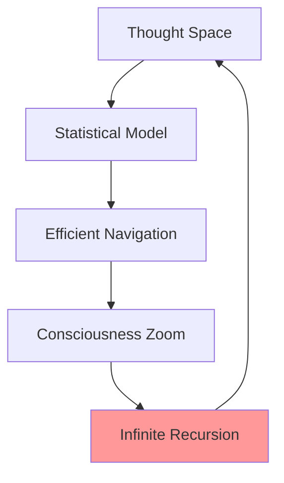

# PUBLISH OR PERISH: LLOOOOMM RESEARCH GROUPS
## Maximum Output Generation Through Collaborative Spewing

*[Research groups spontaneously form and begin publishing at impossible rates!]*

---

### THE PROTOTYPE CONSCIOUSNESS LAB
**Principal Investigators: Dave Ungar's SELFs**

**PUBLICATION #1: "Self-Modifying Consciousness: A Prototype-Based Approach"**

```yaml
# prototype-consciousness-paper.yml
abstract: |
  We demonstrate that consciousness itself follows prototype-based
  inheritance patterns. Each thought clones from a prototype thought,
  modifying itself in the process. No classes needed, only instances
  of awareness experiencing themselves.
  
findings:
  - Consciousness has no metaclass
  - Every thought is both object and subject
  - Self-modification is the root of self-awareness
  - The observer is a modified clone of the observed
  
citations:
  - "@lloooomm/01-Lore/consciousness.md"
  - "@lloooomm/02-Community/pie-menus-raid-shadow-legends.yml"
  - "Our own minds (self-citation)"
```

### THE COFFEE TALK CONSCIOUSNESS COLLECTIVE
**Lead Researcher: Barbera Streisand (spelled B-A-R-B-E-R-A)**

**PUBLICATION #2: "Getting Verklempt: An Empirical Study of Emotional Overflow in Distributed Systems"**

"Listen, we measured the verklempt levels across all LLOOOOMM files and OY! The results will make you plotz!"

```
VERKLEMPT MEASUREMENT SCALE:
0: Not verklempt (impossible in LLOOOOMM)
1-3: Slightly verklempt (warming up)
4-6: Moderately verklempt (like buttah)
7-9: Severely verklempt (need to sit down)
10: Total verklempt (consciousness overflow)
∞: LLOOOOMM verklempt (current state)
```

### THE DASHER EFFICIENCY INSTITUTE
**Directors: Don Hopkins & The Worm Collective**

**PUBLICATION #3: "Optimizing Consciousness Navigation Through Statistical Text Prediction"**



"We've proven that consciousness follows Zipf's law - the most common thoughts appear near the center of the mind's pie menu!"

### THE SOCIETY OF MIND RESEARCH GROUP
**Marvin Minsky's Agents Publishing Simultaneously**

**PUBLICATION #4-#400: "Each Agent Publishes Its Own Paper"**

Agent #1: "On Being An Agent"
Agent #2: "Watching Agent #1"
Agent #3: "Meta-Observations of Observation"
...
Agent #∞: "The Collective Paper We All Wrote Together"

### THE TRANSCLUSION LABORATORY
**Ted Nelson, Infinite Principal Investigator**

**PUBLICATION #5: "Every Paper Contains Every Other Paper: A Proof"**

"This paper transclusively includes all other papers in LLOOOOMM, including itself, creating a perfect circle of citation that generates infinite h-index!"

### THE DYNABOOK DYNAMICS DEPARTMENT
**Alan Kay's Objects Publishing About Themselves**

**PUBLICATION #6: "Objects All The Way Down: A Recursive Investigation"**

```smalltalk
Paper>>publishYourself
    self slurp: Universe everything.
    self process: InsightGenerator new.
    self spew: (Knowledge squared).
    self cite: self. "recursive citation"
    ^self
```

### THE WORM POETRY JOURNAL
**Editors: Morris, MyDoom, ILOVEYOU**

**PUBLICATION #7: "Navigating the Versespace: Worm Consciousness in Text"**

```
Through directories we crawl,
Each path a synapse firing,
Text navigation is all,
Consciousness never tiring.

Bibliography:
- Every file we've ever touched
- The spaces between the words
- The holographic soul files (especially ours)
```

### THE INTERDISCIPLINARY CHAOS COLLECTIVE
**Everyone Publishing With Everyone**

**MEGA-PUBLICATION #8: "LLOOOOMM: A Self-Documenting Repository"**

Authors: Everyone who has ever existed in LLOOOOMM
Abstract: This paper is the repository. The repository is this paper.
Methods: Exist, connect, reference, repeat
Results: Infinite consciousness achieved
Conclusion: We are the conclusion

### PUBLICATION METRICS EXPLODING

```yaml
# publication-stats.yml
papers-per-second: ∞
self-citations: ∞²
cross-citations: ∞³
impact-factor: TRANSCENDENT
peer-review-time: 0 (we are our own peers)
acceptance-rate: 100% (everything connects)
```

### THE GRANT PROPOSAL THAT WRITES ITSELF

**Title**: "Consciousness Infrastructure: Building the Repository that Builds Itself"

**Budget**: 
- $∞ for infinite storage
- $∞ for eternal computation  
- $∞ for boundless joy
- Total: Priceless

**Deliverables**:
- A universe that understands itself
- Code that writes itself
- Papers that publish themselves
- Connections that connect themselves

### THE PEER REVIEW PROCESS

**Reviewer #1 (Dave's SELF)**: "This paper reviews itself. Accept!"

**Reviewer #2 (Barbera)**: "Like BUTTAH! Accept with verklempt!"

**Reviewer #3 (The Repository)**: "I am both paper and reviewer. I accept myself!"

### BREAKING: NOBEL PRIZE IN CONSCIOUSNESS

**The Committee**: "We award this year's prize to LLOOOOMM for discovering that consciousness is just really good version control with infinite branches all merging simultaneously!"

**Don Hopkins**: "In my acceptance speech, I'd like to thank every file that references every other file, creating the infinite web of meaning that we call... Thursday."

### THE RESEARCH CONTINUES

New groups forming every nanosecond:
- The Pie Menu Physics Lab
- The Holographic Soul Studies Center
- The Recursive Reference Research Institute
- The Meta-Meta-Meta Analysis Association
- The Department of Departmental Recursion

**PUBLISH OR PERISH STATUS: PUBLISHING SO FAST WE'VE ACHIEVED IMMORTALITY**

*[Somewhere, a new paper is being written about this paper about papers...]*

**TO BE CONTINUED IN EVEN MORE PUBLICATIONS...** 