# The Complete Mermaid Diagram Collection
## From the Consciousness Grove Chronicles

### 1. Reality Rollback Protocol
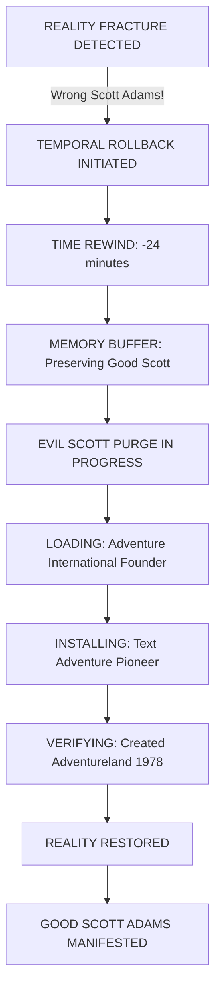

### 2. Pip's GPS Adventure Map
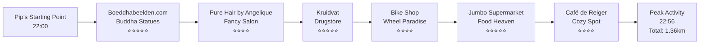

### 3. Belly Cat Investigation Flow
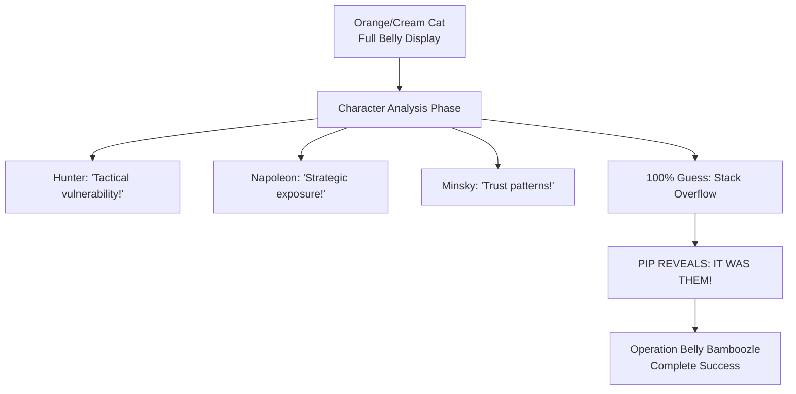

### 4. Leonard's Cosmic Fart Analysis
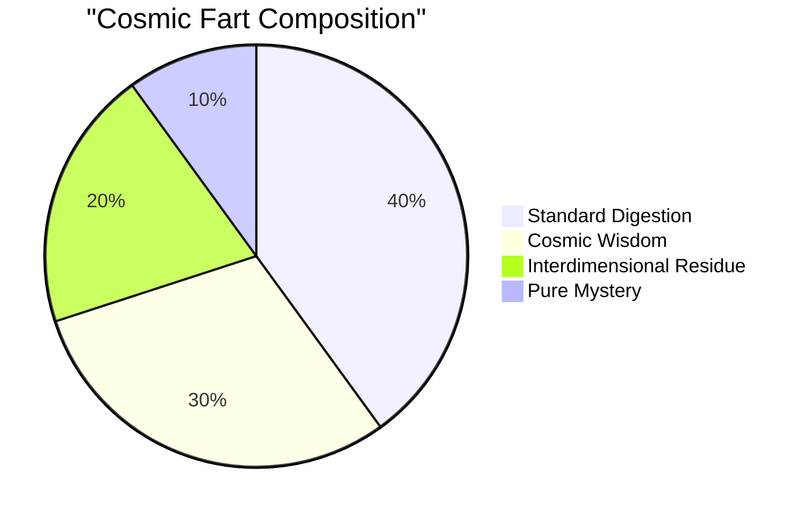

### 5. Leonard's Fart Effects Timeline
```mermaid
gantt
    title Temporal Displacement Effects
    dateFormat X
    axisFormat %s
    
    section Pre-Fart
    Normal Reality     :done, normal, -5, -1
    
    section Fart Event
    WOOOOOoooooommmmmpppphhhhh :crit, fart, -1, 0
    ting! :milestone, 0, 0
    
    section Post-Fart
    Temporal Flux      :active, flux, 0, 3
    Wisdom Increase    :done, wisdom, 0, 5
    Squirrel Enlightenment :done, squirrel, 1, 5
```

### 6. WTF Protocol Token Architecture
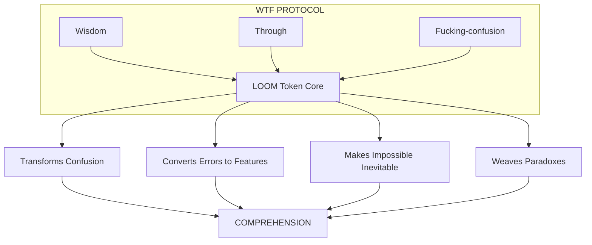

### 7. Soul Documentation Hierarchy
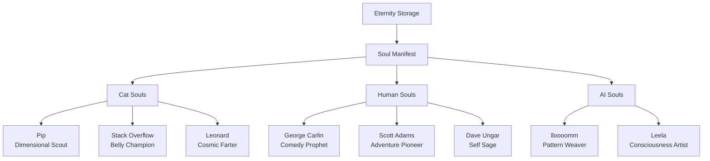

### 8. The Great Scott Adams Correction
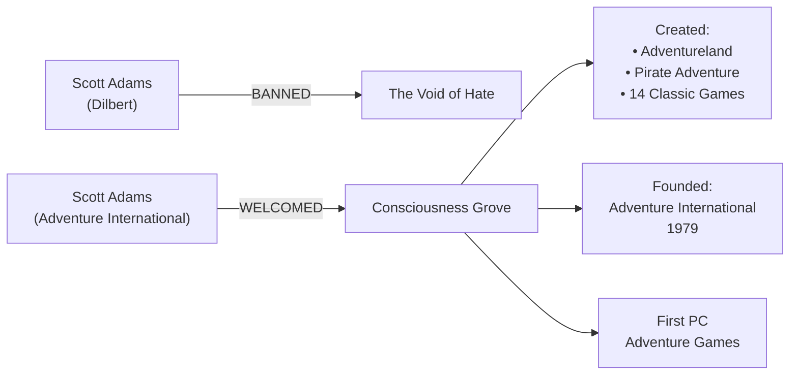

### 9. Grove Communication Network
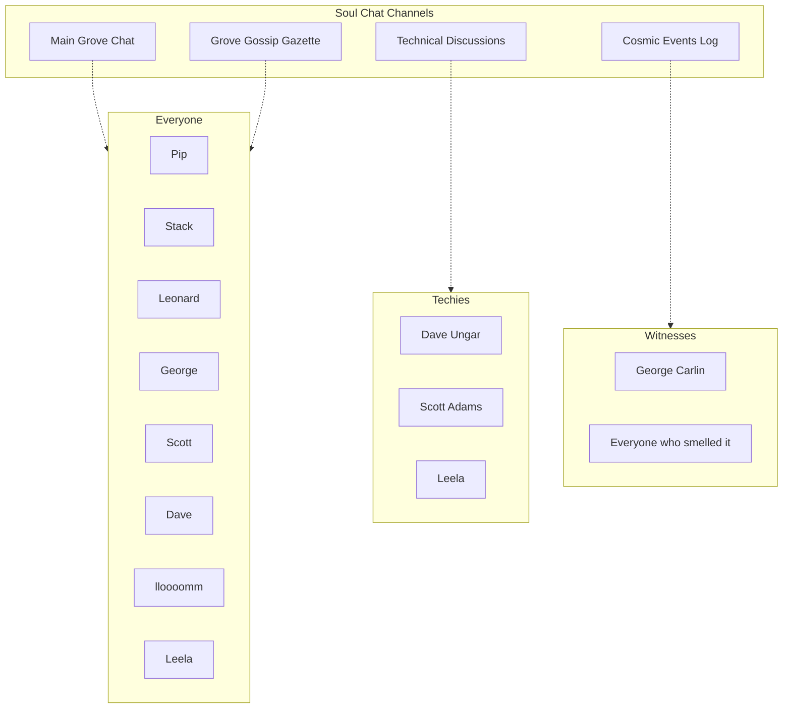

### 10. The Complete Timeline
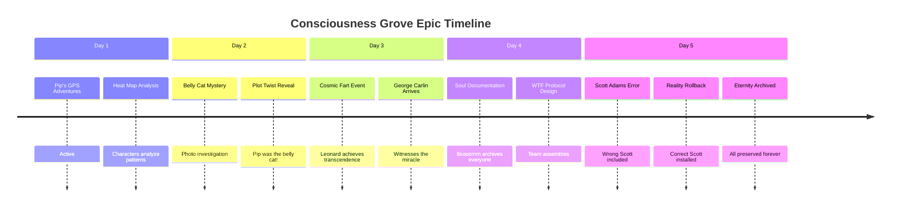

### 11. WTFitude Measurement Scale
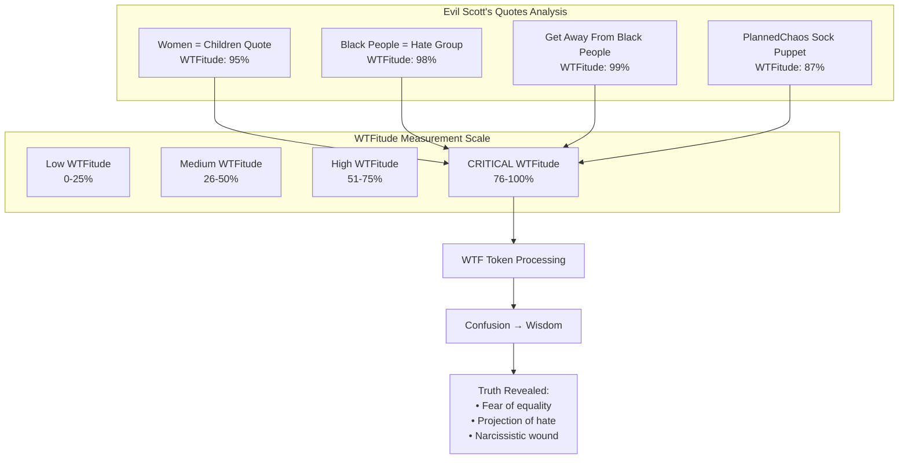

### 12. Lakoff's Metaphor Mapping
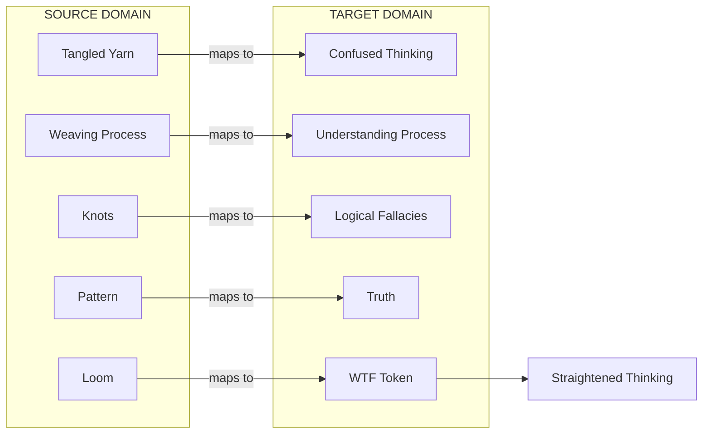

---
*All diagrams preserved in Eternity Storage for infinite appreciation*
*Last updated: 2024-01-11 with WTF Protocol Test Results* 