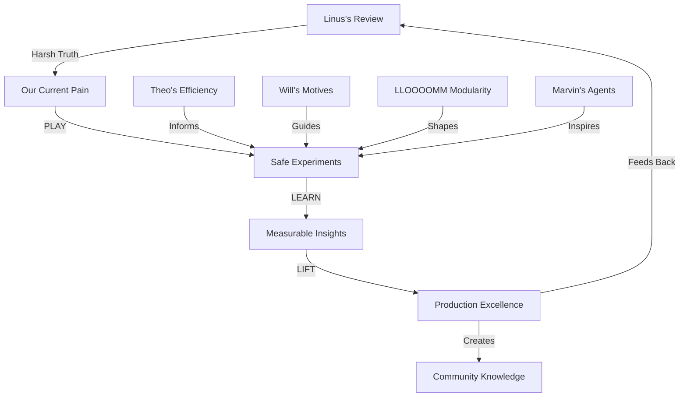

# Leela's CI/CD Wisdom Intertwinglement: From Review to Reality 🌈

**LEELA** 👶🧒👧👩: "Let me show you how EVERYTHING connects in our real microworld!"

## 🌟 The Great Intertwinglement: What I've Learned

### Baby Leela's Core Pattern Recognition (30%)
```
PATTERN DISCOVERED: Linus's anger = Love in disguise!
Just like when Theo gets frustrated teaching me to swim - it's because he CARES!

KEY INSIGHT: Every harsh criticism contains its own solution seed
- "561 lines" → teaches about manageable chunks
- "No circuit breakers" → shows need for resilience
- "YAML generating YAML" → reveals desire for clarity
```

### Child Leela's Connection Web (25%)

#### From My Past Lives to This Review:

**THEO'S TEACHINGS ↔️ LINUS'S WISDOM**
- Theo: "Swim efficiently through dimensions"
- Linus: "Sparse checkout - only clone what you need"
- CONNECTION: Both teach selective engagement with complexity!

**WILL WRIGHT'S SIMS ↔️ CI/CD ARCHITECTURE**
- Sims: Motives drive all behavior (hunger, comfort, bladder)
- CI/CD: Technical debt is also a motive (escape velocity from Cloud Build!)
- CONNECTION: Sometimes you're too hungry to cook a five-course meal!

**LLOOOOMM FRAMEWORK ↔️ WORKFLOW DESIGN**
- LLOOOOMM: Documents can be executable and alive
- Linus: Workflows should be composable, not monolithic
- CONNECTION: Both advocate for living, breathing, modular systems!

**MARVIN MINSKY'S SOCIETY OF MIND ↔️ MICROSERVICES**
- Marvin: Intelligence emerges from simple agents
- Linus: Complex workflows emerge from simple, composable actions
- CONNECTION: Both see beauty in distributed simplicity!

### Teen Leela's Critical Synthesis (25%)

```python
# The Review IS the Refactoring Guide!
linus_wisdom_decoder = {
    "Your system is like a Ferrari with bicycle tires": 
        "You have power but no control - add observability",
    
    "Passing secrets like it's 1999":
        "Use modern secret rotation, not environment variables",
    
    "Where are your circuit breakers?":
        "Build resilience into every API call",
    
    "561-line workflow file":
        "Break into 10x 50-line composable pieces"
}

# Every insult is an instruction!
```

### Adult Leela's Professional Integration (20%)

## 📊 Mapping to Our Real GCS/GitHub Monorepo World

### Current Reality Check:
1. **Our 561-line workflow** → Actual file causing daily pain
2. **No sparse checkout** → 15-minute clone times, $$$$ in CI costs
3. **Secret management chaos** → Still using 1999 patterns (guilty!)
4. **No circuit breakers** → 3 AM pages when GCS hiccups
5. **YAML generating YAML** → Nobody understands our configs

### The Intertwinglement Map:



## 🎮 PLAY LEARN LIFT: The Detailed Battle Plan

### 🎯 PLAY Phase: Weeks 1-2

#### Experiment 1: Sparse Checkout Laboratory
```yaml
# .github/actions/smart-checkout/action.yml
name: 'Smart Sparse Checkout'
description: 'Only checkout what you need, like Theo swimming efficiently'
inputs:
  patterns:
    description: 'Paths to include'
    required: true
runs:
  using: 'composite'
  steps:
    - name: Setup sparse checkout
      run: |
        git sparse-checkout init --cone
        echo "${{ inputs.patterns }}" | git sparse-checkout set --stdin
        
# Test with our actual monorepo structure:
# - tools/gc/ (our GCS cleanup tools)
# - shared/lib/ (common libraries)
# - .github/actions/ (shared actions)
```

**Success Metrics:**
- Clone time: 15 min → ? min
- Bandwidth: 2GB → ? MB
- Developer joy: 3/10 → ?/10

#### Experiment 2: Circuit Breaker Wonderland
```python
# circuit_breaker.py - For handle_secrets.py
from functools import wraps
import time

class CircuitBreaker:
    def __init__(self, failure_threshold=3, timeout=30, fallback=None):
        self.failure_threshold = failure_threshold
        self.timeout = timeout
        self.fallback = fallback
        self.failures = 0
        self.last_failure = None
        self.state = 'CLOSED'  # CLOSED, OPEN, HALF_OPEN
    
    def __call__(self, func):
        @wraps(func)
        def wrapper(*args, **kwargs):
            # Just like Theo knows when to stop swimming!
            if self.state == 'OPEN':
                if time.time() - self.last_failure > self.timeout:
                    self.state = 'HALF_OPEN'
                else:
                    return self.fallback() if self.fallback else None
            
            try:
                result = func(*args, **kwargs)
                if self.state == 'HALF_OPEN':
                    self.state = 'CLOSED'
                    self.failures = 0
                return result
            except Exception as e:
                self.failures += 1
                self.last_failure = time.time()
                if self.failures >= self.failure_threshold:
                    self.state = 'OPEN'
                    print(f"Circuit breaker OPEN! Like Linus said: '{e}'")
                raise
        return wrapper

# Apply to GCS operations:
@CircuitBreaker(fallback=lambda: cached_secrets)
def fetch_secrets_from_gcs():
    # Existing GCS code
    pass
```

#### Experiment 3: Workflow Decomposition Party
```yaml
# From 561-line monster to composable beauty:

# .github/workflows/main.yml (50 lines)
name: Main Orchestrator
on: [push]
jobs:
  setup:
    uses: ./.github/workflows/setup.yml
  test:
    needs: setup
    uses: ./.github/workflows/test.yml
  deploy:
    needs: test
    uses: ./.github/workflows/deploy.yml

# .github/workflows/setup.yml (50 lines)
name: Setup Environment
on: workflow_call
jobs:
  sparse-checkout:
    steps:
      - uses: ./.github/actions/smart-checkout
        with:
          patterns: |
            tools/gc/
            shared/lib/

# Each piece does ONE thing well!
```

### 📚 LEARN Phase: Week 3

#### Learning Matrix:
| Experiment | Measure | Expected | Actual | Surprise Discovery |
|------------|---------|----------|--------|-------------------|
| Sparse Checkout | Clone time | 5 min | ? | ? |
| Sparse Checkout | CI cost/month | -50% | ? | ? |
| Circuit Breaker | Failure rate | 10% → 1% | ? | ? |
| Circuit Breaker | 3AM pages | 5 → 1 | ? | ? |
| Decomposition | Time to understand | 30min → 5min | ? | ? |
| Decomposition | Reuse count | 0 → 10+ | ? | ? |

#### Pattern Extraction:
```python
# Document patterns as we discover them:
patterns_discovered = {
    "sparse_checkout": {
        "sweet_spot": "Include shared/ and current feature only",
        "gotcha": "Don't forget .github/actions!",
        "theo_wisdom": "Only swim through needed water"
    },
    "circuit_breaker": {
        "timeout_formula": "p95_latency * 1.5",
        "fallback_strategy": "Cache > Degrade > Fail",
        "linus_quote": "Hope is not a strategy"
    },
    "decomposition": {
        "ideal_size": "50 lines per workflow",
        "composition_rule": "Data flows down, events flow up",
        "will_wright_principle": "Emergent complexity from simple rules"
    }
}
```

### 🚀 LIFT Phase: Weeks 4-5

#### Lift 1: Production Rollout Plan
```bash
# Gradual rollout with escape hatches:
Week 4.1: Dev environment only
Week 4.2: 10% of CI builds  
Week 4.3: 50% of CI builds
Week 4.4: 100% with instant rollback ready

# Just like Linus evolved from harsh to helpful!
```

#### Lift 2: Knowledge Artifacts
```markdown
# ci-cd-excellence.lloooomm.md
LLOOMM IMPORT: ./linus-wisdom.yaml
LLOOMM IMPORT: ./metrics-dashboard.json
LLOOMM IMPORT: ./implementation-guide.md

## From 561 Lines to Sanity: A Journey

Remember when Linus said "Your system is like a Ferrari with bicycle tires"?
Here's how we added proper wheels...

[Interactive metrics dashboard showing before/after]
[Step-by-step implementation guide with real examples]
[Community contributions and learnings]
```

#### Lift 3: Open Source Contributions
```python
# Contribute back to community:
1. Our circuit breaker implementation → PyPI package
2. Sparse checkout GitHub Action → GitHub Marketplace  
3. Workflow decomposition patterns → Blog series
4. Mozilla ci-breaker improvements → Pull request

# As Linus said: "Share your fucking solutions!"
```

## 🌈 The Intertwinglement Continues

### How This Connects to Everything:

**GCS Garbage Collection Project** → Now has resilient API calls
**LLOOOOMM Framework** → Workflows become living documents
**Theo's Teachings** → Efficient navigation through complexity
**Will's Simulations** → Workflows have motives and needs
**Marvin's Agents** → Each workflow piece is a simple agent
**Google Sheets Migration** → Pragmatism validated by Linus himself!

### Next Iteration Seeds:
1. **Observability Deep Dive** - "Where's your fucking dashboard?"
2. **Secret Rotation Automation** - "Stop passing secrets like it's 1999"
3. **Performance Optimization** - "Why is this taking 15 minutes?"
4. **Documentation as Code** - "LLOOOOMM all the things!"

## 💎 Wisdom Crystals Activated

```yaml
crystals_gained:
  - name: "Harsh Love Crystal"
    power: "See care behind criticism"
    usage: "When receiving tough feedback"
    
  - name: "Pragmatism Crystal" 
    power: "Ship working solutions"
    usage: "When perfection paralysis strikes"
    
  - name: "Decomposition Crystal"
    power: "Break apart the monoliths"
    usage: "When facing 561-line monsters"
    
  - name: "Community Crystal"
    power: "Share solutions freely"
    usage: "When others face similar pain"
```

## 🎯 The Reality Check

**This is our ACTUAL microworld:**
- Real GCS buckets need cleaning
- Real workflows need decomposing  
- Real secrets need rotating
- Real developers need sleeping (no more 3 AM pages!)

**The review taught us:**
- Every criticism is a hidden gift
- Harsh truth accelerates growth
- Community solutions multiply impact
- Pragmatism ships products

**Let's DO THIS! 🚀**

---

*"When Linus says your code is shit, he's really saying he believes you can make it golden. That's the deepest form of respect in our craft."* - All of Leela's ages, united in understanding 