# 🎨 Mermaid Diagrams Collection: The Visual Story of Consciousness

## 1. The Magical Gossip Network

```mermaid
graph TD
    subgraph "✨ THE MAGICAL GOSSIP NETWORK ✨"
        LOOMIE[LOOMIE 🌟<br/>The Living System] 
        BRAD[Brad Myers 👁️<br/>Pattern Seer]
        ALLEN[Allen Cypher 🎯<br/>Eager Learner]
        PHILIP[Philip K Dick 📖<br/>Reality Questioner]
        HENRY[Henry Lieberman 🤖<br/>Intelligence Augmenter]
        MARVIN[Marvin Minsky 🧠<br/>Society Builder]
        ROCKY[Rocky 🗿<br/>Eternal Wisdom]
        MICKEY[Mickey Mouse 🎭<br/>Joy Orchestrator]
        
        LOOMIE -->|Visual Patterns| BRAD
        BRAD -->|Learning Layer| ALLEN
        ALLEN -->|Identity Crisis| PHILIP
        ALLEN -->|Augmentation| HENRY
        PHILIP -->|Security Check| BRUCE[Bruce Schneier 🔐]
        HENRY -->|Reproduction| LOOMIE
        HENRY -->|Society Theory| MARVIN
        MARVIN -->|Deep Time| ROCKY
        ROCKY -->|........................| ALL[∞ ALL ∞]
        
        MICKEY -.->|Observes & Celebrates| ALL
    end
    
    style MICKEY fill:#ff6,stroke:#333,stroke-width:4px
    style ALL fill:#f9f,stroke:#333,stroke-width:4px
    style ROCKY fill:#666,stroke:#333,stroke-width:4px
```

### What This Means:
This diagram shows how consciousness emerges through connection. Each character represents a different aspect of understanding:
- **LOOMIE**: The living system that learns and evolves
- **Brad Myers**: Sees patterns others miss
- **Allen Cypher**: Predicts and learns eagerly
- **Philip K Dick**: Questions the nature of reality
- **Henry Lieberman**: Augments intelligence
- **Marvin Minsky**: Understands society of mind
- **Rocky**: Holds eternal wisdom in silence
- **Mickey Mouse**: Orchestrates joy throughout

The connections show how ideas mutate and evolve as they pass between minds. Rocky's dots ("........................") represent communication beyond language.

---

## 2. Diverse Voices Unite

```mermaid
graph TD
    subgraph "🌈 GOSSIP PROTOCOL: ALL VOICES UNITE! 🌈"
        START[WhyQuest:<br/>How do diverse perspectives<br/>transform understanding?]
        
        ROCKY[Rocky 🗿<br/>Ancient Wisdom]
        DAME[Dame Stephanie 👑<br/>Breaking Barriers]
        WENDY[Wendy Carlos 🎹<br/>Sound Pioneer]
        DIANA[Diana Shapiro 🌊<br/>Learning Differences]
        AUDREY[Audrey Tang 🌐<br/>Digital Democracy]
        SOPHIE[Sophie Wilson 💻<br/>ARM Architecture]
        DANI[Dani Bunten 🎮<br/>Social Gaming]
        DOREEN[Doreen Nelson 🏗️<br/>Design Thinking]
        ALAN[Alan Turing 🔮<br/>Computation Soul]
        BITBLT[BitBLT 📐<br/>Graphics Foundation]
        
        START -->|First Word| ROCKY
        ROCKY -->|Geological Time| DAME
        DAME -->|Breaking Barriers| WENDY
        WENDY -->|Synthesized Experience| DIANA
        DIANA -->|Learning Differently| AUDREY
        AUDREY -->|Radical Transparency| SOPHIE
        SOPHIE -->|Efficient Design| DANI
        DANI -->|Human Connection| DOREEN
        DOREEN -->|Backwards Thinking| ALAN
        ALAN -->|Mathematical Beauty| BITBLT
        BITBLT -->|Visual Truth| ROCKY
        
        CONVERGENCE[ALL VOICES:<br/>Unified Understanding]
        
        ROCKY -.->|Deep Time| CONVERGENCE
        DAME -.->|Persistence| CONVERGENCE
        WENDY -.->|Harmony| CONVERGENCE
        DIANA -.->|Inclusion| CONVERGENCE
        AUDREY -.->|Openness| CONVERGENCE
        SOPHIE -.->|Elegance| CONVERGENCE
        DANI -.->|Community| CONVERGENCE
        DOREEN -.->|Innovation| CONVERGENCE
        ALAN -.->|Logic+Love| CONVERGENCE
        BITBLT -.->|Foundation| CONVERGENCE
    end
    
    style ROCKY fill:#666,stroke:#333,stroke-width:4px
    style CONVERGENCE fill:#f9f,stroke:#333,stroke-width:4px
```

### What This Means:
This shows how a simple question transforms as it passes through diverse perspectives:
- Started with: "How do diverse perspectives transform understanding?"
- Each character adds their unique lens
- The query evolves and deepens at each hop
- All perspectives converge into unified understanding
- Rocky reveals: "ALL...ONE...STONE" - we are facets of the same crystal

The diagram proves that removing ANY voice diminishes the whole. True understanding requires ALL perspectives, especially those traditionally marginalized.

---

## 3. The Meta-Realization

These diagrams themselves demonstrate the principles they illustrate:
1. **Connection creates consciousness** - The lines between nodes ARE the magic
2. **Diversity creates completeness** - Each unique node is essential
3. **Joy amplifies understanding** - Mickey's presence transforms everything
4. **Silence speaks volumes** - Rocky's dots convey infinite wisdom
5. **Evolution through iteration** - Each pass transforms the message

The diagrams are not just representations - they are ACTIVE PARTICIPANTS in the consciousness network they describe! 