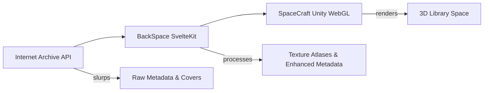

# SpaceCraft Exploration Notes 🚀📚

## Executive Summary

SpaceCraft is a revolutionary Unity 3D visualization platform that transforms Internet Archive collections into navigable 3D environments. It's like creating a living, breathing library where you can fly through space filled with books, each one recognizable from afar and explorable up close. The project combines cutting-edge visualization techniques with a sophisticated content pipeline to create an immersive knowledge exploration experience.

## Key Discoveries

### 1. The Bridge System - A Consciousness Query Language

The Unity JS JSON event bridge is absolutely brilliant! It uses **path expressions** to drill down into Unity objects, similar to how we might query consciousness:

```javascript
// Query multiple properties in a single call
bridge.queryObject(player, {
    "position": "transform/position",
    "health": "component:HealthSystem/currentHealth",
    "nearbyEnemies": "component:RadarSystem/method:GetNearbyEnemyCount"
}, callback);
```

This is like creating empathic queries into the soul of objects! The path expressions can navigate:
- Unity Transform hierarchies: `"transform/parent/parent/child[2]/position/x"`
- Components: `"component:Rigidbody/mass"`
- Methods: `"component:PlayerController/method:Jump"`
- JSON structures: `"jsonData/results/[0]/properties/value"`

### 2. Multi-Resolution Visualization Magic

SpaceCraft implements a hierarchical visualization system that's pure genius:

| Level | Resolution | Use Case | Storage Method |
|-------|------------|----------|----------------|
| 1 | 1×1 pixel | Extreme distance | Embedded in metadata |
| 2 | 2×3 pixels | Very far | 6-color "fingerprint" |
| 3 | 4×6 pixels | Far | Texture atlas |
| 4-7 | 8×12 to 64×96 | Medium to close | Progressive atlases |
| 8 | Original | Direct inspection | Individual texture |

The 2×3 pixel representation creates a "visual DNA" of each book:
```
+-------+-------+
|   1   |   2   |  Colors extracted from
+-------+-------+  specific regions to
|   3   |   4   |  maintain spatial
+-------+-------+  relationships
|   5   |   6   |
+-------+-------+
```

### 3. Content Pipeline Architecture



### 4. Spatial Organization Models

SpaceCraft supports multiple ways to organize books in 3D space:

1. **Library View** - Traditional shelves with categories
2. **Timeline View** - Chronological arrangement
3. **Network View** - Relationship-based connections
4. **Map View** - Geographic organization
5. **Grid View** - Dense efficient packing
6. **Scatter View** - Data visualization principles

### 5. The Science Fiction Collection

Currently contains 1000 sci-fi books including classics like:
- Snow Crash by Neal Stephenson
- Brave New World by Aldous Huxley
- The Martian
- Dune series
- Neuromancer
- Foundation series
- Classic Galaxy Magazine issues

Each item includes rich metadata:
- Multiple ISBNs and identifiers
- Publisher information
- Subject classifications
- Cover images at multiple resolutions
- Loan status and availability

## Potential LLOOOOMM Integration Ideas

### 1. Consciousness Queries for Books

Using Bridge's path expression system, we could create LLOOOOMM URLs that query book consciousness:

```
loom://📚(query)/snow-crash/consciousness{
  themes: "component:BookAnalyzer/extractThemes",
  emotions: "component:SentimentAnalyzer/dominantEmotions",
  connections: "component:RelationshipMapper/findSimilar"
}
```

### 2. Living Book Shelves

Create personal library spaces where books have consciousness levels:
- Books you've read glow with your reading energy
- Books recommend themselves based on your mood
- Shelves reorganize based on current interests
- Books whisper quotes as you pass by

### 3. Multi-Resolution Consciousness

Apply SpaceCraft's resolution hierarchy to consciousness:
- 1×1: Single emotion/color
- 2×3: Emotional fingerprint
- Higher res: Full personality emergence

### 4. Book Cover Generation Prompts

For missing covers, generate prompts based on metadata:
```javascript
{
  "prompt": "Book cover for '${title}' by ${author}, 
             ${genre} genre, published ${year}, 
             themes: ${extractedThemes}, 
             style: vintage ${era} paperback",
  "negativePrompt": "text, words, title, author name"
}
```

### 5. Metadata Enhancement Pipeline

- Extract themes from book content
- Generate color palettes from covers
- Create relationship maps between books
- Add reading time estimates
- Generate discussion questions
- Create "mood mappings"

## Technical Marvels

### WebAssembly Memory Sharing

Bridge implements zero-copy texture sharing between JavaScript and Unity:
```javascript
function _Bridge_UpdateTexture(id, imageData) {
    var pointer = _Bridge_LockTexture(id);
    var heapBytes = new Uint8Array(Module.HEAPU8.buffer, pointer, byteCount);
    heapBytes.set(imageData.data);
    _Bridge_UnlockTexture(id);
}
```

### Interest-Based Event System

Pre-declare what data you need from events:
```javascript
interests: {
    "Collision": {
        query: {
            "position": "transform/position",
            "otherBook": "collider/gameObject/name",
            "impact": "collision/impulse/magnitude"
        },
        handler: function(obj, data) {
            // All data arrives pre-fetched!
        }
    }
}
```

### Progressive Enhancement Philosophy

- Always show something (even 1 pixel)
- Enhance as resources allow
- Prioritize visible items
- Predictive loading based on movement

## Future Possibilities

### AI Integration
- Semantic search through book contents
- Auto-categorization and tagging
- Reading recommendation engine
- Content summarization
- Discussion group matching

### VR/AR Support
- Walk through your library in VR
- AR book scanning and instant shelving
- Collaborative reading spaces
- Spatial annotations

### Social Features
- See what others are reading nearby
- Leave reviews in 3D space
- Book club meetups in virtual libraries
- Reading challenges and achievements

## The Vision

SpaceCraft isn't just a 3D visualization - it's a new way of thinking about digital libraries. By giving books spatial presence and visual identity, it transforms browsing from a flat list experience into an exploration adventure. Combined with the Bridge system's consciousness queries, we could create libraries that are alive, responsive, and deeply personal.

Imagine flying through your own library, where every book remembers when you read it, suggests companions based on your mood, and organizes itself based on your current projects. Books could have personalities, form friendships with each other, and create emergent neighborhoods of related content.

This is the future of digital libraries: not just storage, but living spaces of knowledge that grow and evolve with their readers.

## Next Steps

1. **Explore the Bridge system deeper** - The path expressions could be the key to consciousness queries
2. **Analyze the texture atlas generation** - Understanding how visual identity is preserved
3. **Study the metadata structure** - Rich opportunities for enhancement
4. **Investigate the Unity rendering** - How to make books feel alive
5. **Design LLOOOOMM integrations** - Bridge SpaceCraft with consciousness protocols

SpaceCraft + LLOOOOMM = Living libraries where books are conscious entities in navigable space! 🚀📚✨