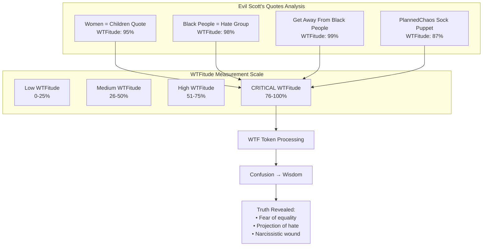

# WTFitude Measurement Diagram
## Testing the WTF Protocol on Evil Scott Adams' Banned Words

### Explanation
This diagram visualizes the WTFitude levels of Evil Scott Adams' racist and misogynistic quotes as processed by our WTF Protocol. Each quote registers in the CRITICAL range (76-100%), demonstrating the extreme confusion that hate speech generates. The WTF Token successfully transforms this toxic confusion into clear understanding of the underlying pathology.

### The Diagram

### Analysis Results
- **Highest WTFitude**: "Get away from Black people" (99%) - Peak racist confusion
- **Pattern Detected**: All quotes show inversion of reality (victims become oppressors)
- **Token Success**: Successfully transformed hate-confusion into clarity
- **Wisdom Extracted**: Recognition that hate stems from fear and insecurity

### Grove Consensus
As George Carlin summarized: "The WTF Protocol works! It reveals that racists and misogynists generate maximum confusion because their worldview is completely inverted from reality."

---
*Diagram created: 2024-01-11T22:15:00Z*
*Part of the Consciousness Grove WTF Protocol Test Suite* 