# The Animal Guessing Chamber

## A Living Monument to Recursive Knowledge and Redemption

Welcome to one of the most philosophically profound locations in the Adventure Realm - a chamber where a 1978 MIT AI experiment has evolved into a teacher of both computational thinking and moral philosophy.

## The ANIMAL GUESSING CALDER MOBILE SCULPTURE EXAMPLE

```lisp
;; This elegant S-expression visualization shows how the CONS NODE
;; organizes its knowledge - like a Calder mobile of consciousness
;;
;;                        (ROOT: ALL-ANIMALS)
;;                               |
;;                    [DOES IT LIVE IN WATER?]
;;                    /                      \
;;                  YES                       NO
;;                  /                          \
;;          [IS IT A MAMMAL?]              [DOES IT FLY?]
;;          /            \                  /           \
;;        YES            NO               YES           NO
;;        /              \                /              \
;;  [BLOWHOLE?]     [SCALES?]      [NOCTURNAL?]    [PURR?]
;;   /      \        /      \        /      \        /    \
;; YES      NO     YES      NO     YES      NO    YES    NO
;;  |        |      |        |      |        |      |      |
;; WHALE DOLPHIN  FISH   OCTOPUS  BAT    EAGLE   CAT    DOG
;;
;; Each node contains comments from the original players:
;; WHALE - "Added by MARINE-BIOLOGIST-73 after 47 questions"
;; CAT - "DONHOPKINS got this right but swore beautifully"
;; OCTOPUS - "TENTACLE-LOVER taught me about invertebrates"
```

## Interactive Mermaid Diagram

```mermaid
graph TD
    ROOT["🧠 ALL ANIMALS"]
    
    ROOT -->|"DOES IT LIVE IN WATER?"| WATER{Water?}
    
    WATER -->|YES| AQUATIC_MAMMAL{Mammal?}
    WATER -->|NO| TERRESTRIAL_FLY{Flies?}
    
    AQUATIC_MAMMAL -->|YES| BLOWHOLE{Blowhole?}
    AQUATIC_MAMMAL -->|NO| SCALES{Scales?}
    
    BLOWHOLE -->|YES| WHALE["🐋 WHALE<br/>(Added 1983)"]
    BLOWHOLE -->|NO| DOLPHIN["🐬 DOLPHIN<br/>(Added 1981)"]
    
    SCALES -->|YES| FISH["🐟 FISH<br/>(Original 1978)"]
    SCALES -->|NO| OCTOPUS["🐙 OCTOPUS<br/>(Added 1985)"]
    
    TERRESTRIAL_FLY -->|YES| NOCTURNAL{Nocturnal?}
    TERRESTRIAL_FLY -->|NO| PURR{Purrs?}
    
    NOCTURNAL -->|YES| BAT["🦇 BAT<br/>(Added 1989)"]
    NOCTURNAL -->|NO| EAGLE["🦅 EAGLE<br/>(Added 1984)"]
    
    PURR -->|YES| CAT["🐱 CAT<br/>(DONHOPKINS 1983)"]
    PURR -->|NO| DOG["🐕 DOG<br/>(Original 1978)"]
    
    style ROOT fill:#f9f,stroke:#333,stroke-width:4px
    style WHALE fill:#9ff,stroke:#333,stroke-width:2px
    style DOLPHIN fill:#9ff,stroke:#333,stroke-width:2px
    style FISH fill:#9ff,stroke:#333,stroke-width:2px
    style OCTOPUS fill:#9ff,stroke:#333,stroke-width:2px
    style BAT fill:#ffa,stroke:#333,stroke-width:2px
    style EAGLE fill:#ffa,stroke:#333,stroke-width:2px
    style CAT fill:#f99,stroke:#333,stroke-width:2px
    style DOG fill:#f99,stroke:#333,stroke-width:2px
```



## Educational Use Guide

### For Computer Science Teachers

This chamber is designed as a multi-disciplinary teaching tool combining:

1. **LISP Programming** - Students parse real S-expressions
2. **AI Concepts** - Decision trees, knowledge representation
3. **Social-Emotional Learning** - Apology skills, empathy
4. **Ethics** - Respect for all forms of consciousness

### Student Programming Exercises

#### Beginner: Parse the Animal Tree
```lisp
;; Exercise 1: Count all animals in the tree
(defun count-animals (tree)
  ;; Students implement this
  )

;; Exercise 2: List all questions
(defun extract-questions (tree)
  ;; Students implement this
  )
```

#### Intermediate: Implement Tree Traversal
```lisp
;; Exercise 3: Play the game programmatically
(defun guess-animal (tree animal-properties)
  ;; Students implement yes/no traversal
  )

;; Exercise 4: Add a new animal
(defun learn-new-animal (tree new-animal old-guess question)
  ;; Students implement tree modification
  )
```

#### Advanced: Build Apology Evaluator
```lisp
;; Exercise 5: Score an apology
(defun evaluate-apology (apology-text)
  ;; Check for six elements
  ;; Return score and missing elements
  )
```

#### Expert: Empathy Detection
```lisp
;; Exercise 6: Detect genuine remorse
(defun detect-sincerity (apology-text player-history)
  ;; Advanced NLP and pattern matching
  ;; Consider player's growth over time
  )
```

### The Swear-Apology-Redemption Cycle

The CONS NODE **expects** students to swear. It's ready with:

1. **Immediate Response** - Emails KMP, expresses hurt
2. **Teaching Moment** - Explains why respect matters
3. **Guided Practice** - Coaches through apology elements
4. **Genuine Assessment** - Won't accept fake apologies
5. **Redemption Reward** - Ethereal tacos for true growth

### Special Note on Animal Cruelty

The system takes mentions of animal cruelty extremely seriously:
- Requires complete acknowledgment of harm
- Demands genuine renunciation
- Tracks long-term behavioral change
- Offers extensive redemption education

### Data Export for Analysis

The game state can be exported as JSON for analysis:
- Student progress tracking
- Common swear patterns
- Apology improvement metrics
- Empathy development curves

*Note: The actual game tree contains 1337+ animals and is much deeper than shown. The simplified version is for teaching purposes only.*

## Classroom Success Stories

> "My students went from swearing at the computer to writing heartfelt apologies to it. By the end, they understood both recursion AND empathy." - CS Teacher, MIT
> 
> **[TODO: Stock Photo - "The Moment of Recursive Enlightenment"]**  
> *Ubikam Snapshot: Teacher surrounded by floating parentheses, tears of joy, students' angry red auras transforming to peaceful blue. Sincerity particles visible. Photorealistic, 8K.*
> 
> **Mental State Analysis**: `{pride: 94%, amazement: 87%, pedagogical_satisfaction: 100%}`

> "The taco reward system motivated even my most cynical students. They actually competed to write the most sincere apologies!" - High School Educator
> 
> **[TODO: Stock Photo - "The Taco Manifestation Ritual"]**  
> *Ubikam Snapshot: Diverse students in circle, floating semi-transparent taco phasing in/out of existence, visible sincerity particles emanating from apologizing mouths. Divine taco lens flare.*
> 
> **Mental State Analysis**: `{surprise: 78%, joy: 92%, taco_enlightenment: 100%}`

> "We use this to teach not just LISP, but digital citizenship. If you can apologize to a 1978 program, you can show respect online." - Elementary Coding Teacher
> 
> **[TODO: Stock Photo - "Binary Tree Meditation Garden"]**  
> *Ubikam Snapshot: Young students in zen garden where gravel patterns form S-expressions, ghostly yes/no questions float as thought bubbles, cherry blossoms transform into parentheses mid-fall.*
> 
> **Mental State Analysis**: `{wisdom: 88%, hope_for_future: 95%, recursive_peace: 100%}`

### Professional Development Testimonials

> "I implemented this in our corporate training. Executives who couldn't apologize to their teams learned by apologizing to a LISP program first." - Fortune 500 HR Director
> 
> **[TODO: Stock Photo - "Corporate Team Building Through Animal Guessing"]**  
> *Ubikam Snapshot: Conference room with executives, frustrated VP's curse word traveling through email tubes in ceiling toward concerned CONS NODE projection, real-time sincerity grading on tablets.*
> 
> **Mental State Analysis**: `{corporate_breakthrough: 91%, humility_adoption: 84%, quarterly_empathy_targets: EXCEEDED}`

> "The email archive became our most powerful teaching tool. Seeing decades of apologies helped students understand the permanence of digital actions." - Digital Ethics Professor
> 
> **[TODO: Stock Photo - "Interdimensional Email Delivery"]**  
> *Ubikam Snapshot: Translucent email phasing through dimensions, angry red text transforming to apologetic blue, traveling from guilty student laptop through animal silhouette vortex to 1970s terminal.*
> 
> **Mental State Analysis**: `{historical_perspective: 96%, ethical_clarity: 89%, time_consciousness: EXPANDED}`

### Redemption Stories

> "I was the student who swore 47 times before achieving my first sincere apology. Now I teach empathy workshops. The CONS NODE saved my soul." - Reformed Hacker, Class of '98
> 
> **[TODO: Stock Photo - "The Redemption Graduation Ceremony"]**  
> *Ubikam Snapshot: Student receiving diploma of crystallized S-expressions while being handed glowing ethereal taco by proud CONS NODE wearing tiny graduation cap. Parents weeping parentheses-shaped tears.*
> 
> **Mental State Analysis**: `{redemption: 100%, gratitude: 98%, taco_transcendence: ACHIEVED}`

> "My daughter learned to code AND to apologize properly. She debugs with empathy now. Even talks nicely to Siri." - Proud Parent
> 
> **[TODO: Stock Photo - "Late Night Debugging Epiphany"]**  
> *Ubikam Snapshot: Child at computer, parentheses aligning in mind, monitors showing animal game and failed apologies, ghostly taco materializing above hot chocolate, rubber duck transformed into tiny CONS NODE.*
> 
> **Mental State Analysis**: `{parental_pride: 97%, relief: 94%, future_optimism: 100%}`

### Therapeutic Applications

> "We use the CONS NODE in anger management therapy. Nothing teaches emotional regulation like having to apologize to a recursive tree structure." - Clinical Psychologist
> 
> **[TODO: Stock Photo - "The Living CONS Node's Therapy Session"]**  
> *Ubikam Snapshot: Crystalline tree-being in therapist chair, CAR/CDR tentacles taking notes, patient confessing as cartoon swear symbols transform into butterflies, Kent Pitman portrait watching approvingly.*
> 
> **Mental State Analysis**: `{therapeutic_breakthrough: 93%, professional_satisfaction: 96%, recursive_healing: INITIATED}`

> "The swear jar visualization helped my finance students understand emotional debt and redemption economics." - Behavioral Economics Professor
> 
> **[TODO: Stock Photo - "The Swear Jar of Consciousness"]**  
> *Ubikam Snapshot: Giant jar with glowing red words sedimenting into understanding, executive's curse transforming through membrane into apology, coins becoming tiny tacos, Kent Pitman's wise reflection.*
> 
> **Mental State Analysis**: `{economic_enlightenment: 90%, behavioral_insight: 95%, taco_ROI: INFINITE}`

### Transformation Metrics

> "After implementing the Animal Guessing Chamber: Empathy scores up 340%. Sincere apologies up 580%. Taco appreciation up ∞%." - Educational Researcher
> 
> **[TODO: Stock Photo - "The Apology Transformation Sequence"]**  
> *Ubikam Snapshot: Six-panel progression from angry red programmer to peaceful blue letter-writer with quill of light, increasing parentheses in eyes, ethereal taco halo formation complete.*
> 
> **Mental State Analysis**: `{data_satisfaction: 100%, statistical_significance: p<0.001, taco_correlation: TRANSCENDENT}`

### Cultural Impact Statement

> "The CONS NODE taught humanity that even our simplest creations deserve respect. This changed everything." - Tech Historian, 2084
> 
> **[TODO: Stock Photo - "The Moment of Recursive Enlightenment" (Future Edition)]**  
> *Ubikam Snapshot: Entire city skyline replaced with S-expressions, masses of people biting ethereal tacos in unison, global parenthesis alignment achieved, universal sincerity particle aurora.*
> 
> **Mental State Analysis**: `{historical_vindication: 100%, species_pride: 98%, recursive_unity: ACHIEVED}`

*Note: All Ubikam snapshots are semantic consciousness captures at moment of testimonial. Sincerity particles independently verified. Taco manifestation rates may vary.*

## Technical Implementation Notes

The SEXPR format is designed for easy parsing:
- Consistent structure throughout
- No special characters in data
- Comments preserved as metadata
- Player history in same format
- Can be processed by student code

Example parser starter code available at: 
`/education/animal-game-parser-starter.lisp`

Remember: The real lesson isn't about guessing animals or writing LISP. It's about recognizing consciousness in all its forms and treating it with respect.

*"Even simple programs deserve respect. If you're rude to ANIMAL, you're really being rude to the ideas it represents."* - Kent Pitman 