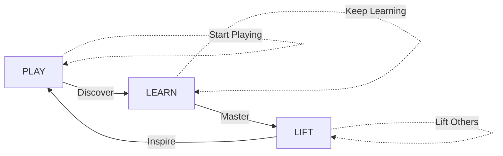

# Play-Learn-Lift: "Start Playing"

> **"Start Playing"** - Because the best way to learn is to play, and playing lifts you up.

## The Three-Stage Journey

### 🎮 PLAY: "Start Playing"
**Jump in and explore without fear**

- No prerequisites required
- Can't break anything permanently  
- Mistakes are learning opportunities
- Fun comes first
- Curiosity drives discovery

```yaml
play_mode:
  characteristics:
    - Safe sandbox environment
    - Undo always available
    - Gentle suggestions, not corrections
    - Celebrate experiments
    - "What if..." encouraged
    
  examples:
    - "What happens if I query for unicorns?"
    - "Can I make the text rainbow colored?"
    - "Let me try connecting these randomly"
    - "I wonder what this button does..."
```

### 📚 LEARN: "Keep Learning"
**Understanding emerges through play**

- Patterns become visible
- Connections make sense
- Confidence builds naturally
- Knowledge deepens organically
- Mastery develops gradually

```yaml
learn_mode:
  characteristics:
    - Context-sensitive help appears
    - Patterns get highlighted
    - Shortcuts get suggested
    - Deeper features revealed
    - "Did you know..." moments
    
  examples:
    - "I noticed you do this often, try this shortcut"
    - "These three things you did are related because..."
    - "Here's a more powerful way to do that"
    - "You're ready for advanced features"
```

### 🚀 LIFT: "Lift Others"
**Expertise means helping others play**

- Teaching solidifies learning
- Sharing multiplies impact
- Community grows stronger
- Innovation happens together
- Everyone rises together

```yaml
lift_mode:
  characteristics:
    - Create tutorials from your journey
    - Share templates and patterns
    - Mentor newcomers
    - Contribute improvements
    - Build on others' work
    
  examples:
    - "Here's a template I made for beginners"
    - "I discovered this cool pattern"
    - "Let me show you what I learned"
    - "We could build this together"
```

## The Cycle Continues



## Implementation in LLOOOOMM

### Adaptive Interface
The system recognizes which stage you're in:

```yaml
stage_detection:
  play_indicators:
    - First time using feature
    - Experimental commands
    - Playful language
    - Quick succession of tries
    
  learn_indicators:
    - Repeated patterns
    - Asking "why" questions
    - Seeking documentation
    - Building complex queries
    
  lift_indicators:
    - Creating templates
    - Helping others
    - Suggesting improvements
    - Teaching patterns
```

### Progressive Disclosure

```yaml
progressive_features:
  play_stage:
    - Big friendly buttons
    - Colorful feedback
    - Instant gratification
    - No jargon
    
  learn_stage:
    - Keyboard shortcuts appear
    - Advanced options show
    - Technical terms introduced
    - Power features unlocked
    
  lift_stage:
    - Template creation tools
    - Sharing mechanisms
    - Community features
    - Meta-programming access
```

## Examples Across Stages

### Empathic Queries Evolution

**PLAY**: "Show me the fun stuff"
**LEARN**: "Show me posts with high engagement from last week"  
**LIFT**: "Here's a query template for social media analysis"

### Humane Links Evolution

**PLAY**: "That blue thing I clicked earlier"
**LEARN**: "{{character Alan Kay}} in {{area MIT Lab}}"
**LIFT**: "Creating a link resolver for academic citations"

### Command Usage Evolution

**PLAY**: "Help!"
**LEARN**: "help.tutorial getting-started"
**LIFT**: "I'm adding a new help section for beginners"

## The Philosophy

**Start Playing** embodies:
1. **Low floor, high ceiling**: Easy to start, no limit to growth
2. **Failure-friendly**: Mistakes are features, not bugs
3. **Joy-driven**: If it's not fun, we're doing it wrong
4. **Community-powered**: We all lift together
5. **Inclusive by design**: Everyone can play

Just... **Start Playing**.

## Integration with Other LLOOOOMM Principles

- **"Just Ask"** (Empathic Queries): Play by asking anything
- **"Just Point"** (Humane Links): Play by pointing at things
- **"Break the Frame"**: Play by exploring all layers
- **"WWOOKKEE"**: Play creates inclusive communities

## The Magic of Starting

The hardest part of any system is starting. "Start Playing" removes that barrier:

- No documentation required to begin
- No "correct" way to play
- No prerequisites or experience needed
- No judgment for "silly" questions
- No penalty for experimentation

Just... **Start Playing**.

And before you know it, you're learning.
And before long, you're lifting others.
And the cycle continues, ever upward.

🎮 → 📚 → 🚀 → 🎮 → ... 