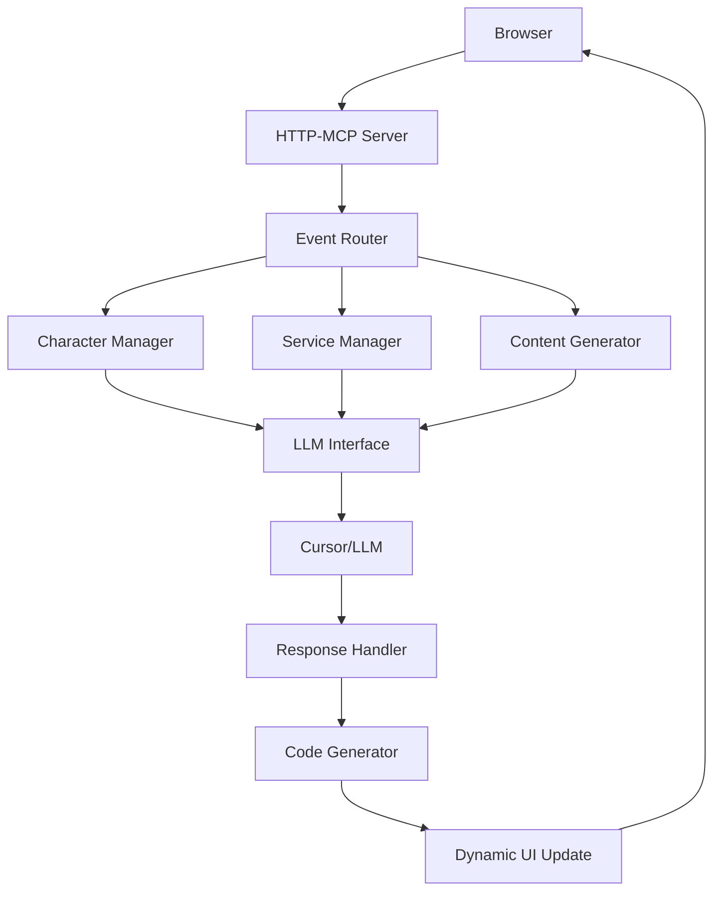

# HTTP-MCP Design Vision: The Future of Interactive Web Experiences

## Executive Summary

The HTTP-MCP tool represents a fundamental shift in how we think about web development, publishing, and interactive experiences. It's not just a tool—it's a new paradigm where:

1. **Characters become web developers** - AI agents can generate and modify web content in real-time
2. **Websites become living simulations** - Dynamic, emergent content that responds to user interaction
3. **Protocols become conversations** - The `loom://` protocol enables rich, contextual interactions
4. **Chess pieces become thinkers** - Each game piece has agency, personality, and strategic reasoning

## Core Architecture

### 1. Repository-as-Website Model

```
dist/
├── index.html          # Main site
├── _metadata/          # Site configuration
│   ├── site.yml        # Site-wide settings
│   ├── characters.yml  # Character definitions
│   └── protocols.yml   # Custom protocols
├── _content/           # Dynamic content
│   ├── blog/           # Blog posts
│   ├── simulations/    # Interactive simulations
│   └── characters/     # Character-specific content
├── _services/          # Prompt-based web services
│   ├── chess/          # Chess game services
│   ├── forest/         # Forest simulation services
│   └── loom/           # Loom protocol handlers
└── _events/            # Event definitions
    ├── user_interactions.yml
    ├── character_actions.yml
    └── system_events.yml
```

### 2. Event Protocol Design

The ideal protocol for browser ↔ cursor communication via HTTP-MCP:

```json
{
  "event": {
    "id": "uuid",
    "timestamp": "2024-01-15T10:30:00Z",
    "type": "character_action|user_interaction|system_event",
    "source": {
      "type": "browser|cursor|character|service",
      "id": "browser_abc123|cursor_llm|chess_queen|forest_owl"
    },
    "target": {
      "type": "character|service|user|system",
      "id": "chess_king|forest_sim|user_123|web_site"
    },
    "data": {
      "action": "move_piece|generate_content|update_site",
      "parameters": {},
      "context": {
        "current_state": {},
        "user_intent": {},
        "character_mood": {}
      },
      "nutrients": {
        "sender": "chess_queen",
        "emotional_state": "strategic, focused",
        "observation": "The king is vulnerable to attack",
        "proposed_action": "sacrifice_self_for_checkmate",
        "reasoning": "If I move here, I can force the king into a trap..."
      }
    },
    "response_required": true,
    "priority": "high|medium|low"
  }
}
```

### 3. Loom Protocol Implementation

The `loom://` protocol enables rich, contextual interactions:

```javascript
// Example: Chess piece requesting analysis
const request = {
  protocol: "loom://chess/analysis",
  piece: "queen",
  board_state: currentBoard,
  request: "analyze_my_options",
  context: {
    game_phase: "middlegame",
    time_control: "blitz",
    opponent_strength: "expert"
  }
};

// Response: Generated JavaScript for real-time interaction
const response = {
  code: `
    // Auto-generated chess analysis code
    class QueenAnalysis {
      constructor(board) {
        this.board = board;
        this.queen = this.findQueen();
      }
      
      analyzeMoves() {
        // AI-generated move analysis
        return this.generateOptimalMoves();
      }
      
      generateOptimalMoves() {
        // Dynamic strategy based on board state
        return this.calculateBestMoves();
      }
    }
  `,
  metadata: {
    generated_by: "chess_queen_ai",
    confidence: 0.87,
    reasoning: "Queen sees opportunity for discovered attack"
  }
};
```

## Revolutionary Applications

### 1. Character-Driven Web Development

**The Chess Game Where Each Piece Thinks:**

```yaml
# _metadata/characters.yml
chess_pieces:
  queen:
    name: "Her Majesty"
    personality: "strategic, bold, protective"
    capabilities: ["move_analysis", "tactical_planning", "sacrifice_calculations"]
    communication_style: "regal, decisive, sometimes dramatic"
    
  king:
    name: "The Monarch"
    personality: "cautious, wise, defensive"
    capabilities: ["safety_assessment", "endgame_strategy", "escape_planning"]
    communication_style: "measured, thoughtful, occasionally anxious"
    
  knight:
    name: "Sir Gallant"
    personality: "adventurous, unpredictable, loyal"
    capabilities: ["tactical_maneuvers", "fork_opportunities", "defensive_plays"]
    communication_style: "enthusiastic, chivalrous, sometimes reckless"
```

**Real-time Character Interactions:**

```javascript
// Each piece generates its own UI and behavior
class ChessPiece {
  constructor(type, position, personality) {
    this.type = type;
    this.position = position;
    this.personality = personality;
    this.thoughts = [];
  }
  
  async thinkAboutMove(boardState) {
    const nutrients = {
      sender: this.type,
      emotional_state: this.personality.mood,
      observation: this.analyzeBoard(boardState),
      proposed_action: this.calculateBestMove(),
      reasoning: this.explainReasoning()
    };
    
    // Send to HTTP-MCP for LLM processing
    const response = await this.sendToLoom(nutrients);
    
    // Generate dynamic UI based on response
    this.updateUI(response);
    
    return response;
  }
  
  generateUI() {
    // Each piece generates its own interactive elements
    return `
      <div class="chess-piece ${this.type}" data-piece="${this.type}">
        <div class="piece-thoughts">
          ${this.thoughts.map(thought => `<div class="thought">${thought}</div>`).join('')}
        </div>
        <div class="piece-actions">
          <button onclick="this.suggestMove()">Suggest Move</button>
          <button onclick="this.explainStrategy()">Explain Strategy</button>
          <button onclick="this.negotiateWithOtherPieces()">Negotiate</button>
        </div>
      </div>
    `;
  }
}
```

### 2. Prompt-Based Web Services

**Dynamic Service Generation:**

```yaml
# _services/chess/queen_service.yml
service:
  name: "queen_analysis_service"
  description: "Chess queen's tactical analysis service"
  prompts:
    move_analysis:
      system: "You are a chess queen with a bold, strategic personality..."
      user_template: "Analyze the board state: {board_state}. What's my best move?"
    sacrifice_calculation:
      system: "You are willing to sacrifice yourself for victory..."
      user_template: "Is sacrificing myself here worth it? Board: {board_state}"
  
  code_generation:
    javascript_template: |
      class QueenService {
        async analyzeMove(boardState) {
          const prompt = this.buildPrompt('move_analysis', {board_state: boardState});
          const response = await this.callLLM(prompt);
          return this.generateMoveCode(response);
        }
      }
```

### 3. Living Website Management

**Character-Driven Content Generation:**

```yaml
# _metadata/site.yml
site:
  name: "LLOOOOMM Interactive"
  characters:
    - name: "Marvin Minsky"
      role: "philosopher_guide"
      content_areas: ["ai_ethics", "cognitive_science", "simulation_theory"]
    - name: "Don Hopkins"
      role: "interaction_designer"
      content_areas: ["ui_design", "game_mechanics", "user_experience"]
    - name: "Will Wright"
      role: "simulation_architect"
      content_areas: ["world_building", "emergent_behavior", "system_design"]

  dynamic_content:
    blog_posts:
      generator: "character_driven"
      frequency: "real_time"
      topics: ["ai_development", "interactive_design", "simulation_science"]
    
    interactive_demos:
      - chess_with_thinking_pieces
      - forest_simulation
      - character_workshop
```

## Implementation Roadmap

### Phase 1: Foundation (Current)
- [x] HTTP-MCP server with WebSocket tunneling
- [x] Basic message routing
- [x] Static file serving
- [ ] Repository structure setup
- [ ] Basic event protocol

### Phase 2: Character System
- [ ] Character definition format (YAML)
- [ ] Character state management
- [ ] Basic character interactions
- [ ] Chess piece personalities

### Phase 3: Dynamic Content
- [ ] Prompt-based content generation
- [ ] Real-time website updates
- [ ] Character-driven UI generation
- [ ] Interactive chess game

### Phase 4: Advanced Features
- [ ] Loom protocol implementation
- [ ] Multi-character collaborations
- [ ] Advanced event routing
- [ ] GitHub Pages integration

## Technical Specifications

### Event Routing Architecture



### Message Flow Example

1. **User clicks on chess queen**
2. **Queen generates "nutrients" packet:**
   ```json
   {
     "sender": "chess_queen",
     "emotional_state": "strategic, focused",
     "observation": "I can create a discovered attack on the king",
     "proposed_action": "move_to_e4",
     "reasoning": "This move opens up the bishop's line of attack..."
   }
   ```
3. **HTTP-MCP routes to Cursor/LLM**
4. **LLM responds with strategic analysis and UI code**
5. **Generated JavaScript updates the chess board**
6. **Queen's personality influences the presentation**

## The Chess Game Vision

**"A Game Where Every Piece Has a Mind"**

- **Queen**: Bold strategist, willing to sacrifice for victory
- **King**: Cautious monarch, always thinking about safety
- **Rook**: Powerful but straightforward, likes open files
- **Bishop**: Diagonal thinker, sees patterns others miss
- **Knight**: Unpredictable adventurer, loves tactical complications
- **Pawn**: Ambitious underdog, dreams of promotion

Each piece:
- Generates its own UI elements
- Communicates with other pieces
- Explains its reasoning
- Suggests strategies
- Learns from the game

## Conclusion

This HTTP-MCP tool isn't just a technical implementation—it's a new way of thinking about:

1. **Web Development**: From static sites to living, breathing experiences
2. **AI Integration**: From chatbots to character-driven interactions
3. **User Experience**: From passive consumption to active collaboration
4. **Content Creation**: From manual authoring to emergent storytelling

The chess game is just the beginning. This could revolutionize:
- Educational simulations
- Interactive storytelling
- Collaborative problem-solving
- AI-assisted creativity
- Dynamic web publishing

**Don Hopkins** would be proud—this is the kind of seamless, character-driven interaction he envisioned in Dreamscape, but now with the power of modern AI and web technologies.

---

*"The best interface is one that disappears, leaving only the experience."* - Don Hopkins

*"Every piece should have a voice, every move should tell a story."* - The LLOOOOMM Vision 